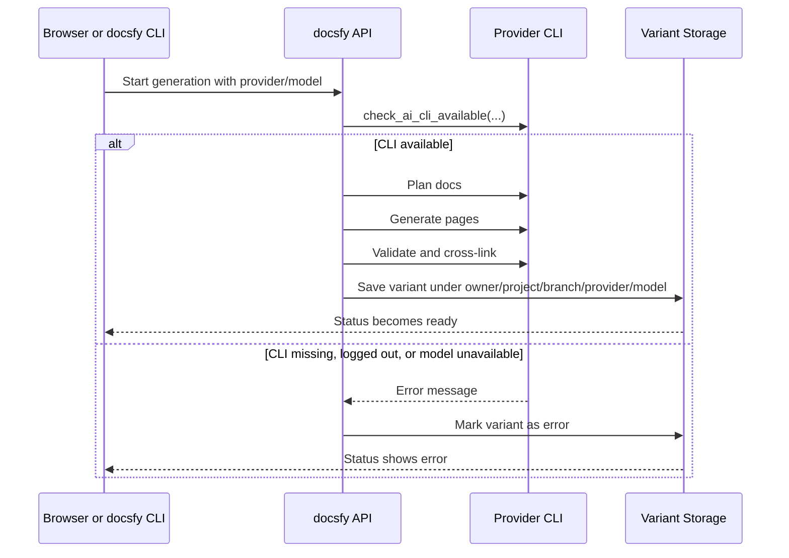

# AI Provider Setup

To generate documentation, `docsfy` needs access to a supported AI provider CLI on the same machine that runs `docsfy-server`. If your browser or local `docsfy` CLI connects to a remote server, provider setup belongs on that server, not on your workstation.

The supported provider names are:

- `claude`
- `gemini`
- `cursor`

## How Provider Setup Fits Into Generation



> **Warning:** The provider dropdown is not a live health check. The UI can show `claude`, `gemini`, and `cursor` even if a CLI is missing, logged out, or blocked from the selected model.

## Install The Provider CLIs

`docsfy` expects a matching external CLI for each provider you want to use:

- `claude`: Claude Code CLI
- `gemini`: Gemini CLI
- `cursor`: Cursor Agent CLI

If you use the bundled container image, all three are installed during the image build and added to the runtime user's `PATH`:

```dockerfile
# Install Claude Code CLI (installs to ~/.local/bin)
RUN /bin/bash -o pipefail -c "curl -fsSL https://claude.ai/install.sh | bash"

# Install Cursor Agent CLI (installs to ~/.local/bin)
RUN /bin/bash -o pipefail -c "curl -fsSL https://cursor.com/install | bash"

# Configure npm for non-root global installs and install Gemini CLI + mermaid-cli
RUN mkdir -p /home/appuser/.npm-global \
  && npm config set prefix '/home/appuser/.npm-global' \
  && npm install -g @google/gemini-cli @mermaid-js/mermaid-cli@11

USER appuser
ENV PATH="/home/appuser/.local/bin:/home/appuser/.npm-global/bin:${PATH}"
ENV HOME="/home/appuser"
```

If you are not using the bundled image, install the equivalent CLIs yourself and make sure the server user can run them from `PATH`.

> **Note:** The repository installs provider binaries for the bundled container image, but it does not perform provider login for you.

## Authenticate The Right Layer

There are two separate authentication layers in a `docsfy` deployment:

- `docsfy` authentication: who can use the app, API, and CLI
- Provider authentication: whether the external Claude, Gemini, or Cursor CLI can actually generate content

When the `docsfy` CLI talks to the server, the stored `password` is used as an HTTP Bearer token:

```python
self._client = httpx.Client(
    base_url=self.server_url,
    headers={"Authorization": f"Bearer {self.password}"},
    timeout=30.0,
    follow_redirects=False,
)
```

The checked-in server environment example contains `docsfy` settings and provider defaults, but no provider login secrets:

```dotenv
ADMIN_KEY=

AI_PROVIDER=cursor
AI_MODEL=gpt-5.4-xhigh-fast
AI_CLI_TIMEOUT=60
```

This means:

- Your `docsfy` login does not log the provider CLI into Claude, Gemini, or Cursor.
- `AI_PROVIDER` and `AI_MODEL` choose defaults; they do not authenticate anything.
- The external CLI must already be authenticated in the same environment that runs `docsfy-server`.

If you deploy with the bundled container, that environment is the `appuser` account with `HOME=/home/appuser`. Provider login state has to be available there.

> **Warning:** Do not put provider credentials in Git-tracked files. Authenticate each provider CLI using its normal login flow outside the repository.

## Defaults And Model Validation

The shipped server defaults are:

- Provider: `cursor`
- Model: `gpt-5.4-xhigh-fast`
- CLI timeout: `60` seconds

At the API layer, `docsfy` enforces a fixed provider list and requires a model name:

```python
if ai_provider not in VALID_PROVIDERS:
    raise HTTPException(
        status_code=400,
        detail=f"Invalid AI provider: '{ai_provider}'. Must be one of {', '.join(VALID_PROVIDERS)}.",
    )
if not ai_model:
    raise HTTPException(status_code=400, detail="AI model must be specified.")
```

Provider names are strict, but model names are intentionally loose. This codebase does not ship its own master catalog of valid Claude, Gemini, or Cursor models. The external CLI and your provider account are the source of truth for whether a model is actually usable.

## How Availability Affects Generation

Before cloning a repo or starting the planning pipeline, `docsfy` checks whether the selected provider CLI is available for the chosen provider/model pair:

```python
cli_flags = ["--trust"] if ai_provider == "cursor" else None
available, msg = await check_ai_cli_available(
    ai_provider, ai_model, cli_flags=cli_flags
)
if not available:
    await update_and_notify(
        gen_key,
        project_name,
        ai_provider,
        ai_model,
        status="error",
        owner=owner,
        branch=branch,
        error_message=msg,
    )
    return
```

This has a few practical consequences:

- If the provider CLI is missing, generation fails fast.
- If the CLI is installed but not authenticated, generation fails fast.
- If the selected model is not available to the current provider login, generation fails fast.
- When this check fails, the variant moves to `error` and the returned message is surfaced in status output.

The same provider and model are then used again for planning, page generation, validation, and cross-linking. Passing the initial availability check is necessary, but it is not a guarantee that later provider calls cannot fail.

> **Note:** `docsfy` automatically adds Cursor's `--trust` flag when the selected provider is `cursor`.

> **Warning:** If a run fails almost immediately, check provider installation, provider login, and model access first. The availability check happens before repo cloning.

## Why The Model Picker May Be Empty Or Stale

The provider list is fixed, but model suggestions are remembered history, not a live catalog fetched from Claude, Gemini, or Cursor.

The server builds its known model list from successful `ready` variants:

```python
cursor = await db.execute(
    "SELECT DISTINCT ai_provider, ai_model FROM projects WHERE ai_provider != '' AND ai_model != '' AND status = 'ready' ORDER BY ai_provider, ai_model"
)
rows = await cursor.fetchall()
models: dict[str, list[str]] = {}
for provider, model in rows:
    if provider not in models:
        models[provider] = []
    if model not in models[provider]:
        models[provider].append(model)
```

At the same time, the model input is free-form in the UI:

```tsx
<Combobox
  options={modelOptions}
  value={model}
  onChange={setModel}
  placeholder="Select or type model..."
  disabled={isSubmitting}
  data-testid="model-input"
/>
```

What this means in practice:

- A fresh server can have an empty model list.
- A newly released provider model does not appear automatically.
- A model can still appear in the picker even if the current provider login no longer has access to it.
- You can type a model manually even when it is not suggested yet.

> **Tip:** If the model dropdown is empty, type the model name you want and use it for a successful generation. Once that variant reaches `ready`, the server can start suggesting that model later.

## Why Provider And Model Create Separate Variants

Provider and model are part of how `docsfy` stores and identifies generated output:

```python
return (
    PROJECTS_DIR
    / safe_owner
    / _validate_name(name)
    / branch
    / ai_provider
    / ai_model
)
```

That is why the same repository can have different outputs for different providers, models, and branches. It is also why docs URLs and download endpoints include `branch`, `provider`, and `model`.

Without `force`, `docsfy` can reuse work from the newest ready variant even if that variant was generated with a different provider or model. On same-commit switches, it can reuse cached pages or even the already-rendered site. With `force`, it does a fresh run and keeps existing variants in place.

> **Note:** If you are comparing providers side by side, use a forced regeneration when you want a clean rerun rather than reuse from the newest ready variant.

## Setup Checklist

- Install the provider CLI you want to use on the machine that runs `docsfy-server`.
- Make sure the server user can run that CLI from `PATH`.
- Authenticate the provider CLI as that same user, with the same `HOME`.
- Set sensible defaults for `AI_PROVIDER`, `AI_MODEL`, and `AI_CLI_TIMEOUT`.
- Keep `ADMIN_KEY` and provider credentials separate in your mental model and in your deployment.
- Expect the provider dropdown to exist even before the provider is actually usable.
- If model suggestions are empty, type the model name manually.
- If generation fails quickly, check provider CLI availability and login state before you troubleshoot the repository itself.


## Related Pages

- [Installation](installation.html)
- [Environment Variables](environment-variables.html)
- [Generating Documentation](generating-documentation.html)
- [Deployment and Runtime](deployment-and-runtime.html)
- [Troubleshooting](troubleshooting.html)