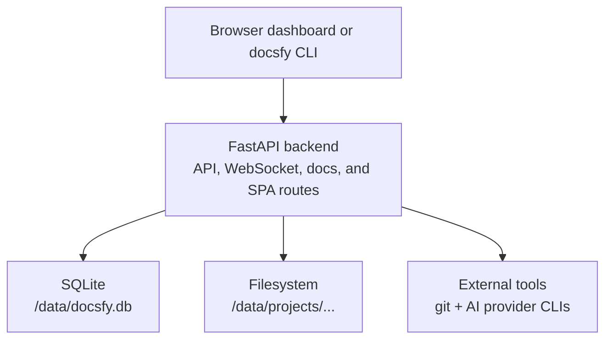

# Architecture and Runtime

`docsfy` runs as one web application with a clear split of responsibilities:

- The FastAPI backend is the hub. It handles auth, generation requests, project state, admin actions, downloads, and WebSocket updates.
- The React dashboard is the control plane. It lets you start runs, watch progress, browse variants, and manage users or access.
- SQLite stores runtime metadata such as projects, variants, users, sessions, and sharing rules.
- The filesystem stores generated artifacts such as cached Markdown, rendered HTML, search assets, and download bundles.
- External AI CLIs do the planning, page writing, validation, and cross-linking work.
- The static renderer turns generated Markdown into a browsable site.

That architecture keeps deployment simple: one service, one database file, one data directory, and one place to look when something is generating, ready, failed, or downloadable.

> **Note:** The generated docs are static HTML on disk, but by default they are still served by the same FastAPI app that powers the dashboard and API.

## The Big Picture



In practice, a generation request looks like this:

1. You submit a repo URL from the dashboard or run `docsfy generate`.
2. The backend validates auth, repo source, provider/model, and branch.
3. It clones the repo or inspects a local admin-only repo path.
4. It compares the current commit to the newest ready variant so it can choose between a full run, an incremental update, or an immediate `up_to_date` result.
5. It asks an AI CLI to create a documentation plan, or reuses the existing plan for an incremental run.
6. It generates Markdown pages, and incremental runs can patch only the affected sections of a page instead of rewriting the whole file.
7. It validates generated pages against the repository and can regenerate pages that still contain stale references.
8. It adds a `## Related Pages` section based on AI-suggested cross-links between pages.
9. If possible, it detects the repository version, renders the static site to disk, and writes search plus LLM export assets.
10. It updates SQLite, notifies connected clients over WebSocket, and serves the finished site under `/docs/...`.

A specific docs variant is served from a URL shaped like:

`/docs/{project}/{branch}/{provider}/{model}/...`

There is also a shortcut route that serves the latest ready variant for a project:

`/docs/{project}/...`

## FastAPI as the Hub

The FastAPI app is where everything comes together. It includes the auth, admin, project, and WebSocket routers, and it also serves both the React frontend and the rendered docs.

The backend does four important things at runtime:

- Authenticates API clients with Bearer tokens and browser users with a session cookie.
- Starts generation in background tasks so the request can return immediately.
- Streams progress to the UI and CLI over `/api/ws`.
- Serves ready docs directly from the filesystem.

Generated docs are treated as authenticated content, not as a separate anonymous static host.

> **Note:** Unauthenticated browser requests to `/docs/...` are redirected to `/login`. Unauthenticated API requests receive `401 Unauthorized`.

Browser sessions are cookie-based, while the CLI uses an API key as a Bearer token. The same auth layer protects `/api/*` and `/docs/*`, which means the dashboard, downloads, and docs views all respect the same user and access rules.

## React Dashboard

The React app is a Vite-built SPA that becomes the main operator interface in the browser. In production, FastAPI serves the built frontend. In development, Vite runs on port `5173` and proxies API, docs, and health requests back to FastAPI.

From `frontend/vite.config.ts`:

```typescript
server: {
  host: '0.0.0.0',
  port: 5173,
  proxy: {
    '/api': {
      target: API_TARGET,
      changeOrigin: true,
      ws: true,
    },
    '/docs': {
      target: API_TARGET,
      changeOrigin: true,
    },
    '/health': {
      target: API_TARGET,
      changeOrigin: true,
    },
  },
},
```

The dashboard does not render documentation itself. Instead, it works as a control plane:

- It calls `/api/auth/me` to check the current session.
- It loads `/api/projects` to populate a hierarchical tree of repository, branch, and provider/model variants. For admins, the tree is grouped by `owner/name` so similarly named repos from different owners stay separate.
- It opens `/api/ws` for live progress and status updates, then combines `current_stage`, `page_count`, and `plan_json` to show a per-page activity log while a run is in progress.
- It opens ready docs in a new tab at `/docs/...`.
- It downloads archives from `/api/projects/.../download`.

The WebSocket connection is the first choice, but the dashboard can fall back to polling if reconnects fail. From `frontend/src/lib/websocket.ts`:

```typescript
private attemptReconnect(): void {
  if (this.reconnectAttempts >= this.maxReconnectAttempts) {
    console.debug('[WS] Falling back to polling')
    this.startPolling()
    return
  }
  const delay = this.getBackoffDelay()
  this.reconnectAttempts++
  console.debug('[WS] Reconnecting, attempt', this.reconnectAttempts)
  this.reconnectTimer = setTimeout(() => this.connect(true), delay)
}

private startPolling(): void {
  if (this.pollingTimer) return
  this.pollingTimer = setInterval(async () => {
    try {
      const data = await api.get<ProjectsResponse>('/api/projects')
      const syncMessage: WebSocketMessage = {
        type: 'sync' as const,
        projects: data.projects,
        known_models: data.known_models,
        known_branches: data.known_branches,
      }
      this.handlers.forEach(handler => handler(syncMessage))
    } catch {
      /* ignore polling errors */
    }
  }, WS_POLLING_FALLBACK_MS)
}
```

That fallback matters in real deployments: if a reverse proxy, browser, or network drops the socket, the dashboard still keeps the project list fresh.

## SQLite Storage and Variant Layout

`docsfy` stores runtime metadata in SQLite and generated content on disk.

The most important table is `projects`, which treats a generated output as a variant of a repository. A variant is keyed by:

- project name
- branch
- AI provider
- AI model
- owner

From `src/docsfy/storage.py`:

```python
await db.execute(f"""
    CREATE TABLE IF NOT EXISTS projects (
        name TEXT NOT NULL,
        branch TEXT NOT NULL DEFAULT '{_SQL_DEFAULT_BRANCH}',
        ai_provider TEXT NOT NULL DEFAULT '',
        ai_model TEXT NOT NULL DEFAULT '',
        owner TEXT NOT NULL DEFAULT '',
        repo_url TEXT NOT NULL,
        status TEXT NOT NULL DEFAULT 'generating',
        current_stage TEXT,
        last_commit_sha TEXT,
        last_generated TEXT,
        page_count INTEGER DEFAULT 0,
        error_message TEXT,
        plan_json TEXT,
        created_at TIMESTAMP DEFAULT CURRENT_TIMESTAMP,
        updated_at TIMESTAMP DEFAULT CURRENT_TIMESTAMP,
        PRIMARY KEY (name, branch, ai_provider, ai_model, owner)
    )
""")
```

This is why the same repository can have multiple outputs side by side instead of overwriting each other.

A typical runtime layout under `DATA_DIR=/data` looks like this:

```text
/data/
  docsfy.db
  projects/
    <owner>/
      <repo-name>/
        <branch>/
          <provider>/
            <model>/
              plan.json
              cache/
                pages/
                  *.md
              site/
                .nojekyll
                index.html
                *.html
                *.md
                assets/
                search-index.json
                llms.txt
                llms-full.txt
```

A few details matter here:

- SQLite stores the project state, not the site content itself.
- The cached page Markdown lives separately from the final rendered site.
- `plan_json` is stored in the database while a run is still in progress, which lets the dashboard show planned page counts before rendering is finished.
- Sessions are stored in SQLite too, so browser login state survives normal request boundaries.

> **Tip:** Because branch, provider, and model are part of the variant key, you can keep `main` and `release-1.x` docs, or `claude` and `cursor` output, side by side for the same repository.

> **Note:** Branch names cannot contain `/`. `docsfy` uses the branch as a single URL segment and as part of the on-disk folder structure.

## AI CLI Integration and Generation Flow

`docsfy` does not talk directly to hosted model APIs inside its own code. Instead, it delegates planning and page writing to external AI CLIs through `ai-cli-runner`. That keeps the provider-specific invocation logic in one layer and lets the backend focus on orchestration.

From `src/docsfy/generator.py`:

```python
async def _call_ai_or_raise(
    prompt: str,
    repo_path: Path,
    ai_provider: str,
    ai_model: str,
    ai_cli_timeout: int | None = None,
) -> str:
    cli_flags = ["--trust"] if ai_provider == "cursor" else None
    success, output = await call_ai_cli(
        prompt=prompt,
        cwd=repo_path,
        ai_provider=ai_provider,
        ai_model=ai_model,
        ai_cli_timeout=ai_cli_timeout,
        cli_flags=cli_flags,
    )
    if not success:
        raise RuntimeError(output)
    return output
```

That flow is wrapped in a generation pipeline with clear stages. The backend writes these stage values into project state, and the dashboard uses the same names to render a live activity log.

From `frontend/src/lib/constants.ts`:

```typescript
export const GENERATION_STAGES = [
  'cloning',
  'planning',
  'incremental_planning',
  'generating_pages',
  'validating',
  'cross_linking',
  'rendering',
] as const
```

That lets the UI distinguish between page generation, stale-reference validation, and cross-link insertion before rendering begins. A ready variant can also keep `current_stage = up_to_date` when `docsfy` determines that nothing meaningful changed.

For remote repositories, cloning is intentionally shallow and branch-aware. From `src/docsfy/repository.py`:

```python
clone_cmd = ["git", "clone", "--depth", "1"]
if branch:
    clone_cmd += ["--branch", branch]
clone_cmd += ["--", repo_url, str(repo_path)]
```

That small detail has a big runtime effect:

- New runs start quickly because only the latest commit is cloned at first.
- If `docsfy` needs a diff against an earlier commit, it deepens the clone just enough to fetch the old commit.
- If the latest commit SHA matches an existing ready variant, `docsfy` can mark the new request as up to date instead of regenerating everything.
- If only part of the repo changed, the incremental planner can choose which pages to regenerate and keep the rest from cache.
- If the newest ready output was built with a different provider or model, `docsfy` can reuse that variant’s artifacts and then replace it only after the new variant is ready.

Page generation is also parallelized, and incremental runs can update only the affected sections of a page instead of forcing a full rewrite. For pages that need regeneration, `docsfy` can ask the AI for a JSON patch-like set of targeted text replacements and apply those edits to the existing markdown before falling back to a full rewrite. The generator still caps page work at five concurrent pages, which is a good balance between speed and keeping provider CLIs manageable.

> **Tip:** Switching provider or model after a successful run can be much faster than starting over from scratch. `docsfy` will try to reuse previous artifacts when the commit history and variant state allow it.

> **Warning:** Local `repo_path` generation is admin-only, and remote repository URLs that target localhost or private network ranges are rejected. That keeps a documentation generator from turning into an internal-network fetch tool.

## Static Site Renderer

Once Markdown pages are ready, `docsfy` renders a complete static site with Jinja templates and Python-Markdown.

The renderer does more than a straight Markdown-to-HTML conversion:

- It pre-renders top-level Mermaid diagrams to inline SVG when `mmdc` is available.
- It cleans up unusual code-fence annotations that AI output may produce.
- It inserts missing blank lines so Markdown structures render correctly.
- It sanitizes dangerous HTML before writing the final page.
- It filters path-unsafe slugs out of the output and trims navigation to only the pages that were actually rendered.
- It renders `index.html` plus one HTML page per slug.
- It also writes `.md` copies of pages alongside the HTML.
- It builds `search-index.json`, `llms.txt`, and `llms-full.txt`.
- It can include a detected project version in the generated footer, using `pyproject.toml`, `package.json`, `Cargo.toml`, `setup.cfg`, or the latest Git tag when available.
- It copies client-side assets for search, theme switching, copy buttons, scrollspy, callout styling, and GitHub metadata.

> **Note:** Mermaid pre-rendering is opportunistic. If `mmdc` is unavailable or a diagram fails to render, `docsfy` keeps the original fenced block instead of failing the whole site render.

From `src/docsfy/renderer.py`:

```python
search_index = _build_search_index(valid_pages, plan)
(output_dir / "search-index.json").write_text(
    json.dumps(search_index), encoding="utf-8"
)

llms_txt = _build_llms_txt(plan, navigation=filtered_navigation)
(output_dir / "llms.txt").write_text(llms_txt, encoding="utf-8")

llms_full_txt = _build_llms_full_txt(
    plan, valid_pages, navigation=filtered_navigation
)
(output_dir / "llms-full.txt").write_text(llms_full_txt, encoding="utf-8")
```

The final site is still a static site in the classic sense: HTML files, CSS, JS, and JSON assets. The difference is that `docsfy` renders and serves that site for you.

A ready site includes user-friendly features out of the box:

- sidebar navigation
- search modal powered by `search-index.json`
- dark/light theme toggle
- on-page table of contents
- previous/next page navigation
- copy buttons for code blocks
- `llms.txt` and `llms-full.txt` exports
- `.nojekyll` for GitHub Pages compatibility

> **Warning:** AI-generated content is rendered with `|safe` in the final page template, but only after `docsfy` sanitizes scripts, `iframe`/`object`/`embed`/`form` tags, event-handler attributes, and unsafe `href`/`src` schemes.

## Runtime Configuration

Server runtime is controlled by environment variables. The defaults are practical, but `ADMIN_KEY` is mandatory.

From `.env.example`:

```bash
# Required: Admin password (minimum 16 characters)
ADMIN_KEY=

# AI provider and model defaults
# (pydantic_settings reads these case-insensitively)
AI_PROVIDER=cursor
AI_MODEL=gpt-5.4-xhigh-fast
AI_CLI_TIMEOUT=60

# Logging
LOG_LEVEL=INFO

# Data directory for database and generated docs
DATA_DIR=/data

# Cookie security (set to false for local HTTP development)
SECURE_COOKIES=true

# Development mode: starts Vite dev server on port 5173 alongside FastAPI
# DEV_MODE=true
```

The most important runtime settings are:

- `ADMIN_KEY`: required at startup, minimum 16 characters
- `AI_PROVIDER` and `AI_MODEL`: defaults for new generations
- `AI_CLI_TIMEOUT`: timeout passed to provider CLI invocations
- `DATA_DIR`: where SQLite and generated docs are stored
- `SECURE_COOKIES`: should stay `true` outside local HTTP development
- `DEV_MODE`: enables Vite plus FastAPI reload in one container/process launch

> **Warning:** `ADMIN_KEY` is more than the admin login password. `docsfy` also uses it as the HMAC secret when hashing stored API keys. Rotating it invalidates existing user API-key hashes.

The CLI has its own separate runtime config in `~/.config/docsfy/config.toml`. From `config.toml.example`:

```toml
# Default server to use when --server is not specified
[default]
server = "dev"

# Server profiles -- add as many as you need
[servers.dev]
url = "http://localhost:8000"
username = "admin"
password = "<your-dev-key>"

[servers.prod]
url = "https://docsfy.example.com"
username = "admin"
password = "<your-prod-key>"

[servers.staging]
url = "https://staging.docsfy.example.com"
username = "deployer"
password = "<your-staging-key>"
```

That file powers the `docsfy` CLI. It is the client-side equivalent of a browser session: it tells the CLI where the server lives and which credentials to send.

> **Tip:** The CLI config is written with owner-only permissions, which is important because it stores real credentials.

## Development and Deployment

The deployment model is intentionally straightforward:

- the frontend is built once with Vite
- Python dependencies are installed into a virtual environment
- provider CLIs are installed into the runtime image
- the built frontend is copied into the same image as FastAPI
- generated state is stored in `/data`

A minimal local deployment is already described by `docker-compose.yaml`:

```yaml
services:
  docsfy:
    build:
      context: .
      dockerfile: Dockerfile
    ports:
      - "8000:8000"
    volumes:
      - ./data:/data
    env_file:
      - .env
    environment:
      - ADMIN_KEY=${ADMIN_KEY}
    restart: unless-stopped
```

In normal mode, the container serves FastAPI on port `8000`. The runtime image also bundles Chromium plus `mermaid-cli`, and the Docker build smoke-tests `mmdc` so Mermaid diagrams can render during site generation without an extra service. In `DEV_MODE=true`, the entrypoint also starts the Vite dev server on `5173` and runs FastAPI with reload, which gives you a faster edit-refresh loop for frontend work.

This architecture makes production easy to reason about:

- one service exposes the dashboard and docs
- one mounted data directory preserves state
- one authentication system protects both API and docs
- one backend orchestrates all provider CLIs

## Testing and Automation

The runtime design is backed by both backend and frontend tests.

The repository includes:

- backend tests under `tests/`, covering auth, generation, storage, rendering, repository cloning and diffing, WebSocket auth and heartbeats, and end-to-end mocked generation flows
- frontend tests with Vitest and JSDOM
- `tox.toml` for running backend tests through `uv`
- `.pre-commit-config.yaml` for linting, formatting, typing, and secret scanning
- human-readable end-to-end plans in `test-plans/`

Practical commands are:

- `uv run pytest -v --tb=short`
- `tox`
- `cd frontend && npm test`

The pre-commit setup also adds quality and security checks such as:

- `flake8`
- `ruff`
- `ruff-format`
- `mypy`
- `detect-secrets`
- `gitleaks`

> **Note:** This checkout does not include any committed `.github/workflows` files, so the repository’s automation is defined here through local tooling such as `tox.toml`, `frontend` test config, and `.pre-commit-config.yaml`, rather than an in-repo GitHub Actions pipeline.

If you keep one mental model in mind, use this one: FastAPI is the orchestrator, SQLite is the control database, the filesystem holds the generated site, and the AI CLI plus renderer pipeline turns a Git repository into a versioned, shareable documentation variant.


## Related Pages

- [Introduction](introduction.html)
- [Data Storage and Layout](data-storage-and-layout.html)
- [Generated Output](generated-output.html)
- [Deployment and Runtime](deployment-and-runtime.html)
- [WebSocket Protocol](websocket-protocol.html)