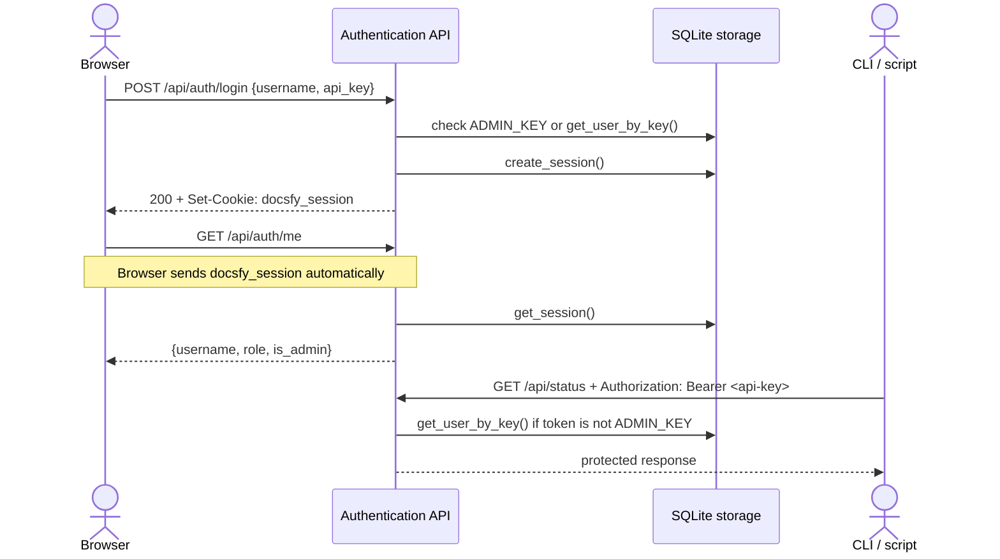

# Authentication API

docsfy supports two ways to authenticate:

- Bearer-token authentication for CLI tools, scripts, and direct API clients
- Session-cookie authentication for the built-in browser UI after a successful login

The same secret shows up under different names depending on the client. In the login API it is sent as `api_key`, in the web UI it is entered in a password field, and in direct API calls it is sent as a Bearer token.

Actual examples from the codebase:

```ts
await api.post<AuthResponse>('/api/auth/login', {
  username,
  api_key: password,
})
navigate(intendedPath)
```

```python
self._client = httpx.Client(
    base_url=self.server_url,
    headers={"Authorization": f"Bearer {self.password}"},
    timeout=30.0,
    follow_redirects=False,
)
```

> **Note:** If you are automating docsfy, you usually do not need to call `POST /api/auth/login` first. Send `Authorization: Bearer <api-key>` on protected requests instead.

## How Authentication Works



For protected requests, docsfy checks authentication in this order:

1. `Authorization: Bearer <token>`
2. `docsfy_session` cookie

If the Bearer token does not authenticate a user, docsfy falls back to the session cookie.

```python
auth_header = request.headers.get("authorization", "")
if auth_header.startswith("Bearer "):
    token = auth_header[7:]
    if token == settings.admin_key:
        is_admin = True
        username = "admin"
    else:
        user = await get_user_by_key(token)

if not user and not is_admin:
    session_token = request.cookies.get("docsfy_session")
    if session_token:
        session = await get_session(session_token)
```

For database-backed users, cookie-based authentication re-reads the user record on each request. That means deleted users lose access immediately, and role changes take effect on the next request.

The frontend sends the session cookie automatically on same-origin requests:

```ts
const config: RequestInit = {
  ...options,
  credentials: 'same-origin',
  redirect: 'manual',
  headers,
}
```

A successful login creates an HttpOnly browser cookie with strict same-site behavior and an 8-hour lifetime:

```python
response.set_cookie(
    "docsfy_session",
    session_token,
    httponly=True,
    samesite="strict",
    secure=settings.secure_cookies,
    max_age=SESSION_TTL_SECONDS,
)
```

Because the cookie is `HttpOnly`, frontend JavaScript cannot read it directly. The cookie value is also an opaque session token, not the raw API key you used to sign in.

Unauthenticated requests behave differently depending on the path:

- `/api/*` returns `401` with `{"detail": "Unauthorized"}`
- HTML requests to `/docs/*` redirect to `/login`
- `/api/ws` follows the same model and accepts either `?token=<api-key>` or the `docsfy_session` cookie

> **Tip:** Use session cookies for browsers and Bearer tokens for automation. They are different transport mechanisms for the same underlying credentials.

## Endpoint Reference

### POST `/api/auth/login`

Creates a browser session from a username/key pair.

- `Auth required:` No
- `Request body:` JSON object with `username` and `api_key`
- `Success:` `200 OK` with `username`, `role`, and `is_admin`, plus a `docsfy_session` cookie
- `400:` Invalid JSON body, or a JSON body that is not an object
- `401:` Invalid username or password

Important rules:

- The built-in admin login only works when `username` is exactly `admin` and the submitted secret matches `ADMIN_KEY`.
- Database-backed users must send the username that owns the submitted key.
- The built-in `admin` account is special and does not come from the users table.
- The returned `role` can be `admin`, `user`, or `viewer`.
- `is_admin` is `true` for the built-in admin and for database-backed users whose role is `admin`.

This endpoint is intentionally public and returns JSON. Bad credentials return `401`; they do not trigger a redirect.

> **Note:** The web UI labels this value as a password, but the API field name is still `api_key`.

### POST `/api/auth/logout`

Clears the current browser session.

- `Auth required:` No
- `Request body:` None
- `Success:` `200 OK` with `{ "ok": true }`
- `Side effect:` If the request includes `docsfy_session`, docsfy deletes the stored session and clears the cookie in the response

This endpoint does not revoke API keys or disable Bearer-token access. It only clears the session-cookie flow.

> **Note:** `logout` is safe to call even when the session has already expired or the client is no longer authenticated.

### GET `/api/auth/me`

This is the current-user endpoint. It returns the identity attached to the current request, whether that request was authenticated by a Bearer token or by a session cookie.

- `Auth required:` Yes
- `Success:` `200 OK` with `username`, `role`, and `is_admin`
- `401:` No valid Bearer token or session cookie

The response shape is simple:

```python
return JSONResponse(
    content={
        "username": request.state.username,
        "role": request.state.role,
        "is_admin": request.state.is_admin,
    }
)
```

Use `GET /api/auth/me` to:

- confirm that a token or session is still valid
- determine the active role
- decide whether to show admin-only behavior in a client

### POST `/api/auth/rotate-key`

Rotates the current user's own key. In the UI this behaves like a change-password action, but it rotates the same secret used for Bearer-token authentication.

- `Auth required:` Yes
- `Request body:` No body or `{}` generates a new random key
- `Request body:` `{ "new_key": "..." }` sets a custom key
- `Success:` `200 OK` with `username` and `new_api_key`
- `Response header:` `Cache-Control: no-store`
- `400:` Malformed JSON, a non-object JSON body, a short custom key, or the built-in `admin` account authenticated via `ADMIN_KEY`
- `401:` No valid authentication

Any authenticated database-backed user can rotate their own key, including `viewer`, `user`, and `admin` roles. The one exception is the built-in `admin` login that uses `ADMIN_KEY`.

Key rotation invalidates every existing session for that user:

```python
cursor = await db.execute(
    "UPDATE users SET api_key_hash = ? WHERE username = ?",
    (key_hash, username),
)
if cursor.rowcount == 0:
    msg = f"User '{username}' not found"
    raise ValueError(msg)
# Invalidate all existing sessions for this user
await db.execute("DELETE FROM sessions WHERE username = ?", (username,))
await db.commit()
```

The HTTP response also prevents caching and clears the current browser session:

```python
response = JSONResponse(
    content={"username": username, "new_api_key": new_key},
    headers={"Cache-Control": "no-store"},
)
response.delete_cookie(
    "docsfy_session",
    httponly=True,
    samesite="strict",
    secure=settings.secure_cookies,
)
```

After a successful rotation:

- the old key stops working immediately
- all existing sessions for that user are deleted
- the current `docsfy_session` cookie is cleared
- you must sign in again with the new key

> **Warning:** Custom keys must be at least 16 characters long.

> **Warning:** The built-in `admin` account cannot use this endpoint. To change that password, change `ADMIN_KEY` in the server configuration instead.

## Configuration

Authentication depends on two settings:

- `ADMIN_KEY` is required at startup and must be at least 16 characters long
- `secure_cookies` defaults to `True`; disable it only for local plain-HTTP development

The server settings are defined like this:

```python
class Settings(BaseSettings):
    model_config = SettingsConfigDict(
        env_file=".env",
        env_file_encoding="utf-8",
        extra="ignore",
    )

    admin_key: str = ""  # Required — validated at startup
    ai_provider: str = "cursor"
    ai_model: str = "gpt-5.4-xhigh-fast"
    ai_cli_timeout: int = Field(default=60, gt=0)
    log_level: str = "INFO"
    data_dir: str = "/data"
    secure_cookies: bool = True  # Set to False for local HTTP dev
```

When running with Docker Compose, `ADMIN_KEY` is passed through from the environment:

```yaml
env_file:
  - .env
environment:
  - ADMIN_KEY=${ADMIN_KEY}
```

> **Warning:** If `secure_cookies` stays enabled on plain HTTP local development, the browser will not send the session cookie and login will appear not to stick.

> **Warning:** `ADMIN_KEY` is more than the built-in admin password. It is also used when hashing stored user keys, so changing it invalidates existing database-backed user keys.

## Choosing The Right Flow

- Use Bearer tokens for CLI tools, scripts, and direct API clients.
- Use `POST /api/auth/login` when you want a browser session for the built-in UI.
- Use `GET /api/auth/me` to check who the current request is authenticated as.
- Use `POST /api/auth/rotate-key` when you want to invalidate a user key and issue a new one.
- Use `POST /api/auth/logout` only to clear browser sessions.


## Related Pages

- [Authentication and Roles](authentication-and-roles.html)
- [User and Access Management](user-and-access-management.html)
- [Admin API](admin-api.html)
- [WebSocket Protocol](websocket-protocol.html)
- [Security Considerations](security-considerations.html)