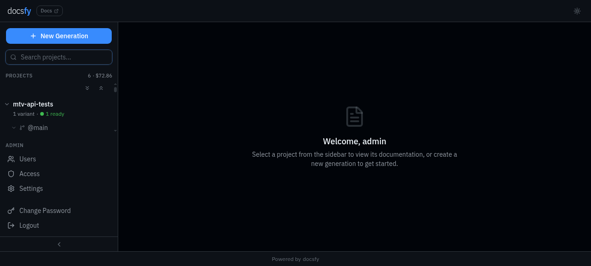
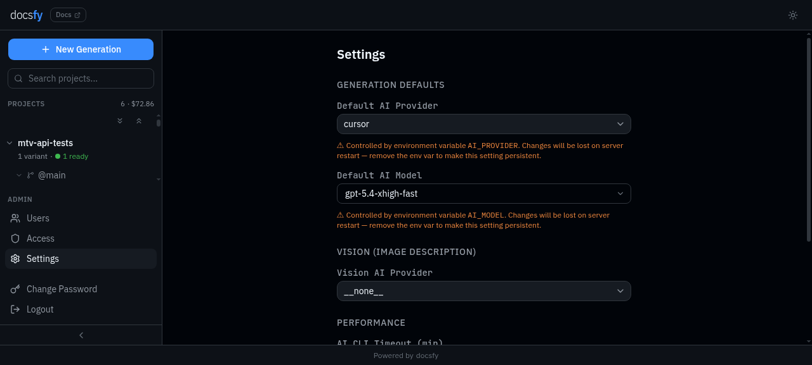
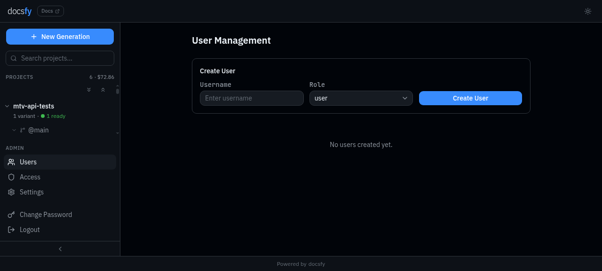

# Run Common CLI Workflows

These recipes cover the terminal tasks you will repeat most often once `docsfy` is installed. Paste them as-is, then follow the linked guide when you need the full workflow behind a command.

## Save a CLI profile and confirm it works

Use this when you want repeatable CLI access without retyping your server URL and API key for every command.

```bash
read -rsp "docsfy admin key: " DOCSFY_KEY && echo
printf '%s\n%s\n%s\n%s\n' \
  dev \
  http://localhost:800 \
  admin \
  "$DOCSFY_KEY" \
  | docsfy config init

docsfy config show
docsfy health
```

This creates a `dev` profile, saves your credentials, shows the masked result, and confirms the server is reachable. Use it once per workstation, then reuse the saved profile for the rest of the recipes on this page. See [Set Up the CLI](set-up-the-cli.html) for details.

- Use `docsfy config set default.server dev` to switch the default profile later.
- For one-off commands against another server, add `--host`, `--port`, `-u`, and `-p` directly on the command line.

## Start a generation and watch it finish

Use this when you want one command that starts a docs run and keeps streaming progress until it is done.

```bash
docsfy generate https://github.com/myk-org/docsfy.git --branch main --watch
```

This starts a generation for the `main` branch and prints live progress until the run ends in `ready`, `error`, or `aborted`. It uses the server's default provider and model if you do not pass them explicitly. See [Generate Documentation](generate-documentation.html) and [Track Generation Progress](track-generation-progress.html) for details.

- Add `--provider cursor --model gpt-5` if you want to override the server defaults.
- Add `--force` when you want a full rebuild instead of reusing an existing variant.

## Check one run by generation ID

Use this when a project has many variants and you want the exact status for one specific run.

```bash
GEN_ID="$(
  docsfy generate https://github.com/myk-org/docsfy.git --branch main \
    | awk -F': ' '/Generation ID:/ {print $2}'
)"

docsfy status "$GEN_ID"
```

This starts a run, captures the generated UUID from the CLI output, and then asks for status using that exact ID. It is especially useful when the same repository exists under multiple branches, providers, models, or owners. See [Manage Projects and Variants](manage-projects-and-variants.html) for details.



- Add `--json` to `docsfy status "$GEN_ID"` if you want machine-readable output.
- You can also pass a generation ID to `docsfy abort`, `docsfy delete`, and `docsfy download`.

## Download a ready variant into a flat folder

Use this when you want a clean local directory that contains the generated site files directly at the top level.

```bash
GEN_ID="$(
  docsfy generate https://github.com/myk-org/docsfy.git --branch main --watch \
    | awk -F': ' '/Generation ID:/ {print $2}'
)"

docsfy download "$GEN_ID" --output ./docsfy-site --flatten
```

This waits for a generation to finish, then downloads that exact run and extracts it into `./docsfy-site` without leaving the nested archive directory in place. It is a good fit for quick previews, static hosting, or handing the generated site to another tool. See [Browse and Download Docs](browse-and-download-docs.html) for details.



- Omit `--flatten` if you want to keep the archive's top-level directory structure.
- > **Warning:** `--flatten` only works when you also pass `--output`.

## Create a viewer and share one project

Use this when you want to give someone read-only access to an existing project's variants.

```bash
docsfy admin users create qa-viewer --role viewer
docsfy admin access grant docsfy --username qa-viewer --owner admin
docsfy admin access list docsfy --owner admin
```

The first command creates the user and prints their API key, the second shares every `docsfy` variant owned by `admin`, and the third confirms the access list. This is the fastest way to onboard someone who needs to inspect docs but should not start, abort, or delete runs. See [Manage Users and Access](manage-users-and-access.html) for details.



- Save the API key from `users create` immediately; it is only shown once.
- Use `--role user` instead of `--role viewer` if the person should be allowed to regenerate or delete variants.

## Rotate a user's key and remove their project access

Use this when someone loses a key, changes teams, or should stop seeing a shared project.

```bash
docsfy admin users rotate-key qa-viewer
docsfy admin access revoke docsfy --username qa-viewer --owner admin
docsfy admin users list
```

This prints a fresh API key for `qa-viewer`, revokes that user's shared access to the `admin` copy of `docsfy`, and then shows the current user list for a quick check. Rotating the key is also the right move when you want to invalidate the user's existing sessions. See [Manage Users and Access](manage-users-and-access.html) for details.

- Run `docsfy admin access list docsfy --owner admin` afterward if you want to verify that the grant is gone.
- > **Warning:** `rotate-key` shows the new key once, so copy it before you close the terminal.

## Find only the variants you care about

Use this when your server has enough projects that a full `list` output is too noisy.

```bash
docsfy list --status generating
docsfy list --provider cursor
docsfy status docsfy
```

These commands narrow the project table to active runs or one provider, then show every variant for a single project. This is the quickest way to spot in-progress jobs before you decide whether to watch, abort, or delete them. See [Manage Projects and Variants](manage-projects-and-variants.html) and [CLI Command Reference](cli-command-reference.html) for details.

- Valid `--status` filters are the same statuses you see in the UI, such as `generating` and `ready`.
- Use `docsfy status <GENERATION_ID>` when the project name alone is not specific enough.# Run Common CLI Workflows

These recipes cover the terminal tasks you will repeat most often once `docsfy` is installed. Paste them as-is, then follow the linked guide when you need the full workflow behind a command.

## Save a CLI profile and confirm it works

Use this when you want repeatable CLI access without retyping your server URL and API key for every command.

```bash
read -rsp "docsfy admin key: " DOCSFY_KEY && echo
printf '%s\n%s\n%s\n%s\n' \
  dev \
  http://localhost:8000 \
  admin \
  "$DOCSFY_KEY" \
  | docsfy config init

docsfy config show
docsfy health
```

This creates a `dev` profile, saves your credentials, shows the masked result, and confirms the server is reachable. Use it once per workstation, then reuse the saved profile for the rest of the recipes on this page. See [Set Up the CLI](set-up-the-cli.html) for details.

- Use `docsfy config set default.server dev` to switch the default profile later.
- For one-off commands against another server, add `--host`, `--port`, `-u`, and `-p` directly on the command line.

## Start a generation and watch it finish

Use this when you want one command that starts a docs run and keeps streaming progress until it is done.

```bash
docsfy generate https://github.com/myk-org/docsfy.git --branch main --watch
```

This starts a generation for the `main` branch and prints live progress until the run ends in `ready`, `error`, or `aborted`. It uses the server's default provider and model if you do not pass them explicitly. See [Generate Documentation](generate-documentation.html) and [Track Generation Progress](track-generation-progress.html) for details.

- Add `--provider cursor --model gpt-5` if you want to override the server defaults.
- Add `--force` when you want a full rebuild instead of reusing an existing variant.

## Check one run by generation ID

Use this when a project has many variants and you want the exact status for one specific run.

```bash
GEN_ID="$(
  docsfy generate https://github.com/myk-org/docsfy.git --branch main \
    | awk -F': ' '/Generation ID:/ {print $2}'
)"

docsfy status "$GEN_ID"
```

This starts a run, captures the generated UUID from the CLI output, and then asks for status using that exact ID. It is especially useful when the same repository exists under multiple branches, providers, models, or owners. See [Manage Projects and Variants](manage-projects-and-variants.html) for details.


- Add `--json` to `docsfy status "$GEN_ID"` if you want machine-readable output.
- You can also pass a generation ID to `docsfy abort`, `docsfy delete`, and `docsfy download`.

## Download a ready variant into a flat folder

Use this when you want a clean local directory that contains the generated site files directly at the top level.

```bash
GEN_ID="$(
  docsfy generate https://github.com/myk-org/docsfy.git --branch main --watch \
    | awk -F': ' '/Generation ID:/ {print $2}'
)"

docsfy download "$GEN_ID" --output ./docsfy-site --flatten
```

This waits for a generation to finish, then downloads that exact run and extracts it into `./docsfy-site` without leaving the nested archive directory in place. It is a good fit for quick previews, static hosting, or handing the generated site to another tool. See [Browse and Download Docs](browse-and-download-docs.html) for details.


- Omit `--flatten` if you want to keep the archive's top-level directory structure.
- > **Warning:** `--flatten` only works when you also pass `--output`.

## Create a viewer and share one project

Use this when you want to give someone read-only access to an existing project's variants.

```bash
docsfy admin users create qa-viewer --role viewer
docsfy admin access grant docsfy --username qa-viewer --owner admin
docsfy admin access list docsfy --owner admin
```

The first command creates the user and prints their API key, the second shares every `docsfy` variant owned by `admin`, and the third confirms the access list. This is the fastest way to onboard someone who needs to inspect docs but should not start, abort, or delete runs. See [Manage Users and Access](manage-users-and-access.html) for details.


- Save the API key from `users create` immediately; it is only shown once.
- Use `--role user` instead of `--role viewer` if the person should be allowed to regenerate or delete variants.

## Rotate a user's key and remove their project access

Use this when someone loses a key, changes teams, or should stop seeing a shared project.

```bash
docsfy admin users rotate-key qa-viewer
docsfy admin access revoke docsfy --username qa-viewer --owner admin
docsfy admin users list
```

This prints a fresh API key for `qa-viewer`, revokes that user's shared access to the `admin` copy of `docsfy`, and then shows the current user list for a quick check. Rotating the key is also the right move when you want to invalidate the user's existing sessions. See [Manage Users and Access](manage-users-and-access.html) for details.

- Run `docsfy admin access list docsfy --owner admin` afterward if you want to verify that the grant is gone.
- > **Warning:** `rotate-key` shows the new key once, so copy it before you close the terminal.

## Find only the variants you care about

Use this when your server has enough projects that a full `list` output is too noisy.

```bash
docsfy list --status generating
docsfy list --provider cursor
docsfy status docsfy
```

These commands narrow the project table to active runs or one provider, then show every variant for a single project. This is the quickest way to spot in-progress jobs before you decide whether to watch, abort, or delete them. See [Manage Projects and Variants](manage-projects-and-variants.html) and [CLI Command Reference](cli-command-reference.html) for details.

- Valid `--status` filters are the same statuses you see in the UI, such as `generating` and `ready`.
- Use `docsfy status <GENERATION_ID>` when the project name alone is not specific enough.

## Related Pages

- [Set Up the CLI](set-up-the-cli.html)
- [Generate Documentation](generate-documentation.html)
- [Track Generation Progress](track-generation-progress.html)
- [Browse and Download Docs](browse-and-download-docs.html)
- [Manage Users and Access](manage-users-and-access.html)