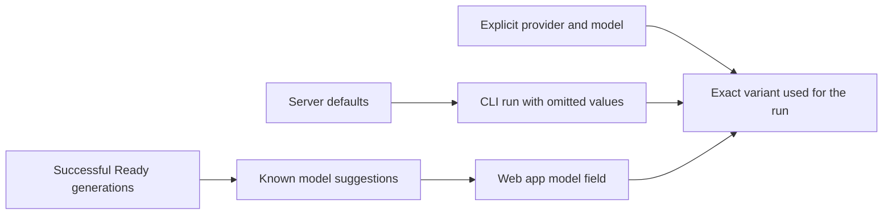

# Configuring AI Providers and Models

You want each generation to use the provider and model you intended, whether you start it from the web app or the CLI. Picking the pair deliberately keeps runs predictable, makes the right variant easy to find later, and avoids accidental fallback to server defaults.

## Prerequisites

- A running docsfy server with at least one working AI provider.
- Permission to start generations as a `user` or `admin`.
- If you use the CLI, a configured CLI profile. See [Managing docsfy from the CLI](manage-docsfy-from-the-cli.html).
- If you want to change server defaults, access to the server environment or `.env`. See [Configuration Reference](configuration-reference.html).
- If provider setup is not working yet, see [Install and Run docsfy Without Docker](install-and-run-docsfy-without-docker.html) or [Fixing Setup and Generation Problems](fix-setup-and-generation-problems.html).

## Quick Example

```shell
docsfy models --provider cursor
docsfy generate https://github.com/myk-org/for-testing-only \
  --provider cursor \
  --model gpt-5.4-xhigh-fast
```

The first command shows what docsfy already knows about `cursor` models. The second command starts a run with an explicit provider/model pair, so the request cannot silently fall back to something else.

## Step-by-Step



1. Review or set the server defaults.

```dotenv
AI_PROVIDER=cursor
AI_MODEL=gpt-5.4-xhigh-fast
AI_CLI_TIMEOUT=60
```

These values are the server-side fallback when a run does not supply a provider, a model, or a timeout. After you change them, restart `docsfy-server`. See [Configuration Reference](configuration-reference.html) for the full settings list.

2. Check how defaults and known models appear.

```shell
docsfy models
docsfy models --provider gemini
```

| Surface | What you can choose or see | How defaults appear |
| --- | --- | --- |
| Web app `New Generation` | Fixed provider list: `claude`, `gemini`, `cursor`; model suggestions for the selected provider; typed model names | The form does not mark the server default provider or model |
| `docsfy models` | All supported providers and known models | `(default)` marks the server default provider and model |
| `docsfy generate` | `--provider` and `--model`, or omitted values | Any missing value is filled by the server default |

> **Note:** Known models come from successful `Ready` generations. They are not a live catalog of every model your provider account could use.


> **Tip:** On a brand-new server, `docsfy models` can show `(no models used yet)` and the web app model suggestions can be empty. You can still type a model manually.

3. Start the run with an explicit pair when you want a predictable result.

```shell
docsfy generate https://github.com/myk-org/for-testing-only \
  --branch main \
  --provider gemini \
  --model gemini-2.5-flash
```

In the web app, open `New Generation`, choose `gemini`, then choose or type `gemini-2.5-flash` before you click `Generate`. For the rest of the run flow, see [Generating Documentation](generate-documentation.html).

> **Tip:** After you change the provider in the web app, check the `Model` field again before you submit.

4. Confirm the exact variant after the run starts.

```shell
docsfy status for-testing-only \
  --branch main \
  --provider gemini \
  --model gemini-2.5-flash
```

Use all three selectors together when you want one exact variant. This matters most after you try multiple providers or models for the same repository. See [Regenerating for New Branches and Models](regenerate-for-new-branches-and-models.html) for the full variant workflow.

5. Use server defaults only when you mean to.

```shell
docsfy models
docsfy generate https://github.com/myk-org/for-testing-only
```

This CLI example omits both flags, so the server applies its current default provider and model. If you want the same pair from the web app, check it with `docsfy models` first, then select those values manually.

> **Warning:** Avoid setting only one of the two values. If you pass `--provider` without `--model`, or leave the web app model field blank, the server fills only the missing side. That can produce a provider/model combination you did not intend.

## Advanced Usage

Use this table when you want to avoid the most common mismatches:

| Goal | Safe choice | Risky choice |
| --- | --- | --- |
| Use the server default pair from the CLI | Omit both `--provider` and `--model` | Set only one of them |
| Start a specific run in the web app | Choose the provider and choose or type the model | Change the provider and assume the model still matches |
| Try a model that is not suggested yet | Type the exact model name manually | Wait for it to appear before trying it |
| Confirm what docsfy has learned | Run `docsfy models` | Assume suggestions are a live provider catalog |

The web app model field is free-form. If the model you want is not suggested yet, type it exactly and start the run anyway.

After a generation reaches `Ready`, that model becomes part of docsfy’s known-model list for that provider. It then appears in `docsfy models` and in later web app suggestions for that provider.

The web app remembers the repository URL, branch, and `Force full regeneration` checkbox in the current browser session, but it does not keep your provider or model choice. Each new form starts on `cursor`, so re-check both fields every time if you usually run with `claude` or `gemini`.

For filtering or automation, use the CLI directly:

```shell
docsfy models --provider gemini
docsfy models --json
```

See [CLI Command Reference](cli-command-reference.html) for the full command syntax.

## Troubleshooting

- `docsfy models` shows `(no models used yet)`: the server can still be healthy. It only means there is no successful `Ready` generation recorded yet for that provider.
- The web app started on `cursor` again: expected. Provider and model are not remembered between runs.
- The CLI shows the default pair, but the web app does not: expected. The web app does not mark server defaults.
- A run used the wrong model: start the next run with both provider and model set explicitly, then verify it with `docsfy status`.
- Generation fails immediately even though the provider is visible in the web app: that provider list is fixed and does not prove the provider CLI is installed or signed in. See [Fixing Setup and Generation Problems](fix-setup-and-generation-problems.html).
- New defaults seem ignored: restart `docsfy-server` after changing `AI_PROVIDER`, `AI_MODEL`, or `AI_CLI_TIMEOUT`.

## Related Pages

- [Configuration Reference](configuration-reference.html)
- [Generating Documentation](generate-documentation.html)
- [Regenerating for New Branches and Models](regenerate-for-new-branches-and-models.html)
- [Managing docsfy from the CLI](manage-docsfy-from-the-cli.html)
- [Fixing Setup and Generation Problems](fix-setup-and-generation-problems.html)