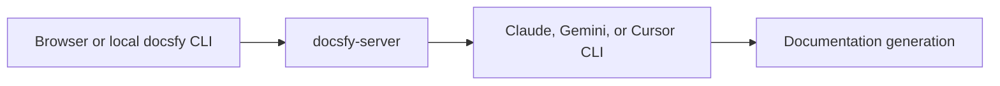

# Configure AI Providers

You want `docsfy` to reach a working AI provider CLI so documentation generation can start and finish without immediate provider errors. The important part is doing the install and sign-in in the same runtime environment as `docsfy-server`, because that server process makes the actual Claude, Gemini, and Cursor calls.

## Prerequisites

- Access to the machine or container that runs `docsfy-server`
- Internet access for provider CLI installation and sign-in
- A `docsfy` `user` or `admin` account to test a generation
- If you want to verify from the terminal, a configured `docsfy` CLI profile. See [Manage docsfy from the CLI](manage-docsfy-from-the-cli.html) for details.

## Quick Example

```bash
docsfy generate https://github.com/myk-org/for-testing-only \
  --provider cursor \
  --model gpt-5.4-xhigh-fast \
  --watch
```

If the `cursor` CLI is installed and authenticated where `docsfy-server` runs, `docsfy` moves on to cloning and page generation. Replace the repository URL with your own repository and swap in `claude` or `gemini` if that is the provider you configured.

> **Note:** If the `docsfy` CLI is not configured yet, run `docsfy config init` first. See [Manage docsfy from the CLI](manage-docsfy-from-the-cli.html) for details.

## Step-by-Step



1. Configure the provider on the server side of this flow.

| You are configuring | Where it matters | Why |
| --- | --- | --- |
| `docsfy` login or CLI profile | browser or local `docsfy` CLI | lets you reach the `docsfy` server |
| Provider CLI login | same machine and runtime user as `docsfy-server` | lets generation actually run |

> **Warning:** If your browser or local `docsfy` CLI talks to a remote `docsfy` server, install and authenticate the provider CLI on that remote server, not only on your laptop.

2. Install the provider CLI you plan to use.

The bundled `docsfy` container image already includes all three supported providers. If you run `docsfy` outside that image, these are the installer commands used by the project:

| Provider | Install command |
| --- | --- |
| `claude` | `curl -fsSL https://claude.ai/install.sh \| bash` |
| `cursor` | `curl -fsSL https://cursor.com/install \| bash` |
| `gemini` | `npm install -g @google/gemini-cli` |

Only `claude`, `gemini`, and `cursor` are accepted provider names. Make sure the same runtime user that starts `docsfy-server` can run the provider CLI from `PATH`.

3. Authenticate the provider CLI as that same runtime user.

- Open a shell in the environment where `docsfy-server` runs.
- Start the provider CLI and complete its normal sign-in or credential setup there.
- Confirm the same runtime user can still run the provider afterward.

> **Note:** `docsfy` authentication and provider authentication are separate. Signing in to `docsfy` does not sign the provider CLI in for you.

> **Warning:** Do not store provider tokens or other secrets in Git-tracked files.

4. Set server defaults if you want requests without an explicit provider or model to fall back to known values.

```env
AI_PROVIDER=cursor
AI_MODEL=gpt-5.4-xhigh-fast
AI_CLI_TIMEOUT=60
```

> **Note:** These settings choose defaults only. They do not authenticate Claude, Gemini, or Cursor for you.

Restart `docsfy-server` after changing these values. See [Configuration Reference](configuration-reference.html) for details.

5. Verify with a real generation.

Run the quick example above, or choose the same provider and model in the `New Generation` form in the web app. If provider setup is wrong, `docsfy` fails early instead of continuing to page generation. See [Generate Documentation](generate-documentation.html) for details.

> **Tip:** During setup, pass `--provider` and `--model` explicitly so you know exactly which provider/model pair you are testing.

<details><summary>Advanced Usage</summary>

**Check the server's provider list and remembered models**

```bash
docsfy models
docsfy models --provider cursor
```

This shows the fixed provider list, the current server defaults, and models remembered from successful generations. It is useful for discovery, but it is not a live health check for provider installation or login.

> **Tip:** If the model picker is empty or a new model is missing, type the model name manually. The dashboard accepts free-form model input and starts suggesting that model after a successful generation.

**Use the bundled container image**

The bundled image already installs Claude, Gemini, and Cursor. You still need to complete provider login inside that running environment before generation will work.

**Increase timeout for slower environments**

```env
AI_CLI_TIMEOUT=120
```

Raise this value if provider CLI calls time out on slower machines or larger repositories.

**Cursor trust handling**

When you choose `cursor`, `docsfy` adds Cursor's `--trust` flag automatically.

</details>

## Troubleshooting

- A run fails almost immediately: the provider CLI is usually missing, signed out, or using a model your account cannot access. Fix that on the `docsfy-server` host, then retry.
- The provider appears in the dashboard but generation still fails: the provider picker always offers `claude`, `gemini`, and `cursor`, so seeing the provider in the UI does not prove the CLI is installed or authenticated.
- No models are suggested: type the model name manually and rerun. Suggested models come from successful generations, not from a live provider catalog.
- New default settings seem ignored: restart `docsfy-server` after changing `AI_PROVIDER`, `AI_MODEL`, or `AI_CLI_TIMEOUT`.
- You need deeper diagnosis: see [Fix Setup and Generation Problems](fix-setup-and-generation-problems.html).

## Related Pages

- [Install and Run docsfy Without Docker](install-and-run-docsfy-without-docker.html)
- [Configuration Reference](configuration-reference.html)
- [Generate Documentation](generate-documentation.html)
- [Manage docsfy from the CLI](manage-docsfy-from-the-cli.html)
- [Fix Setup and Generation Problems](fix-setup-and-generation-problems.html)