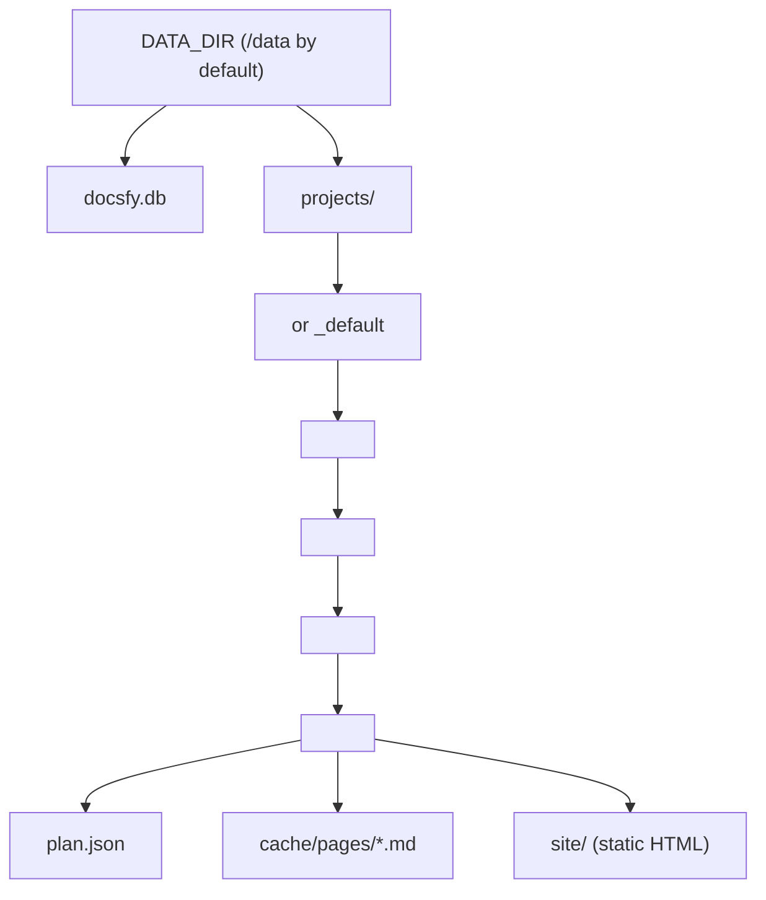

# Data Storage and Layout

`docsfy` keeps persistent server-side state in one base directory controlled by `DATA_DIR`. By default, that directory is `/data`, so the two locations that matter most are `DATA_DIR/docsfy.db` and `DATA_DIR/projects/`. On startup, the server reads `DATA_DIR`, creates missing directories, initializes the SQLite database, and runs migrations automatically.

```1:17:.env.example
# Required: Admin password (minimum 16 characters)
ADMIN_KEY=

# AI provider and model defaults
# (pydantic_settings reads these case-insensitively)
AI_PROVIDER=cursor
AI_MODEL=gpt-5.4-xhigh-fast
AI_CLI_TIMEOUT=60

# Logging
LOG_LEVEL=INFO

# Data directory for database and generated docs
DATA_DIR=/data

# Cookie security (set to false for local HTTP development)
SECURE_COOKIES=true
```

```40:60:src/docsfy/storage.py
# Module-level paths are set at import time from env vars.
# Tests override these globals directly for isolation.
DB_PATH = Path(os.getenv("DATA_DIR", "/data")) / "docsfy.db"
DATA_DIR = Path(os.getenv("DATA_DIR", "/data"))
PROJECTS_DIR = DATA_DIR / "projects"

async def init_db(data_dir: str = "") -> None:
    if data_dir:
        DB_PATH = Path(data_dir) / "docsfy.db"
        DATA_DIR = Path(data_dir)
        PROJECTS_DIR = DATA_DIR / "projects"

    DB_PATH.parent.mkdir(parents=True, exist_ok=True)
    PROJECTS_DIR.mkdir(parents=True, exist_ok=True)
```

The included container setup persists that data by bind-mounting host `./data` into container `/data`:

```1:22:docker-compose.yaml
services:
  docsfy:
    build:
      context: .
      dockerfile: Dockerfile
    ports:
      - "8000:8000"
    volumes:
      - ./data:/data
    env_file:
      - .env
    environment:
      - ADMIN_KEY=${ADMIN_KEY}
    restart: unless-stopped
```

> **Note:** If you change `DATA_DIR`, update your container mount to match. The provided Compose file assumes the app writes to `/data`.

## Quick Reference

| Path | What lives there |
|---|---|
| `DATA_DIR/docsfy.db` | SQLite database for variants, users, sharing rules, and sessions |
| `DATA_DIR/projects/<owner>/<project>/<branch>/<provider>/<model>/plan.json` | Final documentation plan for one variant |
| `DATA_DIR/projects/<owner>/<project>/<branch>/<provider>/<model>/cache/pages/*.md` | Cached markdown pages for one variant |
| `DATA_DIR/projects/<owner>/<project>/<branch>/<provider>/<model>/site/` | Static HTML site served by the app and used for downloads |
| `~/.config/docsfy/config.toml` | Local CLI connection profiles on a user machine, not server runtime data |



## The SQLite Database

The SQLite database is the source of truth for variant metadata, user accounts, sharing rules, and browser sessions.

| Table | Purpose |
|---|---|
| `projects` | One row per generated docs variant. The key is `name + branch + ai_provider + ai_model + owner`, so the same repo can exist as separate branches and model/provider variants. |
| `users` | User accounts, roles, and hashed API keys. |
| `project_access` | Sharing rules for a project name owned by a specific owner. One grant applies across that project’s variants. |
| `sessions` | Browser login sessions with expiration times. |

The `projects` table shows how variant identity works:

```61:79:src/docsfy/storage.py
async with aiosqlite.connect(DB_PATH) as db:
    await db.execute(f"""
        CREATE TABLE IF NOT EXISTS projects (
            name TEXT NOT NULL,
            branch TEXT NOT NULL DEFAULT '{_SQL_DEFAULT_BRANCH}',
            ai_provider TEXT NOT NULL DEFAULT '',
            ai_model TEXT NOT NULL DEFAULT '',
            owner TEXT NOT NULL DEFAULT '',
            repo_url TEXT NOT NULL,
            status TEXT NOT NULL DEFAULT 'generating',
            current_stage TEXT,
            last_commit_sha TEXT,
            last_generated TEXT,
            page_count INTEGER DEFAULT 0,
            error_message TEXT,
            plan_json TEXT,
            created_at TIMESTAMP DEFAULT CURRENT_TIMESTAMP,
            updated_at TIMESTAMP DEFAULT CURRENT_TIMESTAMP,
            PRIMARY KEY (name, branch, ai_provider, ai_model, owner)
        )
    """)
```

API keys and session tokens are not stored in raw form:

```662:675:src/docsfy/storage.py
def hash_api_key(key: str, hmac_secret: str = "") -> str:
    """Hash an API key with HMAC-SHA256 for storage."""
    # NOTE: ADMIN_KEY is used as the HMAC secret.
    secret = hmac_secret or os.getenv("ADMIN_KEY", "")
    if not secret:
        msg = "ADMIN_KEY environment variable is required for key hashing"
        raise RuntimeError(msg)
    return hmac.new(secret.encode(), key.encode(), hashlib.sha256).hexdigest()
```

```773:790:src/docsfy/storage.py
def _hash_session_token(token: str) -> str:
    """Hash a session token for storage."""
    return hashlib.sha256(token.encode()).hexdigest()

async def create_session(
    username: str, is_admin: bool = False, ttl_hours: int = SESSION_TTL_HOURS
) -> str:
    """Create an opaque session token."""
    token = secrets.token_urlsafe(32)
    token_hash = _hash_session_token(token)
    expires_at = datetime.now(timezone.utc) + timedelta(hours=ttl_hours)
    expires_str = expires_at.strftime("%Y-%m-%d %H:%M:%S")
    async with aiosqlite.connect(DB_PATH) as db:
        await db.execute(
            "INSERT INTO sessions (token, username, is_admin, expires_at) VALUES (?, ?, ?, ?)",
            (token_hash, username, 1 if is_admin else 0, expires_str),
        )
```

> **Note:** You normally do not need a manual migration step. Server startup calls the database initializer automatically and upgrades older schemas before serving requests.

## Variant Directories Under `DATA_DIR/projects`

Each generated variant gets its own directory under `DATA_DIR/projects/`. The path is built from five values, in this order:

1. `owner`
2. `project`
3. `branch`
4. `provider`
5. `model`

The actual path builder is in `get_project_dir()`:

```515:581:src/docsfy/storage.py
def _validate_owner(owner: str) -> str:
    """Validate owner segment to prevent path traversal."""
    if not owner:
        return "_default"
    if "/" in owner or "\\" in owner or ".." in owner or owner.startswith("."):
        msg = f"Invalid owner: '{owner}'"
        raise ValueError(msg)
    return owner

def get_project_dir(
    name: str,
    ai_provider: str = "",
    ai_model: str = "",
    owner: str = "",
    branch: str = DEFAULT_BRANCH,
) -> Path:
    if not branch:
        msg = "branch is required for project directory paths"
        raise ValueError(msg)
    if not ai_provider or not ai_model:
        msg = "ai_provider and ai_model are required for project directory paths"
        raise ValueError(msg)

    safe_owner = _validate_owner(owner)
    return (
        PROJECTS_DIR
        / safe_owner
        / _validate_name(name)
        / branch
        / ai_provider
        / ai_model
    )

def get_project_site_dir(
    name: str,
    ai_provider: str = "",
    ai_model: str = "",
    owner: str = "",
    branch: str = DEFAULT_BRANCH,
) -> Path:
    return get_project_dir(name, ai_provider, ai_model, owner, branch) / "site"

def get_project_cache_dir(
    name: str,
    ai_provider: str = "",
    ai_model: str = "",
    owner: str = "",
    branch: str = DEFAULT_BRANCH,
) -> Path:
    return (
        get_project_dir(name, ai_provider, ai_model, owner, branch) / "cache" / "pages"
    )
```

A test in the repository asserts the exact segment order:

```848:854:tests/test_storage.py
async def test_get_project_dir_with_branch(db_path: Path) -> None:
    from docsfy.storage import PROJECTS_DIR, get_project_dir

    result = get_project_dir(
        "my-repo", ai_provider="claude", ai_model="opus", owner="user", branch="main"
    )
    assert result == PROJECTS_DIR / "user" / "my-repo" / "main" / "claude" / "opus"
```

Inside a finished variant directory, the main files are:

- `plan.json`: the final documentation plan for that variant.
- `cache/pages/*.md`: the per-page markdown cache.
- `site/`: the generated static site.

`plan.json` is written into the variant directory after generation completes:

```1054:1057:src/docsfy/api/projects.py
project_dir = get_project_dir(
    project_name, ai_provider, ai_model, owner, branch=branch
)
(project_dir / "plan.json").write_text(json.dumps(plan, indent=2), encoding="utf-8")
```

Tests also show the expected `cache/` and `site/` contents for a variant:

```602:608:tests/test_main.py
old_cache_dir = get_project_cache_dir("test-repo", "gemini", "flash", "admin")
old_cache_dir.mkdir(parents=True, exist_ok=True)
(old_cache_dir / "introduction.md").write_text("# Introduction\n\nGemini intro\n")

old_site_dir = get_project_site_dir("test-repo", "gemini", "flash", "admin")
old_site_dir.mkdir(parents=True, exist_ok=True)
(old_site_dir / "index.html").write_text("<html>Gemini docs</html>")
```

> **Note:** If you ever see `_default` as the owner directory name, docsfy is using the safe on-disk fallback for an empty stored owner. In normal authenticated use, you will usually see the real username instead.

## How Branch, Provider, and Model Shape Paths

Branch, provider, and model are not just metadata. They directly determine both the database key and the filesystem path.

- Changing the branch gives you a different variant directory.
- Changing the provider gives you a sibling variant directory.
- Changing the model gives you a sibling variant directory under that provider.
- Omitting the branch defaults it to `main`.

Branch names are validated because they become path segments:

```29:47:src/docsfy/models.py
branch: str = Field(
    default=DEFAULT_BRANCH, description="Git branch to generate docs from"
)

@field_validator("branch")
@classmethod
def validate_branch(cls, v: str) -> str:
    if "/" in v:
        msg = (
            f"Invalid branch name: '{v}'. Branch names cannot contain slashes "
            "— use hyphens instead (e.g., release-1.x)."
        )
        raise ValueError(msg)
    if not re.match(r"^[a-zA-Z0-9][a-zA-Z0-9._-]*$", v):
        msg = f"Invalid branch name: '{v}'"
        raise ValueError(msg)
    if ".." in v:
        msg = f"Invalid branch name: '{v}'"
        raise ValueError(msg)
```

> **Warning:** Branch names cannot contain slashes. Use names like `release-1.x` or `v2.0`, not `release/1.x`.

The public docs URL uses the same `project / branch / provider / model` segments that the filesystem uses. The `owner` segment is resolved internally from the database:

```200:224:src/docsfy/main.py
@app.get("/docs/{project}/{branch}/{provider}/{model}/{path:path}")
async def serve_variant_docs(
    request: Request,
    project: str,
    branch: str,
    provider: str,
    model: str,
    path: str = "index.html",
) -> FileResponse:
    # ...
    proj = await _resolve_project(
        request,
        project,
        ai_provider=provider,
        ai_model=model,
        branch=branch,
    )

    proj_owner = str(proj.get("owner", ""))
    site_dir = get_project_site_dir(project, provider, model, proj_owner, branch=branch)
```

The matching download endpoint packages the `site/` directory for that same variant:

```1597:1623:src/docsfy/api/projects.py
@router.get("/projects/{name}/{branch}/{provider}/{model}/download")
async def download_variant(
    request: Request,
    name: str,
    branch: str,
    provider: str,
    model: str,
) -> StreamingResponse:
    # ...
    project_owner = str(project.get("owner", ""))
    site_dir = get_project_site_dir(name, provider, model, project_owner, branch=branch)
    if not site_dir.exists():
        raise HTTPException(status_code=404, detail="Site not found")
    return await _stream_tarball(site_dir, f"{name}-{branch}-{provider}-{model}")
```

> **Tip:** A variant download contains the built `site/` output, not the whole variant directory. The database, `plan.json`, and `cache/` stay on the server.

## Cache Behavior and Reuse

The page cache is stored per variant under `cache/pages/`. It is not a global cache shared across all projects or models.

That matters in a few practical cases:

- An incremental update can reuse unchanged page markdown from the existing variant directory.
- A full regeneration clears stale cached pages for the target variant.
- A non-force switch to a different provider/model can prefill a new sibling variant from the newest ready variant on the same branch.
- If the commit is unchanged during that cross-provider switch, docsfy can reuse both cached markdown and the finished `site/`, then delete the old variant after the replacement is ready.

The tests show that behavior directly:

```668:674:tests/test_main.py
assert (
    new_cache_dir / "introduction.md"
).read_text() == "# Introduction\n\nGemini intro\n"
assert (new_site_dir / "index.html").read_text() == "<html>Gemini docs</html>"
assert old_variant is None
assert not old_cache_dir.exists()
assert not old_site_dir.exists()
```

> **Tip:** Use `force=true` when you want a clean rebuild of the target variant instead of starting from cached artifacts.

## What Is Persistent and What Is Temporary

Not every file created during generation lives under `DATA_DIR`.

Persistent data:

- `docsfy.db`
- `projects/.../plan.json`
- `projects/.../cache/pages/*.md`
- `projects/.../site/`

Temporary data:

- remote repository clones
- temporary validation work directories
- temporary archive files used while streaming a download

Remote repos are cloned into a temporary directory, not into `DATA_DIR`:

```580:588:src/docsfy/api/projects.py
# Remote repository - clone to temp dir
if repo_url is None:
    msg = "repo_url must be provided for remote repositories"
    raise ValueError(msg)
with tempfile.TemporaryDirectory() as tmp_dir:
    repo_dir, commit_sha, _ = await asyncio.to_thread(
        clone_repo, repo_url, Path(tmp_dir), branch=branch
    )
```

The clone itself is a shallow `git clone --depth 1`:

```27:36:src/docsfy/repository.py
def clone_repo(
    repo_url: str, base_dir: Path, branch: str | None = None
) -> tuple[Path, str, str]:
    repo_name = extract_repo_name(repo_url)
    repo_path = base_dir / repo_name
    logger.info(f"Cloning {repo_name} to {repo_path}")
    clone_cmd = ["git", "clone", "--depth", "1"]
    if branch:
        clone_cmd += ["--branch", branch]
```

Validation work happens in a temporary directory that is removed afterward:

```244:269:src/docsfy/postprocess.py
job_id = str(uuid.uuid4())
job_dir = Path(tempfile.mkdtemp(prefix=f"docsfy-validation-{job_id}-"))

try:
    coroutines = [
        _validate_single_page(
            slug=slug,
            content=content,
            repo_path=repo_path,
            ai_provider=ai_provider,
            ai_model=ai_model,
            cache_dir=cache_dir,
            project_name=project_name,
            page_title=slug_meta.get(slug, {}).get("title", slug),
            page_description=slug_meta.get(slug, {}).get("description", ""),
            job_dir=job_dir,
            ai_cli_timeout=ai_cli_timeout,
        )
        for slug, content in pages.items()
    ]
    results = await run_parallel_with_limit(
        coroutines, max_concurrency=MAX_CONCURRENT_PAGES
    )
finally:
    shutil.rmtree(job_dir, ignore_errors=True)
```

Download archives are also temporary and are deleted after they are streamed:

```374:402:src/docsfy/api/projects.py
async def _stream_tarball(site_dir: Path, archive_name: str) -> StreamingResponse:
    """Create a tar.gz archive and stream it as a response."""
    tmp = tempfile.NamedTemporaryFile(suffix=".tar.gz", delete=False)
    tar_path = Path(tmp.name)
    tmp.close()

    def _create_archive() -> None:
        with tarfile.open(tar_path, mode="w:gz") as tar:
            tar.add(str(site_dir), arcname=archive_name)

    async def _stream_and_cleanup() -> AsyncIterator[bytes]:
        try:
            f = await asyncio.to_thread(open, tar_path, "rb")
            try:
                while True:
                    chunk = await asyncio.to_thread(f.read, _STREAM_CHUNK_SIZE)
                    if not chunk:
                        break
                    yield chunk
            finally:
                await asyncio.to_thread(f.close)
        finally:
            tar_path.unlink(missing_ok=True)
```

When you generate from `repo_path` instead of `repo_url`, docsfy uses that repository in place. It does not copy the repo into `DATA_DIR` first.

> **Tip:** In Docker, `repo_path` must exist inside the container. With the included Compose file, a repo placed under host `./data` is visible in the container under `/data`.

## What to Back Up

For a complete server backup, keep the whole `DATA_DIR` together.

- `docsfy.db` preserves variant metadata, users, access rules, and session state.
- `projects/` preserves the actual generated artifacts.

If you restore only one of those, the database and filesystem can drift out of sync.

If you use the CLI from a developer workstation or admin machine, its connection profiles live in a separate, client-side file:

```14:43:src/docsfy/cli/config_cmd.py
CONFIG_DIR = Path.home() / ".config" / "docsfy"
CONFIG_FILE = CONFIG_DIR / "config.toml"

def _save_config(config: dict[str, Any]) -> None:
    """Write config to disk with secure permissions."""
    CONFIG_DIR.mkdir(parents=True, exist_ok=True)
    os.chmod(CONFIG_DIR, stat.S_IRWXU)
    with open(CONFIG_FILE, "wb") as f:
        tomli_w.dump(config, f)
    os.chmod(CONFIG_FILE, stat.S_IRUSR | stat.S_IWUSR)
```

> **Warning:** `~/.config/docsfy/config.toml` is not part of server runtime storage, but it may contain CLI credentials. Back it up carefully and keep its permissions private.


## Related Pages

- [Architecture and Runtime](architecture-and-runtime.html)
- [Projects, Variants, and Ownership](projects-variants-and-ownership.html)
- [Generated Output](generated-output.html)
- [Variants, Branches, and Regeneration](variants-branches-and-regeneration.html)
- [Deployment and Runtime](deployment-and-runtime.html)