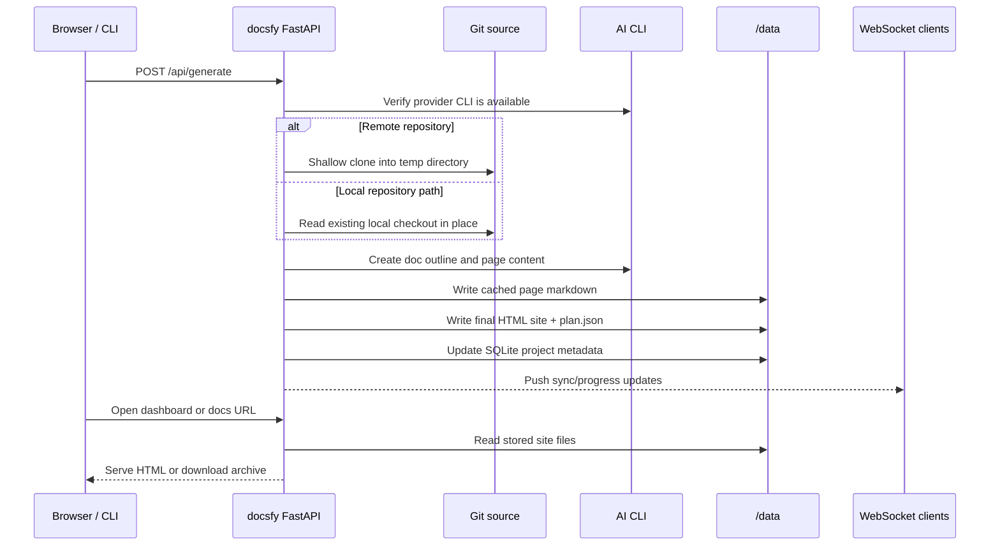

# Deployment and Runtime

docsfy runs as a single FastAPI service that also serves the built React app and the generated documentation output. In the official container image, the process listens on `8000`, keeps durable state under `/data`, includes the AI and diagram toolchain it needs at runtime, and runs as a non-root user.

## Runtime Configuration

| Setting | What it controls | Default |
|---|---|---|
| `ADMIN_KEY` | Required startup credential; also used when hashing stored user API keys | required |
| `DATA_DIR` | Root directory for the SQLite database and stored artifacts | `/data` |
| `SECURE_COOKIES` | Whether the browser session cookie uses the `Secure` flag | `true` |
| `AI_PROVIDER` / `AI_MODEL` | Server defaults when a request omits provider/model | `cursor` / `gpt-5.4-xhigh-fast` |
| `AI_CLI_TIMEOUT` | Default timeout for AI CLI calls | `60` |
| `DEV_MODE` | Container-only switch that starts Vite alongside the backend | off |

If you install the Python package directly, the packaged server launcher reads `HOST`, `PORT`, and `DEBUG` from the environment:

```303:309:src/docsfy/main.py
def run() -> None:
    import uvicorn

    reload = os.getenv("DEBUG", "").lower() == "true"
    host = os.getenv("HOST", "127.0.0.1")
    port = int(os.getenv("PORT", "8000"))
    uvicorn.run("docsfy.main:app", host=host, port=port, reload=reload)
```

That launcher is separate from the `docsfy` CLI, which is a client for the HTTP API.

## Entrypoint Modes

In the official container, startup is controlled by `/app/entrypoint.sh`. By default it starts only the backend. If you explicitly set `DEV_MODE=true`, the same image becomes a dev container: it installs frontend dependencies, starts Vite on `5173`, and runs Uvicorn with reload enabled.

```1:21:entrypoint.sh
#!/bin/bash
set -e

if [ "$DEV_MODE" = "true" ]; then
    echo "DEV_MODE enabled - installing frontend dependencies..."
    cd /app/frontend || exit 1
    npm ci
    echo "Starting Vite dev server on port 5173..."
    npm run dev &
    VITE_PID=$!
    # Forward signals to the background Vite process for clean shutdown
    trap 'kill $VITE_PID 2>/dev/null; wait $VITE_PID 2>/dev/null' SIGTERM SIGINT
    cd /app
    echo "Starting FastAPI with hot reload on port 8000..."
    uv run --no-sync uvicorn docsfy.main:app \
        --host 0.0.0.0 --port 8000 \
        --reload --reload-dir /app/src
else
    exec uv run --no-sync uvicorn docsfy.main:app \
        --host 0.0.0.0 --port 8000
fi
```

For production, the important behavior is simple:

- The backend listens on `0.0.0.0:8000` inside the container.
- `5173` only matters when `DEV_MODE=true`.
- The official image already includes the built frontend bundle, so FastAPI can serve the dashboard directly.

> **Warning:** The official container hardcodes its internal listener to `8000`. If you want a different internal port, override the command or entrypoint. Otherwise, change only the published port at your container runtime, ingress, or load balancer.

> **Note:** FastAPI's Swagger/ReDoc endpoints are disabled in this app. In docsfy, the `/docs/...` path is reserved for generated documentation output.

## Startup Behavior

On process start, docsfy validates `ADMIN_KEY`, initializes or migrates the database under `DATA_DIR`, clears in-memory generation bookkeeping, and removes expired session rows.

```44:58:src/docsfy/main.py
@asynccontextmanager
async def lifespan(app: FastAPI) -> AsyncIterator[None]:
    settings = get_settings()
    if not settings.admin_key:
        logger.error("ADMIN_KEY environment variable is required")
        raise SystemExit(1)

    if len(settings.admin_key) < 16:
        logger.error("ADMIN_KEY must be at least 16 characters long")
        raise SystemExit(1)

    _generating.clear()
    await init_db(data_dir=settings.data_dir)
    await cleanup_expired_sessions()
    yield
```

A few production details are worth knowing:

- Database creation and schema migration happen automatically at startup.
- If the previous process died while a job was still active, the next startup rewrites that stored row from `generating` to `error` so it does not look permanently stuck.
- Expired sessions are removed during startup. The code comments note that long-lived deployments do not yet run periodic session cleanup in the background.
- Browser logins use the `docsfy_session` cookie with `HttpOnly`, `SameSite=Strict`, and a `Secure` flag controlled by `SECURE_COOKIES`. The default session lifetime is 8 hours.

For production browser access, keep `SECURE_COOKIES=true` and serve docsfy over HTTPS.

## Request Flow

docsfy keeps the source checkout ephemeral but keeps the results durable.



In practice, that means:

- A generation request accepts either a remote `repo_url` or a local `repo_path`.
- For remote sources, docsfy uses a temporary shallow clone for that run and discards it afterward.
- For local sources, docsfy reads the existing checkout in place instead of copying it.
- Before doing expensive work, docsfy checks that the selected AI CLI is available.
- If a ready variant already exists, docsfy can reuse cached artifacts, skip unnecessary work when the commit SHA is unchanged, or update only the parts that actually need to change.
- Once written to disk, the site is served from stored files at `/docs/<project>/<branch>/<provider>/<model>/...`, and the latest-ready shortcut `/docs/<project>/...` can resolve to the newest ready variant.
- Download endpoints create a `tar.gz` archive from the stored `site` directory; they do not regenerate content on demand.

> **Warning:** `repo_path` is an absolute filesystem path and is only allowed for admin-triggered requests. In containers, that path must exist inside the container filesystem, so you need an explicit bind mount or volume for the repository if you plan to use that mode.

The checked-in Compose file only persists `/data`; it does not mount source repositories into the container. If you want `repo_path` generation in that setup, add a separate mount.

## Persistent Storage

`DATA_DIR` is the only location that must be persistent across restarts and redeployments. By default, that is `/data`.

```525:582:src/docsfy/storage.py
def get_project_dir(
    name: str,
    ai_provider: str = "",
    ai_model: str = "",
    owner: str = "",
    branch: str = DEFAULT_BRANCH,
) -> Path:
    if not branch:
        msg = "branch is required for project directory paths"
        raise ValueError(msg)
    if not ai_provider or not ai_model:
        msg = "ai_provider and ai_model are required for project directory paths"
        raise ValueError(msg)
    # Sanitize path segments to prevent traversal
    for segment_name, segment in [
        ("branch", branch),
        ("ai_provider", ai_provider),
        ("ai_model", ai_model),
    ]:
        if (
            "/" in segment
            or "\\" in segment
            or ".." in segment
            or segment.startswith(".")
        ):
            msg = f"Invalid {segment_name}: '{segment}'"
            raise ValueError(msg)
    safe_owner = _validate_owner(owner)
    return (
        PROJECTS_DIR
        / safe_owner
        / _validate_name(name)
        / branch
        / ai_provider
        / ai_model
    )

def get_project_site_dir(
    name: str,
    ai_provider: str = "",
    ai_model: str = "",
    owner: str = "",
    branch: str = DEFAULT_BRANCH,
) -> Path:
    return get_project_dir(name, ai_provider, ai_model, owner, branch) / "site"

def get_project_cache_dir(
    name: str,
    ai_provider: str = "",
    ai_model: str = "",
    owner: str = "",
    branch: str = DEFAULT_BRANCH,
) -> Path:
    return (
        get_project_dir(name, ai_provider, ai_model, owner, branch) / "cache" / "pages"
    )
```

A single deployment root contains both metadata and artifacts:

- `${DATA_DIR}/docsfy.db`: SQLite database for projects, users, access grants, and sessions
- `${DATA_DIR}/projects/<owner>/<project>/<branch>/<provider>/<model>/plan.json`: stored document outline for that variant
- `${DATA_DIR}/projects/<owner>/<project>/<branch>/<provider>/<model>/cache/pages/*.md`: cached page markdown
- `${DATA_DIR}/projects/<owner>/<project>/<branch>/<provider>/<model>/site/`: final static site served by docsfy

The site writer creates a self-contained output tree under `site/`, including `index.html`, per-page `*.html`, per-page `*.md`, `assets/`, `search-index.json`, `llms.txt`, `llms-full.txt`, and `.nojekyll`.

The checked-in Compose file mounts the persistent directory exactly where the app expects it:

```1:15:docker-compose.yaml
services:
  docsfy:
    build:
      context: .
      dockerfile: Dockerfile
    ports:
      - "8000:8000"
      # Uncomment for development (DEV_MODE=true)
      # - "5173:5173"
    volumes:
      - ./data:/data
      # Uncomment for development (hot reload)
      # - ./frontend:/app/frontend
    env_file:
      - .env
```

> **Tip:** If you back up `/data`, you back up both the SQLite metadata and every generated variant. You do not need to preserve remote Git working copies, because docsfy recreates those in temporary directories when needed.

## Health Checks And Live Connections

The built-in liveness endpoint is `GET /health`, and it returns `{"status":"ok"}`. The official image wires its container health probe to that endpoint, and the CLI's `docsfy health` command calls the same URL.

That endpoint is intentionally shallow. It confirms that the web process is up, but it does not prove that:

- your `DATA_DIR` volume is writable
- the selected AI CLI is installed and usable
- Chromium and Mermaid CLI are present if you rely on Mermaid-to-SVG conversion
- your reverse proxy is correctly forwarding WebSocket upgrades

The dashboard also relies on a WebSocket connection at `/api/ws` for live sync and status updates. The server sends an initial sync message immediately after connect, then uses a 30-second heartbeat. It waits 10 seconds for each pong and closes the socket after 2 missed pongs.

> **Tip:** Use `/health` as a liveness probe. If you want a stronger readiness check, add an external probe that also verifies `/data` write access and the AI CLI(s) you expect to use.

If you deploy behind Nginx, Traefik, Caddy, HAProxy, a cloud load balancer, or Kubernetes ingress, make sure `/api/ws` supports WebSocket upgrade and that idle timeouts are comfortably longer than the heartbeat interval.

In `DEV_MODE=true`, Vite proxies `/api`, `/docs`, and `/health` to the backend on `8000`, so local frontend development still talks to the same server process.

## Non-Root Containers And Runtime Toolchain

The official image is designed to run without root privileges and to remain compatible with OpenShift-style arbitrary UIDs in group `0`. It also keeps its runtime dependencies in the final image because docsfy really uses them after startup.

```49:133:Dockerfile
# Create non-root user, data directory, and set permissions
# OpenShift runs containers as a random UID in the root group (GID 0)
RUN useradd --create-home --shell /bin/bash -g 0 appuser \
  && mkdir -p /data \
  && chown appuser:0 /data \
  && chmod -R g+w /data

# ...

# Puppeteer config for mermaid-cli (must be set before npm install)
ENV PUPPETEER_EXECUTABLE_PATH="/usr/bin/chromium"
ENV PUPPETEER_SKIP_CHROMIUM_DOWNLOAD="true"

# Puppeteer needs --no-sandbox in Docker (non-root user, no user namespaces)
RUN printf '{"args":["--no-sandbox","--disable-setuid-sandbox"]}\n' > /home/appuser/.puppeteerrc.json

# Install Claude Code CLI (installs to ~/.local/bin)
RUN /bin/bash -o pipefail -c "curl -fsSL https://claude.ai/install.sh | bash"

# Install Cursor Agent CLI (installs to ~/.local/bin)
RUN /bin/bash -o pipefail -c "curl -fsSL https://cursor.com/install | bash"

# Configure npm for non-root global installs and install Gemini CLI + mermaid-cli
RUN mkdir -p /home/appuser/.npm-global \
  && npm config set prefix '/home/appuser/.npm-global' \
  && npm install -g @google/gemini-cli @mermaid-js/mermaid-cli@11

# ...

# Make /app group-writable for OpenShift compatibility
RUN chmod -R g+w /app

# Make appuser home accessible by OpenShift arbitrary UID
RUN find /home/appuser -type d -exec chmod g=u {} + \
  && npm cache clean --force 2>/dev/null; \
  rm -rf /home/appuser/.npm/_cacache

# Switch back to non-root user for runtime
USER appuser

# Ensure CLIs are in PATH
ENV PATH="/home/appuser/.local/bin:/home/appuser/.npm-global/bin:${PATH}"
# Set HOME for OpenShift compatibility (random UID has no passwd entry)
ENV HOME="/home/appuser"

HEALTHCHECK --interval=30s --timeout=10s --retries=3 \
  CMD curl -f http://localhost:8000/health || exit 1

ENTRYPOINT ["/app/entrypoint.sh"]
```

A few practical consequences follow from that image design:

- `git` is a runtime dependency because docsfy fetches repositories and computes diffs during generation.
- `nodejs`, `npm`, `chromium`, and `mmdc` stay in the runtime image because Mermaid diagrams can be converted to inline SVG while the site is being written.
- The AI provider CLIs are runtime dependencies, not optional build extras. If you build your own image, include the providers you plan to use.
- The container expects `/data` to be writable by the effective non-root user or by an arbitrary UID that is a member of group `0`.
- Browser-based deployments should keep `SECURE_COOKIES=true` and place docsfy behind HTTPS so session cookies are accepted by the browser.

> **Note:** Mermaid SVG conversion is conditional in code. If `mmdc` is missing, docsfy skips that conversion step. The official image installs `@mermaid-js/mermaid-cli` and Chromium so diagrams work out of the box.

> **Warning:** If your persistent volume is mounted read-only, or with ownership and permissions that block the effective UID/GID, docsfy will fail when it tries to create `docsfy.db`, write page cache files, or store the final site under `site/`.

> **Tip:** The official image is a good reference even if you do not use Docker directly. If you deploy with systemd, Podman, Kubernetes, or another platform, replicate the same assumptions: port `8000`, persistent `DATA_DIR`, non-root execution, Git available, and the provider and diagram toolchain installed in the runtime environment.


## Related Pages

- [Architecture and Runtime](architecture-and-runtime.html)
- [Docker and Compose Quickstart](docker-quickstart.html)
- [Environment Variables](environment-variables.html)
- [Data Storage and Layout](data-storage-and-layout.html)
- [Security Considerations](security-considerations.html)