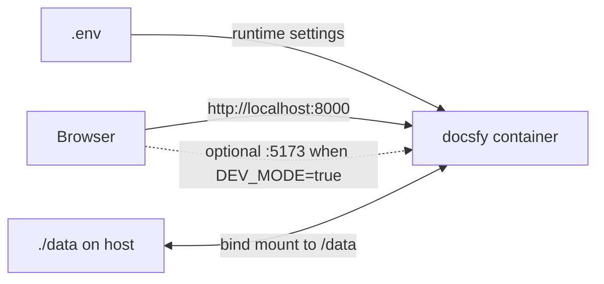

# Docker and Compose Quickstart

`docsfy` ships with both a `Dockerfile` and a `docker-compose.yaml`, so you can run it directly from this repository without writing your own container setup. The provided configuration exposes the app on `http://localhost:8000`, stores its SQLite database and generated output under `./data`, and does not require a separate database container.

By default, one container serves the web UI, the HTTP API, and generated documentation.



## Create `.env`

Run these commands from the repository root:

```bash
cp .env.example .env
```

Relevant lines from `.env.example`:

```dotenv
# Required: Admin password (minimum 16 characters)
ADMIN_KEY=

# Logging
LOG_LEVEL=INFO

# Data directory for database and generated docs
DATA_DIR=/data

# Cookie security (set to false for local HTTP development)
SECURE_COOKIES=true

# Development mode: starts Vite dev server on port 5173 alongside FastAPI
# DEV_MODE=true
```

The compose file uses `.env`, and the application is also configured to read `.env`-style settings.

> **Warning:** `ADMIN_KEY` is required and must be at least 16 characters long. The server validates it during startup.

> **Warning:** If you are using plain `http://localhost:8000` in a browser, set `SECURE_COOKIES=false`. With the default `true`, the session cookie is marked secure for HTTPS.

> **Note:** The provided volume mapping assumes `DATA_DIR=/data`. If you change `DATA_DIR`, change the container-side mount path to match.

## Start with Compose

Key lines from `docker-compose.yaml`:

```yaml
services:
  docsfy:
    build:
      context: .
      dockerfile: Dockerfile
    ports:
      - "8000:8000"
      # Uncomment for development (DEV_MODE=true)
      # - "5173:5173"
    volumes:
      - ./data:/data
    env_file:
      - .env
    environment:
      - ADMIN_KEY=${ADMIN_KEY}
    restart: unless-stopped
```

This setup:

- Builds the image from the repository’s `Dockerfile`.
- Publishes the main app on port `8000`.
- Persists runtime data by binding `./data` on the host to `/data` in the container.
- Loads settings from `.env`.
- Restarts automatically unless you stop it.

Start it with:

```bash
mkdir -p data
docker compose up --build
```

If you prefer detached mode, add `-d`.

Once the container is up:

1. Open `http://localhost:8000/login`.
2. Sign in with username `admin` and the `ADMIN_KEY` value from `.env`.
3. Optionally verify the health endpoint:

```bash
curl http://localhost:8000/health
```

Expected response:

```json
{"status":"ok"}
```

Stop the stack with:

```bash
docker compose down
```

> **Tip:** The first build can take a while. The `Dockerfile` builds the frontend, installs Python dependencies, and installs additional runtime tooling during the image build.

> **Note:** After you change `.env`, restart the container so the new settings are picked up.

## Persistent Data

The storage layout is defined in `src/docsfy/storage.py`:

```python
DB_PATH = Path(os.getenv("DATA_DIR", "/data")) / "docsfy.db"
DATA_DIR = Path(os.getenv("DATA_DIR", "/data"))
PROJECTS_DIR = DATA_DIR / "projects"

return (
    PROJECTS_DIR
    / safe_owner
    / _validate_name(name)
    / branch
    / ai_provider
    / ai_model
)
```

Generated site output lives one level deeper:

```python
def get_project_site_dir(
    name: str,
    ai_provider: str = "",
    ai_model: str = "",
    owner: str = "",
    branch: str = DEFAULT_BRANCH,
) -> Path:
    return get_project_dir(name, ai_provider, ai_model, owner, branch) / "site"
```

In practice, the host-mounted `./data` directory contains:

- `./data/docsfy.db` for the SQLite database.
- `./data/projects/<owner>/<project>/<branch>/<provider>/<model>/site` for rendered documentation.
- `./data/projects/.../cache/pages` for cached page data used during generation.

> **Note:** You do not need to create `docsfy.db` yourself. Startup initializes the database and creates the data directories inside `DATA_DIR`.

> **Note:** Rebuilding or recreating the container does not remove your data as long as `./data` stays in place.

## Exposed Ports and Dev Mode

Relevant lines from `Dockerfile`:

```dockerfile
EXPOSE 8000
# Vite dev server (DEV_MODE only)
EXPOSE 5173

HEALTHCHECK --interval=30s --timeout=10s --retries=3 \
  CMD curl -f http://localhost:8000/health || exit 1

ENTRYPOINT ["/app/entrypoint.sh"]
```

The startup behavior comes from `entrypoint.sh`:

```bash
if [ "$DEV_MODE" = "true" ]; then
    cd /app/frontend || exit 1
    npm ci
    npm run dev &
    uv run --no-sync uvicorn docsfy.main:app \
        --host 0.0.0.0 --port 8000 \
        --reload --reload-dir /app/src
else
    exec uv run --no-sync uvicorn docsfy.main:app \
        --host 0.0.0.0 --port 8000
fi
```

What that means in practice:

- `8000` is the main port end users need. It serves the app, the API, and generated docs.
- `5173` is only relevant when `DEV_MODE=true`.
- In development mode, the container starts a Vite dev server and runs Uvicorn with reload enabled.
- The image health check probes `GET /health`, which is a public endpoint.

If you enable `DEV_MODE=true`, also publish `5173` so that port is reachable from the host.

## Run the Dockerfile Directly

If you want to use the `Dockerfile` without Compose, build and run it like this:

```bash
docker build -t docsfy .
docker run --rm \
  -p 8000:8000 \
  --env-file .env \
  -v "$(pwd)/data:/data" \
  docsfy
```

That gives you the same basics as the provided compose setup:

- `--env-file .env` passes your runtime settings into the container.
- `-v "$(pwd)/data:/data"` preserves the database and generated docs.
- `-p 8000:8000` publishes the web app.

The image does not copy your host `.env` file into `/app`, so `--env-file .env` is the simplest way to pass the same settings you use with Compose.

If you also enable `DEV_MODE=true`, publish `5173` too.

## Troubleshooting

- The container exits immediately: check that `ADMIN_KEY` is set and at least 16 characters long.
- The login page loads but you cannot stay signed in on `http://localhost:8000`: set `SECURE_COOKIES=false` for local HTTP.
- Data is missing after a restart: make sure the bind mount still points to `/data` and still matches `DATA_DIR`.
- You changed `.env` but nothing changed at runtime: restart the container.
- You want to inspect logs: run `docker compose logs -f`.


## Related Pages

- [Installation](installation.html)
- [Environment Variables](environment-variables.html)
- [Deployment and Runtime](deployment-and-runtime.html)
- [Local Development](local-development.html)
- [First Run Quickstart](first-run-quickstart.html)