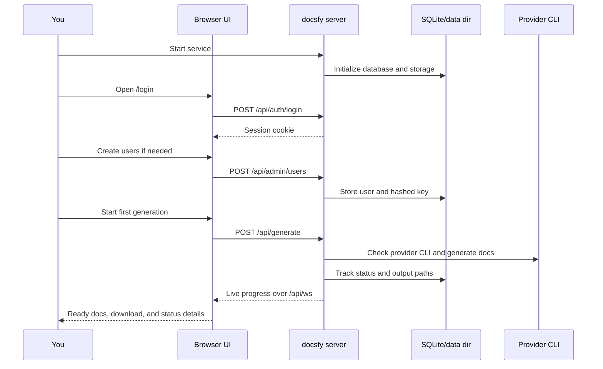

# First Run Quickstart

`docsfy` ships with a built-in admin account and a browser UI. On a fresh install, the fastest path is:

1. Set `ADMIN_KEY` and local runtime settings.
2. Start the service.
3. Sign in as `admin`.
4. Create any additional users.
5. Start your first documentation generation.
6. Open the generated site or download it.

## Before You Start

Choose one runtime path:

- Docker Compose: the simplest first run.
- From source: Python `3.12+`, `uv`, Node.js, npm, Git, and at least one supported provider CLI.

The current codebase exposes these two entry points:

```toml
[project.scripts]
docsfy-server = "docsfy.main:run"
docsfy = "docsfy.cli.main:main"
```

> **Note:** `docsfy-server` runs the web service. `docsfy` is the client CLI for health checks, generation, and admin tasks.

## 1. Configure `.env`

Start from the shipped `.env.example`:

```dotenv
# Required: Admin password (minimum 16 characters)
ADMIN_KEY=

# AI provider and model defaults
# (pydantic_settings reads these case-insensitively)
AI_PROVIDER=cursor
AI_MODEL=gpt-5.4-xhigh-fast
AI_CLI_TIMEOUT=60

# Logging
LOG_LEVEL=INFO

# Data directory for database and generated docs
DATA_DIR=/data

# Cookie security (set to false for local HTTP development)
SECURE_COOKIES=true

# Development mode: starts Vite dev server on port 5173 alongside FastAPI
# DEV_MODE=true
```

Set these before your first launch:

- `ADMIN_KEY`: required, and it must be at least 16 characters.
- `SECURE_COOKIES=false`: use this for plain `http://localhost` development.
- `AI_PROVIDER` and `AI_MODEL`: optional server-wide defaults for new generations.

> **Warning:** If `ADMIN_KEY` is empty or shorter than 16 characters, the server exits at startup.

> **Warning:** If you keep `SECURE_COOKIES=true` on plain local HTTP, sign-in will appear to work but the browser session will not stick.

## 2. Start the Service

### Recommended: Docker Compose

The included Compose file already builds the app, publishes port `8000`, and persists data under `./data`:

```yaml
services:
  docsfy:
    build:
      context: .
      dockerfile: Dockerfile
    ports:
      - "8000:8000"
    volumes:
      - ./data:/data
    env_file:
      - .env
    environment:
      - ADMIN_KEY=${ADMIN_KEY}
    restart: unless-stopped
```

From the repository root:

```bash
docker compose up --build
```

Then check the health endpoint:

```bash
curl http://localhost:8000/health
```

Expected response:

```json
{"status":"ok"}
```

> **Tip:** On this path, your database and generated docs live on the host in `./data`, because Compose mounts `./data:/data`.

### Alternative: run from source

If you want to run without Docker, install the Python environment, build the frontend, then start the server:

```bash
uv sync --frozen --no-dev
cd frontend
npm ci
npm run build
cd ..
uv run docsfy-server
```

By default, `docsfy-server` binds to `127.0.0.1:8000`. You can override that at launch time:

```bash
HOST=0.0.0.0 PORT=8000 DEBUG=true uv run docsfy-server
```

> **Note:** When FastAPI serves the web app itself, it expects a built `frontend/dist`. Build the frontend before starting `docsfy-server`.

## First-Run Flow



## 3. Sign In as Admin

Open `http://localhost:8000/login`.

Use:

- Username: `admin`
- Password: the value of `ADMIN_KEY`

The browser UI submits the same fields the API expects:

```json
{
  "username": "admin",
  "api_key": "<ADMIN_KEY>"
}
```

A successful login creates a browser session cookie and takes you to the dashboard.

> **Note:** In the web UI the secret is labeled as a password. In the API and CLI, the same value is treated as an API key or bearer token.

> **Note:** The built-in `admin` account comes from the environment, not the database.

## 4. Create Users If You Need Them

If you are the only operator, you can skip this section and generate docs as `admin`.

If other people will use the system, open `Users` from the admin section of the dashboard and create named accounts. The available roles are:

| Role | What it is for | Can start generations | Can manage users and access |
| --- | --- | --- | --- |
| `admin` | full operators | Yes | Yes |
| `user` | day-to-day doc generation | Yes | No |
| `viewer` | read-only access to docs | No | No |

A user creation request uses this shape:

```json
{"username": "alice", "role": "user"}
```

If you prefer the CLI, configure it once with `uv run docsfy config init`, then use:

```bash
uv run docsfy admin users list
uv run docsfy admin users create alice --role user
```

When a user is created, `docsfy` returns a generated credential once. Auto-generated user keys start with `docsfy_`.

> **Warning:** Save the generated password/API key before you dismiss it. Creation and key rotation responses are intentionally marked `Cache-Control: no-store`.

> **Tip:** Start with `user` for most people. Use `viewer` for people who only need to read generated docs.

> **Tip:** If you want a second human administrator for day-to-day work, create a normal database-backed user with role `admin`.

If you generate documentation as one account and want another account to view it, share the project afterward from `Access`. Access is granted per project name and owner.

## 5. Start Your First Documentation Generation

From the dashboard, click `New Generation` and fill in:

- `Repository URL`
- `Branch`
- `Provider`
- `Model`
- `Force full regeneration`

The web app sends these fields when you click `Generate`:

```json
{
  "repo_url": "https://github.com/myk-org/for-testing-only",
  "branch": "main",
  "ai_provider": "gemini",
  "ai_model": "gemini-2.5-flash",
  "force": false
}
```

For a smooth first run:

- Use a normal remote Git URL over HTTPS or SSH.
- Choose both provider and model explicitly on a fresh system.
- Leave `Force full regeneration` off for the very first run unless you are retrying a failed attempt.

A known small test target used by the repository's own end-to-end plans is:

```text
https://github.com/myk-org/for-testing-only
```

> **Note:** Provider choices in the current codebase are `claude`, `gemini`, and `cursor`.

> **Note:** Model suggestions and branch suggestions come from completed generations. On a brand-new instance, it is normal to type the model manually.

> **Warning:** Branch names cannot contain `/`. Use names like `main`, `dev`, or `release-1.x`, not `release/1.x`.

> **Warning:** For a normal first run, prefer `repo_url`. Local `repo_path` generation is admin-only, and in Docker the path must exist inside the container filesystem.

## 6. Watch Progress

As soon as the request is accepted, the dashboard creates a variant and switches to live progress updates over `/api/ws`.

The statuses you will see are:

- `generating`
- `ready`
- `error`
- `aborted`

A typical first run moves through these stages:

- `cloning`
- `planning`
- `generating_pages`
- `validating`
- `cross_linking`
- `rendering`

If the project already matches the last generated commit, `docsfy` can finish immediately as up to date.

> **Note:** The progress bar only appears after planning, because the server does not know the total page count until the documentation plan exists.

> **Tip:** If the status stays `Generating` after all pages are counted, the run is usually in one of the final stages such as validation, cross-linking, or rendering. It is only finished when the status changes to `Ready`.

## 7. Open or Download the Result

When the run reaches `Ready`, the detail view shows:

- the final page count
- the last generated time
- the commit SHA
- `View Documentation`
- `Download`

Variant-specific URLs follow this pattern:

```text
/docs/<project>/<branch>/<provider>/<model>/
/api/projects/<project>/<branch>/<provider>/<model>/download
```

If you used the default Compose setup, the rendered site is also written to disk here:

```text
./data/projects/<owner>/<project>/<branch>/<provider>/<model>/site/
```

That same `./data` directory also contains the SQLite database at `./data/docsfy.db`.

> **Note:** Generated docs are authenticated routes. Open them from a logged-in browser session or an API client that sends valid credentials.

## 8. Common First-Run Problems

If the first run does not work, check these first:

- The service exits immediately: `ADMIN_KEY` is missing or too short.
- Login does not persist in the browser: `SECURE_COOKIES` is still `true` while you are using plain `http://localhost`.
- Generation fails right away: the selected provider CLI is not usable in that runtime environment.
- The request is rejected before generation starts: the repository URL is invalid, points to a private network, or is not reachable from the server.
- The `Generate` action is missing: the signed-in account is a `viewer`, which cannot start or regenerate documentation.

> **Tip:** The Docker image installs the Claude, Cursor, and Gemini CLIs during the image build. That gives you the executables, but you still need a provider/model combination that is usable from that runtime.

Once your first generation succeeds, the next practical step is to create named `user` accounts for everyday work and keep the built-in `admin` account for setup, sharing, and recovery.


## Related Pages

- [Docker and Compose Quickstart](docker-quickstart.html)
- [User and Access Management](user-and-access-management.html)
- [Generating Documentation](generating-documentation.html)
- [Tracking Progress and Status](tracking-progress-and-status.html)
- [Viewing, Downloading, and Hosting Docs](viewing-downloading-and-hosting-docs.html)