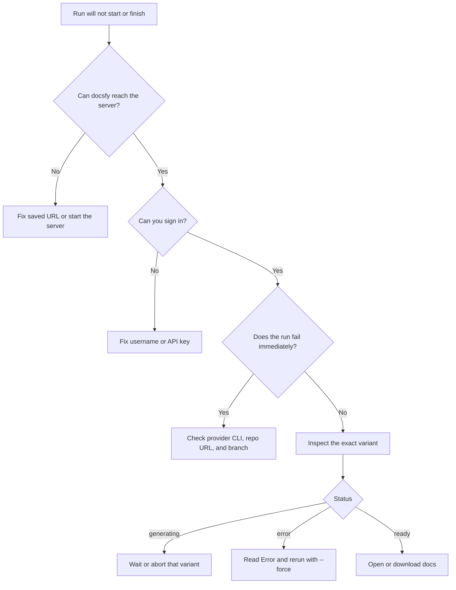

# Fixing Setup and Generation Problems

You want docsfy to accept your sign-in, start a run, and get that run back to `ready` instead of failing on login, provider setup, repo validation, or a stuck variant. Use these checks to isolate the real cause quickly so you only retry after fixing the right thing.

## Prerequisites

- A running docsfy server.
- A valid admin key or user API key.
- A Git repository URL the server can reach.
- If you use the CLI, either a saved profile from `docsfy config init` or explicit `--host`, `--port`, `-u`, and `-p` flags.

## Quick Example

```bash
docsfy health
docsfy models
docsfy generate https://github.com/myk-org/for-testing-only --branch main --provider cursor --model gpt-5.4-xhigh-fast --force --watch
docsfy status for-testing-only --branch main --provider cursor --model gpt-5.4-xhigh-fast
```

Use the public `for-testing-only` repository first. If this works, your server connection, credentials, repo input, and basic generation path are all working. If your server defaults are different, substitute the provider and model shown by `docsfy models`.

If you just need the normal first-run path instead of troubleshooting, see [Generate Your First Docs Site](generate-your-first-docs-site.html).



## Step-by-Step

### 1. Confirm the server target

```bash
docsfy config show
docsfy health
```

`docsfy config show` should point at the server you expect. `docsfy health` should return `Status: ok`.

If the config is missing, run `docsfy config init`. When it asks for `Password`, enter your admin key or user API key. See [Managing docsfy from the CLI](manage-docsfy-from-the-cli.html) for the full CLI setup flow.

If `docsfy health` says `Server unreachable`, fix the saved URL, host, or port. If it says the server redirected you somewhere else, the CLI is pointed at the wrong address.

### 2. Fix login before anything else

| Sign-in type | Username | Password field |
| --- | --- | --- |
| Built-in admin | `admin` | `ADMIN_KEY` |
| Named user | your exact username | your API key |

The browser login form always labels the secret as `Password`, but named users must still enter their API key there. The built-in admin only works when the username is literally `admin`.

> **Warning:** If login works once and then you keep landing back on `/login` on plain `http://localhost`, set `SECURE_COOKIES=false` and restart the server. Keep `SECURE_COOKIES=true` for HTTPS deployments.


> **Note:** Browser and CLI sign-in are separate. A working browser session does not fix a broken CLI profile, and a working CLI profile does not refresh an expired browser session.

### 3. Verify the AI tool can actually run

```bash
docsfy models
docsfy generate https://github.com/myk-org/for-testing-only --branch main --provider cursor --model gpt-5.4-xhigh-fast --force
```

Use only `claude`, `gemini`, or `cursor` as provider names. `docsfy models` shows the server defaults and any models docsfy has already seen in ready runs.

A provider or model appearing in the UI or in `docsfy models` is not a live health check. Those suggestions come from previous ready variants, so a new generation can still fail immediately if the provider CLI is missing, not signed in, or cannot use that model.

On a brand-new server, `docsfy models` can show `(no models used yet)` and still be healthy.

If you run docsfy without Docker, make sure the provider CLI you selected is installed and authenticated on the server machine, then restart the server. See [Install and Run docsfy Without Docker](install-and-run-docsfy-without-docker.html) for the setup steps.

### 4. Recheck the repo URL and branch

```bash
docsfy generate https://github.com/myk-org/for-testing-only --branch dev --force
```

Use a real Git remote with a hostname. The supported remote formats are direct HTTPS or SSH URLs such as `https://github.com/org/repo.git` and `git@github.com:org/repo.git`.

Bare local paths, `localhost` URLs, and URLs that resolve to private network addresses are rejected before generation starts. If you only need the standard run flow, see [Generating Documentation](generate-documentation.html).

| Use this | Not this | Why |
| --- | --- | --- |
| `main` | `.hidden` | The branch must start with a letter or number. |
| `release-1.x` | `release/1.x` | Slashes are rejected. |
| `v2.0.1` | `../repo` | `..` and traversal-like names are rejected. |

If you omit `--branch`, docsfy uses `main`. If the branch name is valid but cloning still fails, confirm that branch really exists in the remote repository.

### 5. Recover the exact variant that failed

```bash
docsfy status for-testing-only --branch main --provider cursor --model gpt-5.4-xhigh-fast
docsfy abort for-testing-only --branch main --provider cursor --model gpt-5.4-xhigh-fast
docsfy generate https://github.com/myk-org/for-testing-only --branch main --provider cursor --model gpt-5.4-xhigh-fast --force --watch
```

Always inspect the exact `branch` / `provider` / `model` combination you are fixing. The same repository can have multiple variants at once, and only one of them may be stuck or broken.

| Status | What it means | What to do next |
| --- | --- | --- |
| `generating` | The run is still active | Wait, or abort that exact variant before retrying. |
| `ready` | The docs finished successfully | Open or download the docs. See [Viewing and Downloading Docs](view-and-download-docs.html). |
| `error` | The run stopped | Read the `Error` field, fix the cause, then rerun with `--force`. |
| `aborted` | The run was stopped on purpose | Start a new run if you still need this variant. |

If a run comes back `ready` with an `up_to_date` stage, nothing is broken. docsfy decided the existing docs already match the current repository state.

Where the run stopped helps you narrow the cause. Problems in or before `cloning` usually point to repo or provider setup, while later failures are best diagnosed from the variant’s `Error` field. See [Tracking Generation Progress](track-generation-progress.html) for the fuller stage-by-stage view.

## Advanced Usage

### Recheck the server settings that affect troubleshooting

```env
ADMIN_KEY=<at-least-16-characters>
AI_PROVIDER=cursor
AI_MODEL=gpt-5.4-xhigh-fast
AI_CLI_TIMEOUT=120
SECURE_COOKIES=false
```

`ADMIN_KEY` is required and must be at least 16 characters long. `AI_CLI_TIMEOUT` must be greater than zero, so increase it if the provider CLI starts slowly instead of failing outright.

`SECURE_COOKIES=false` is only for plain local HTTP. For normal HTTPS deployments, switch it back to `true`. See [Configuration Reference](configuration-reference.html) for the full settings list.

### Use generation IDs to target the exact run

```bash
docsfy status <generation-id>
docsfy abort <generation-id>
```

Every run gets a generation ID, and the CLI accepts that ID anywhere it normally accepts a project name. This is the cleanest way to inspect or abort one specific run when names, branches, or models are easy to mix up.

### Disambiguate admin actions by owner

```bash
docsfy status for-testing-only --branch main --provider cursor --model gpt-5.4-xhigh-fast --owner <owner>
```

Admins can see more than one owner’s copy of the same variant. If you hit a `Multiple owners found` error, rerun the command with `--owner`.

### When `--watch` is the only thing failing

```bash
docsfy generate https://github.com/myk-org/for-testing-only --branch main --force --watch
docsfy status for-testing-only
```

The CLI `--watch` mode depends on the WebSocket connection. If it times out or disconnects, the server-side generation may still be running, so fall back to `docsfy status` before assuming the run failed.

### When a branch or model is missing from the web app suggestions

The branch and model fields accept typed values. Their suggestion lists only include branches and models from previous ready variants, so a missing suggestion does not mean the value is invalid.

### If you use a local repository path

Local-path generation is an admin-only flow. The path must be absolute, it must exist, it must contain a `.git` directory, and the checked-out branch must match the branch you requested.

### If you automate outside the CLI

Use the same recovery sequence: confirm server reachability, authenticate, start one exact variant, then poll that variant until it reaches `ready`, `error`, or `aborted`. See [HTTP API and WebSocket Reference](http-api-and-websocket-reference.html) for the integration endpoints.

## Troubleshooting

| Problem | What to do |
| --- | --- |
| `Invalid username or password` | Use `admin` only with `ADMIN_KEY`. For named users, use the exact username that owns the API key. |
| You keep getting sent back to `/login` on local HTTP | Set `SECURE_COOKIES=false`, restart the server, and sign in again. |
| `Session expired. Redirecting to login...` | Sign in again. Browser sessions last 8 hours. |
| `Server unreachable` or a redirect error in the CLI | Recheck `docsfy config show` and `docsfy health`, then fix the saved server URL, host, or port. |
| `docsfy models` shows a model, but generation still fails immediately | Treat the model list as history, not proof the provider CLI is healthy. Install or re-authenticate the selected provider CLI, then retry. |
| Repo input is rejected before clone starts | Use a direct remote URL with a hostname. Bare local paths, `localhost`, and private-network repo URLs are rejected. |
| `Invalid branch name` | Use a branch that starts with a letter or number and only contains letters, numbers, `.`, `_`, or `-`. Replace `/` with `-`. |
| `Variant '...' is already being generated` | Wait for that exact variant to finish, or abort it before starting another run. |
| `Multiple active variants found` or `Multiple owners found` | Rerun `status` or `abort` with `--branch`, `--provider`, and `--model`, and add `--owner` when needed. |
| `--watch` times out or the WebSocket closes | Check `docsfy status`; the generation may still be running. |
| Generate, abort, or delete is missing or returns `Write access required` | Your account is read-only. Use a `user` or `admin` account for write actions. |
| The app says `Frontend not built` | Build the frontend with `cd frontend && npm run build`, then restart the server. |

See [CLI Command Reference](cli-command-reference.html) for the full CLI syntax.

## Related Pages

- [Generate Your First Docs Site](generate-your-first-docs-site.html)
- [Install and Run docsfy Without Docker](install-and-run-docsfy-without-docker.html)
- [Configuring AI Providers and Models](configure-ai-providers-and-models.html)
- [Tracking Generation Progress](track-generation-progress.html)
- [Configuration Reference](configuration-reference.html)