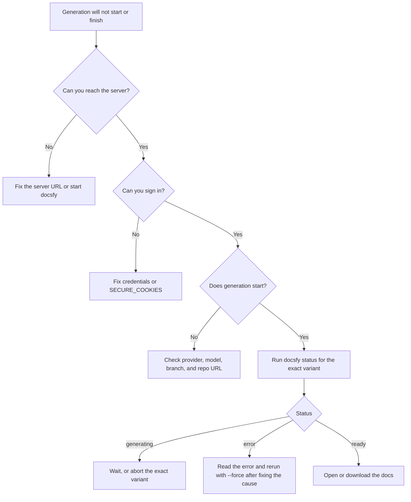

# Fix Setup and Generation Problems

You want docsfy to accept your sign-in, start a generation, and finish with a ready docs site instead of failing early or getting stuck. Use this page to isolate whether the problem is your server connection, login, provider setup, branch choice, or the exact variant you started.

## Prerequisites
- A running docsfy server.
- Browser credentials or CLI credentials for that server.
- A Git repository URL the server can reach.
- If you use the CLI, either a saved profile from `docsfy config init` or explicit `--host`, `--port`, `-u`, and `-p` flags.
- If you need the clean first-run path instead of troubleshooting, see [Generate Your First Docs Site](generate-your-first-docs-site.html).

## Quick Example
```bash
docsfy health
docsfy models
docsfy generate https://github.com/myk-org/for-testing-only --branch main --provider cursor --model gpt-5.4-xhigh-fast --force --watch
docsfy status for-testing-only -b main -p cursor -m gpt-5.4-xhigh-fast
```

Start with the public `for-testing-only` repository when you need to prove that your setup works independently of your own repo. If this succeeds, your server target, credentials, provider, and branch handling are all working.



## Step-by-Step
### 1. Confirm The Server
```bash
docsfy config show
docsfy health
```

If `docsfy config show` says the config is missing, run `docsfy config init` or use explicit connection flags on each command. If `docsfy health` says the server is unreachable, fix the saved URL or start the server; if it reports a redirect, the CLI is pointed at the wrong host or port.

### 2. Fix Sign-In First
| Sign-in type | Username field | Password field |
| --- | --- | --- |
| Admin | `admin` | `ADMIN_KEY` |
| Named user | your username | your API key |

For admin access, the username must literally be `admin`. For named users, the username must match the owner of the API key, even though the browser label says `Password`.

> **Warning:** If browser sign-in seems to work and then sends you back to `/login` on plain `http://localhost`, set `SECURE_COOKIES=false` and restart the server. Keep `SECURE_COOKIES=true` anywhere you serve docsfy over HTTPS.

> **Warning:** If admin access never works and the server will not start cleanly, `ADMIN_KEY` is missing or too short. It must be set and must be at least 16 characters.

> **Note:** The browser and CLI do not share auth state. A working browser session does not fix a broken CLI profile, and a working CLI command does not refresh an expired browser session.

### 3. Verify The Provider And Model
```bash
docsfy models
docsfy generate https://github.com/myk-org/for-testing-only --branch main --provider cursor --model gpt-5.4-xhigh-fast
```

Use only `claude`, `gemini`, or `cursor` as provider names. If you leave provider or model unset, docsfy uses the server defaults; in the default configuration, those are `cursor` and `gpt-5.4-xhigh-fast`.

If a generation fails almost immediately, fix the selected provider on the server before retrying. A remembered model name in the UI or CLI is not proof that the provider CLI is still installed, authenticated, or allowed to use that model.

On a brand-new server, `docsfy models` can show `(no models used yet)` and still be healthy.

> **Tip:** If provider startup is slow rather than broken, increase `AI_CLI_TIMEOUT` before retrying.

### 4. Use A Valid Branch
```bash
docsfy generate https://github.com/myk-org/for-testing-only --branch dev --provider cursor --model gpt-5.4-xhigh-fast
```

| Use this | Not this | Why |
| --- | --- | --- |
| `main` | `.hidden` | Branches must start with a letter or number. |
| `release-1.x` | `release/1.x` | Slashes are rejected. |
| `v2.0.1` | `../etc/passwd` | Traversal-like names are rejected. |

If the branch name passes validation but clone still fails, check that the branch actually exists in the remote repo. If you do not pass `--branch`, docsfy uses `main`.

### 5. Check The Exact Variant
```bash
docsfy status for-testing-only -b main -p cursor -m gpt-5.4-xhigh-fast
docsfy abort for-testing-only -b main -p cursor -m gpt-5.4-xhigh-fast
docsfy generate https://github.com/myk-org/for-testing-only --branch main --provider cursor --model gpt-5.4-xhigh-fast --force --watch
```

Always inspect the exact `branch/provider/model` variant you are fixing. That matters because the same project can have multiple variants at once.

If you see `already being generated`, let the active run finish or abort that exact variant before retrying. If you see `error`, fix the cause shown in the `Error` field and then retry with `--force` for a clean rebuild.

> **Tip:** Where a run stops tells you what to fix next. Failures before `cloning` are usually provider problems, failures during `cloning` are usually repo URL or branch problems, and later failures are best diagnosed from the variant's `Error` message.

See [CLI Command Reference](cli-command-reference.html) for the full command syntax.

<details><summary>Advanced Usage</summary>

### Local Settings To Recheck
```env
ADMIN_KEY=<a-secret-with-at-least-16-characters>
AI_PROVIDER=cursor
AI_MODEL=gpt-5.4-xhigh-fast
AI_CLI_TIMEOUT=60
SECURE_COOKIES=false
```

Use `SECURE_COOKIES=false` only for plain local HTTP. Keep it `true` when docsfy is served over HTTPS.

### When `--watch` Is The Only Thing Failing
```bash
docsfy generate https://github.com/myk-org/for-testing-only --branch main --provider cursor --model gpt-5.4-xhigh-fast --watch
docsfy status for-testing-only -b main -p cursor -m gpt-5.4-xhigh-fast
```

`--watch` depends on live WebSocket updates. If watch times out or disconnects, the server-side generation can still continue, so fall back to `docsfy status` and only treat it as a failed generation if the variant itself reaches `error` or `aborted`.

See [WebSocket Reference](websocket-reference.html) if you are debugging custom live-status clients.

### When An Admin Sees Owner Ambiguity
```bash
docsfy status for-testing-only -b main -p cursor -m gpt-5.4-xhigh-fast --owner alice
```

If more than one owner has the same project name or the same variant key, add `--owner` when you inspect or abort a variant. This is the fastest fix for `Multiple owners found` errors.

### When You Automate Outside The CLI
Use the same sequence of checks: reach the server, authenticate, start one exact variant, then inspect that exact variant until it reaches `ready`, `error`, or `aborted`. See [HTTP API Reference](http-api-reference.html) for the route list.

### When You Generate From A Local Checkout
Local path generation is an admin-only flow. The path must be absolute, the directory must exist, it must contain `.git`, and the checked-out branch must match the branch you requested.

</details>

## Troubleshooting
| Problem | What to do |
| --- | --- |
| `Invalid username or password` in the browser | Use `admin` only with `ADMIN_KEY`. For named users, use the exact username that owns the API key. |
| Sign-in works once, then you go back to `/login` on `http://localhost` | Set `SECURE_COOKIES=false`, restart the server, and sign in again. |
| `Server unreachable` or `Unable to connect to server` | Fix the server URL, host, or port, or start the server before retrying. |
| The UI says `Frontend not built` | Build the frontend and restart the server. |
| Generation fails almost immediately | Fix the selected provider on the server, pick a different provider or model, or increase `AI_CLI_TIMEOUT`. |
| `Invalid branch name` | Use a branch that starts with a letter or number and only contains letters, numbers, `.`, `_`, or `-`. Replace `/` with `-`. |
| `Variant '...' is already being generated` | Wait for that exact variant to finish, or abort it before retrying. |
| `Multiple active variants found` when aborting by project name | Re-run `docsfy abort` with `-b`, `-p`, and `-m` together. |
| `--watch` fails but the generation may still be running | Use `docsfy status` until the variant reaches `ready`, `error`, or `aborted`. |

## Related Pages

- [Generate Your First Docs Site](generate-your-first-docs-site.html)
- [Configure AI Providers](configure-ai-providers.html)
- [Install and Run docsfy Without Docker](install-and-run-docsfy-without-docker.html)
- [Generate Documentation](generate-documentation.html)
- [Track Generation Progress](track-generation-progress.html)