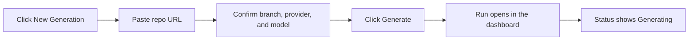

# Generating Documentation

Use the dashboard to start a documentation run for a Git repository and get it into a successful `Generating` state with the fewest possible inputs. This is the fastest way to confirm that your repo URL, branch, and AI settings are accepted before you wait for the full documentation build.

## Prerequisites

- A running docsfy server
- A signed-in `user` or `admin` account
- A remote Git repository URL in HTTPS or SSH form
- Git access from the docsfy server if the repository is private or uses SSH
- A provider/model pair that already works on your server

> **Note:** If you still need the setup and first sign-in path, see [Generate Your First Docs Site](generate-your-first-docs-site.html).

## Quick Example

```text
Repository URL: https://github.com/myk-org/for-testing-only
Branch: main
Provider: cursor
Model: gpt-5.4-xhigh-fast
Force full regeneration: off
```

Click `Generate`. A successful start shows `Generation started for for-testing-only`, adds the repository to the sidebar, and opens the new run with status `Generating`.

> **Tip:** If your server is already set up for a different provider, change only `Provider` and `Model` and keep the rest of the example the same.

## Step-by-Step

1. Open the form.

   In the sidebar, click `New Generation`. This action is available to `user` and `admin` accounts.

2. Enter the repository URL.

   Paste a remote URL such as `https://github.com/myk-org/for-testing-only`. docsfy uses the repository name from that URL as the project name in the sidebar.

> **Tip:** A public HTTPS repository is the easiest first run because it avoids extra Git authentication setup.

3. Leave the branch as `main`.

   `main` is the default for new runs. Use a different branch only when you want a separate run for that branch.

> **Warning:** Branch names cannot contain `/`. Use `release-1.x`, not `release/1.x`.

4. Choose the AI settings.

   `Provider` offers `claude`, `gemini`, and `cursor`, and it opens on `cursor`. If `Model` is blank, enter `gpt-5.4-xhigh-fast` for the default setup, or type the model that matches the provider you actually use.

> **Tip:** The `Model` field accepts typed values, so you can start a run even when no suggestions are shown yet.

5. Leave `Force full regeneration` off.

   This is the normal first-run choice. Turn it on only when you want a clean rebuild of an existing run.

6. Start the run.

   Click `Generate`. On success, the main panel switches from the form to the new run.

7. Confirm that the run started correctly.

   Look for the `Generating` status badge at the top of the detail view. If you want to follow the run until it finishes, see [Tracking Generation Progress](track-generation-progress.html).



## Advanced Usage

### Remote URL formats

```text
https://github.com/myk-org/for-testing-only
https://github.com/myk-org/for-testing-only.git
git@github.com:myk-org/for-testing-only.git
```

The dashboard accepts HTTPS URLs and `git@...` SSH URLs with a hostname. It does not accept bare local paths, and it rejects URLs that target `localhost` or private network addresses.

> **Note:** SSH URLs work only if the machine running docsfy already has Git access to that host.

### Normal run vs clean rebuild

| Setting | When to use it | What to expect |
| --- | --- | --- |
| `Force full regeneration` off | First runs and routine retries | docsfy can reuse existing work when it makes sense |
| `Force full regeneration` on | Clean rebuilds after a bad result or when you want to ignore earlier cached output | docsfy rebuilds that run from scratch |

A non-force rerun can finish quickly and show `Documentation is already up to date.` when nothing changed.

### Suggestions in the form

- Branch suggestions appear only after there is already a successful run for the same repository name.
- Model suggestions appear only after there is already a successful run for that provider.
- You can type a branch or model manually even when there are no suggestions.

### Common alternatives

- To create a separate run for another branch or model, see [Regenerating for New Branches and Models](regenerate-for-new-branches-and-models.html).
- To start runs from a terminal instead of the dashboard, see [Managing docsfy from the CLI](manage-docsfy-from-the-cli.html).

## Troubleshooting

- `New Generation` is missing: your account is probably `viewer`. Only `user` and `admin` accounts can start runs.
- The form says `Please enter a repository URL`: enter the full HTTPS or SSH Git URL, not just the repository name.
- The repository URL is rejected: use a remote URL with a hostname such as `https://github.com/org/repo` or `git@github.com:org/repo.git`.
- The branch is rejected: use a branch that starts with a letter or number and contains only letters, numbers, `.`, `_`, or `-`.
- The run will not start because the variant is already being generated: wait for that exact branch/provider/model combination to finish, or abort it and try again.
- The run switches to `Error` quickly: the selected provider, model, branch, or repository access is not working on the server. See [Fixing Setup and Generation Problems](fix-setup-and-generation-problems.html).

## Related Pages

- [Tracking Generation Progress](track-generation-progress.html)
- [Viewing and Downloading Docs](view-and-download-docs.html)
- [Configuring AI Providers and Models](configure-ai-providers-and-models.html)
- [Regenerating for New Branches and Models](regenerate-for-new-branches-and-models.html)
- [Fixing Setup and Generation Problems](fix-setup-and-generation-problems.html)