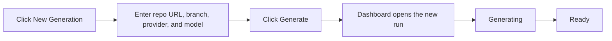

# Generate Documentation

Use the dashboard to start a new documentation run for a Git repository, choose the branch, provider, and model you want, and get a browsable docs site from the same screen. This is the quickest path when you want to add a repo and launch generation without switching to a terminal.

## Prerequisites

- Signed in to the dashboard as a `user` or `admin`
- A remote Git repository URL in HTTPS or `git@...` form
- Git access from the machine running docsfy if the repository is private or uses SSH
- A provider and model that your docsfy server can run

## Quick Example

```text
Repository URL: https://github.com/myk-org/for-testing-only
Branch: main
Provider: gemini
Model: gemini-2.5-flash
Force full regeneration: off
```

Click `New Generation`, enter those values, then click `Generate`. If your server uses a different provider or model, swap those two fields and keep the rest of the flow the same.

## Step-by-Step

1. Open the form.  
   In the dashboard sidebar, click `New Generation`.

2. Enter the repository URL.  
   Paste the remote URL for the repository you want to document. docsfy uses the repository name from that URL as the project name, so `https://github.com/myk-org/for-testing-only` appears in the sidebar as `for-testing-only`.

3. Choose the branch.  
   Leave the default `main` branch or type another branch such as `dev`.

> **Warning:** Branch names cannot contain `/`. Use `release-1.x`, not `release/1.x`.

4. Choose the provider and model.  
   Pick one of `claude`, `gemini`, or `cursor`, then choose a model from the suggestions or type one manually. The form starts with `cursor` selected, but you can change it before you submit.

> **Tip:** If the model list is empty, type the model name yourself. Suggestions only appear after successful generations have already recorded known models.

5. Decide whether to force a full rebuild.  
   Leave `Force full regeneration` off for a normal run. Turn it on when you want docsfy to ignore cached pages and rebuild everything from scratch.

6. Start the run.  
   Click `Generate`. The new run is added to the sidebar, the dashboard opens its detail view automatically, and the status changes to `Generating`.

7. Wait for the ready state.  
   When the run finishes, the selected item shows `Ready`. At that point you can open or download the generated site from the same view.



<details><summary>Advanced Usage</summary>

### Accepted repository URL formats

```text
https://github.com/org/repo
https://github.com/org/repo.git
git@github.com:org/repo.git
```

> **Note:** SSH URLs work only if the machine running docsfy already has Git access to that host.

### Normal run vs forced rebuild

| Setting | When to use it | What to expect |
| --- | --- | --- |
| `Force full regeneration` off | Everyday runs | docsfy can reuse existing work, skip unchanged runs, or update only what changed |
| `Force full regeneration` on | Clean rebuilds, retries after a bad result, or when you want to ignore cached pages | docsfy clears cached page output and rebuilds the docs from scratch |

### Branch and model suggestions

- The branch field suggests branches that already have successful generations for the same repository name.
- The model field suggests models that already have successful generations for the selected provider.
- You can still type a new branch or model even when there is no suggestion.

### Repository URL rules

- Use a standard hosted Git remote in `host/owner/repo` form.
- Do not use a local filesystem path in the dashboard.
- URLs that point to `localhost` or private-network addresses are rejected.

### Terminal alternative

If you prefer to start generations from a shell, see [Manage docsfy from the CLI](manage-docsfy-from-the-cli.html).

</details>

## Troubleshooting

- **The repository URL is rejected:** Use an HTTPS URL like `https://github.com/org/repo.git` or an SSH URL like `git@github.com:org/repo.git`.
- **The branch is rejected:** Remove `/` from the branch name and try a name such as `release-1.x`.
- **No model suggestions appear:** Type the model name manually. Suggestions are learned from successful generations.
- **The run fails during clone:** Make sure the docsfy server can reach the Git host and authenticate to the repository.
- **You get an "already being generated" error:** That exact branch, provider, and model combination is already running. Wait for it to finish, or open it and abort the current run before retrying.
- **You can view docs but cannot start a generation:** Your account is probably `viewer` role. Ask an admin for `user` or `admin` access.
- **The run finishes almost immediately:** docsfy may have detected that the selected commit is already covered. If you need a clean rebuild, start another run with `Force full regeneration` turned on.

## Related Pages

- [Track Generation Progress](track-generation-progress.html)
- [Regenerate for New Branches and Models](regenerate-for-new-branches-and-models.html)
- [View, Download, and Publish Docs](view-download-and-publish-docs.html)
- [Manage docsfy from the CLI](manage-docsfy-from-the-cli.html)
- [Fix Setup and Generation Problems](fix-setup-and-generation-problems.html)