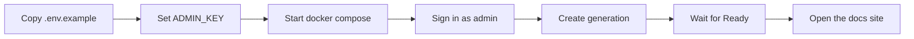

# Generate Your First Docs Site

You want a working docs site fast, without wiring up the stack manually first. This guide uses the built-in Docker path so you can start the app, sign in as `admin`, and generate documentation for a repository right away.

## Prerequisites

- Docker with Compose
- A new `ADMIN_KEY` with at least 16 characters
- A Git repository URL over HTTPS or SSH
- A supported AI provider that can run inside the container; the image includes `claude`, `gemini`, and `cursor`

## Quick Example

```bash
cp .env.example .env
mkdir -p data
```

```dotenv
ADMIN_KEY=replace-with-a-strong-secret
SECURE_COOKIES=false
```

```bash
docker compose up --build -d
curl http://localhost:8000/health
```

1. Open `http://localhost:8000/login`.
2. Sign in with username `admin` and the `ADMIN_KEY` value from `.env`.
3. Click `New Generation`.
4. Enter `https://github.com/myk-org/for-testing-only`.
5. Leave `Branch` as `main`.
6. Leave `Provider` as `cursor`.
7. In `Model`, type `gpt-5.4-xhigh-fast`.
8. Click `Generate`.
9. When the status becomes `Ready`, click `View Documentation`.

> **Note:** `SECURE_COOKIES=false` is the right setting for plain local `http://localhost`. If you move docsfy behind HTTPS, turn it back on.

> **Tip:** The `Model` field accepts typed values, so you can enter a model even when no suggestions are shown yet.



## Step-by-Step

1. Create your local config.

```bash
cp .env.example .env
```

```dotenv
ADMIN_KEY=replace-with-a-strong-secret
SECURE_COOKIES=false
```

`ADMIN_KEY` is required at startup, and the built-in `admin` login uses that value as its password.

> **Warning:** `ADMIN_KEY` must be at least 16 characters long or the server will not start.

> **Warning:** Keep `ADMIN_KEY` in a local `.env` or secret store, not in git-tracked files.

2. Start docsfy with Docker Compose.

```bash
mkdir -p data
docker compose up --build -d
```

```bash
curl http://localhost:8000/health
```

A successful response means the app is up. The app listens on `http://localhost:8000`, and `./data` keeps your database and generated sites between restarts.

3. Sign in as `admin`.

1. Open `http://localhost:8000/login`.
2. Enter username `admin`.
3. Enter the `ADMIN_KEY` value from `.env`.
4. Click `Sign In`.

After login, the dashboard opens and the `New Generation` flow is available immediately.

4. Generate your first site.

1. Click `New Generation`.
2. In `Repository URL`, enter `https://github.com/myk-org/for-testing-only`.
3. Keep `Branch` as `main`.
4. Leave `Provider` as `cursor`.
5. In `Model`, type `gpt-5.4-xhigh-fast`.
6. Click `Generate`.

If another provider is already working in the container, pick that provider instead and type the model you want to use.

> **Note:** Repository URLs can use HTTPS or SSH. For a first run, a public HTTPS repo is the simplest path.

5. Open the result.

The detail view updates in real time while the site is being built. When the status changes to `Ready`, click `View Documentation` to open the generated site in a new tab.

See [Track Generation Progress](track-generation-progress.html) for the live status view and activity log. See [View, Download, and Publish Docs](view-download-and-publish-docs.html) for downloading or publishing the output.

<details><summary>Advanced Usage</summary>

To keep the stack running in the background and watch logs only when you need them:

```bash
docker compose logs -f
```

To stop the stack without deleting your data:

```bash
docker compose down
```

To run the same image without Compose:

```bash
docker build -t docsfy .
docker run --rm \
  -p 8000:8000 \
  --env-file .env \
  -v "$(pwd)/data:/data" \
  docsfy
```

`./data` persists your database and generated sites, so rebuilding or restarting the container does not wipe previous output.

> **Warning:** The built-in `admin` account does not change its password from the dashboard. To change it, update `ADMIN_KEY` in `.env` and restart the container. See [Manage Users, Roles, and Access](manage-users-roles-and-access.html) for shared-instance guidance.

See [Generate Documentation](generate-documentation.html) for more generation options. See [Regenerate for New Branches and Models](regenerate-for-new-branches-and-models.html) when you want another branch or model. See [Install and Run docsfy Without Docker](install-and-run-docsfy-without-docker.html) if you want a non-container setup.

</details>

## Troubleshooting

- The container exits immediately: check that `ADMIN_KEY` is set and at least 16 characters long.
- The login page loads but you cannot stay signed in on `http://localhost:8000`: set `SECURE_COOKIES=false`, then restart the container.
- A generation switches to `Error` right away: the selected provider or model is not ready in the container. Try a working provider/model pair or see [Fix Setup and Generation Problems](fix-setup-and-generation-problems.html).
- A branch name is rejected: use a single branch segment such as `main`, `dev`, or `release-1.x`. Branch names with `/` are rejected.
- A repository URL is rejected: use a Git URL over HTTPS or SSH, not a bare local path.

## Related Pages

- [Generate Documentation](generate-documentation.html)
- [Track Generation Progress](track-generation-progress.html)
- [View, Download, and Publish Docs](view-download-and-publish-docs.html)
- [Regenerate for New Branches and Models](regenerate-for-new-branches-and-models.html)
- [Install and Run docsfy Without Docker](install-and-run-docsfy-without-docker.html)