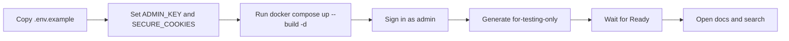

# Generate Your First Docs Site

You want a working docs site quickly so you can prove your setup, sign in, and see a real result before tuning anything else. This guide uses the checked-in Docker path and a small public repository so you can get to a searchable site in one short flow.

## Prerequisites

- Docker with Compose
- An `ADMIN_KEY` you choose, at least 16 characters long
- A Git repository URL over HTTPS or SSH
- At least one working provider and model where docsfy runs

> **Note:** The checked-in container image installs the `claude`, `gemini`, and `cursor` CLIs. Your first generation still needs a provider/model pair that can authenticate and run in that environment.

## Quick Example

```shell
cp .env.example .env
```

```dotenv
ADMIN_KEY=<a-16-plus-character-password>
SECURE_COOKIES=false
```

```shell
docker compose up --build -d
curl http://localhost:8000/health
```

```text
Login
  URL: http://localhost:8000/login
  Username: admin
  Password: <ADMIN_KEY>

New Generation
  Repository URL: https://github.com/myk-org/for-testing-only
  Branch: main
  Provider: cursor
  Model: gpt-5.4-xhigh-fast
  Force full regeneration: off
```

Sign in, click `Generate`, wait for the run to reach `Ready`, then click `View Documentation`. In the docs tab, use the search field or press `Ctrl+K` / `Cmd+K` to confirm the site is searchable.

> **Tip:** On a brand-new server, the `Model` field may have no suggestions yet. Type the model name manually and continue.

## Step-by-Step

1. Prepare your local config.

```shell
cp .env.example .env
```

Set these values in `.env`:

```dotenv
ADMIN_KEY=<a-16-plus-character-password>
SECURE_COOKIES=false
```

For the fastest first run, keep the checked-in provider and model defaults from `.env.example` unless you already know you need a different pair.

> **Warning:** `ADMIN_KEY` is required, and the server rejects values shorter than 16 characters.

2. Start docsfy.

```shell
docker compose up --build -d
```

```shell
curl http://localhost:8000/health
```

The app listens on `http://localhost:8000`. The compose file mounts `./data` into the container, so your database and generated docs survive restarts.

> **Note:** The first build can take a few minutes because it builds the frontend and installs runtime dependencies. If the health check fails immediately, wait a bit and run it again.

3. Sign in as the built-in admin.

Open `http://localhost:8000/login`, enter username `admin`, and enter your `ADMIN_KEY` in the `Password` field. After a successful sign-in, the dashboard opens and `New Generation` is available right away.

4. Start your first generation.

Click `New Generation`, then enter these values:

```text
Repository URL: https://github.com/myk-org/for-testing-only
Branch: main
Provider: cursor
Model: gpt-5.4-xhigh-fast
Force full regeneration: off
```

Then click `Generate`. A small public HTTPS repository is the easiest first run because it avoids private Git access and branch guesswork.

If your environment is already set up for a different working provider, switch the provider and model before you submit. See [Generating Documentation](generate-documentation.html) for the full field-by-field workflow.

5. Wait for the run to finish.

docsfy opens the new variant detail view automatically and updates it in real time. When the status changes to `Ready`, the page shows `View Documentation`.

See [Tracking Generation Progress](track-generation-progress.html) if you want the full meaning of each stage and status.

6. Open the docs and test search.

Click `View Documentation` to open the generated site in a new tab. The finished site includes sidebar navigation and search, so you can click the search field or press `Ctrl+K` / `Cmd+K`, search for a term from the repo, and jump straight to a result.



## Advanced Usage

### Use Another Provider Or Model

The checked-in defaults are `cursor` and `gpt-5.4-xhigh-fast`. If your docsfy environment is already working with `claude` or `gemini` instead, change those two fields before you click `Generate`.

If the model list is empty, type the model name manually. Suggestions appear only after successful generations have already recorded known models.

### Generate Another Branch

Replace `main` with another branch when you need a different variant.

| Use | Avoid | Why |
| --- | --- | --- |
| `main` | `.hidden` | Branches must start with a letter or number. |
| `release-1.x` | `release/1.x` | `/` is rejected. |
| `v2.0.1` | `../etc/passwd` | Traversal-like names are rejected. |

See [Regenerating for New Branches and Models](regenerate-for-new-branches-and-models.html) for the multi-variant workflow.

### Restart Or Change Defaults

Use this to stop the stack without deleting your saved data:

```shell
docker compose down
```

Start it again with:

```shell
docker compose up -d
```

Use this when you want to watch server output:

```shell
docker compose logs -f docsfy
```

To change the built-in admin password or the default provider/model for future runs, edit `.env` and restart the stack. See [Configuration Reference](configuration-reference.html) for the full setting list.

### Other Workflows

See [Install and Run docsfy Without Docker](install-and-run-docsfy-without-docker.html) for a non-container setup. See [Managing docsfy from the CLI](manage-docsfy-from-the-cli.html) if you want a terminal-first workflow.

After your repository changes, see [Regenerating After Code Changes](regenerate-after-code-changes.html).

## Troubleshooting

- If the container exits immediately, `ADMIN_KEY` is missing or too short. Set it in `.env`, then start the stack again.
- If the login page works but you bounce back to `/login` on plain `http://localhost`, set `SECURE_COOKIES=false` in `.env`, then restart.
- If the generation switches to `Error` almost immediately, the selected provider/model is not ready in the environment running docsfy. Pick a working pair or see [Fixing Setup and Generation Problems](fix-setup-and-generation-problems.html).
- If the repository URL is rejected, use a hosted Git URL such as `https://github.com/org/repo`, `https://github.com/org/repo.git`, or `git@github.com:org/repo.git`. The dashboard quick-start flow is for remote Git URLs, not local filesystem paths.
- If the branch name is rejected, use a single branch segment such as `main`, `dev`, or `release-1.x`. Branch names with `/` are rejected.
- If the `Model` field shows no suggestions, type the model name manually and continue.

## Related Pages

- [Generating Documentation](generate-documentation.html)
- [Tracking Generation Progress](track-generation-progress.html)
- [Viewing and Downloading Docs](view-and-download-docs.html)
- [Install and Run docsfy Without Docker](install-and-run-docsfy-without-docker.html)
- [Fixing Setup and Generation Problems](fix-setup-and-generation-problems.html)