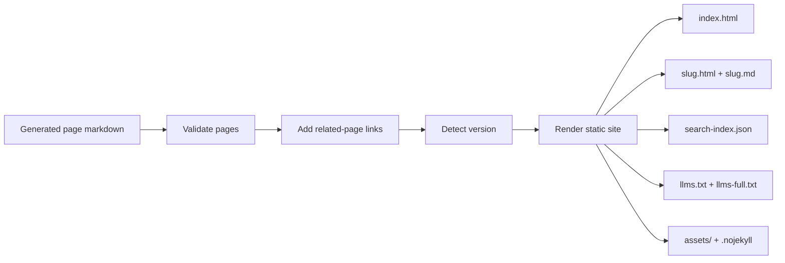

# Generated Output

Every successful `docsfy` generation produces one self-contained static documentation bundle for one variant: project, branch, AI provider, and AI model. That bundle is what `docsfy` serves under `/docs/...`, what the download endpoints return as a `.tar.gz`, and what you can publish on any static host.

The bundle is built for two audiences at once: people browsing HTML pages and tools that prefer plain text. That is why each generation includes rendered HTML, matching Markdown copies, built-in search data, and the `llms.txt` / `llms-full.txt` artifacts.

> **Note:** The public output is the variant’s `site/` directory. Internal files such as `plan.json` and `cache/pages/*.md` live beside it to support regeneration, but they are not part of the published site.

## What Gets Published

| Artifact | What it contains | Why it exists |
| --- | --- | --- |
| `index.html` | The docs homepage | Landing page, grouped navigation, first-page jump-off |
| `<slug>.html` | One rendered page per generated doc page | Normal browser reading and sharing |
| `<slug>.md` | A Markdown copy of each page | Reuse, diffing, text-first workflows, automation |
| `search-index.json` | Search data | Client-side search in the published site |
| `llms.txt` | A compact Markdown index | Lightweight map of the documentation |
| `llms-full.txt` | All page Markdown in one file | Single-file ingestion for LLMs or other text pipelines |
| `assets/` | Static CSS and JavaScript | Theme, search, callouts, copy buttons, TOC highlighting, sidebar behavior |
| `.nojekyll` | Empty marker file | Prevents Jekyll processing on GitHub Pages-style hosts |

The renderer writes the public bundle directly:

```599:688:src/docsfy/renderer.py
def render_site(plan: dict[str, Any], pages: dict[str, str], output_dir: Path) -> None:
    if output_dir.exists():
        shutil.rmtree(output_dir)
    output_dir.mkdir(parents=True, exist_ok=True)
    assets_dir = output_dir / "assets"
    assets_dir.mkdir(exist_ok=True)

    # Prevent GitHub Pages from running Jekyll
    (output_dir / ".nojekyll").touch()

    # ... copy files from src/docsfy/static/ into assets/ ...

    (output_dir / "index.html").write_text(index_html, encoding="utf-8")
    (output_dir / f"{slug}.html").write_text(page_html, encoding="utf-8")
    (output_dir / f"{slug}.md").write_text(md_content, encoding="utf-8")

    (output_dir / "search-index.json").write_text(
        json.dumps(search_index), encoding="utf-8"
    )
    (output_dir / "llms.txt").write_text(llms_txt, encoding="utf-8")
    (output_dir / "llms-full.txt").write_text(llms_full_txt, encoding="utf-8")
```

> **Note:** `render_site()` deletes and recreates the entire `site/` directory before writing the new bundle. If a page existed in an older generation but not the new one, the old files do not linger.

This repository’s checked-in `docs/` directory is a real example of the published shape:

```text
docs/
  index.html
  generated-output.html
  generated-output.md
  llms.txt
  llms-full.txt
  search-index.json
  assets/
    style.css
    search.js
    copy.js
    callouts.js
    scrollspy.js
    theme.js
    github.js
```

> **Warning:** Page slugs are flat filenames. If a slug contains `/`, `\`, a leading `.`, or `..`, docsfy skips it instead of creating nested directories or unsafe paths.

```620:637:src/docsfy/renderer.py
# Filter out invalid slugs
valid_pages: dict[str, str] = {}
for slug, content in pages.items():
    if "/" in slug or "\\" in slug or slug.startswith(".") or ".." in slug:
        logger.warning(f"Skipping invalid slug: {slug}")
    else:
        valid_pages[slug] = content

# Filter navigation to only include pages that exist in valid_pages
filtered_navigation: list[dict[str, Any]] = []
for group in navigation:
    filtered_pages = [
        page
        for page in group.get("pages", [])
        if page.get("slug", "") in valid_pages
    ]
```

## How A Generation Becomes A Bundle

Before the site is rendered, docsfy runs a short post-generation pipeline. In practice, it looks like this:



The backend implements that sequence explicitly:

```981:1052:src/docsfy/api/projects.py
# --- Post-generation pipeline ---
await update_and_notify(
    gen_key,
    project_name,
    ai_provider,
    ai_model,
    status="generating",
    owner=owner,
    branch=branch,
    current_stage="validating",
    page_count=len(pages),
)
pages = await validate_pages(...)

await update_and_notify(
    gen_key,
    project_name,
    ai_provider,
    ai_model,
    status="generating",
    owner=owner,
    branch=branch,
    current_stage="cross_linking",
    page_count=len(pages),
)
pages = await add_cross_links(...)

version = detect_version(repo_dir)
if version:
    plan["version"] = version

await update_and_notify(... current_stage="rendering", page_count=len(pages))
site_dir = get_project_site_dir(
    project_name, ai_provider, ai_model, owner, branch=branch
)
render_site(plan=plan, pages=pages, output_dir=site_dir)
```

## HTML Pages, Assets, And Search

`index.html` is a real landing page, not just a redirect. Each page slug also gets a standalone `<slug>.html` file with previous/next navigation and, when headings exist, an `On this page` table of contents.

Markdown is rendered with fenced code blocks, syntax highlighting, tables, and a TOC built from `##` and `###` headings:

```441:455:src/docsfy/renderer.py
def _md_to_html(md_text: str) -> tuple[str, str]:
    """Convert markdown to HTML. Returns (content_html, toc_html)."""
    md = markdown.Markdown(
        extensions=["fenced_code", "codehilite", "tables", "toc"],
        extension_configs={
            "codehilite": {"css_class": "highlight", "guess_lang": False},
            "toc": {"toc_depth": "2-3"},
        },
    )
    md_text = _prerender_mermaid(md_text)
    md_text = _clean_code_fence_annotations(md_text)
    md_text = _ensure_blank_lines(md_text)
    content_html = _sanitize_html(md.convert(md_text))
    toc_html = getattr(md, "toc", "")
    return content_html, toc_html
```

```15:39:src/docsfy/templates/page.html
<nav class="page-nav">
    
    <a href="{{ prev_page.slug }}.html" class="page-nav-link page-nav-prev">
        <span class="page-nav-label">Previous</span>
        <span class="page-nav-title">{{ prev_page.title }}</span>
    </a>
    
    
    <a href="{{ next_page.slug }}.html" class="page-nav-link page-nav-next">
        <span class="page-nav-label">Next</span>
        <span class="page-nav-title">{{ next_page.title }}</span>
    </a>
    
</nav>

<aside class="toc-sidebar">
    <div class="toc-container">
        <h3>On this page</h3>
        {{ toc | safe }}
    </div>
</aside>

```

If a page uses the standard blockquote callout forms such as `> **Note:**`, `> **Warning:**`, or `> **Tip:**`, the published bundle styles them automatically:

```1:25:src/docsfy/static/callouts.js
(function() {
  var blockquotes = document.querySelectorAll('blockquote');
  blockquotes.forEach(function(bq) {
    var firstStrong = bq.querySelector('strong');
    if (!firstStrong) return;

    var text = firstStrong.textContent.toLowerCase().replace(':', '').trim();
    var type = null;

    if (text === 'note' || text === 'info') {
      type = 'note';
    } else if (text === 'warning' || text === 'caution') {
      type = 'warning';
    } else if (text === 'tip' || text === 'hint') {
      type = 'tip';
    }

    if (type) {
      bq.classList.add('callout', 'callout-' + type);
    }
  });
})();
```

Search is fully self-contained. There is no separate search server to run. The renderer writes `search-index.json`, and the browser loads that file directly.

```518:524:src/docsfy/renderer.py
index.append(
    {
        "slug": slug,
        "title": title_map.get(slug, slug),
        "content": content[:2000],
    }
)
```

```18:19:src/docsfy/static/search.js
fetch('search-index.json').then(function(r) { return r.json(); })
  .then(function(data) { index = data; }).catch(function() {});
```

```74:80:src/docsfy/static/search.js
var matches = index.filter(function(item) {
  return item.title.toLowerCase().includes(q) || item.content.toLowerCase().includes(q);
}).slice(0, 10);

matches.forEach(function(m, i) {
  var div = document.createElement('a');
  div.href = m.slug + '.html';
```

> **Note:** The search index stores only the first 2,000 characters of each page. That keeps the bundle small, but very deep matches later in a long page may not appear in the built-in search results.

## Markdown Copies And LLM-Friendly Files

For every `guide.html`, you also get `guide.md` in the same bundle. Those Markdown files are part of the public output, not just an internal cache. They are what `llms.txt` links to, and they are what `llms-full.txt` concatenates.

This repository’s generated `llms.txt` is a good real-world example of the format:

```1:10:docs/llms.txt
# docsfy

> AI-powered documentation generator that turns Git repositories into shareable static docs sites.

## Overview

- [Introduction](introduction.md): Explain what docsfy does, who it is for, and the main workflows exposed through the web app, HTTP API, generated sites, and CLI.
- [Architecture and Runtime](architecture-and-runtime.md): Describe how the FastAPI backend, React dashboard, SQLite storage, AI CLI integrations, and static site renderer work together.
- [Projects, Variants, and Ownership](projects-variants-and-ownership.md): Define the core data model: owners, repository names, branches, provider and model variants, statuses, and latest-variant resolution.
- [Generated Output](generated-output.md): Show what docsfy publishes for each generation, including static HTML pages, Markdown copies, search index files, and LLM-friendly artifacts.
```

`llms-full.txt` takes the next step and combines every page into one file with a source label before each page’s content:

```582:595:src/docsfy/renderer.py
for group in nav:
    for page in group.get("pages", []):
        slug = page.get("slug", "")
        content = pages.get(slug, "")
        lines.extend(
            [
                f"Source: {slug}.md",
                "",
                content,
                "",
                "---",
                "",
            ]
        )
```

The published homepage also makes both files easy to discover:

```18:27:src/docsfy/templates/index.html
<div class="llm-docs-content">
    <strong>AI-friendly documentation</strong>
    <p>This documentation is optimized for AI consumption.</p>
    <div class="llm-docs-links">
        <a href="llms.txt">llms.txt</a> — structured index
        <span class="llm-docs-sep">·</span>
        <a href="llms-full.txt">llms-full.txt</a> — complete docs in one file
    </div>
</div>
```

> **Tip:** Use `llms.txt` when you want a small table of contents you can crawl page by page. Use `llms-full.txt` when you want one file to hand to an LLM, a batch text-processing job, or another ingestion pipeline.

## Where The Files Live And How To Get Them

By default, docsfy stores runtime data under `/data`, and the provided Compose file binds host `./data` into that location:

```13:17:.env.example
# Data directory for database and generated docs
DATA_DIR=/data

# Cookie security (set to false for local HTTP development)
SECURE_COOKIES=true
```

```10:11:docker-compose.yaml
volumes:
  - ./data:/data
```

On disk, one variant lives in a branch/provider/model-aware directory, and the published site is the `site/` child of that variant:

```525:581:src/docsfy/storage.py
def get_project_dir(
    name: str,
    ai_provider: str = "",
    ai_model: str = "",
    owner: str = "",
    branch: str = DEFAULT_BRANCH,
) -> Path:
    return (
        PROJECTS_DIR
        / safe_owner
        / _validate_name(name)
        / branch
        / ai_provider
        / ai_model
    )

def get_project_site_dir(
    name: str,
    ai_provider: str = "",
    ai_model: str = "",
    owner: str = "",
    branch: str = DEFAULT_BRANCH,
) -> Path:
    return get_project_dir(name, ai_provider, ai_model, owner, branch) / "site"
```

With the default settings, that means the published bundle lives at:

`/data/projects/<owner>/<project>/<branch>/<provider>/<model>/site/`

Docsfy serves any file inside that directory, not just `index.html`. In other words, the same route family that serves HTML pages can also serve `llms.txt`, `llms-full.txt`, `search-index.json`, or files under `assets/`.

```200:268:src/docsfy/main.py
@app.get("/docs/{project}/{branch}/{provider}/{model}/{path:path}")
async def serve_variant_docs(...):
    ...
    site_dir = get_project_site_dir(project, provider, model, proj_owner, branch=branch)
    file_path = site_dir / path
    ...
    return FileResponse(file_path)

@app.get("/docs/{project}/{path:path}")
async def serve_docs(...):
    """Serve the most recently generated variant."""
    ...
    site_dir = get_project_site_dir(
        project,
        str(latest["ai_provider"]),
        str(latest["ai_model"]),
        latest_owner,
        branch=latest_branch,
    )
    file_path = site_dir / path
    ...
    return FileResponse(file_path)
```

That means a URL like `/docs/<project>/<branch>/<provider>/<model>/llms.txt` is just as real as `/docs/<project>/<branch>/<provider>/<model>/index.html`.

> **Warning:** The short `/docs/<project>/...` and `/api/projects/<name>/download` routes are not pinned to one branch or model. They return the newest ready variant you can access. If you care about one exact build, use the fully qualified variant route.

Downloads are built from `site_dir` only, so the archive contains the published static bundle rather than caches or planning metadata. The CLI either saves that archive or extracts it into the directory you pass with `--output`.

```374:409:src/docsfy/api/projects.py
async def _stream_tarball(site_dir: Path, archive_name: str) -> StreamingResponse:
    """Create a tar.gz archive and stream it as a response."""
    ...
    def _create_archive() -> None:
        with tarfile.open(tar_path, mode="w:gz") as tar:
            tar.add(str(site_dir), arcname=archive_name)

    ...
    return StreamingResponse(
        _stream_and_cleanup(),
        media_type="application/gzip",
        headers={
            "Content-Disposition": f'attachment; filename="{archive_name}-docs.tar.gz"'
        },
    )
```

```301:321:src/docsfy/cli/projects.py
if branch and provider and model:
    url_path = (
        f"/api/projects/{name}/{branch}/{provider}/{model}/download{owner_qs}"
    )
    archive_name = f"{name}-{branch}-{provider}-{model}-docs.tar.gz"
else:
    url_path = f"/api/projects/{name}/download{owner_qs}"
    archive_name = f"{name}-docs.tar.gz"

if output:
    client.download(url_path, tmp_path)
    output_dir = Path(output)
    output_dir.mkdir(parents=True, exist_ok=True)
    with tarfile.open(tmp_path, "r:gz") as tar:
        tar.extractall(path=output_dir, filter="data")
    typer.echo(f"Extracted to {output_dir}")
```

> **Note:** Extracting a download gives you a top-level folder inside your target directory. The tarball is created with an explicit archive name, so you should expect one nested directory rather than loose files at the extraction root.

## What Can Appear Inside The Published Pages

The final HTML pages can include a little more than a raw Markdown render:

- docsfy can validate generated pages, detect stale references, and regenerate a page before the final render.
- It can append a `## Related Pages` section with links to other generated pages.
- It can detect a project version and show it in the footer.
- It can pre-render top-level Mermaid diagrams to inline SVG when `mmdc` is available.

The related-pages section is appended as plain Markdown links to other generated HTML pages:

```402:404:src/docsfy/postprocess.py
if link_items:
    related_section = "\n\n## Related Pages\n\n" + "\n".join(link_items)
    updated[slug] = updated[slug] + related_section
```

Version detection checks common project metadata files and Git tags, then the footer renders the version if one was found:

```38:43:src/docsfy/postprocess.py
def detect_version(repo_path: Path) -> str | None:
    """Auto-detect project version from common sources.

    Checks in order: pyproject.toml, package.json, Cargo.toml, setup.cfg, git tags.
    Returns the first version found, or None.
    """
```

```82:89:src/docsfy/templates/_doc_base.html
<footer class="page-footer">
    
    <span class="footer-version">Generated from version {{ version }}</span>
    <span class="footer-sep">&middot;</span>
    
    Generated with <a href="{{ docsfy_repo_url }}" target="_blank" rel="noopener">docs<span class="brand-accent">fy</span></a>
    <span class="footer-sep">&middot;</span>
    <span class="footer-llm">LLM-friendly: <a href="llms.txt">llms.txt</a> &middot; <a href="llms-full.txt">llms-full.txt</a></span>
</footer>
```

Mermaid rendering is opportunistic rather than brittle: if `mmdc` is installed, docsfy turns top-level Mermaid fences into inline SVG; if not, or if rendering fails, it keeps the original Mermaid block instead of failing the page.

```325:327:src/docsfy/renderer.py
if not shutil.which("mmdc"):
    logger.debug("mmdc not found, skipping Mermaid pre-rendering")
    return md_text
```

```383:393:src/docsfy/renderer.py
if in_mermaid and backtick_count >= mermaid_fence_len and not rest:
    mermaid_src = "\n".join(mermaid_lines)
    rendered = _render_mermaid_block(mermaid_src)
    if rendered:
        result.append(rendered)
    else:
        # Rendering failed -- restore original block
        result.append("`" * mermaid_fence_len + "mermaid")
        result.extend(mermaid_lines)
        result.append(line)
```

> **Tip:** If you want a version in the footer, keep version metadata in a standard place such as `pyproject.toml`, `package.json`, `Cargo.toml`, or `setup.cfg`, or tag the repository.


## Related Pages

- [Viewing, Downloading, and Hosting Docs](viewing-downloading-and-hosting-docs.html)
- [Data Storage and Layout](data-storage-and-layout.html)
- [Architecture and Runtime](architecture-and-runtime.html)
- [Generating Documentation](generating-documentation.html)
- [Deployment and Runtime](deployment-and-runtime.html)