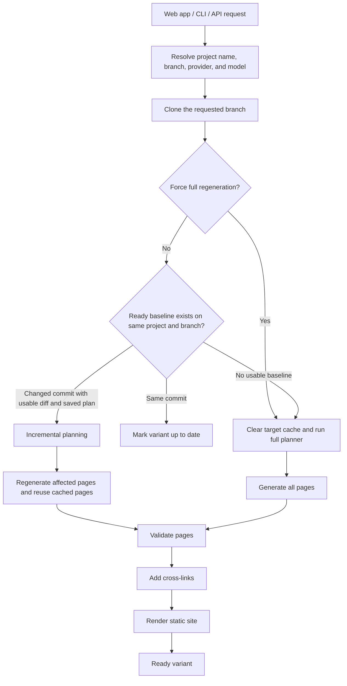

# Generating Documentation

`docsfy` turns a Git repository into a static documentation variant. Each variant is scoped by repository name, branch, AI provider, and AI model, so the same repository can have separate outputs for `main` and `dev`, or for `gemini` and `cursor`.

The project name comes from the repository URL automatically. For example, `https://github.com/myk-org/for-testing-only` becomes `for-testing-only`.

## What You Need

- A `user` or `admin` account. `viewer` accounts can read docs but cannot start or regenerate them.
- A remote Git URL in HTTPS or `git@...` form.
- A provider/model combination that the server can actually run.

Accepted URL shapes in the current request model include:

```text
https://github.com/org/repo.git
https://github.com/org/repo
git@github.com:org/repo.git
```

> **Note:** If you use an SSH URL, the machine running `docsfy` must already have working Git credentials for that host.

> **Warning:** This page covers generation from a Git repository URL. Local `repo_path` generation exists in the API, but it is an admin-only workflow.

> **Warning:** Repository URLs that point to `localhost` or private-network addresses are rejected.

## Start a New Generation in the Web App

Use the `New Generation` form in the dashboard:

1. Enter the repository URL.
2. Choose the branch.
3. Choose the AI provider.
4. Choose or type the model name.
5. Decide whether to enable `Force full regeneration`.
6. Click `Generate`.

The web app submits these fields to the server:

```ts
await api.post('/api/generate', {
  repo_url: submittedRepoUrl,
  branch: submittedBranch,
  ai_provider: submittedProvider,
  ai_model: submittedModel,
  force: submittedForce,
})
```

A few details are worth knowing:

- The branch field starts at `main`.
- The provider field starts at `cursor`.
- Branch suggestions come from previous ready generations of the same repository name.
- Model suggestions come from previous ready variants for the selected provider.
- Both branch and model inputs still let you type a new value.

> **Tip:** The web form remembers the repository URL, branch, and Force checkbox for the current browser session.

## Generate From the CLI

If you have not configured the CLI yet, run `docsfy config init` first.

`docsfy generate` accepts the same core settings as the web app: `--branch` / `-b`, `--provider`, `--model` / `-m`, `--force` / `-f`, and `--watch` / `-w`.

Real CLI examples from the repository's own test plans:

```bash
docsfy generate https://github.com/myk-org/for-testing-only --provider gemini --model gemini-2.5-flash --force
```

```bash
docsfy generate https://github.com/myk-org/for-testing-only --branch dev --provider gemini --model gemini-2.5-flash --force --watch
```

`--watch` keeps the CLI attached to the run and prints stage output until the variant is ready, fails, or is aborted.

> **Note:** The CLI stores connection profiles in `~/.config/docsfy/config.toml` and sends the configured password or API key as a Bearer token.

## Generate Through the API

`POST /api/generate` accepts `repo_url`, `branch`, `ai_provider`, `ai_model`, `ai_cli_timeout`, and `force`.

A real API example from the test plans:

```bash
curl -s -X POST http://localhost:8800/api/generate \
  -H "Authorization: Bearer <TEST_USER_PASSWORD>" \
  -H "Content-Type: application/json" \
  -d '{"repo_url":"https://github.com/myk-org/for-testing-only","ai_provider":"gemini","ai_model":"gemini-2.5-flash"}'
```

A successful request returns `202 Accepted` and starts generation asynchronously. The response includes the derived project name, the current status, and the resolved branch.

> **Note:** `ai_cli_timeout` is an API-only advanced option for overriding the server's default AI CLI timeout on a single request.

## Choose Branch, Provider, and Model

Actual defaults in the request model are:

```python
force: bool = Field(
    default=False, description="Force full regeneration, ignoring cache"
)
branch: str = Field(
    default=DEFAULT_BRANCH, description="Git branch to generate docs from"
)
```

If you do not choose a branch, `docsfy` uses `main`.

Valid branch examples exercised in the test suite include:

```text
main
dev
v2.0
release-v2.0
v2.0.1
```

> **Warning:** Branch names cannot contain `/`. Use `release-v2.0` instead of `release/v2.0`.

The supported providers in the current codebase are `claude`, `gemini`, and `cursor`.

If you do not set a provider or model, the server falls back to its configured defaults. The shipped defaults are:

```env
AI_PROVIDER=cursor
AI_MODEL=gpt-5.4-xhigh-fast
AI_CLI_TIMEOUT=60
```

Branch, provider, and model are part of the variant identity. That same combination appears in the exact docs and download URLs:

```text
/docs/for-testing-only/dev/gemini/gemini-2.5-flash/
/api/projects/for-testing-only/dev/gemini/gemini-2.5-flash/download
```

> **Warning:** If the selected branch does not exist on the remote, cloning fails and the variant ends in `error`.

> **Warning:** The selected provider CLI must be installed and authenticated on the server. If the server cannot run that provider or model, generation fails before docs are produced.

## Regenerating an Existing Variant

The variant detail pane has a `Regenerate Documentation` section. That flow keeps the current repository URL and branch, and lets you change provider, model, and Force.

This is the actual regenerate request:

```ts
await api.post('/api/generate', {
  repo_url: project.repo_url,
  branch: project.branch,
  ai_provider: provider,
  ai_model: model,
  force,
})
```

> **Note:** Regenerate does not change the branch in the current UI. To generate a different branch, start a new run from the `New Generation` form.

## Understanding Force Full Regeneration

`Force full regeneration` changes how much previous work `docsfy` is allowed to reuse.

With Force off:

- `docsfy` can finish immediately as up to date when the latest generated commit already matches the requested commit.
- `docsfy` can diff the repository, reuse the saved plan, keep cached pages that still apply, and regenerate only the affected pages.
- When you switch provider or model, `docsfy` can use the newest ready variant on the same branch as a baseline, even if that baseline used a different provider or model.

With Force on:

- `docsfy` clears the target variant's cached pages.
- The page count is reset to `0`.
- A full planning step runs again.
- Every page is regenerated from scratch.

Provider/model switches are where Force matters most:

- On a non-force run, a new provider/model variant can reuse the previous variant's artifacts and, after success, replace the older baseline variant.
- On a force run, the older variant is kept and the new provider/model variant is built separately from scratch.

> **Tip:** Use Force when you want a clean rebuild, when you suspect stale cached output, or when you want two provider/model variants to exist side by side instead of replacing the older one.

> **Tip:** In the current UI, Force defaults to off for `ready` variants and to on for `error` or `aborted` variants.

> **Warning:** Only one run can be active for the same project, branch, provider, and model at a time. Starting that exact variant again returns `409`.

## Generation Flow



In code, the pipeline uses stages such as `cloning`, `planning`, `incremental_planning`, `generating_pages`, `validating`, `cross_linking`, and `rendering`. A no-op run uses `up_to_date`.

## After Generation

Once the variant is ready, you can:

- open the generated site from the variant detail view
- download the rendered output as a `.tar.gz` archive
- inspect the variant later with `docsfy status <project>`

If you care about an exact branch/provider/model combination, use the full variant URL:

```text
/docs/for-testing-only/dev/gemini/gemini-2.5-flash/
```

> **Note:** The shorter `/docs/<project>/` route serves the most recently generated ready variant, not a branch-pinned one. Use the full variant URL when you want a stable link.

> **Note:** Docs and download routes are authenticated. Open them from a logged-in browser session, or use an API client that sends a valid Bearer token.


## Related Pages

- [Variants, Branches, and Regeneration](variants-branches-and-regeneration.html)
- [Tracking Progress and Status](tracking-progress-and-status.html)
- [Projects API](projects-api.html)
- [CLI Workflows](cli-workflows.html)
- [AI Provider Setup](ai-provider-setup.html)