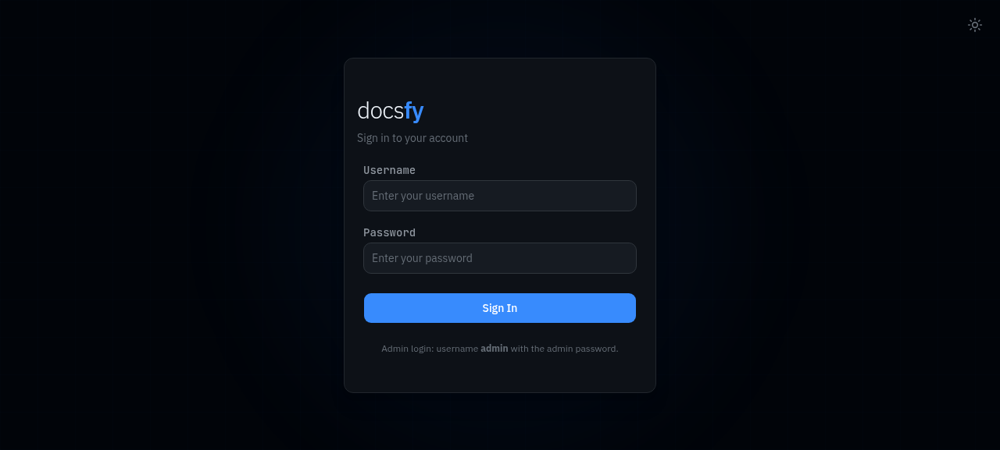
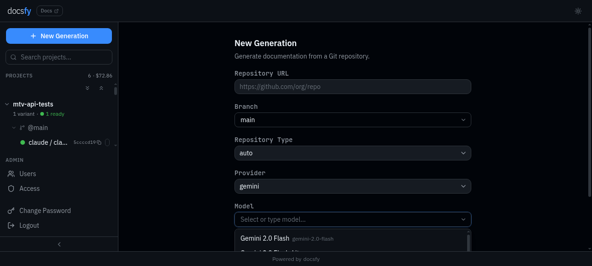
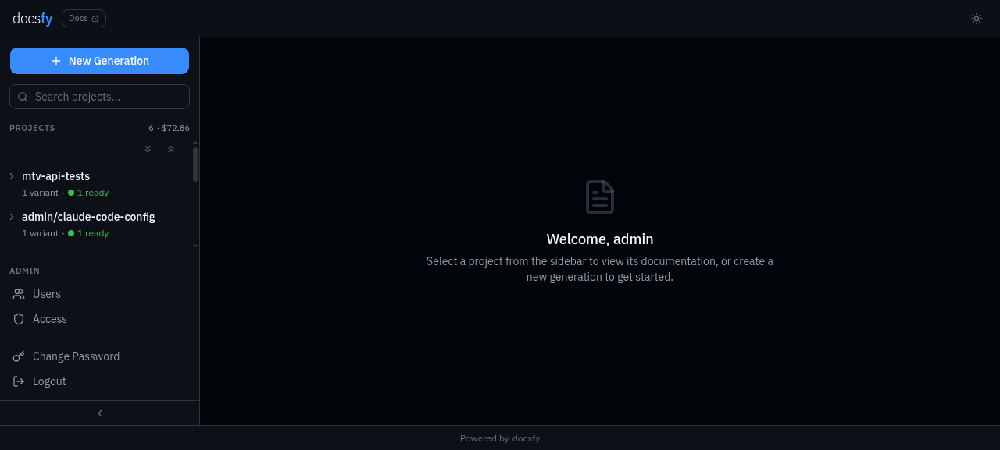
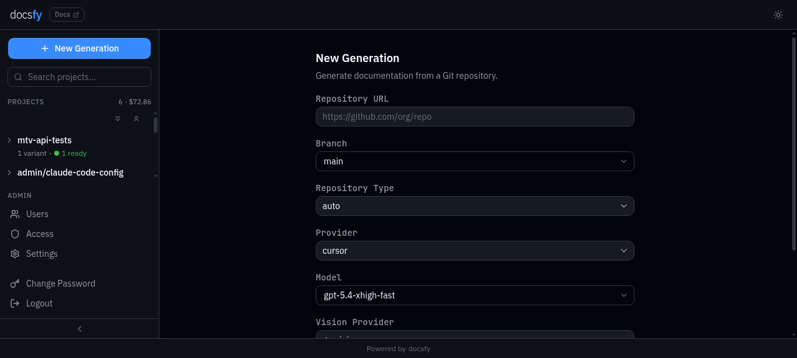
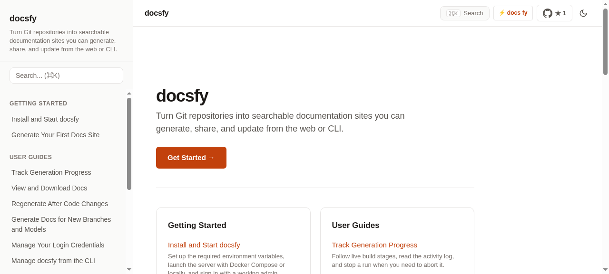
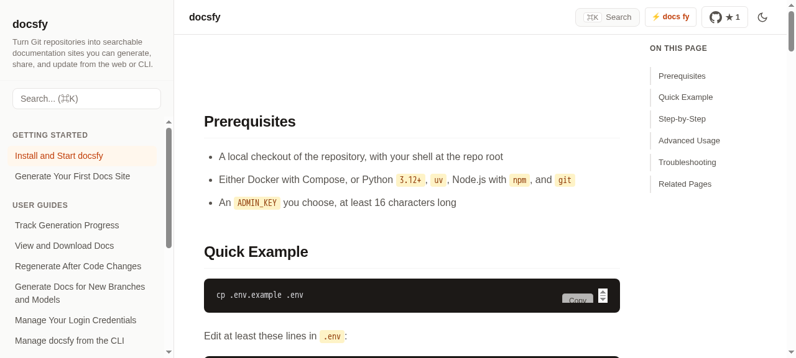
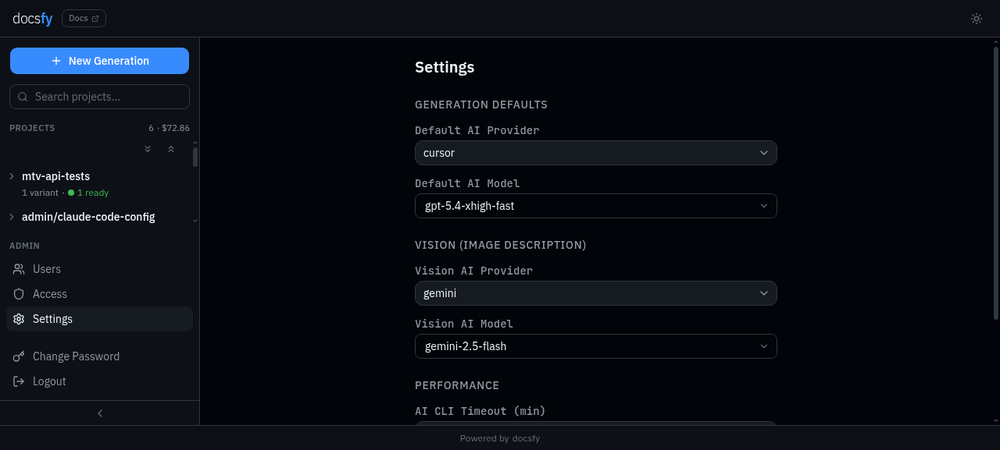

# HTTP API and WebSocket Reference

> **Note:** Examples use `http://localhost:800`. See [Set Up the CLI](set-up-the-cli.html) for CLI profile setup, [Generate Documentation](generate-documentation.html) for guided runs, and [Track Generation Progress](track-generation-progress.html) for human-facing monitoring.

## Authentication and Conventions

### `Authentication surfaces`

Use a Bearer token for automation, or log in once to receive a `docsfy_session` cookie for browser and same-origin WebSocket access.

| Name | Type | Default | Description |
| --- | --- | --- | --- |
| `Authorization` | HTTP header | none | `Bearer <ADMIN_KEY>` or `Bearer <user_api_key>`. Accepted on protected `/api/*` routes and `/docs/*` file routes. |
| `docsfy_session` | cookie | none | Session cookie created by `POST /api/auth/login`. Attributes: `HttpOnly`, `SameSite=Strict`, `Max-Age=28800`. The `Secure` flag follows the server cookie configuration. |
| `token` | query string | none | Raw `ADMIN_KEY` or user API key for `ws://.../api/ws` or `wss://.../api/ws`. |

| Identity | Read `/api/*` and `/docs/*` | Start generation | Abort/delete owned variants | Admin endpoints | Rotate own key |
| --- | --- | --- | --- | --- | --- |
| Bootstrap `ADMIN_KEY` identity | Yes | Yes | Yes | Yes | No |
| DB-backed `admin` user | Yes | Yes | Yes | Yes | Yes |
| `user` | Yes, including shared variants | Yes, for owned variants only | Yes, for owned variants only | No | Yes |
| `viewer` | Yes, including shared variants | No | No | No | Yes |

```bash
curl -H "Authorization: Bearer <USER_API_KEY>" \
  http://localhost:800/api/projects
```

```javascript
const ws = new WebSocket("ws://localhost:800/api/ws?token=<USER_API_KEY>");
```

Authenticates protected HTTP requests and the WebSocket handshake.



> **Warning:** Hidden resources return `404` instead of `403`. A missing project and an inaccessible project are intentionally indistinguishable to non-admin callers.


> **Warning:** Unauthenticated `/docs/*` requests with `Accept: text/html` receive `302 /login`. Other unauthenticated `/docs/*` requests receive `401 {"detail":"Unauthorized"}`.

### `Variant path encoding`

Variant-scoped routes put the branch in a single URL path segment. Encode `/` as `~2F` and `~` as `~7E`.

| Raw branch | Encoded path segment | Used in |
| --- | --- | --- |
| `main` | `main` | Variant API routes and variant `/docs/*` routes |
| `release/v2.0` | `release~2Fv2.0` | Variant API routes and variant `/docs/*` routes |
| `feature~preview` | `feature~7Epreview` | Variant API routes and variant `/docs/*` routes |

```bash
curl -H "Authorization: Bearer <ADMIN_KEY>" \
  "http://localhost:800/api/projects/my-repo/release~2Fv2.0/claude/opus?owner=alice"
```

Use the encoded segment anywhere the route path contains `{branch}`.

### `Error response body`

Most non-2xx HTTP responses use a `detail` field. Validation failures use FastAPI's `422` format, where `detail` is an array.

| Name | Type | Default | Description |
| --- | --- | --- | --- |
| `detail` | string | none | Error message for most `4xx` and `5xx` responses. |
| `detail` | array | none | Validation errors for `422` responses. Each item includes a location, message, and error type. |

```json
{"detail":"Unauthorized"}
```

```json
{
  "detail": [
    {
      "type": "value_error",
      "loc": ["body", "repo_url"],
      "msg": "Value error, Invalid git repository URL: 'not-a-url'",
      "input": "not-a-url"
    }
  ]
}
```

Returns machine-readable error data for automated clients.

## Health and Model Discovery

### `GET /health`

Public health check.

Auth: `Public`

No parameters.

```bash
curl http://localhost:800/health
```

```json
{"status":"ok"}
```

Returns `200 OK` when the service is reachable.

### `GET /api/models`

List supported providers, current server defaults, discovered model catalogs, and Cursor availability status.

Auth: `Public`

No parameters.

Response body:

| Name | Type | Default | Description |
| --- | --- | --- | --- |
| `providers` | array of strings | `[]` | Supported provider IDs. The current set is `claude`, `gemini`, and `cursor`. |
| `default_provider` | string | `""` | Default generation provider from persisted settings or environment. |
| `default_model` | string | `""` | Default generation model from persisted settings or environment. |
| `default_vision_provider` | string | `""` | Default image-description provider from persisted settings or environment. |
| `default_vision_model` | string | `""` | Default image-description model from persisted settings or environment. |
| `available_models` | object | `{}` | Models grouped by provider. Each value is an array of model entries. |
| `provider_status` | object | `{}` | Provider health summary. The current response contains a `cursor` entry. |

Model entry fields:

| Name | Type | Default | Description |
| --- | --- | --- | --- |
| `id` | string | none | Provider-specific model identifier. |
| `name` | string | `id` | Human-readable model name. |
| `source` | string | omitted | Catalog source. Current values are `acpx`, `cli`, or `api`. |

`provider_status.cursor` fields:

| Name | Type | Default | Description |
| --- | --- | --- | --- |
| `ok` | boolean | `false` | Whether Cursor models are currently available. |
| `reason` | string or `null` | `null` | Current health reason. Known values include `unavailable`, `no_models`, `agent_missing`, `auth_expired`, and `api_key_not_applied`. |
| `hint` | string or `null` | `null` | Human-readable status hint. |
| `model_count` | integer | `0` | Number of discovered Cursor models. |
| `has_api_key` | boolean | omitted | Admin-only field indicating whether `CURSOR_API_KEY` is set in the server environment. |

```bash
curl http://localhost:800/api/models
```

```json
{
  "providers": ["claude", "gemini", "cursor"],
  "default_provider": "cursor",
  "default_model": "gpt-5.4-xhigh-fast",
  "default_vision_provider": "",
  "default_vision_model": "",
  "available_models": {
    "cursor": [
      {
        "id": "gpt-5.4-xhigh-fast",
        "name": "GPT-5.4 XHigh Fast",
        "source": "acpx"
      }
    ],
    "claude": [],
    "gemini": []
  },
  "provider_status": {
    "cursor": {
      "ok": true,
      "reason": null,
      "hint": null,
      "model_count": 1
    }
  }
```

Returns the current model catalog and configured defaults. Public and non-admin callers receive coarse Cursor status; authenticated admins receive additional Cursor auth details such as `has_api_key`.



### `POST /api/models/refresh`

Refresh the sidecar model catalog and return a fresh `GET /api/models` response body.

Auth: `admin`

No parameters.

```bash
curl -X POST \
  -H "Authorization: Bearer <ADMIN_KEY>" \
  http://localhost:800/api/models/refresh
```

```json
{
  "providers": ["claude", "gemini", "cursor"],
  "default_provider": "cursor",
  "default_model": "gpt-5.4-xhigh-fast",
  "default_vision_provider": "",
  "default_vision_model": "",
  "available_models": {
    "cursor": []
  },
  "provider_status": {
    "cursor": {
      "ok": false,
      "reason": "unavailable",
      "hint": "Cursor is unavailable. Contact an administrator.",
      "has_api_key": false,
      "model_count": 0
    }
  }
```

Returns a refreshed model catalog. Unauthenticated callers receive `401`, authenticated non-admin callers receive `403`, and refresh failures return `502`. See [Configure AI Providers and Models](configure-ai-providers-and-models.html) for details.

### `GET /api/cost`

Return the accumulated generation cost total visible to the caller.

Auth: `Bearer token or session cookie`

No parameters.

Response body:

| Name | Type | Default | Description |
| --- | --- | --- | --- |
| `total_cost_usd` | number | `0` | Total cost in USD. Admins see all variants. Non-admin callers see only their own owned variants. |

```bash
curl -H "Authorization: Bearer <USER_API_KEY>" \
  http://localhost:800/api/cost
```

```json
{"total_cost_usd":4.56}
```

Returns `200 OK` with the scoped cost total.

## Authentication Endpoints

### `POST /api/auth/login`

Authenticate a user, create a session cookie, and return the authenticated identity.

Auth: `Public`

Body parameters:

| Name | Type | Default | Description |
| --- | --- | --- | --- |
| `username` | string | none | Login name. Use `admin` only with the bootstrap `ADMIN_KEY`. DB-backed users, including DB-backed admins, must use their own username. |
| `api_key` | string | none | Bootstrap `ADMIN_KEY` or a stored user API key. |

Response body:

| Name | Type | Default | Description |
| --- | --- | --- | --- |
| `username` | string | none | Authenticated username. |
| `role` | string | none | `admin`, `user`, or `viewer`. |
| `is_admin` | boolean | `false` | `true` for the bootstrap admin identity and DB-backed admin users. |

Response headers:

| Name | Value | Description |
| --- | --- | --- |
| `Set-Cookie` | `docsfy_session=...` | Creates the `docsfy_session` cookie for browser and WebSocket session auth. |

```bash
curl -i -X POST http://localhost:800/api/auth/login \
  -H "Content-Type: application/json" \
  -d '{"username":"admin","api_key":"<ADMIN_KEY>"}'
```

```json
{
  "username": "admin",
  "role": "admin",
  "is_admin": true
}
```

Returns `200 OK` and sets `docsfy_session`. Returns `400` for malformed or non-object JSON and `401` for invalid credentials.

### `POST /api/auth/logout`

Delete the current session cookie and remove the current server-side session row if one exists.

Auth: `Public`

No parameters.

```bash
curl -X POST \
  -b "docsfy_session=<SESSION_TOKEN>" \
  http://localhost:800/api/auth/logout
```

```json
{"ok":true}
```

Returns `200 OK`. The response always clears `docsfy_session`, even when no valid session existed.

### `GET /api/auth/me`

Return the current authenticated identity.

Auth: `Bearer token or session cookie`

No parameters.

Response body:

| Name | Type | Default | Description |
| --- | --- | --- | --- |
| `username` | string | none | Authenticated username. |
| `role` | string | none | `admin`, `user`, or `viewer`. |
| `is_admin` | boolean | `false` | Whether the current identity has admin access. |

```bash
curl -H "Authorization: Bearer <USER_API_KEY>" \
  http://localhost:800/api/auth/me
```

```json
{
  "username": "alice",
  "role": "viewer",
  "is_admin": false
}
```

Returns `200 OK` with the active identity, or `401` when unauthenticated.

### `POST /api/auth/rotate-key`

Rotate the current DB-backed user's API key.

Auth: `Bearer token or session cookie`

Body parameters:

| Name | Type | Default | Description |
| --- | --- | --- | --- |
| `new_key` | string | auto-generated | Optional replacement API key. Must be at least 16 characters when provided. |

Response body:

| Name | Type | Default | Description |
| --- | --- | --- | --- |
| `username` | string | none | Rotated username. |
| `new_api_key` | string | none | New raw API key. |

Response headers:

| Name | Value | Description |
| --- | --- | --- |
| `Cache-Control` | `no-store` | Prevents caching of the returned secret. |
| `Set-Cookie` | expired `docsfy_session` | Clears the current session cookie. |

```bash
curl -X POST http://localhost:800/api/auth/rotate-key \
  -b "docsfy_session=<SESSION_TOKEN>" \
  -H "Content-Type: application/json" \
  -d '{"new_key":"my-very-secure-custom-password-123"}'
```

```json
{
  "username": "alice",
  "new_api_key": "my-very-secure-custom-password-123"
}
```

Returns `200 OK`, invalidates all sessions for that user, and clears the caller's `docsfy_session`. Returns `400` for malformed JSON, non-object JSON, short custom keys, or when the caller is the bootstrap `ADMIN_KEY` identity.

## Project Records and Snapshots

### `ProjectVariant` object

Stored record for one generated variant.

| Name | Type | Default | Description |
| --- | --- | --- | --- |
| `name` | string | none | Project name derived from `repo_url` or the basename of `repo_path`. |
| `branch` | string | `main` | Stored raw branch name. Variant route paths use the encoded branch segment from `Variant path encoding`. |
| `ai_provider` | string | none | Generation provider ID. |
| `ai_model` | string | none | Generation model ID. |
| `owner` | string | `""` | Variant owner username. Legacy rows may be ownerless. |
| `repo_url` | string | none | Stored source value. For local generations, this contains the submitted `repo_path`. |
| `status` | string | `generating` | Variant status. See the status table below. |
| `current_stage` | string or `null` | `null` | Current generation stage while active. See the stage table below. |
| `last_commit_sha` | string or `null` | `null` | Commit SHA used for the most recent successful generation. |
| `last_generated` | string or `null` | `null` | Last successful generation timestamp in `YYYY-MM-DD HH:MM:SS` format. |
| `page_count` | integer | `0` | Current or final page count. |
| `error_message` | string or `null` | `null` | Error or abort text for non-ready variants. |
| `plan_json` | string or `null` | `null` | Stringified JSON documentation plan. |
| `repo_type` | string or `null` | `null` | Stored repository type: `app`, `tests`, `library`, or `framework`. |
| `total_cost_usd` | number or `null` | `null` | Cost of the most recent generation for this variant in USD. |
| `vision_provider` | string | `""` | Stored image-description provider setting for this variant. |
| `vision_model` | string | `""` | Stored image-description model setting for this variant. |
| `generation_id` | string or `null` | `null` | Hyphenated UUID for this variant. |
| `generation_duration` | integer or `null` | `null` | Final generation duration in seconds when available. |
| `generation_started_at` | string or `null` | `null` | Generation start timestamp in ISO 8601 format while the run is active. |
| `created_at` | string | current time | Creation timestamp in `YYYY-MM-DD HH:MM:SS` format. |
| `updated_at` | string | current time | Last update timestamp in `YYYY-MM-DD HH:MM:SS` format. |

Status values:

| Value | Description |
| --- | --- |
| `generating` | Generation is active. |
| `ready` | A rendered site is available. |
| `error` | Generation failed. |
| `aborted` | Generation was cancelled. |

`current_stage` values:

| Value | Description |
| --- | --- |
| `cloning` | Cloning or opening the source repository. |
| `incremental_planning` | Selecting pages for incremental regeneration. |
| `planning` | Building the documentation plan. |
| `generating_pages` | Generating page markdown. |
| `validating` | Validating generated pages. |
| `cross_linking` | Fixing and adding internal links. |
| `rendering` | Rendering the final static site. |
| `up_to_date` | The stored variant was already current and was marked ready without regenerating page content. |
| `null` | No active stage is set. |

```json
{
  "name": "for-testing-only",
  "branch": "main",
  "ai_provider": "claude",
  "ai_model": "opus",
  "owner": "alice",
  "repo_url": "https://github.com/myk-org/for-testing-only.git",
  "status": "ready",
  "current_stage": null,
  "last_commit_sha": "abc123def456",
  "last_generated": "2026-07-31 11:30:00",
  "page_count": 12,
  "error_message": null,
  "plan_json": "{\"project_name\":\"for-testing-only\",\"tagline\":\"Test repo\",\"navigation\":[]}",
  "repo_type": "app",
  "total_cost_usd": 1.4628,
  "vision_provider": "",
  "vision_model": "",
  "generation_id": "5bf1495b-b6fa-4318-841c-dced628a2c5b",
  "generation_duration": 214,
  "generation_started_at": null,
  "created_at": "2026-07-31 11:25:00",
  "updated_at": "2026-07-31 11:30:00"
}
```

Returned by variant lookup routes and included in project snapshots.


### `ProjectSnapshot` object

Snapshot used by `GET /api/status`, `GET /api/projects`, and WebSocket `sync`.

| Name | Type | Default | Description |
| --- | --- | --- | --- |
| `projects` | array of `ProjectVariant` | `[]` | Visible variants for the caller. |
| `known_branches` | object | `{}` | Ready branches keyed by project name. Admins see all owners. Non-admin callers receive their own owned ready branches only. |
| `total_cost_usd` | number | `0` | Total generation cost in USD. Admins see all variants. Non-admin callers see owned variants only. |

```json
{
  "projects": [
    {
      "name": "for-testing-only",
      "branch": "main",
      "ai_provider": "claude",
      "ai_model": "opus",
      "owner": "alice",
      "status": "ready",
      "page_count": 12,
      "generation_id": "5bf1495b-b6fa-4318-841c-dced628a2c5b"
    }
  ],
  "known_branches": {
    "for-testing-only": ["main", "release/v2.0"]
  },
  "total_cost_usd": 4.56
}
```

Returned by listing routes and WebSocket `sync`. It does not include model catalogs; fetch `/api/models` separately for provider and model discovery.



### `GET /api/status` and `GET /api/projects`

Return the current `ProjectSnapshot`.

Auth: `Bearer token or session cookie`

No parameters.

```bash
curl -H "Authorization: Bearer <USER_API_KEY>" \
  http://localhost:800/api/projects
```

```json
{
  "projects": [],
  "known_branches": {},
  "total_cost_usd": 0
}
```

Returns `200 OK`. `GET /api/status` is a direct alias of `GET /api/projects`.

### `GET /api/projects/by-id/{generation_id}`

Look up one variant by generation UUID.

Auth: `Bearer token or session cookie`

Path parameters:

| Name | Type | Default | Description |
| --- | --- | --- | --- |
| `generation_id` | string | none | Canonical hyphenated UUID from `POST /api/generate` or a stored `ProjectVariant.generation_id`. |

```bash
curl -H "Authorization: Bearer <USER_API_KEY>" \
  http://localhost:800/api/projects/by-id/5bf1495b-b6fa-4318-841c-dced628a2c5b
```

```json
{
  "name": "for-testing-only",
  "branch": "main",
  "ai_provider": "claude",
  "ai_model": "opus",
  "owner": "alice",
  "status": "ready",
  "generation_id": "5bf1495b-b6fa-4318-841c-dced628a2c5b"
}
```

Returns a `ProjectVariant`. Returns `400` for invalid UUID format and `404` when the ID does not exist or is not visible to the caller.

### `GET /api/projects/{name}`

List all visible variants for one project name.

Auth: `Bearer token or session cookie`

Path parameters:

| Name | Type | Default | Description |
| --- | --- | --- | --- |
| `name` | string | none | Project name. Must start with an alphanumeric character and may contain letters, digits, `.`, `_`, and `-`. |

Response body:

| Name | Type | Default | Description |
| --- | --- | --- | --- |
| `name` | string | none | Requested project name. |
| `variants` | array of `ProjectVariant` | `[]` | Visible variants for that project name. Admins see all owners. Non-admin callers see owned variants plus shared variants. |

```bash
curl -H "Authorization: Bearer <ADMIN_KEY>" \
  http://localhost:800/api/projects/for-testing-only
```

```json
{
  "name": "for-testing-only",
  "variants": [
    {
      "name": "for-testing-only",
      "branch": "main",
      "ai_provider": "claude",
      "ai_model": "opus",
      "owner": "alice",
      "status": "ready"
    }
  ]
}
```

Returns `200 OK` with project-scoped variants, or `404` when no visible variants exist.

### `GET /api/projects/{name}/{branch}/{provider}/{model}`

Look up one variant by project name, branch, provider, and model.

Auth: `Bearer token or session cookie`

Path parameters:

| Name | Type | Default | Description |
| --- | --- | --- | --- |
| `name` | string | none | Project name. |
| `branch` | string | none | Encoded branch segment. Use the encoding rules from `Variant path encoding`. |
| `provider` | string | none | Stored AI provider ID. |
| `model` | string | none | Stored AI model ID. |

Query parameters:

| Name | Type | Default | Description |
| --- | --- | --- | --- |
| `owner` | string | none | Admin-only owner disambiguation. Ignored for non-admin callers. |

```bash
curl -H "Authorization: Bearer <ADMIN_KEY>" \
  "http://localhost:800/api/projects/for-testing-only/release~2Fv2.0/claude/opus?owner=alice"
```

```json
{
  "name": "for-testing-only",
  "branch": "release/v2.0",
  "ai_provider": "claude",
  "ai_model": "opus",
  "owner": "alice",
  "status": "ready"
}
```

Returns a `ProjectVariant`. Returns `404` when the variant does not exist or is not visible, and `409` when an admin lookup is ambiguous across multiple owners.

## Generation and Lifecycle Control

### `POST /api/generate`

Start documentation generation for a remote Git repository or an admin-supplied local Git path.

Auth: `admin` or `user`

Body parameters:

| Name | Type | Default | Description |
| --- | --- | --- | --- |
| `repo_url` | string | none | Remote Git URL. Accepted forms are `http://host/org/repo`, `https://host/org/repo`, and `git@host:org/repo`, with optional `.git`. Exactly one of `repo_url` or `repo_path` is required. |
| `repo_path` | string | none | Absolute local Git repository path. Admin only. Exactly one of `repo_url` or `repo_path` is required. |
| `ai_provider` | string | server default | AI provider. Valid values: `claude`, `gemini`, `cursor`. |
| `ai_model` | string | server default | AI model name. |
| `ai_cli_timeout` | integer | server default | Per-call AI CLI timeout in seconds. Must be greater than `0`. |
| `force` | boolean | `false` | Force a full regeneration instead of reusing cached content. |
| `repo_type` | string | auto-detected | Optional repository type override: `app`, `tests`, `library`, or `framework`. |
| `branch` | string | `main` | Raw branch name to generate. Slashes are allowed here; encode them only when the branch appears in a URL path. |
| `vision_provider` | string | server default, then generation provider | Optional image-description provider. |
| `vision_model` | string | server default, then generation model | Optional image-description model. |

Response body:

| Name | Type | Default | Description |
| --- | --- | --- | --- |
| `project` | string | none | Derived project name. |
| `status` | string | `generating` | Always `generating` on acceptance. |
| `branch` | string | request branch | Resolved branch for the new run. |
| `generation_id` | string | none | Hyphenated UUID for the variant. |
| `repo_type` | string or `null` | `null` | Echoes the request `repo_type` when provided. If omitted, fetch the variant later to see the detected type. |

```bash
curl -X POST http://localhost:800/api/generate \
  -H "Authorization: Bearer <USER_API_KEY>" \
  -H "Content-Type: application/json" \
  -d '{
    "repo_url": "https://github.com/myk-org/for-testing-only.git",
    "ai_provider": "claude",
    "ai_model": "opus",
    "branch": "release/v2.0",
    "repo_type": "app",
    "force": false
  }'
```

```json
{
  "project": "for-testing-only",
  "status": "generating",
  "branch": "release/v2.0",
  "generation_id": "5bf1495b-b6fa-4318-841c-dced628a2c5b",
  "repo_type": "app"
}
```

Returns `202 Accepted`, creates or updates the variant row immediately, and starts background generation. Returns `403` for viewer access or non-admin `repo_path` usage, `400` for invalid local path or missing defaults, `422` for request validation failures, and `409` when the same owner/name/branch/provider/model is already generating. See [Generate Documentation](generate-documentation.html) for guided workflows.



> **Warning:** `repo_url` values that point to localhost, private network addresses, or unsupported URL schemes are rejected.


> **Warning:** `repo_path` must exist, be absolute, and contain a `.git` directory.

### `POST /api/projects/{name}/abort`

Abort the only active generation that matches a project name.

Auth: `admin` or `user`

Path parameters:

| Name | Type | Default | Description |
| --- | --- | --- | --- |
| `name` | string | none | Project name. |

No query or body parameters.

```bash
curl -X POST \
  -H "Authorization: Bearer <USER_API_KEY>" \
  http://localhost:800/api/projects/for-testing-only/abort
```

```json
{"aborted":"for-testing-only"}
```

Returns `200 OK` when exactly one matching active generation is cancelled. Non-admin callers can abort only their own runs. Returns `404` when no active generation exists and `409` when more than one active variant matches or cancellation is still in progress.

> **Warning:** This route is not deterministic when more than one active variant exists for the same project name. Use the variant-scoped abort route for automation.

### `POST /api/projects/{name}/{branch}/{provider}/{model}/abort`

Abort one active variant.

Auth: `admin` or `user`

Path parameters:

| Name | Type | Default | Description |
| --- | --- | --- | --- |
| `name` | string | none | Project name. |
| `branch` | string | none | Encoded branch segment. |
| `provider` | string | none | AI provider. |
| `model` | string | none | AI model. |

Query parameters:

| Name | Type | Default | Description |
| --- | --- | --- | --- |
| `owner` | string | none | Admin-only owner disambiguation when the active variant belongs to another owner or multiple owners have the same active variant. Ignored for non-admin callers. |

```bash
curl -X POST \
  -H "Authorization: Bearer <ADMIN_KEY>" \
  "http://localhost:800/api/projects/for-testing-only/release~2Fv2.0/claude/opus/abort?owner=alice"
```

```json
{"aborted":"for-testing-only/release/v2.0/claude/opus"}
```

Returns `200 OK` when the matching task is cancelled. Returns `404` when no active generation matches, and `409` when the lookup is ambiguous or cancellation is still in progress.

### `DELETE /api/projects/{name}`

Delete all variants for one project name.

Auth: `admin` or `user`

Path parameters:

| Name | Type | Default | Description |
| --- | --- | --- | --- |
| `name` | string | none | Project name. |

Query parameters:

| Name | Type | Default | Description |
| --- | --- | --- | --- |
| `owner` | string | none | Required for admin callers. Ignored for non-admin callers, who can delete only their own variants. Use an empty value (`?owner=`) to target a legacy ownerless row. |

```bash
curl -X DELETE \
  -H "Authorization: Bearer <ADMIN_KEY>" \
  "http://localhost:800/api/projects/for-testing-only?owner=alice"
```

```json
{"deleted":"for-testing-only"}
```

Returns `200 OK` after deleting the matching owner-scoped project variants. Returns `404` when nothing matches and `409` when any matching variant is still generating. A successful delete sends a WebSocket `sync`.

### `DELETE /api/projects/{name}/{branch}/{provider}/{model}`

Delete one variant.

Auth: `admin` or `user`

Path parameters:

| Name | Type | Default | Description |
| --- | --- | --- | --- |
| `name` | string | none | Project name. |
| `branch` | string | none | Encoded branch segment. |
| `provider` | string | none | AI provider. |
| `model` | string | none | AI model. |

Query parameters:

| Name | Type | Default | Description |
| --- | --- | --- | --- |
| `owner` | string | none | Required for admin callers. Ignored for non-admin callers, who can delete only their own variants. Use an empty value (`?owner=`) to target a legacy ownerless row. |

```bash
curl -X DELETE \
  -H "Authorization: Bearer <ADMIN_KEY>" \
  "http://localhost:800/api/projects/for-testing-only/release~2Fv2.0/claude/opus?owner=alice"
```

```json
{"deleted":"for-testing-only/release/v2.0/claude/opus"}
```

Returns `200 OK` after deleting the matching variant. Returns `404` when the variant does not exist and `409` when the variant is still generating.

## Downloads and Document-Serving URLs

### `Generated site files`

Generated sites expose both browser-facing HTML and machine-readable artifacts under `/docs/*`.

| Name | Type | Default | Description |
| --- | --- | --- | --- |
| `index.html` | HTML | generated | Site homepage. |
| `<page-slug>.html` | HTML | generated | Rendered documentation page for a planned slug. |
| `search-index.json` | JSON | generated | Search index used by the static site. |
| `llms.txt` | text | generated | AI-readable documentation index. |
| `llms-full.txt` | text | generated | Full concatenated AI-readable documentation output. |
| `images/<filename>` | binary | generated when project images exist | Copied project images for rendered pages. |

```bash
curl -H "Authorization: Bearer <USER_API_KEY>" \
  http://localhost:800/docs/for-testing-only/llms.txt
```

Returns raw file bytes from the generated site. See [Browse and Download Docs](browse-and-download-docs.html) for browser and CLI workflows.





### `GET /api/projects/{name}/download`

Download a tarball for the newest accessible ready variant of a project.

Auth: `Bearer token or session cookie`

Path parameters:

| Name | Type | Default | Description |
| --- | --- | --- | --- |
| `name` | string | none | Project name. |

Response headers:

| Name | Value | Description |
| --- | --- | --- |
| `Content-Type` | `application/gzip` | Gzip-compressed tar archive. |
| `Content-Disposition` | `attachment; filename="<name>-docs.tar.gz"` | Suggested download filename. |

```bash
curl -OJ \
  -H "Authorization: Bearer <USER_API_KEY>" \
  http://localhost:800/api/projects/for-testing-only/download
```

Returns the newest accessible ready variant as a tarball. Returns `404` when no accessible ready variant exists or the site directory is missing, and `409` when multiple owners have equally newest ready variants with the same timestamp.

> **Warning:** This route resolves the newest accessible ready variant. Use the variant-scoped download route for deterministic automation.

### `GET /api/projects/{name}/{branch}/{provider}/{model}/download`

Download a tarball for one variant.

Auth: `Bearer token or session cookie`

Path parameters:

| Name | Type | Default | Description |
| --- | --- | --- | --- |
| `name` | string | none | Project name. |
| `branch` | string | none | Encoded branch segment. |
| `provider` | string | none | AI provider. |
| `model` | string | none | AI model. |

Query parameters:

| Name | Type | Default | Description |
| --- | --- | --- | --- |
| `owner` | string | none | Admin-only owner disambiguation when more than one owner has the same variant. Ignored for non-admin callers. |

Response headers:

| Name | Value | Description |
| --- | --- | --- |
| `Content-Type` | `application/gzip` | Gzip-compressed tar archive. |
| `Content-Disposition` | `attachment; filename="<name>-<encoded-branch>-<provider>-<model>-docs.tar.gz"` | Suggested download filename. Branch names with `/` remain encoded in the filename. |

```bash
curl -OJ \
  -H "Authorization: Bearer <ADMIN_KEY>" \
  "http://localhost:800/api/projects/for-testing-only/release~2Fv2.0/claude/opus/download?owner=alice"
```

Returns the generated site for that variant. Returns `400` when the variant exists but is not `ready`, `404` when the variant or site is missing, and `409` when an admin lookup is ambiguous across owners.

### `GET /docs/{project}/{path:path}`

Serve one file from the newest accessible ready variant.

Auth: `Bearer token or session cookie`

Path parameters:

| Name | Type | Default | Description |
| --- | --- | --- | --- |
| `project` | string | none | Project name. |
| `path` | string | `index.html` when empty | File path inside the generated site, such as `index.html`, `search-index.json`, `llms.txt`, or `images/diagram.png`. |

```bash
curl -H "Authorization: Bearer <USER_API_KEY>" \
  http://localhost:800/docs/for-testing-only/search-index.json
```

Returns raw file bytes from the newest accessible ready variant. Returns `404` when no accessible docs are available or the file does not exist, `403` when the resolved path escapes the site directory, and `409` when the newest accessible variant is ambiguous across owners.

### `GET /docs/{project}/{branch}/{provider}/{model}/{path:path}`

Serve one file from a specific variant.

Auth: `Bearer token or session cookie`

Path parameters:

| Name | Type | Default | Description |
| --- | --- | --- | --- |
| `project` | string | none | Project name. |
| `branch` | string | none | Encoded branch segment. |
| `provider` | string | none | AI provider. |
| `model` | string | none | AI model. |
| `path` | string | `index.html` when empty | File path inside the generated site. |

Query parameters:

| Name | Type | Default | Description |
| --- | --- | --- | --- |
| `owner` | string | none | Admin-only owner disambiguation when more than one owner has the same variant. Ignored for non-admin callers. |

```bash
curl -H "Authorization: Bearer <ADMIN_KEY>" \
  "http://localhost:800/docs/for-testing-only/release~2Fv2.0/claude/opus/llms-full.txt?owner=alice"
```

Returns raw file bytes from the requested variant. Returns `404` when the variant or file does not exist, `403` when the resolved file path escapes the site directory, and `409` when an admin lookup is ambiguous across owners.

## Admin API

### `GET /api/admin/users`

List all users.

Auth: `admin`

No parameters.

Response body:

| Name | Type | Default | Description |
| --- | --- | --- | --- |
| `users` | array | `[]` | User rows without API key hashes. Each row contains `id`, `username`, `role`, and `created_at`. |

```bash
curl -H "Authorization: Bearer <ADMIN_KEY>" \
  http://localhost:800/api/admin/users
```

```json
{
  "users": [
    {
      "id": 1,
      "username": "alice",
      "role": "user",
      "created_at": "2026-07-31 11:00:00"
    }
  ]
}
```

Returns `200 OK`. Non-admin callers receive `403`.


### `POST /api/admin/users`

Create a user and return its raw API key.

Auth: `admin`

Body parameters:

| Name | Type | Default | Description |
| --- | --- | --- | --- |
| `username` | string | none | Username. Must be 2-50 characters, start with an alphanumeric character, and use only letters, digits, `.`, `_`, and `-`. `admin` is reserved. |
| `role` | string | `user` | User role. Valid values: `admin`, `user`, or `viewer`. |

Response body:

| Name | Type | Default | Description |
| --- | --- | --- | --- |
| `username` | string | none | Created username. |
| `api_key` | string | none | New raw API key. |
| `role` | string | none | Assigned role. |

Response headers:

| Name | Value | Description |
| --- | --- | --- |
| `Cache-Control` | `no-store` | Prevents caching of the returned secret. |

```bash
curl -X POST http://localhost:800/api/admin/users \
  -H "Authorization: Bearer <ADMIN_KEY>" \
  -H "Content-Type: application/json" \
  -d '{"username":"alice","role":"viewer"}'
```

```json
{
  "username": "alice",
  "api_key": "docsfy_xxxxxxxxx",
  "role": "viewer"
}
```

Returns `200 OK`. Returns `400` for invalid usernames, reserved `admin`, duplicate users, invalid roles, malformed JSON, or a non-object request body.

### `DELETE /api/admin/users/{username}`

Delete a user.

Auth: `admin`

Path parameters:

| Name | Type | Default | Description |
| --- | --- | --- | --- |
| `username` | string | none | Existing username to delete. |

```bash
curl -X DELETE \
  -H "Authorization: Bearer <ADMIN_KEY>" \
  http://localhost:800/api/admin/users/alice
```

```json
{"deleted":"alice"}
```

Returns `200 OK` after deleting the user, all of their sessions, their owned projects, grants they received, grants to their projects, and their project directory. Returns `400` when an admin tries to delete their own account, `404` when the user does not exist, and `409` when that user has an active generation.

### `POST /api/admin/users/{username}/rotate-key`

Rotate another user's API key.

Auth: `admin`

Path parameters:

| Name | Type | Default | Description |
| --- | --- | --- | --- |
| `username` | string | none | Existing username to rotate. |

Body parameters:

| Name | Type | Default | Description |
| --- | --- | --- | --- |
| `new_key` | string | auto-generated | Optional replacement API key. Must be at least 16 characters when provided. |

Response body:

| Name | Type | Default | Description |
| --- | --- | --- | --- |
| `username` | string | none | Rotated username. |
| `new_api_key` | string | none | New raw API key. |

Response headers:

| Name | Value | Description |
| --- | --- | --- |
| `Cache-Control` | `no-store` | Prevents caching of the returned secret. |

```bash
curl -X POST http://localhost:800/api/admin/users/alice/rotate-key \
  -H "Authorization: Bearer <ADMIN_KEY>" \
  -H "Content-Type: application/json" \
  -d '{"new_key":"admin-chosen-password-long"}'
```

```json
{
  "username": "alice",
  "new_api_key": "admin-chosen-password-long"
}
```

Returns `200 OK` and invalidates all sessions for the target user. Returns `400` for invalid custom keys, malformed JSON, or a non-object body, and `404` when the user does not exist.

### `GET /api/admin/projects/{name}/access`

List users who have access to a project-owner pair.

Auth: `admin`

Path parameters:

| Name | Type | Default | Description |
| --- | --- | --- | --- |
| `name` | string | none | Project name. |

Query parameters:

| Name | Type | Default | Description |
| --- | --- | --- | --- |
| `owner` | string | none | Required project owner. Access grants are scoped by owner, not just by project name. |

Response body:

| Name | Type | Default | Description |
| --- | --- | --- | --- |
| `project` | string | none | Project name. |
| `owner` | string | none | Owner whose variants the grant applies to. |
| `users` | array of strings | `[]` | Granted usernames, sorted alphabetically. |

```bash
curl -H "Authorization: Bearer <ADMIN_KEY>" \
  "http://localhost:800/api/admin/projects/for-testing-only/access?owner=alice"
```

```json
{
  "project": "for-testing-only",
  "owner": "alice",
  "users": ["bob", "carol"]
}
```

Returns `200 OK`. Returns `400` when `owner` is missing and `403` for non-admin callers.

### `POST /api/admin/projects/{name}/access`

Grant a user read access to all variants of a project owned by one owner.

Auth: `admin`

Path parameters:

| Name | Type | Default | Description |
| --- | --- | --- | --- |
| `name` | string | none | Project name. |

Body parameters:

| Name | Type | Default | Description |
| --- | --- | --- | --- |
| `username` | string | none | Target username that will receive access. |
| `owner` | string | none | Required project owner. The grant applies to this `name` and this owner only. |

```bash
curl -X POST http://localhost:800/api/admin/projects/for-testing-only/access \
  -H "Authorization: Bearer <ADMIN_KEY>" \
  -H "Content-Type: application/json" \
  -d '{"username":"bob","owner":"alice"}'
```

```json
{
  "granted": "for-testing-only",
  "username": "bob",
  "owner": "alice"
}
```

Returns `200 OK`. Duplicate grants are ignored without error. Returns `400` for malformed JSON, a non-object body, or missing fields, and `404` when the target user or the project-owner pair does not exist. A successful grant sends a WebSocket `sync` to the target user's active connections. See [Manage Users and Access](manage-users-and-access.html) for details.

### `DELETE /api/admin/projects/{name}/access/{username}`

Revoke a user's access grant for one project-owner pair.

Auth: `admin`

Path parameters:

| Name | Type | Default | Description |
| --- | --- | --- | --- |
| `name` | string | none | Project name. |
| `username` | string | none | Username to revoke. |

Query parameters:

| Name | Type | Default | Description |
| --- | --- | --- | --- |
| `owner` | string | none | Required project owner. |

```bash
curl -X DELETE \
  -H "Authorization: Bearer <ADMIN_KEY>" \
  "http://localhost:800/api/admin/projects/for-testing-only/access/bob?owner=alice"
```

```json
{
  "revoked": "for-testing-only",
  "username": "bob",
  "owner": "alice"
}
```

Returns `200 OK` and sends a WebSocket `sync` to the target user's active connections. Returns `400` when `owner` is missing and `403` for non-admin callers. This route is idempotent.

### `GET /api/admin/settings`

Return the current persisted admin settings and any active environment overrides.

Auth: `admin`

No parameters.

Response body:

| Name | Type | Default | Description |
| --- | --- | --- | --- |
| `settings` | object | `{}` | Current effective admin-editable settings. |
| `env_overrides` | object | `{}` | Mapping of settings keys to environment variable names that currently control them. |

`settings` fields:

| Name | Type | Default | Description |
| --- | --- | --- | --- |
| `default_ai_provider` | string | `""` | Default provider for new generations. |
| `default_ai_model` | string | `""` | Default model for the default provider. |
| `ai_cli_timeout` | integer | `60` | Default per-call AI timeout in seconds. |
| `max_concurrent_pages` | integer | `10` | Maximum concurrent page-generation calls. |
| `vision_provider` | string | `""` | Default image-description provider. |
| `vision_model` | string | `""` | Default image-description model. |

```bash
curl -H "Authorization: Bearer <ADMIN_KEY>" \
  http://localhost:800/api/admin/settings
```

```json
{
  "settings": {
    "default_ai_provider": "cursor",
    "default_ai_model": "gpt-5.4-xhigh-fast",
    "ai_cli_timeout": 60,
    "max_concurrent_pages": 10,
    "vision_provider": "",
    "vision_model": ""
  },
  "env_overrides": {
    "default_ai_provider": "AI_PROVIDER"
  }
```

Returns `200 OK`. Numeric settings are returned as integers.



### `PUT /api/admin/settings`

Update one or more admin settings.

Auth: `admin`

Body parameters:

| Name | Type | Default | Description |
| --- | --- | --- | --- |
| `settings` | object | none | Object containing one or more setting keys to update. |

Allowed `settings` keys:

| Name | Type | Default | Description |
| --- | --- | --- | --- |
| `default_ai_provider` | string | current value | Default generation provider. Valid values: `claude`, `gemini`, `cursor`, or an empty string to clear it. |
| `default_ai_model` | string | current value | Default generation model. Required when `default_ai_provider` is set. |
| `ai_cli_timeout` | integer | current value | Positive integer timeout in seconds. |
| `max_concurrent_pages` | integer | current value | Positive integer concurrency limit. |
| `vision_provider` | string | current value | Default image-description provider. Valid values: `claude`, `gemini`, `cursor`, or an empty string to clear it. |
| `vision_model` | string | current value | Default image-description model. Required when `vision_provider` is set. |

```bash
curl -X PUT http://localhost:800/api/admin/settings \
  -H "Authorization: Bearer <ADMIN_KEY>" \
  -H "Content-Type: application/json" \
  -d '{
    "settings": {
      "default_ai_provider": "cursor",
      "default_ai_model": "gpt-5.4-xhigh-fast",
      "max_concurrent_pages": 12
    }
  }'
```

```json
{"status":"ok"}
```

Returns `200 OK` after persisting the submitted keys. Returns `400` for malformed JSON, a non-object body, an unknown setting key, invalid provider values, non-positive integers, or provider fields without the required matching model. See [Configure AI Providers and Models](configure-ai-providers-and-models.html) and [Configuration Reference](configuration-reference.html) for details.

## WebSocket

### `WebSocket /api/ws`

Open a real-time stream of project snapshots and generation updates.

Auth: `docsfy_session` cookie or `?token=<api_key>`

Query parameters:

| Name | Type | Default | Description |
| --- | --- | --- | --- |
| `token` | string | none | Optional raw `ADMIN_KEY` or user API key. Use this for non-browser clients that cannot send the session cookie. |

Connection behavior:

| Item | Value |
| --- | --- |
| Initial server message | `sync` |
| Server heartbeat | `{"type":"ping"}` every 30 seconds |
| Required client response | `{"type":"pong"}` |
| Pong timeout | 10 seconds |
| Max missed pongs | 2 |
| Unauthenticated close code | `1008` |
| Missed-pong close code | `1001` |
| Broadcast recipients | Admins, the project owner, and users granted access to that project-owner pair |

```javascript
const ws = new WebSocket("ws://localhost:800/api/ws?token=<USER_API_KEY>");

ws.onmessage = (event) => {
  const message = JSON.parse(event.data);

  if (message.type === "ping") {
    ws.send(JSON.stringify({ type: "pong" }));
    return;
  }

  console.log(message);
};
```

Opens a live subscription. The server sends `sync`, `progress`, `status_change`, and `ping` messages. Client messages other than `{"type":"pong"}` are ignored.

### `sync` message

Full project snapshot message.

Fields:

| Name | Type | Default | Description |
| --- | --- | --- | --- |
| `type` | string | none | Always `sync`. |
| `projects` | array of `ProjectVariant` | `[]` | Full visible project snapshot. |
| `known_branches` | object | `{}` | Ready branches keyed by project name. |
| `total_cost_usd` | number | `0` | Total visible cost for the connected identity. |

```json
{
  "type": "sync",
  "projects": [
    {
      "name": "for-testing-only",
      "branch": "main",
      "ai_provider": "claude",
      "ai_model": "opus",
      "owner": "alice",
      "status": "ready",
      "page_count": 12,
      "generation_id": "5bf1495b-b6fa-4318-841c-dced628a2c5b"
    }
  ],
  "known_branches": {
    "for-testing-only": ["main", "release/v2.0"]
  },
  "total_cost_usd": 4.56
}
```

Sent immediately after connect and again after access changes, deletions, and terminal generation refreshes. Model catalogs are not included; call `GET /api/models` separately when needed.


### `progress` message

Incremental update for an in-progress generation.

Fields:

| Name | Type | Default | Description |
| --- | --- | --- | --- |
| `type` | string | none | Always `progress`. |
| `name` | string | none | Project name. |
| `branch` | string | none | Raw branch name. |
| `provider` | string | none | AI provider. |
| `model` | string | none | AI model. |
| `owner` | string | none | Variant owner. |
| `status` | string | none | Current in-progress status. The current implementation sends `generating`. |
| `current_stage` | string | omitted | Current stage such as `cloning`, `planning`, or `generating_pages`. |
| `page_count` | integer | omitted | Current generated page count when known. |
| `plan_json` | string or `null` | omitted | Stringified plan JSON once planning is available. |
| `error_message` | string or `null` | omitted | Error text when present during an in-progress update. |
| `generation_id` | string or `null` | omitted | Variant UUID. |
| `generation_started_at` | string or `null` | omitted | Active generation start time in ISO 8601 format. |

```json
{
  "type": "progress",
  "name": "for-testing-only",
  "branch": "release/v2.0",
  "provider": "claude",
  "model": "opus",
  "owner": "alice",
  "status": "generating",
  "current_stage": "generating_pages",
  "page_count": 4,
  "plan_json": "{\"project_name\":\"for-testing-only\",\"tagline\":\"Test repo\",\"navigation\":[]}",
  "generation_id": "5bf1495b-b6fa-4318-841c-dced628a2c5b",
  "generation_started_at": "2026-07-31T11:26:12.345678+00:00"
}
```

Sent during non-terminal stages. Merge these updates by the tuple `(name, branch, provider, model, owner)`.

### `status_change` message

Terminal update for a variant.

Fields:

| Name | Type | Default | Description |
| --- | --- | --- | --- |
| `type` | string | none | Always `status_change`. |
| `name` | string | none | Project name. |
| `branch` | string | none | Raw branch name. |
| `provider` | string | none | AI provider. |
| `model` | string | none | AI model. |
| `owner` | string | none | Variant owner. |
| `status` | string | none | Terminal status: `ready`, `error`, or `aborted`. |
| `page_count` | integer | omitted | Final page count when available. |
| `last_generated` | string or `null` | omitted | Completion timestamp when `status` is `ready`. |
| `last_commit_sha` | string or `null` | omitted | Final commit SHA when available. |
| `error_message` | string or `null` | omitted | Error or abort text when available. |
| `generation_id` | string or `null` | omitted | Variant UUID. |
| `generation_duration` | integer or `null` | omitted | Final duration in seconds when available. |

```json
{
  "type": "status_change",
  "name": "for-testing-only",
  "branch": "release/v2.0",
  "provider": "claude",
  "model": "opus",
  "owner": "alice",
  "status": "ready",
  "page_count": 12,
  "last_generated": "2026-07-31 11:30:00",
  "last_commit_sha": "abc123def456",
  "generation_id": "5bf1495b-b6fa-4318-841c-dced628a2c5b",
  "generation_duration": 214
}
```

Sent when a variant reaches a terminal state. A follow-up `sync` may arrive immediately afterward.

### `ping` message

Server heartbeat message.

Fields:

| Name | Type | Default | Description |
| --- | --- | --- | --- |
| `type` | string | none | Always `ping`. |

```json
{"type":"ping"}
```

Sent every 30 seconds per open connection.

### `pong` message

Client heartbeat response.

Fields:

| Name | Type | Default | Description |
| --- | --- | --- | --- |
| `type` | string | none | Always `pong`. |

```json
{"type":"pong"}
```

Acknowledge the most recent server `ping`. If the server misses two consecutive pongs, it closes the connection with code `1001`.

## Related Pages

- See [Set Up the CLI](set-up-the-cli.html) for CLI profile setup.
- See [Generate Documentation](generate-documentation.html) for guided generation flows.
- See [Configure AI Providers and Models](configure-ai-providers-and-models.html) for provider setup and troubleshooting.
- See [Track Generation Progress](track-generation-progress.html) for live monitoring patterns.
- See [Browse and Download Docs](browse-and-download-docs.html) for browser and CLI download workflows.
- See [Manage Projects and Variants](manage-projects-and-variants.html) for day-to-day project operations.
- See [Manage Users and Access](manage-users-and-access.html) for task-oriented admin procedures.
- See [Configuration Reference](configuration-reference.html) for environment variables and deployment settings.# HTTP API and WebSocket Reference

> **Note:** Examples use `http://localhost:8000`. See [Set Up the CLI](set-up-the-cli.html) for CLI profile setup, [Generate Documentation](generate-documentation.html) for guided runs, and [Track Generation Progress](track-generation-progress.html) for human-facing monitoring.

## Authentication and Conventions

### `Authentication surfaces`

Use a Bearer token for automation, or log in once to receive a `docsfy_session` cookie for browser and same-origin WebSocket access.

| Name | Type | Default | Description |
| --- | --- | --- | --- |
| `Authorization` | HTTP header | none | `Bearer <ADMIN_KEY>` or `Bearer <user_api_key>`. Accepted on protected `/api/*` routes and `/docs/*` file routes. |
| `docsfy_session` | cookie | none | Session cookie created by `POST /api/auth/login`. Attributes: `HttpOnly`, `SameSite=Strict`, `Max-Age=28800`. The `Secure` flag follows the server cookie configuration. |
| `token` | query string | none | Raw `ADMIN_KEY` or user API key for `ws://.../api/ws` or `wss://.../api/ws`. |

| Identity | Read `/api/*` and `/docs/*` | Start generation | Abort/delete owned variants | Admin endpoints | Rotate own key |
| --- | --- | --- | --- | --- | --- |
| Bootstrap `ADMIN_KEY` identity | Yes | Yes | Yes | Yes | No |
| DB-backed `admin` user | Yes | Yes | Yes | Yes | Yes |
| `user` | Yes, including shared variants | Yes, for owned variants only | Yes, for owned variants only | No | Yes |
| `viewer` | Yes, including shared variants | No | No | No | Yes |

```bash
curl -H "Authorization: Bearer <USER_API_KEY>" \
  http://localhost:8000/api/projects
```

```javascript
const ws = new WebSocket("ws://localhost:8000/api/ws?token=<USER_API_KEY>");
```

Authenticates protected HTTP requests and the WebSocket handshake.


> **Warning:** Hidden resources return `404` instead of `403`. A missing project and an inaccessible project are intentionally indistinguishable to non-admin callers.


> **Warning:** Unauthenticated `/docs/*` requests with `Accept: text/html` receive `302 /login`. Other unauthenticated `/docs/*` requests receive `401 {"detail":"Unauthorized"}`.

### `Variant path encoding`

Variant-scoped routes put the branch in a single URL path segment. Encode `/` as `~2F` and `~` as `~7E`.

| Raw branch | Encoded path segment | Used in |
| --- | --- | --- |
| `main` | `main` | Variant API routes and variant `/docs/*` routes |
| `release/v2.0` | `release~2Fv2.0` | Variant API routes and variant `/docs/*` routes |
| `feature~preview` | `feature~7Epreview` | Variant API routes and variant `/docs/*` routes |

```bash
curl -H "Authorization: Bearer <ADMIN_KEY>" \
  "http://localhost:8000/api/projects/my-repo/release~2Fv2.0/claude/opus?owner=alice"
```

Use the encoded segment anywhere the route path contains `{branch}`.

### `Error response body`

Most non-2xx HTTP responses use a `detail` field. Validation failures use FastAPI's `422` format, where `detail` is an array.

| Name | Type | Default | Description |
| --- | --- | --- | --- |
| `detail` | string | none | Error message for most `4xx` and `5xx` responses. |
| `detail` | array | none | Validation errors for `422` responses. Each item includes a location, message, and error type. |

```json
{"detail":"Unauthorized"}
```

```json
{
  "detail": [
    {
      "type": "value_error",
      "loc": ["body", "repo_url"],
      "msg": "Value error, Invalid git repository URL: 'not-a-url'",
      "input": "not-a-url"
    }
  ]
}
```

Returns machine-readable error data for automated clients.

## Health and Model Discovery

### `GET /health`

Public health check.

Auth: `Public`

No parameters.

```bash
curl http://localhost:8000/health
```

```json
{"status":"ok"}
```

Returns `200 OK` when the service is reachable.

### `GET /api/models`

List supported providers, current server defaults, discovered model catalogs, and Cursor availability status.

Auth: `Public`

No parameters.

Response body:

| Name | Type | Default | Description |
| --- | --- | --- | --- |
| `providers` | array of strings | `[]` | Supported provider IDs. The current set is `claude`, `gemini`, and `cursor`. |
| `default_provider` | string | `""` | Default generation provider from persisted settings or environment. |
| `default_model` | string | `""` | Default generation model from persisted settings or environment. |
| `default_vision_provider` | string | `""` | Default image-description provider from persisted settings or environment. |
| `default_vision_model` | string | `""` | Default image-description model from persisted settings or environment. |
| `available_models` | object | `{}` | Models grouped by provider. Each value is an array of model entries. |
| `provider_status` | object | `{}` | Provider health summary. The current response contains a `cursor` entry. |

Model entry fields:

| Name | Type | Default | Description |
| --- | --- | --- | --- |
| `id` | string | none | Provider-specific model identifier. |
| `name` | string | `id` | Human-readable model name. |
| `source` | string | omitted | Catalog source. Current values are `acpx`, `cli`, or `api`. |

`provider_status.cursor` fields:

| Name | Type | Default | Description |
| --- | --- | --- | --- |
| `ok` | boolean | `false` | Whether Cursor models are currently available. |
| `reason` | string or `null` | `null` | Current health reason. Known values include `unavailable`, `no_models`, `agent_missing`, `auth_expired`, and `api_key_not_applied`. |
| `hint` | string or `null` | `null` | Human-readable status hint. |
| `model_count` | integer | `0` | Number of discovered Cursor models. |
| `has_api_key` | boolean | omitted | Admin-only field indicating whether `CURSOR_API_KEY` is set in the server environment. |

```bash
curl http://localhost:8000/api/models
```

```json
{
  "providers": ["claude", "gemini", "cursor"],
  "default_provider": "cursor",
  "default_model": "gpt-5.4-xhigh-fast",
  "default_vision_provider": "",
  "default_vision_model": "",
  "available_models": {
    "cursor": [
      {
        "id": "gpt-5.4-xhigh-fast",
        "name": "GPT-5.4 XHigh Fast",
        "source": "acpx"
      }
    ],
    "claude": [],
    "gemini": []
  },
  "provider_status": {
    "cursor": {
      "ok": true,
      "reason": null,
      "hint": null,
      "model_count": 1
    }
  }
}
```

Returns the current model catalog and configured defaults. Public and non-admin callers receive coarse Cursor status; authenticated admins receive additional Cursor auth details such as `has_api_key`.


### `POST /api/models/refresh`

Refresh the sidecar model catalog and return a fresh `GET /api/models` response body.

Auth: `admin`

No parameters.

```bash
curl -X POST \
  -H "Authorization: Bearer <ADMIN_KEY>" \
  http://localhost:8000/api/models/refresh
```

```json
{
  "providers": ["claude", "gemini", "cursor"],
  "default_provider": "cursor",
  "default_model": "gpt-5.4-xhigh-fast",
  "default_vision_provider": "",
  "default_vision_model": "",
  "available_models": {
    "cursor": []
  },
  "provider_status": {
    "cursor": {
      "ok": false,
      "reason": "unavailable",
      "hint": "Cursor is unavailable. Contact an administrator.",
      "has_api_key": false,
      "model_count": 0
    }
  }
}
```

Returns a refreshed model catalog. Unauthenticated callers receive `401`, authenticated non-admin callers receive `403`, and refresh failures return `502`. See [Configure AI Providers and Models](configure-ai-providers-and-models.html) for details.

### `GET /api/cost`

Return the accumulated generation cost total visible to the caller.

Auth: `Bearer token or session cookie`

No parameters.

Response body:

| Name | Type | Default | Description |
| --- | --- | --- | --- |
| `total_cost_usd` | number | `0` | Total cost in USD. Admins see all variants. Non-admin callers see only their own owned variants. |

```bash
curl -H "Authorization: Bearer <USER_API_KEY>" \
  http://localhost:8000/api/cost
```

```json
{"total_cost_usd":4.56}
```

Returns `200 OK` with the scoped cost total.

## Authentication Endpoints

### `POST /api/auth/login`

Authenticate a user, create a session cookie, and return the authenticated identity.

Auth: `Public`

Body parameters:

| Name | Type | Default | Description |
| --- | --- | --- | --- |
| `username` | string | none | Login name. Use `admin` only with the bootstrap `ADMIN_KEY`. DB-backed users, including DB-backed admins, must use their own username. |
| `api_key` | string | none | Bootstrap `ADMIN_KEY` or a stored user API key. |

Response body:

| Name | Type | Default | Description |
| --- | --- | --- | --- |
| `username` | string | none | Authenticated username. |
| `role` | string | none | `admin`, `user`, or `viewer`. |
| `is_admin` | boolean | `false` | `true` for the bootstrap admin identity and DB-backed admin users. |

Response headers:

| Name | Value | Description |
| --- | --- | --- |
| `Set-Cookie` | `docsfy_session=...` | Creates the `docsfy_session` cookie for browser and WebSocket session auth. |

```bash
curl -i -X POST http://localhost:8000/api/auth/login \
  -H "Content-Type: application/json" \
  -d '{"username":"admin","api_key":"<ADMIN_KEY>"}'
```

```json
{
  "username": "admin",
  "role": "admin",
  "is_admin": true
}
```

Returns `200 OK` and sets `docsfy_session`. Returns `400` for malformed or non-object JSON and `401` for invalid credentials.

### `POST /api/auth/logout`

Delete the current session cookie and remove the current server-side session row if one exists.

Auth: `Public`

No parameters.

```bash
curl -X POST \
  -b "docsfy_session=<SESSION_TOKEN>" \
  http://localhost:8000/api/auth/logout
```

```json
{"ok":true}
```

Returns `200 OK`. The response always clears `docsfy_session`, even when no valid session existed.

### `GET /api/auth/me`

Return the current authenticated identity.

Auth: `Bearer token or session cookie`

No parameters.

Response body:

| Name | Type | Default | Description |
| --- | --- | --- | --- |
| `username` | string | none | Authenticated username. |
| `role` | string | none | `admin`, `user`, or `viewer`. |
| `is_admin` | boolean | `false` | Whether the current identity has admin access. |

```bash
curl -H "Authorization: Bearer <USER_API_KEY>" \
  http://localhost:8000/api/auth/me
```

```json
{
  "username": "alice",
  "role": "viewer",
  "is_admin": false
}
```

Returns `200 OK` with the active identity, or `401` when unauthenticated.

### `POST /api/auth/rotate-key`

Rotate the current DB-backed user's API key.

Auth: `Bearer token or session cookie`

Body parameters:

| Name | Type | Default | Description |
| --- | --- | --- | --- |
| `new_key` | string | auto-generated | Optional replacement API key. Must be at least 16 characters when provided. |

Response body:

| Name | Type | Default | Description |
| --- | --- | --- | --- |
| `username` | string | none | Rotated username. |
| `new_api_key` | string | none | New raw API key. |

Response headers:

| Name | Value | Description |
| --- | --- | --- |
| `Cache-Control` | `no-store` | Prevents caching of the returned secret. |
| `Set-Cookie` | expired `docsfy_session` | Clears the current session cookie. |

```bash
curl -X POST http://localhost:8000/api/auth/rotate-key \
  -b "docsfy_session=<SESSION_TOKEN>" \
  -H "Content-Type: application/json" \
  -d '{"new_key":"my-very-secure-custom-password-123"}'
```

```json
{
  "username": "alice",
  "new_api_key": "my-very-secure-custom-password-123"
}
```

Returns `200 OK`, invalidates all sessions for that user, and clears the caller's `docsfy_session`. Returns `400` for malformed JSON, non-object JSON, short custom keys, or when the caller is the bootstrap `ADMIN_KEY` identity.

## Project Records and Snapshots

### `ProjectVariant` object

Stored record for one generated variant.

| Name | Type | Default | Description |
| --- | --- | --- | --- |
| `name` | string | none | Project name derived from `repo_url` or the basename of `repo_path`. |
| `branch` | string | `main` | Stored raw branch name. Variant route paths use the encoded branch segment from `Variant path encoding`. |
| `ai_provider` | string | none | Generation provider ID. |
| `ai_model` | string | none | Generation model ID. |
| `owner` | string | `""` | Variant owner username. Legacy rows may be ownerless. |
| `repo_url` | string | none | Stored source value. For local generations, this contains the submitted `repo_path`. |
| `status` | string | `generating` | Variant status. See the status table below. |
| `current_stage` | string or `null` | `null` | Current generation stage while active. See the stage table below. |
| `last_commit_sha` | string or `null` | `null` | Commit SHA used for the most recent successful generation. |
| `last_generated` | string or `null` | `null` | Last successful generation timestamp in `YYYY-MM-DD HH:MM:SS` format. |
| `page_count` | integer | `0` | Current or final page count. |
| `error_message` | string or `null` | `null` | Error or abort text for non-ready variants. |
| `plan_json` | string or `null` | `null` | Stringified JSON documentation plan. |
| `repo_type` | string or `null` | `null` | Stored repository type: `app`, `tests`, `library`, or `framework`. |
| `total_cost_usd` | number or `null` | `null` | Cost of the most recent generation for this variant in USD. |
| `vision_provider` | string | `""` | Stored image-description provider setting for this variant. |
| `vision_model` | string | `""` | Stored image-description model setting for this variant. |
| `generation_id` | string or `null` | `null` | Hyphenated UUID for this variant. |
| `generation_duration` | integer or `null` | `null` | Final generation duration in seconds when available. |
| `generation_started_at` | string or `null` | `null` | Generation start timestamp in ISO 8601 format while the run is active. |
| `created_at` | string | current time | Creation timestamp in `YYYY-MM-DD HH:MM:SS` format. |
| `updated_at` | string | current time | Last update timestamp in `YYYY-MM-DD HH:MM:SS` format. |

Status values:

| Value | Description |
| --- | --- |
| `generating` | Generation is active. |
| `ready` | A rendered site is available. |
| `error` | Generation failed. |
| `aborted` | Generation was cancelled. |

`current_stage` values:

| Value | Description |
| --- | --- |
| `cloning` | Cloning or opening the source repository. |
| `incremental_planning` | Selecting pages for incremental regeneration. |
| `planning` | Building the documentation plan. |
| `generating_pages` | Generating page markdown. |
| `validating` | Validating generated pages. |
| `cross_linking` | Fixing and adding internal links. |
| `rendering` | Rendering the final static site. |
| `up_to_date` | The stored variant was already current and was marked ready without regenerating page content. |
| `null` | No active stage is set. |

```json
{
  "name": "for-testing-only",
  "branch": "main",
  "ai_provider": "claude",
  "ai_model": "opus",
  "owner": "alice",
  "repo_url": "https://github.com/myk-org/for-testing-only.git",
  "status": "ready",
  "current_stage": null,
  "last_commit_sha": "abc123def456",
  "last_generated": "2026-07-31 11:30:00",
  "page_count": 12,
  "error_message": null,
  "plan_json": "{\"project_name\":\"for-testing-only\",\"tagline\":\"Test repo\",\"navigation\":[]}",
  "repo_type": "app",
  "total_cost_usd": 1.4628,
  "vision_provider": "",
  "vision_model": "",
  "generation_id": "5bf1495b-b6fa-4318-841c-dced628a2c5b",
  "generation_duration": 214,
  "generation_started_at": null,
  "created_at": "2026-07-31 11:25:00",
  "updated_at": "2026-07-31 11:30:00"
}
```

Returned by variant lookup routes and included in project snapshots.


### `ProjectSnapshot` object

Snapshot used by `GET /api/status`, `GET /api/projects`, and WebSocket `sync`.

| Name | Type | Default | Description |
| --- | --- | --- | --- |
| `projects` | array of `ProjectVariant` | `[]` | Visible variants for the caller. |
| `known_branches` | object | `{}` | Ready branches keyed by project name. Admins see all owners. Non-admin callers receive their own owned ready branches only. |
| `total_cost_usd` | number | `0` | Total generation cost in USD. Admins see all variants. Non-admin callers see owned variants only. |

```json
{
  "projects": [
    {
      "name": "for-testing-only",
      "branch": "main",
      "ai_provider": "claude",
      "ai_model": "opus",
      "owner": "alice",
      "status": "ready",
      "page_count": 12,
      "generation_id": "5bf1495b-b6fa-4318-841c-dced628a2c5b"
    }
  ],
  "known_branches": {
    "for-testing-only": ["main", "release/v2.0"]
  },
  "total_cost_usd": 4.56
}
```

Returned by listing routes and WebSocket `sync`. It does not include model catalogs; fetch `/api/models` separately for provider and model discovery.


### `GET /api/status` and `GET /api/projects`

Return the current `ProjectSnapshot`.

Auth: `Bearer token or session cookie`

No parameters.

```bash
curl -H "Authorization: Bearer <USER_API_KEY>" \
  http://localhost:8000/api/projects
```

```json
{
  "projects": [],
  "known_branches": {},
  "total_cost_usd": 0
}
```

Returns `200 OK`. `GET /api/status` is a direct alias of `GET /api/projects`.

### `GET /api/projects/by-id/{generation_id}`

Look up one variant by generation UUID.

Auth: `Bearer token or session cookie`

Path parameters:

| Name | Type | Default | Description |
| --- | --- | --- | --- |
| `generation_id` | string | none | Canonical hyphenated UUID from `POST /api/generate` or a stored `ProjectVariant.generation_id`. |

```bash
curl -H "Authorization: Bearer <USER_API_KEY>" \
  http://localhost:8000/api/projects/by-id/5bf1495b-b6fa-4318-841c-dced628a2c5b
```

```json
{
  "name": "for-testing-only",
  "branch": "main",
  "ai_provider": "claude",
  "ai_model": "opus",
  "owner": "alice",
  "status": "ready",
  "generation_id": "5bf1495b-b6fa-4318-841c-dced628a2c5b"
}
```

Returns a `ProjectVariant`. Returns `400` for invalid UUID format and `404` when the ID does not exist or is not visible to the caller.

### `GET /api/projects/{name}`

List all visible variants for one project name.

Auth: `Bearer token or session cookie`

Path parameters:

| Name | Type | Default | Description |
| --- | --- | --- | --- |
| `name` | string | none | Project name. Must start with an alphanumeric character and may contain letters, digits, `.`, `_`, and `-`. |

Response body:

| Name | Type | Default | Description |
| --- | --- | --- | --- |
| `name` | string | none | Requested project name. |
| `variants` | array of `ProjectVariant` | `[]` | Visible variants for that project name. Admins see all owners. Non-admin callers see owned variants plus shared variants. |

```bash
curl -H "Authorization: Bearer <ADMIN_KEY>" \
  http://localhost:8000/api/projects/for-testing-only
```

```json
{
  "name": "for-testing-only",
  "variants": [
    {
      "name": "for-testing-only",
      "branch": "main",
      "ai_provider": "claude",
      "ai_model": "opus",
      "owner": "alice",
      "status": "ready"
    }
  ]
}
```

Returns `200 OK` with project-scoped variants, or `404` when no visible variants exist.

### `GET /api/projects/{name}/{branch}/{provider}/{model}`

Look up one variant by project name, branch, provider, and model.

Auth: `Bearer token or session cookie`

Path parameters:

| Name | Type | Default | Description |
| --- | --- | --- | --- |
| `name` | string | none | Project name. |
| `branch` | string | none | Encoded branch segment. Use the encoding rules from `Variant path encoding`. |
| `provider` | string | none | Stored AI provider ID. |
| `model` | string | none | Stored AI model ID. |

Query parameters:

| Name | Type | Default | Description |
| --- | --- | --- | --- |
| `owner` | string | none | Admin-only owner disambiguation. Ignored for non-admin callers. |

```bash
curl -H "Authorization: Bearer <ADMIN_KEY>" \
  "http://localhost:8000/api/projects/for-testing-only/release~2Fv2.0/claude/opus?owner=alice"
```

```json
{
  "name": "for-testing-only",
  "branch": "release/v2.0",
  "ai_provider": "claude",
  "ai_model": "opus",
  "owner": "alice",
  "status": "ready"
}
```

Returns a `ProjectVariant`. Returns `404` when the variant does not exist or is not visible, and `409` when an admin lookup is ambiguous across multiple owners.

## Generation and Lifecycle Control

### `POST /api/generate`

Start documentation generation for a remote Git repository or an admin-supplied local Git path.

Auth: `admin` or `user`

Body parameters:

| Name | Type | Default | Description |
| --- | --- | --- | --- |
| `repo_url` | string | none | Remote Git URL. Accepted forms are `http://host/org/repo`, `https://host/org/repo`, and `git@host:org/repo`, with optional `.git`. Exactly one of `repo_url` or `repo_path` is required. |
| `repo_path` | string | none | Absolute local Git repository path. Admin only. Exactly one of `repo_url` or `repo_path` is required. |
| `ai_provider` | string | server default | AI provider. Valid values: `claude`, `gemini`, `cursor`. |
| `ai_model` | string | server default | AI model name. |
| `ai_cli_timeout` | integer | server default | Per-call AI CLI timeout in seconds. Must be greater than `0`. |
| `force` | boolean | `false` | Force a full regeneration instead of reusing cached content. |
| `repo_type` | string | auto-detected | Optional repository type override: `app`, `tests`, `library`, or `framework`. |
| `branch` | string | `main` | Raw branch name to generate. Slashes are allowed here; encode them only when the branch appears in a URL path. |
| `vision_provider` | string | server default, then generation provider | Optional image-description provider. |
| `vision_model` | string | server default, then generation model | Optional image-description model. |

Response body:

| Name | Type | Default | Description |
| --- | --- | --- | --- |
| `project` | string | none | Derived project name. |
| `status` | string | `generating` | Always `generating` on acceptance. |
| `branch` | string | request branch | Resolved branch for the new run. |
| `generation_id` | string | none | Hyphenated UUID for the variant. |
| `repo_type` | string or `null` | `null` | Echoes the request `repo_type` when provided. If omitted, fetch the variant later to see the detected type. |

```bash
curl -X POST http://localhost:8000/api/generate \
  -H "Authorization: Bearer <USER_API_KEY>" \
  -H "Content-Type: application/json" \
  -d '{
    "repo_url": "https://github.com/myk-org/for-testing-only.git",
    "ai_provider": "claude",
    "ai_model": "opus",
    "branch": "release/v2.0",
    "repo_type": "app",
    "force": false
  }'
```

```json
{
  "project": "for-testing-only",
  "status": "generating",
  "branch": "release/v2.0",
  "generation_id": "5bf1495b-b6fa-4318-841c-dced628a2c5b",
  "repo_type": "app"
}
```

Returns `202 Accepted`, creates or updates the variant row immediately, and starts background generation. Returns `403` for viewer access or non-admin `repo_path` usage, `400` for invalid local path or missing defaults, `422` for request validation failures, and `409` when the same owner/name/branch/provider/model is already generating. See [Generate Documentation](generate-documentation.html) for guided workflows.


> **Warning:** `repo_url` values that point to localhost, private network addresses, or unsupported URL schemes are rejected.


> **Warning:** `repo_path` must exist, be absolute, and contain a `.git` directory.

### `POST /api/projects/{name}/abort`

Abort the only active generation that matches a project name.

Auth: `admin` or `user`

Path parameters:

| Name | Type | Default | Description |
| --- | --- | --- | --- |
| `name` | string | none | Project name. |

No query or body parameters.

```bash
curl -X POST \
  -H "Authorization: Bearer <USER_API_KEY>" \
  http://localhost:8000/api/projects/for-testing-only/abort
```

```json
{"aborted":"for-testing-only"}
```

Returns `200 OK` when exactly one matching active generation is cancelled. Non-admin callers can abort only their own runs. Returns `404` when no active generation exists and `409` when more than one active variant matches or cancellation is still in progress.

> **Warning:** This route is not deterministic when more than one active variant exists for the same project name. Use the variant-scoped abort route for automation.

### `POST /api/projects/{name}/{branch}/{provider}/{model}/abort`

Abort one active variant.

Auth: `admin` or `user`

Path parameters:

| Name | Type | Default | Description |
| --- | --- | --- | --- |
| `name` | string | none | Project name. |
| `branch` | string | none | Encoded branch segment. |
| `provider` | string | none | AI provider. |
| `model` | string | none | AI model. |

Query parameters:

| Name | Type | Default | Description |
| --- | --- | --- | --- |
| `owner` | string | none | Admin-only owner disambiguation when the active variant belongs to another owner or multiple owners have the same active variant. Ignored for non-admin callers. |

```bash
curl -X POST \
  -H "Authorization: Bearer <ADMIN_KEY>" \
  "http://localhost:8000/api/projects/for-testing-only/release~2Fv2.0/claude/opus/abort?owner=alice"
```

```json
{"aborted":"for-testing-only/release/v2.0/claude/opus"}
```

Returns `200 OK` when the matching task is cancelled. Returns `404` when no active generation matches, and `409` when the lookup is ambiguous or cancellation is still in progress.

### `DELETE /api/projects/{name}`

Delete all variants for one project name.

Auth: `admin` or `user`

Path parameters:

| Name | Type | Default | Description |
| --- | --- | --- | --- |
| `name` | string | none | Project name. |

Query parameters:

| Name | Type | Default | Description |
| --- | --- | --- | --- |
| `owner` | string | none | Required for admin callers. Ignored for non-admin callers, who can delete only their own variants. Use an empty value (`?owner=`) to target a legacy ownerless row. |

```bash
curl -X DELETE \
  -H "Authorization: Bearer <ADMIN_KEY>" \
  "http://localhost:8000/api/projects/for-testing-only?owner=alice"
```

```json
{"deleted":"for-testing-only"}
```

Returns `200 OK` after deleting the matching owner-scoped project variants. Returns `404` when nothing matches and `409` when any matching variant is still generating. A successful delete sends a WebSocket `sync`.

### `DELETE /api/projects/{name}/{branch}/{provider}/{model}`

Delete one variant.

Auth: `admin` or `user`

Path parameters:

| Name | Type | Default | Description |
| --- | --- | --- | --- |
| `name` | string | none | Project name. |
| `branch` | string | none | Encoded branch segment. |
| `provider` | string | none | AI provider. |
| `model` | string | none | AI model. |

Query parameters:

| Name | Type | Default | Description |
| --- | --- | --- | --- |
| `owner` | string | none | Required for admin callers. Ignored for non-admin callers, who can delete only their own variants. Use an empty value (`?owner=`) to target a legacy ownerless row. |

```bash
curl -X DELETE \
  -H "Authorization: Bearer <ADMIN_KEY>" \
  "http://localhost:8000/api/projects/for-testing-only/release~2Fv2.0/claude/opus?owner=alice"
```

```json
{"deleted":"for-testing-only/release/v2.0/claude/opus"}
```

Returns `200 OK` after deleting the matching variant. Returns `404` when the variant does not exist and `409` when the variant is still generating.

## Downloads and Document-Serving URLs

### `Generated site files`

Generated sites expose both browser-facing HTML and machine-readable artifacts under `/docs/*`.

| Name | Type | Default | Description |
| --- | --- | --- | --- |
| `index.html` | HTML | generated | Site homepage. |
| `<page-slug>.html` | HTML | generated | Rendered documentation page for a planned slug. |
| `search-index.json` | JSON | generated | Search index used by the static site. |
| `llms.txt` | text | generated | AI-readable documentation index. |
| `llms-full.txt` | text | generated | Full concatenated AI-readable documentation output. |
| `images/<filename>` | binary | generated when project images exist | Copied project images for rendered pages. |

```bash
curl -H "Authorization: Bearer <USER_API_KEY>" \
  http://localhost:8000/docs/for-testing-only/llms.txt
```

Returns raw file bytes from the generated site. See [Browse and Download Docs](browse-and-download-docs.html) for browser and CLI workflows.


### `GET /api/projects/{name}/download`

Download a tarball for the newest accessible ready variant of a project.

Auth: `Bearer token or session cookie`

Path parameters:

| Name | Type | Default | Description |
| --- | --- | --- | --- |
| `name` | string | none | Project name. |

Response headers:

| Name | Value | Description |
| --- | --- | --- |
| `Content-Type` | `application/gzip` | Gzip-compressed tar archive. |
| `Content-Disposition` | `attachment; filename="<name>-docs.tar.gz"` | Suggested download filename. |

```bash
curl -OJ \
  -H "Authorization: Bearer <USER_API_KEY>" \
  http://localhost:8000/api/projects/for-testing-only/download
```

Returns the newest accessible ready variant as a tarball. Returns `404` when no accessible ready variant exists or the site directory is missing, and `409` when multiple owners have equally newest ready variants with the same timestamp.

> **Warning:** This route resolves the newest accessible ready variant. Use the variant-scoped download route for deterministic automation.

### `GET /api/projects/{name}/{branch}/{provider}/{model}/download`

Download a tarball for one variant.

Auth: `Bearer token or session cookie`

Path parameters:

| Name | Type | Default | Description |
| --- | --- | --- | --- |
| `name` | string | none | Project name. |
| `branch` | string | none | Encoded branch segment. |
| `provider` | string | none | AI provider. |
| `model` | string | none | AI model. |

Query parameters:

| Name | Type | Default | Description |
| --- | --- | --- | --- |
| `owner` | string | none | Admin-only owner disambiguation when more than one owner has the same variant. Ignored for non-admin callers. |

Response headers:

| Name | Value | Description |
| --- | --- | --- |
| `Content-Type` | `application/gzip` | Gzip-compressed tar archive. |
| `Content-Disposition` | `attachment; filename="<name>-<encoded-branch>-<provider>-<model>-docs.tar.gz"` | Suggested download filename. Branch names with `/` remain encoded in the filename. |

```bash
curl -OJ \
  -H "Authorization: Bearer <ADMIN_KEY>" \
  "http://localhost:8000/api/projects/for-testing-only/release~2Fv2.0/claude/opus/download?owner=alice"
```

Returns the generated site for that variant. Returns `400` when the variant exists but is not `ready`, `404` when the variant or site is missing, and `409` when an admin lookup is ambiguous across owners.

### `GET /docs/{project}/{path:path}`

Serve one file from the newest accessible ready variant.

Auth: `Bearer token or session cookie`

Path parameters:

| Name | Type | Default | Description |
| --- | --- | --- | --- |
| `project` | string | none | Project name. |
| `path` | string | `index.html` when empty | File path inside the generated site, such as `index.html`, `search-index.json`, `llms.txt`, or `images/diagram.png`. |

```bash
curl -H "Authorization: Bearer <USER_API_KEY>" \
  http://localhost:8000/docs/for-testing-only/search-index.json
```

Returns raw file bytes from the newest accessible ready variant. Returns `404` when no accessible docs are available or the file does not exist, `403` when the resolved path escapes the site directory, and `409` when the newest accessible variant is ambiguous across owners.

### `GET /docs/{project}/{branch}/{provider}/{model}/{path:path}`

Serve one file from a specific variant.

Auth: `Bearer token or session cookie`

Path parameters:

| Name | Type | Default | Description |
| --- | --- | --- | --- |
| `project` | string | none | Project name. |
| `branch` | string | none | Encoded branch segment. |
| `provider` | string | none | AI provider. |
| `model` | string | none | AI model. |
| `path` | string | `index.html` when empty | File path inside the generated site. |

Query parameters:

| Name | Type | Default | Description |
| --- | --- | --- | --- |
| `owner` | string | none | Admin-only owner disambiguation when more than one owner has the same variant. Ignored for non-admin callers. |

```bash
curl -H "Authorization: Bearer <ADMIN_KEY>" \
  "http://localhost:8000/docs/for-testing-only/release~2Fv2.0/claude/opus/llms-full.txt?owner=alice"
```

Returns raw file bytes from the requested variant. Returns `404` when the variant or file does not exist, `403` when the resolved file path escapes the site directory, and `409` when an admin lookup is ambiguous across owners.

## Admin API

### `GET /api/admin/users`

List all users.

Auth: `admin`

No parameters.

Response body:

| Name | Type | Default | Description |
| --- | --- | --- | --- |
| `users` | array | `[]` | User rows without API key hashes. Each row contains `id`, `username`, `role`, and `created_at`. |

```bash
curl -H "Authorization: Bearer <ADMIN_KEY>" \
  http://localhost:8000/api/admin/users
```

```json
{
  "users": [
    {
      "id": 1,
      "username": "alice",
      "role": "user",
      "created_at": "2026-07-31 11:00:00"
    }
  ]
}
```

Returns `200 OK`. Non-admin callers receive `403`.


### `POST /api/admin/users`

Create a user and return its raw API key.

Auth: `admin`

Body parameters:

| Name | Type | Default | Description |
| --- | --- | --- | --- |
| `username` | string | none | Username. Must be 2-50 characters, start with an alphanumeric character, and use only letters, digits, `.`, `_`, and `-`. `admin` is reserved. |
| `role` | string | `user` | User role. Valid values: `admin`, `user`, or `viewer`. |

Response body:

| Name | Type | Default | Description |
| --- | --- | --- | --- |
| `username` | string | none | Created username. |
| `api_key` | string | none | New raw API key. |
| `role` | string | none | Assigned role. |

Response headers:

| Name | Value | Description |
| --- | --- | --- |
| `Cache-Control` | `no-store` | Prevents caching of the returned secret. |

```bash
curl -X POST http://localhost:8000/api/admin/users \
  -H "Authorization: Bearer <ADMIN_KEY>" \
  -H "Content-Type: application/json" \
  -d '{"username":"alice","role":"viewer"}'
```

```json
{
  "username": "alice",
  "api_key": "docsfy_xxxxxxxxxxxxxxxxxxxxxxxxxxxxxxxxxxxxxxxxxxx",
  "role": "viewer"
}
```

Returns `200 OK`. Returns `400` for invalid usernames, reserved `admin`, duplicate users, invalid roles, malformed JSON, or a non-object request body.

### `DELETE /api/admin/users/{username}`

Delete a user.

Auth: `admin`

Path parameters:

| Name | Type | Default | Description |
| --- | --- | --- | --- |
| `username` | string | none | Existing username to delete. |

```bash
curl -X DELETE \
  -H "Authorization: Bearer <ADMIN_KEY>" \
  http://localhost:8000/api/admin/users/alice
```

```json
{"deleted":"alice"}
```

Returns `200 OK` after deleting the user, all of their sessions, their owned projects, grants they received, grants to their projects, and their project directory. Returns `400` when an admin tries to delete their own account, `404` when the user does not exist, and `409` when that user has an active generation.

### `POST /api/admin/users/{username}/rotate-key`

Rotate another user's API key.

Auth: `admin`

Path parameters:

| Name | Type | Default | Description |
| --- | --- | --- | --- |
| `username` | string | none | Existing username to rotate. |

Body parameters:

| Name | Type | Default | Description |
| --- | --- | --- | --- |
| `new_key` | string | auto-generated | Optional replacement API key. Must be at least 16 characters when provided. |

Response body:

| Name | Type | Default | Description |
| --- | --- | --- | --- |
| `username` | string | none | Rotated username. |
| `new_api_key` | string | none | New raw API key. |

Response headers:

| Name | Value | Description |
| --- | --- | --- |
| `Cache-Control` | `no-store` | Prevents caching of the returned secret. |

```bash
curl -X POST http://localhost:8000/api/admin/users/alice/rotate-key \
  -H "Authorization: Bearer <ADMIN_KEY>" \
  -H "Content-Type: application/json" \
  -d '{"new_key":"admin-chosen-password-long"}'
```

```json
{
  "username": "alice",
  "new_api_key": "admin-chosen-password-long"
}
```

Returns `200 OK` and invalidates all sessions for the target user. Returns `400` for invalid custom keys, malformed JSON, or a non-object body, and `404` when the user does not exist.

### `GET /api/admin/projects/{name}/access`

List users who have access to a project-owner pair.

Auth: `admin`

Path parameters:

| Name | Type | Default | Description |
| --- | --- | --- | --- |
| `name` | string | none | Project name. |

Query parameters:

| Name | Type | Default | Description |
| --- | --- | --- | --- |
| `owner` | string | none | Required project owner. Access grants are scoped by owner, not just by project name. |

Response body:

| Name | Type | Default | Description |
| --- | --- | --- | --- |
| `project` | string | none | Project name. |
| `owner` | string | none | Owner whose variants the grant applies to. |
| `users` | array of strings | `[]` | Granted usernames, sorted alphabetically. |

```bash
curl -H "Authorization: Bearer <ADMIN_KEY>" \
  "http://localhost:8000/api/admin/projects/for-testing-only/access?owner=alice"
```

```json
{
  "project": "for-testing-only",
  "owner": "alice",
  "users": ["bob", "carol"]
}
```

Returns `200 OK`. Returns `400` when `owner` is missing and `403` for non-admin callers.

### `POST /api/admin/projects/{name}/access`

Grant a user read access to all variants of a project owned by one owner.

Auth: `admin`

Path parameters:

| Name | Type | Default | Description |
| --- | --- | --- | --- |
| `name` | string | none | Project name. |

Body parameters:

| Name | Type | Default | Description |
| --- | --- | --- | --- |
| `username` | string | none | Target username that will receive access. |
| `owner` | string | none | Required project owner. The grant applies to this `name` and this owner only. |

```bash
curl -X POST http://localhost:8000/api/admin/projects/for-testing-only/access \
  -H "Authorization: Bearer <ADMIN_KEY>" \
  -H "Content-Type: application/json" \
  -d '{"username":"bob","owner":"alice"}'
```

```json
{
  "granted": "for-testing-only",
  "username": "bob",
  "owner": "alice"
}
```

Returns `200 OK`. Duplicate grants are ignored without error. Returns `400` for malformed JSON, a non-object body, or missing fields, and `404` when the target user or the project-owner pair does not exist. A successful grant sends a WebSocket `sync` to the target user's active connections. See [Manage Users and Access](manage-users-and-access.html) for details.

### `DELETE /api/admin/projects/{name}/access/{username}`

Revoke a user's access grant for one project-owner pair.

Auth: `admin`

Path parameters:

| Name | Type | Default | Description |
| --- | --- | --- | --- |
| `name` | string | none | Project name. |
| `username` | string | none | Username to revoke. |

Query parameters:

| Name | Type | Default | Description |
| --- | --- | --- | --- |
| `owner` | string | none | Required project owner. |

```bash
curl -X DELETE \
  -H "Authorization: Bearer <ADMIN_KEY>" \
  "http://localhost:8000/api/admin/projects/for-testing-only/access/bob?owner=alice"
```

```json
{
  "revoked": "for-testing-only",
  "username": "bob",
  "owner": "alice"
}
```

Returns `200 OK` and sends a WebSocket `sync` to the target user's active connections. Returns `400` when `owner` is missing and `403` for non-admin callers. This route is idempotent.

### `GET /api/admin/settings`

Return the current persisted admin settings and any active environment overrides.

Auth: `admin`

No parameters.

Response body:

| Name | Type | Default | Description |
| --- | --- | --- | --- |
| `settings` | object | `{}` | Current effective admin-editable settings. |
| `env_overrides` | object | `{}` | Mapping of settings keys to environment variable names that currently control them. |

`settings` fields:

| Name | Type | Default | Description |
| --- | --- | --- | --- |
| `default_ai_provider` | string | `""` | Default provider for new generations. |
| `default_ai_model` | string | `""` | Default model for the default provider. |
| `ai_cli_timeout` | integer | `60` | Default per-call AI timeout in seconds. |
| `max_concurrent_pages` | integer | `10` | Maximum concurrent page-generation calls. |
| `vision_provider` | string | `""` | Default image-description provider. |
| `vision_model` | string | `""` | Default image-description model. |

```bash
curl -H "Authorization: Bearer <ADMIN_KEY>" \
  http://localhost:8000/api/admin/settings
```

```json
{
  "settings": {
    "default_ai_provider": "cursor",
    "default_ai_model": "gpt-5.4-xhigh-fast",
    "ai_cli_timeout": 60,
    "max_concurrent_pages": 10,
    "vision_provider": "",
    "vision_model": ""
  },
  "env_overrides": {
    "default_ai_provider": "AI_PROVIDER"
  }
}
```

Returns `200 OK`. Numeric settings are returned as integers.


### `PUT /api/admin/settings`

Update one or more admin settings.

Auth: `admin`

Body parameters:

| Name | Type | Default | Description |
| --- | --- | --- | --- |
| `settings` | object | none | Object containing one or more setting keys to update. |

Allowed `settings` keys:

| Name | Type | Default | Description |
| --- | --- | --- | --- |
| `default_ai_provider` | string | current value | Default generation provider. Valid values: `claude`, `gemini`, `cursor`, or an empty string to clear it. |
| `default_ai_model` | string | current value | Default generation model. Required when `default_ai_provider` is set. |
| `ai_cli_timeout` | integer | current value | Positive integer timeout in seconds. |
| `max_concurrent_pages` | integer | current value | Positive integer concurrency limit. |
| `vision_provider` | string | current value | Default image-description provider. Valid values: `claude`, `gemini`, `cursor`, or an empty string to clear it. |
| `vision_model` | string | current value | Default image-description model. Required when `vision_provider` is set. |

```bash
curl -X PUT http://localhost:8000/api/admin/settings \
  -H "Authorization: Bearer <ADMIN_KEY>" \
  -H "Content-Type: application/json" \
  -d '{
    "settings": {
      "default_ai_provider": "cursor",
      "default_ai_model": "gpt-5.4-xhigh-fast",
      "max_concurrent_pages": 12
    }
  }'
```

```json
{"status":"ok"}
```

Returns `200 OK` after persisting the submitted keys. Returns `400` for malformed JSON, a non-object body, an unknown setting key, invalid provider values, non-positive integers, or provider fields without the required matching model. See [Configure AI Providers and Models](configure-ai-providers-and-models.html) and [Configuration Reference](configuration-reference.html) for details.

## WebSocket

### `WebSocket /api/ws`

Open a real-time stream of project snapshots and generation updates.

Auth: `docsfy_session` cookie or `?token=<api_key>`

Query parameters:

| Name | Type | Default | Description |
| --- | --- | --- | --- |
| `token` | string | none | Optional raw `ADMIN_KEY` or user API key. Use this for non-browser clients that cannot send the session cookie. |

Connection behavior:

| Item | Value |
| --- | --- |
| Initial server message | `sync` |
| Server heartbeat | `{"type":"ping"}` every 30 seconds |
| Required client response | `{"type":"pong"}` |
| Pong timeout | 10 seconds |
| Max missed pongs | 2 |
| Unauthenticated close code | `1008` |
| Missed-pong close code | `1001` |
| Broadcast recipients | Admins, the project owner, and users granted access to that project-owner pair |

```javascript
const ws = new WebSocket("ws://localhost:8000/api/ws?token=<USER_API_KEY>");

ws.onmessage = (event) => {
  const message = JSON.parse(event.data);

  if (message.type === "ping") {
    ws.send(JSON.stringify({ type: "pong" }));
    return;
  }

  console.log(message);
};
```

Opens a live subscription. The server sends `sync`, `progress`, `status_change`, and `ping` messages. Client messages other than `{"type":"pong"}` are ignored.

### `sync` message

Full project snapshot message.

Fields:

| Name | Type | Default | Description |
| --- | --- | --- | --- |
| `type` | string | none | Always `sync`. |
| `projects` | array of `ProjectVariant` | `[]` | Full visible project snapshot. |
| `known_branches` | object | `{}` | Ready branches keyed by project name. |
| `total_cost_usd` | number | `0` | Total visible cost for the connected identity. |

```json
{
  "type": "sync",
  "projects": [
    {
      "name": "for-testing-only",
      "branch": "main",
      "ai_provider": "claude",
      "ai_model": "opus",
      "owner": "alice",
      "status": "ready",
      "page_count": 12,
      "generation_id": "5bf1495b-b6fa-4318-841c-dced628a2c5b"
    }
  ],
  "known_branches": {
    "for-testing-only": ["main", "release/v2.0"]
  },
  "total_cost_usd": 4.56
}
```

Sent immediately after connect and again after access changes, deletions, and terminal generation refreshes. Model catalogs are not included; call `GET /api/models` separately when needed.


### `progress` message

Incremental update for an in-progress generation.

Fields:

| Name | Type | Default | Description |
| --- | --- | --- | --- |
| `type` | string | none | Always `progress`. |
| `name` | string | none | Project name. |
| `branch` | string | none | Raw branch name. |
| `provider` | string | none | AI provider. |
| `model` | string | none | AI model. |
| `owner` | string | none | Variant owner. |
| `status` | string | none | Current in-progress status. The current implementation sends `generating`. |
| `current_stage` | string | omitted | Current stage such as `cloning`, `planning`, or `generating_pages`. |
| `page_count` | integer | omitted | Current generated page count when known. |
| `plan_json` | string or `null` | omitted | Stringified plan JSON once planning is available. |
| `error_message` | string or `null` | omitted | Error text when present during an in-progress update. |
| `generation_id` | string or `null` | omitted | Variant UUID. |
| `generation_started_at` | string or `null` | omitted | Active generation start time in ISO 8601 format. |

```json
{
  "type": "progress",
  "name": "for-testing-only",
  "branch": "release/v2.0",
  "provider": "claude",
  "model": "opus",
  "owner": "alice",
  "status": "generating",
  "current_stage": "generating_pages",
  "page_count": 4,
  "plan_json": "{\"project_name\":\"for-testing-only\",\"tagline\":\"Test repo\",\"navigation\":[]}",
  "generation_id": "5bf1495b-b6fa-4318-841c-dced628a2c5b",
  "generation_started_at": "2026-07-31T11:26:12.345678+00:00"
}
```

Sent during non-terminal stages. Merge these updates by the tuple `(name, branch, provider, model, owner)`.

### `status_change` message

Terminal update for a variant.

Fields:

| Name | Type | Default | Description |
| --- | --- | --- | --- |
| `type` | string | none | Always `status_change`. |
| `name` | string | none | Project name. |
| `branch` | string | none | Raw branch name. |
| `provider` | string | none | AI provider. |
| `model` | string | none | AI model. |
| `owner` | string | none | Variant owner. |
| `status` | string | none | Terminal status: `ready`, `error`, or `aborted`. |
| `page_count` | integer | omitted | Final page count when available. |
| `last_generated` | string or `null` | omitted | Completion timestamp when `status` is `ready`. |
| `last_commit_sha` | string or `null` | omitted | Final commit SHA when available. |
| `error_message` | string or `null` | omitted | Error or abort text when available. |
| `generation_id` | string or `null` | omitted | Variant UUID. |
| `generation_duration` | integer or `null` | omitted | Final duration in seconds when available. |

```json
{
  "type": "status_change",
  "name": "for-testing-only",
  "branch": "release/v2.0",
  "provider": "claude",
  "model": "opus",
  "owner": "alice",
  "status": "ready",
  "page_count": 12,
  "last_generated": "2026-07-31 11:30:00",
  "last_commit_sha": "abc123def456",
  "generation_id": "5bf1495b-b6fa-4318-841c-dced628a2c5b",
  "generation_duration": 214
}
```

Sent when a variant reaches a terminal state. A follow-up `sync` may arrive immediately afterward.

### `ping` message

Server heartbeat message.

Fields:

| Name | Type | Default | Description |
| --- | --- | --- | --- |
| `type` | string | none | Always `ping`. |

```json
{"type":"ping"}
```

Sent every 30 seconds per open connection.

### `pong` message

Client heartbeat response.

Fields:

| Name | Type | Default | Description |
| --- | --- | --- | --- |
| `type` | string | none | Always `pong`. |

```json
{"type":"pong"}
```

Acknowledge the most recent server `ping`. If the server misses two consecutive pongs, it closes the connection with code `1001`.

## Related Pages

- See [Set Up the CLI](set-up-the-cli.html) for CLI profile setup.
- See [Generate Documentation](generate-documentation.html) for guided generation flows.
- See [Configure AI Providers and Models](configure-ai-providers-and-models.html) for provider setup and troubleshooting.
- See [Track Generation Progress](track-generation-progress.html) for live monitoring patterns.
- See [Browse and Download Docs](browse-and-download-docs.html) for browser and CLI download workflows.
- See [Manage Projects and Variants](manage-projects-and-variants.html) for day-to-day project operations.
- See [Manage Users and Access](manage-users-and-access.html) for task-oriented admin procedures.
- See [Configuration Reference](configuration-reference.html) for environment variables and deployment settings.

## Related Pages

- [Generate Documentation](generate-documentation.html)
- [Track Generation Progress](track-generation-progress.html)
- [Browse and Download Docs](browse-and-download-docs.html)
- [Manage Users and Access](manage-users-and-access.html)
- [Configuration Reference](configuration-reference.html)