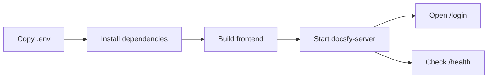

# Install and Run docsfy Without Docker

You want `docsfy` running straight from a local checkout so you can use the web app and CLI without a container. This setup is useful when you want a normal Python and Node workflow, faster frontend iteration, or direct access to the AI CLIs on your machine.

## Prerequisites

- A local clone of the repository, with your shell at the repo root
- Python `3.12` or newer
- `uv`
- Node.js and `npm`
- `git`
- One supported AI provider CLI installed and signed in on the same machine and as the same user that will run `docsfy-server`: `claude`, `gemini`, or `cursor`

## Quick Example

```bash
cp .env.example .env
```

```dotenv
ADMIN_KEY=change-this-to-a-16-plus-character-password
AI_PROVIDER=cursor
AI_MODEL=gpt-5.4-xhigh-fast
AI_CLI_TIMEOUT=60
LOG_LEVEL=INFO
DATA_DIR=data
SECURE_COOKIES=false
```

```bash
uv sync --frozen
cd frontend
npm ci
npm run build
cd ..
uv run docsfy-server
```

In another terminal:

```bash
curl http://localhost:8000/health
```

Then open `http://localhost:8000/login` and sign in with username `admin` and the same `ADMIN_KEY` value from `.env`.

> **Note:** `DATA_DIR=data` keeps the database and generated output in a writable local folder, and `SECURE_COOKIES=false` is required for browser login over plain `http://localhost`. If you plan to generate docs with `claude` or `gemini`, replace `AI_PROVIDER` and `AI_MODEL` before your first run.

## Step-by-Step

1. Install the Python environment.

```bash
uv sync --frozen
```

Run all `uv run ...` commands from the repo root after this so both `docsfy-server` and `docsfy` use the project environment.

2. Create a local `.env`.

```bash
cp .env.example .env
```

```dotenv
ADMIN_KEY=change-this-to-a-16-plus-character-password
AI_PROVIDER=cursor
AI_MODEL=gpt-5.4-xhigh-fast
AI_CLI_TIMEOUT=60
LOG_LEVEL=INFO
DATA_DIR=data
SECURE_COOKIES=false
```

| Put in `.env` | Set when you start the server |
| --- | --- |
| `ADMIN_KEY`, `AI_PROVIDER`, `AI_MODEL`, `AI_CLI_TIMEOUT`, `LOG_LEVEL`, `DATA_DIR`, `SECURE_COOKIES` | `HOST`, `PORT`, `DEBUG` |

- `ADMIN_KEY` is required and must be at least 16 characters long.
- `DATA_DIR=data` keeps local state in a writable project folder instead of a system path like `/data`.
- `SECURE_COOKIES=false` lets the browser keep the login session on `http://localhost`.
- Change `AI_PROVIDER` and `AI_MODEL` now if you are using `claude` or `gemini` instead of `cursor`.

See [Configuration Reference](configuration-reference.html) for every supported setting.

> **Note:** Start `docsfy-server` from the repo root so it picks up `.env`.

3. Build the browser UI that the server will serve.

```bash
cd frontend
npm ci
npm run build
cd ..
```

This creates the frontend files that `http://localhost:8000/` and `http://localhost:8000/login` need in a normal local run.

4. Start the server.

```bash
uv run docsfy-server
```

By default, the server listens on `127.0.0.1:8000`, so `http://localhost:8000` works locally.



> **Warning:** Before you start a generation, the selected provider CLI must already be installed, on `PATH`, and signed in for the same OS user that started `docsfy-server`.

5. Verify the server from the browser and the CLI.

```bash
curl http://localhost:8000/health
```

A successful response confirms the backend is up. After that, open `http://localhost:8000/login` and sign in as `admin` with the same `ADMIN_KEY`.

Set up the CLI once:

```bash
uv run docsfy config init
```

Use these values when prompted:

- Profile name: `dev`
- Server URL: `http://localhost:8000`
- Username: `admin`
- Password: the same value as `ADMIN_KEY`

Then verify the saved profile:

```bash
uv run docsfy health
```

> **Tip:** `docsfy config init` creates `~/.config/docsfy/config.toml` for you, so later CLI commands can keep using your local `http://localhost:8000` server without re-entering the connection details.

6. Start using the local server.

```bash
uv run docsfy list
```

If you have not generated anything yet, `No projects found.` is normal on a fresh install. See [Generating Documentation](generate-documentation.html) when you are ready to create your first docs site, and see [Managing docsfy from the CLI](manage-docsfy-from-the-cli.html) or [CLI Command Reference](cli-command-reference.html) for the next CLI steps.

## Advanced Usage

### Choose a built UI or a live-reload UI

| When you want | Backend | Frontend | Open |
| --- | --- | --- | --- |
| One local server that serves the built app | `uv run docsfy-server` | `cd frontend && npm ci && npm run build` | `http://localhost:8000` |
| Live frontend reload while you work on the UI | `DEBUG=true uv run docsfy-server` | `cd frontend && API_TARGET=http://localhost:8000 npm run dev` | `http://localhost:5173` |

```bash
DEBUG=true uv run docsfy-server
```

```bash
cd frontend
API_TARGET=http://localhost:8000 npm run dev
```

Open `http://localhost:5173`. The Vite dev server proxies `/api`, `/docs`, and `/health` to the backend on port `8000`.

> **Note:** The commented `DEV_MODE` line in `.env.example` is for the container entrypoint. For a direct local run, start the backend and Vite yourself.

### Change the bind address or port

```bash
HOST=0.0.0.0 PORT=9000 DEBUG=true uv run docsfy-server
```

Use this when you want another port, LAN access, or automatic backend reload during development.

### Tune local generation defaults

```dotenv
AI_PROVIDER=gemini
AI_MODEL=gemini-2.5-pro
AI_CLI_TIMEOUT=120
MAX_CONCURRENT_PAGES=4
```

Use these settings when you want a different default provider or model, a longer CLI timeout, or lower local parallelism on a smaller machine. See [Configuration Reference](configuration-reference.html) for the full list.

## Troubleshooting

- If `docsfy-server` exits immediately, make sure `ADMIN_KEY` is set and at least 16 characters long.
- If browser login keeps returning to `/login` on `http://localhost`, set `SECURE_COOKIES=false` in `.env`, then restart the server.
- If the browser says the frontend is not built, run `cd frontend && npm ci && npm run build`, then restart `uv run docsfy-server`.
- If you get permission errors under `/data`, point `DATA_DIR` at a writable local folder such as `data`.
- If a generation fails before it really starts, the selected `claude`, `gemini`, or `cursor` CLI is usually missing, signed out, or installed for a different user than the one running `docsfy-server`.
- If `uv run docsfy health` fails before connecting, finish `uv run docsfy config init` first so the CLI has a saved local profile.

See [Fixing Setup and Generation Problems](fix-setup-and-generation-problems.html) for deeper setup and runtime failures.

## Related Pages

- [Configuration Reference](configuration-reference.html)
- [Configuring AI Providers and Models](configure-ai-providers-and-models.html)
- [Generating Documentation](generate-documentation.html)
- [Managing docsfy from the CLI](manage-docsfy-from-the-cli.html)
- [Fixing Setup and Generation Problems](fix-setup-and-generation-problems.html)