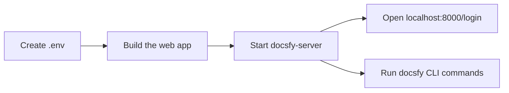

# Install and Run docsfy Without Docker

Use this guide to run `docsfy` directly from a local checkout instead of inside Docker. You will end with a local web app and CLI that both talk to the same server on your machine.

## Prerequisites

- A clone of the repository, with your shell opened at the repo root
- Python `3.12` or newer
- `uv`
- Node.js and `npm`
- `git`
- One supported AI provider CLI installed and authenticated on the same machine that will run `docsfy-server`

## Quick Example

```shell
cp .env.example .env
```

Use these values in `.env`:

```dotenv
ADMIN_KEY=change-this-to-a-16-plus-character-password
AI_PROVIDER=cursor
AI_MODEL=gpt-5.4-xhigh-fast
AI_CLI_TIMEOUT=60
LOG_LEVEL=INFO
DATA_DIR=.data
SECURE_COOKIES=false
```

```shell
uv sync --frozen

cd frontend
npm ci
npm run build
cd ..

uv run docsfy-server
```

In another terminal:

```shell
uv run docsfy --host localhost --port 8000 -u admin -p 'change-this-to-a-16-plus-character-password' health
```

Then open `http://localhost:8000/login` and sign in as `admin` with the same admin password.

> **Note:** This example uses a local `DATA_DIR` so you do not need a writable `/data` directory, and it sets `SECURE_COOKIES=false` so browser login works over plain `http://localhost`.

## Step-by-Step

1. Install the Python dependencies.

```shell
uv sync --frozen
```

Run `uv run ...` commands from the repo root after this so both `docsfy-server` and `docsfy` use the project environment.

2. Create your local `.env` file.

```shell
cp .env.example .env
```

Use these values in `.env`:

```dotenv
ADMIN_KEY=change-this-to-a-16-plus-character-password
AI_PROVIDER=cursor
AI_MODEL=gpt-5.4-xhigh-fast
AI_CLI_TIMEOUT=60
LOG_LEVEL=INFO
DATA_DIR=.data
SECURE_COOKIES=false
```

| Put in `.env` | Set when you start the server |
| --- | --- |
| `ADMIN_KEY`, `AI_PROVIDER`, `AI_MODEL`, `AI_CLI_TIMEOUT`, `LOG_LEVEL`, `DATA_DIR`, `SECURE_COOKIES` | `HOST`, `PORT`, `DEBUG` |

- `ADMIN_KEY` is required, and the server rejects values shorter than 16 characters.
- `DATA_DIR=.data` keeps the database and generated output in a writable local directory.
- `SECURE_COOKIES=false` is the right choice for plain local `http://` use.
- Change `AI_PROVIDER` and `AI_MODEL` now if your machine is set up for `claude` or `gemini` instead of `cursor`.

> **Note:** Start `docsfy-server` from this repo root so it picks up the `.env` file.

3. Build the web app that the server will serve.

```shell
cd frontend
npm ci
npm run build
cd ..
```

This builds the browser UI before the backend starts.

4. Start the server.

```shell
uv run docsfy-server
```

By default, this listens on `127.0.0.1:8000`, so `http://localhost:8000` works locally.



> **Warning:** When you later run generations, the selected provider CLI must already be installed and authenticated for the same machine and user account that started `docsfy-server`.

5. Configure the CLI once and verify the server.

```shell
uv run docsfy config init
```

Use these values when prompted:

- Profile name: `dev`
- Server URL: `http://localhost:8000`
- Username: `admin`
- Password: the same value as `ADMIN_KEY`

Then verify the connection:

```shell
uv run docsfy health
```

You should see the server URL and an `ok` status.

> **Tip:** `docsfy config init` writes `~/.config/docsfy/config.toml` with owner-only permissions automatically.

6. Sign in from the browser.

Open `http://localhost:8000/login`, then sign in as `admin` with the same admin password you used in `.env`.

See [CLI Command Reference](cli-command-reference.html) for details.

<details><summary>Advanced Usage</summary>

**Bind to another address or enable reload**

```shell
HOST=0.0.0.0 PORT=8000 DEBUG=true uv run docsfy-server
```

`HOST`, `PORT`, and `DEBUG` are read when `docsfy-server` starts, so set them in the shell or service manager that launches it.

**Run CLI commands without saving a profile**

```shell
uv run docsfy --host localhost --port 8000 -u admin -p 'change-this-to-a-16-plus-character-password' list
```

This is handy for one-off checks and scripts.

**Use Vite instead of a prebuilt frontend while iterating on the UI**

```shell
DEBUG=true uv run docsfy-server
```

```shell
cd frontend
API_TARGET=http://localhost:8000 npm run dev
```

Open `http://localhost:5173`. The commented `DEV_MODE` line in `.env.example` is for the container entrypoint, not for a direct `uv run docsfy-server` launch.

**Change the default provider, model, or CLI timeout**

```dotenv
AI_PROVIDER=gemini
AI_MODEL=gemini-2.5-pro
AI_CLI_TIMEOUT=120
```

Set these in `.env` when you want different defaults for new runs.

**Optional Mermaid rendering**

```shell
npm install -g @mermaid-js/mermaid-cli@11
```

If `mmdc` is on `PATH`, local renders can prerender Mermaid diagrams. On some Linux hosts you may also need Chromium and a Puppeteer config in `~/.puppeteerrc.json`.

</details>

## Troubleshooting

- If `docsfy-server` exits immediately, make sure `ADMIN_KEY` is set and at least 16 characters long.
- If browser sign-in keeps returning to `/login` on `http://localhost`, set `SECURE_COOKIES=false` in `.env`.
- If the UI says the frontend is not built, or static assets are missing, run `cd frontend && npm ci && npm run build`, then restart `uv run docsfy-server`.
- If you get permission errors under `/data`, point `DATA_DIR` at a writable directory such as `.data` or a folder under your home directory.
- If `uv run docsfy health` says no server is configured, run `uv run docsfy config init`, or pass `--host`, `--port`, `-u`, and `-p` for a one-off command.
- If a generation fails before it starts, install and authenticate the selected provider CLI on the same machine and for the same user that runs `docsfy-server`.

## Related Pages

- [Generate Your First Docs Site](generate-your-first-docs-site.html)
- [Configure AI Providers](configure-ai-providers.html)
- [Generate Documentation](generate-documentation.html)
- [Manage docsfy from the CLI](manage-docsfy-from-the-cli.html)
- [Configuration Reference](configuration-reference.html)