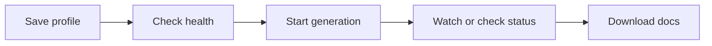

# Manage docsfy from the CLI

Use the CLI when you want to manage docsfy from a shell, script, or remote session instead of the browser. A saved server profile makes health checks, generations, status lookups, downloads, and admin tasks faster and easier to repeat.

## Prerequisites
- A running docsfy server you can reach
- The `docsfy` command available on your machine
- An API key for that server
- For the built-in admin account, the username is `admin`
- For generation, a server that already has a working AI provider configured

## Quick Example
```shell
docsfy config init
docsfy health
docsfy generate https://github.com/org/my-repo.git --watch
docsfy status my-repo
docsfy download my-repo
```

In this flow, `my-repo` is the project name derived from the Git URL. `download` fetches the newest ready variant you can access.



## Step-by-Step
1. Save a reusable server profile.

```shell
docsfy config init
docsfy config show
```

When `docsfy config init` asks for `Password`, enter your API key.

A saved profile looks like this:

```toml
[default]
server = "dev"

[servers.dev]
url = "http://localhost:8000"
username = "admin"
password = "<your-dev-key>"
```

The first profile you create becomes the default server. Later profiles are added without changing the existing default.

> **Note:** The CLI stores profiles in `~/.config/docsfy/config.toml`, masks saved passwords in `docsfy config show`, and writes the file with owner-only permissions.

2. Confirm that the CLI can reach the right server.

```shell
docsfy health
```

A healthy server returns a short result like this:

```text
Server: http://localhost:8000
Status: ok
```

Run this first whenever you switch profiles or change environments.

3. Start a generation from a Git remote.

```shell
docsfy generate https://github.com/org/my-repo.git --watch
```

Use a normal HTTPS or SSH Git URL. If you omit `--branch`, docsfy uses `main`. If you omit `--provider` and `--model`, the server uses its current defaults.

Later CLI commands use the repository name, so `https://github.com/org/my-repo.git` becomes `my-repo`.

> **Warning:** `docsfy generate` takes a Git URL, not a local filesystem path.

> **Warning:** Branch names cannot contain `/`. Use names like `release-1.x`, not `release/1.x`.

If you want to generate another branch or model on purpose, see [Regenerate for New Branches and Models](regenerate-for-new-branches-and-models.html).

4. Check what is running and inspect the result.

```shell
docsfy list
docsfy status my-repo
```

`list` gives you a table of accessible variants. Each row is one variant, so the same project can appear more than once.

`status` shows the details for one project, including the owner, current status, page count, last update time, short commit, current stage, and any error message.

If you want one exact variant instead of every variant for the project, pass all three selectors together:

```shell
docsfy status my-repo --branch main --provider cursor --model gpt-5.4-xhigh-fast
```

For the full meaning of statuses and stages, see [Track Generation Progress](track-generation-progress.html).

5. Download the finished site.

```shell
docsfy download my-repo
```

This saves the newest ready variant you can access as a `.tar.gz` file in your current directory.

If you want to unpack it immediately instead:

```shell
docsfy download my-repo --output ./site
```

> **Tip:** Use exact selectors when you need one specific variant instead of the latest ready one.

See [CLI Command Reference](cli-command-reference.html) for the full syntax and every flag.

<details><summary>Advanced Usage</summary>

### Switch servers or override a saved profile

```shell
docsfy config set default.server prod
docsfy --host myhost --port 9000 -u admin -p <your-api-key> health
```

Use saved profiles for everyday work, and one-off flags when you need to hit a different host without changing `~/.config/docsfy/config.toml`.

| If `-p` appears... | It means... |
| --- | --- |
| Before the subcommand, like `docsfy -p <your-api-key> health` | API key/password |
| After `status`, `delete`, `abort`, or `download`, like `docsfy status my-repo -p cursor` | AI provider |

> **Tip:** Global connection flags go before the subcommand.

### Discover providers and models

```shell
docsfy models
docsfy models --provider cursor
docsfy models --json
```

Use `models` when you want to see the server defaults and the model names the server already knows about.

### Work with exact variants, aborts, and deletes

```shell
docsfy abort my-repo
docsfy abort my-repo --branch main --provider cursor --model gpt-5.4-xhigh-fast
docsfy delete my-repo --branch main --provider cursor --model gpt-5.4-xhigh-fast --yes
docsfy delete my-repo --all --yes
```

Use the project-only `abort` form when there is just one active run for that project. If more than one variant is running, rerun the command with `--branch`, `--provider`, and `--model`.

The same exact selector pattern is useful for downloads too:

```shell
docsfy download my-repo --branch main --provider cursor --model gpt-5.4-xhigh-fast --output ./site
```

> **Note:** When you use `--output`, docsfy extracts the archive into a subdirectory inside the target directory.

> **Warning:** Use either `--all` or an exact variant selector with `delete`, not both.

### Use `--owner` when you are an admin

```shell
docsfy status shared-name --branch main --provider claude --model opus --owner alice
docsfy download shared-name --branch main --provider claude --model opus --owner alice
```

`--owner` is mainly for admins who need one specific copy of a project or variant when the same project name exists under multiple owners.

### Run admin tasks

```shell
docsfy admin users list
docsfy admin users create newuser --role user
docsfy admin users rotate-key newuser
docsfy admin access grant my-repo --username newuser --owner admin
docsfy admin access list my-repo --owner admin
docsfy admin access revoke my-repo --username newuser --owner admin
```

Valid roles are `admin`, `user`, and `viewer`. New and rotated API keys are shown once, so save them immediately. Generated keys use the `docsfy_...` format.

Access grants are project-wide for one owner, so granting access to `my-repo` also grants access to that owner's variants of the project.

If you rotate a key for a saved profile, update the profile too:

```shell
docsfy config set servers.dev.password <new-api-key>
```

> **Note:** `viewer` accounts can list, inspect, and download docs they can access, but they cannot generate, abort, or delete.

> **Warning:** The username `admin` is reserved, custom keys must be at least 16 characters long, you cannot delete your own account, and a user cannot be deleted while they still have an active generation.

### Use JSON output for scripts

```shell
docsfy list --json
docsfy status my-repo --json
docsfy admin users list --json
```

Use `--json` when you want stable output for automation instead of the default tables and detail blocks.

</details>

## Troubleshooting
- `No server configured`: run `docsfy config init`, or pass `--host`, `--username`, and `--password` before the subcommand.
- `Server unreachable` or a redirect error: check the saved URL, host, and port with `docsfy config show` and `docsfy health`.
- `Write access required`: you authenticated as a `viewer`; use a `user` or `admin` account for `generate`, `abort`, and `delete`.
- `Variant not ready`: wait until `docsfy status my-repo` shows a ready variant, then download again.
- `Multiple active variants found` or `Multiple owners found`: rerun the command with `--branch`, `--provider`, and `--model`; if you are an admin and need one owner's copy, add `--owner`.
- `Invalid branch name`: rename the branch argument to something like `release-1.x`.
- A Git URL to `localhost` or another private network host is rejected: use a remote the server can reach.

## Related Pages

- [CLI Command Reference](cli-command-reference.html)
- [Configuration Reference](configuration-reference.html)
- [Generate Documentation](generate-documentation.html)
- [Track Generation Progress](track-generation-progress.html)
- [View, Download, and Publish Docs](view-download-and-publish-docs.html)