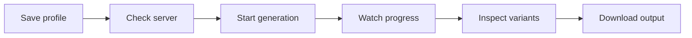

# Managing docsfy from the CLI

Run docsfy from a terminal when you want to save a profile, start a docs run, watch it finish, and fetch the result without opening the web app. That keeps repeat work fast in remote shells, local terminals, and simple scripts.

## Prerequisites
- A running docsfy server you can reach
- The `docsfy` command installed on your machine. If you still need local setup, see [Install and Run docsfy Without Docker](install-and-run-docsfy-without-docker.html).
- An API key for that server
- A `user` or `admin` key if you want to run `generate`, `abort`, or `delete`
- A Git repository URL the server can reach

## Quick Example
```shell
docsfy config init
docsfy health
docsfy generate https://github.com/myk-org/for-testing-only --watch
docsfy status for-testing-only
docsfy download for-testing-only --output ./site
```

Replace `https://github.com/myk-org/for-testing-only` with the repository you want to document. The rest of the flow stays the same.



## Step-by-step
1. Save a reusable profile.

```shell
docsfy config init
docsfy config show
```

When `docsfy config init` asks for `Password`, enter your API key. For the built-in admin account, the username is `admin`.

```toml
[default]
server = "dev"

[servers.dev]
url = "http://localhost:8000"
username = "admin"
password = "<your-dev-key>"
```

The first profile you create becomes the default. Later profiles are added without changing that default automatically.

> **Note:** Profiles live in `~/.config/docsfy/config.toml`. `docsfy config show` masks the saved key, but the file stores the full value, so keep it private. See [Configuration Reference](configuration-reference.html) for the full profile format.

2. Confirm that the CLI is pointing at the right server.

```shell
docsfy health
```

A working connection prints the server URL and `Status: ok`. Run this first whenever you switch environments or update a profile.

3. Start a generation and watch it live.

```shell
docsfy generate https://github.com/myk-org/for-testing-only --watch
```

Use an HTTPS or SSH Git URL. If you omit `--branch`, docsfy uses `main`. If you omit `--provider` and `--model`, the server uses its current defaults.

Later commands use the repository name from the URL, with any `.git` suffix removed, so this repository becomes `for-testing-only`.

```text
Project: for-testing-only
Branch: main
Status: generating
Generation ID: <GENERATION_ID>
Watching generation progress...
[generating] cloning
[generating] planning
[generating] generating_pages (3 pages)
Generation complete! (9 pages)
```

Save the generation ID if you want an exact handle for later commands. The exact stage list and page counts vary by run. See [Tracking Generation Progress](track-generation-progress.html) for the meaning of each stage.

> **Tip:** If you want `--watch` to follow one exact variant from the start, run `docsfy models` first and pass both `--provider` and `--model` to `docsfy generate`.


> **Warning:** `docsfy generate` accepts a remote Git URL, not a local path. Branch names cannot contain `/`, so use `release-1.x` instead of `release/1.x`.

4. Inspect the variants you can access.

```shell
docsfy list
docsfy status for-testing-only
docsfy status <GENERATION_ID>
```

`docsfy list` prints one row per variant, including `NAME`, `BRANCH`, `PROVIDER`, `MODEL`, `STATUS`, `OWNER`, `PAGES`, and `GEN ID`. `docsfy status` shows the fuller detail view, including stage, last update time, short commit, and any error message.

> **Tip:** Use the generation ID from `docsfy generate` or `docsfy list` when you want the exact variant without retyping branch, provider, and model.

5. Download the finished output.

```shell
docsfy download for-testing-only
docsfy download <GENERATION_ID> --output ./site
```

| Command | What you get |
| --- | --- |
| `docsfy download for-testing-only` | A `.tar.gz` archive for the latest ready variant you can access, saved in your current directory. |
| `docsfy download <GENERATION_ID> --output ./site` | One exact variant, downloaded and extracted directly into `./site`. |

Without `--output`, the archive name is `<project>-docs.tar.gz`. With `--output`, docsfy creates the target directory if needed and extracts the archive there.

## Advanced Usage
### Switch profiles or override them for one command

```shell
docsfy config set default.server prod
docsfy --server prod health
docsfy --host docsfy.example.com --port 443 -u admin -p <API_KEY> health
```

Use `--server` when you already saved multiple profiles. Use `--host`, `--port`, `-u`, and `-p` before the subcommand when you need a one-off connection without changing the saved file.

| Command | Meaning of `-p` |
| --- | --- |
| `docsfy --server prod -p <API_KEY> health` | API key/password, because it appears before the subcommand. |
| `docsfy status for-testing-only -p cursor` | AI provider, because it appears after `status`. |

> **Tip:** Put global connection flags before the subcommand.

### Pick an exact provider, model, or branch

```shell
docsfy models
docsfy models --provider cursor
docsfy generate https://github.com/myk-org/for-testing-only --branch dev --force
docsfy status for-testing-only --branch main --provider cursor --model gpt-5.4-xhigh-fast
docsfy download for-testing-only --branch main --provider cursor --model gpt-5.4-xhigh-fast --output ./site
```

Use `docsfy models` to see the current default provider and model, plus model names the server already knows about. A provider can show `(no models used yet)` until a ready variant has been generated with it.

Replace `cursor` and `gpt-5.4-xhigh-fast` with the values your server reports. Use `--force` when you want a full rebuild instead of reusing existing artifacts.

If you intentionally keep separate outputs for other branches or models, see [Regenerating for New Branches and Models](regenerate-for-new-branches-and-models.html).

### Stop or clean up runs

```shell
docsfy abort for-testing-only
docsfy abort <GENERATION_ID>
docsfy delete <GENERATION_ID> --yes
docsfy delete for-testing-only --all --yes
```

Project-level `abort` is convenient when only one active variant matches that project name. Use a generation ID when more than one run might be active, or when you want copy-paste-safe cleanup.

`docsfy delete ... --all --yes` removes every variant of that project that belongs to you. If you only want one variant, delete by generation ID instead.

### Use JSON output for scripts

```shell
docsfy list --status ready --json
docsfy status for-testing-only --json
docsfy models --provider cursor --json
```

These commands return JSON instead of table or plain-text output, which is easier to pipe into your own scripts. See [CLI Command Reference](cli-command-reference.html) for the full flag list.

### Disambiguate same-name projects as an admin

```shell
docsfy status shared-name --branch main --provider claude --model opus --owner alice
docsfy download shared-name --branch main --provider claude --model opus --owner alice --output ./site
```

Use `--owner` only with fully specified variant commands. It helps when the same project name exists under more than one owner and you need one exact copy.

## Troubleshooting
- `No server configured`: run `docsfy config init`, or pass `--host`, `--port`, `-u`, and `-p` before the subcommand.
- `Server unreachable` or a redirect error: check the saved URL with `docsfy config show`, then rerun `docsfy health`.
- `Write access required`: the API key belongs to a `viewer`; use a `user` or `admin` account for `generate`, `abort`, and `delete`.
- `Invalid branch name`: branch names cannot contain `/`; use `release-1.x` instead.
- A project name points to more than one possible variant, or a run is already active: run `docsfy list`, then retry with the generation ID or a fully specified variant selector.
- `Variant not ready`: wait until `docsfy status ...` shows `ready`, then download again.
- A repository URL that points to `localhost` or another private-network host is rejected: use a remote the server can reach.

See [Fixing Setup and Generation Problems](fix-setup-and-generation-problems.html) for broader setup and generation failures.

## Related Pages

- [CLI Command Reference](cli-command-reference.html)
- [Install and Run docsfy Without Docker](install-and-run-docsfy-without-docker.html)
- [Configuration Reference](configuration-reference.html)
- [Tracking Generation Progress](track-generation-progress.html)
- [Viewing and Downloading Docs](view-and-download-docs.html)