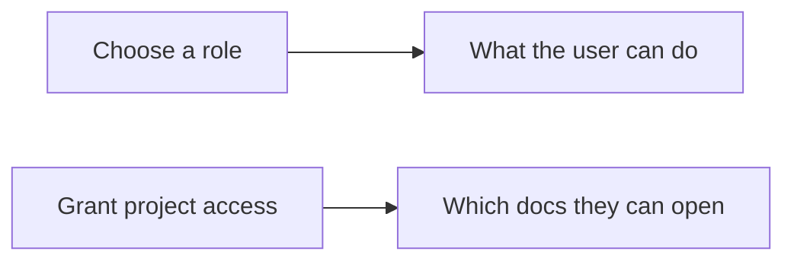

# Managing Users and Access

Use this page when you need to onboard teammates, give them the smallest role that still lets them work, and share only the docs they should see. That keeps readers out of generation and admin workflows while still letting writers and admins do their jobs.

## Prerequisites

- An `admin` account. The built-in admin signs in as `admin`.
- If you use the CLI, a working profile or one-off connection flags. See [Managing docsfy from the CLI](manage-docsfy-from-the-cli.html) for details.
- A project that already exists before you try to share it. See [Generating Documentation](generate-documentation.html) for details.

## Quick Example

```shell
docsfy admin users create alice --role viewer
docsfy admin access grant my-repo --username alice --owner admin
docsfy admin access list my-repo --owner admin
```

This creates a read-only teammate, shares `admin`'s `my-repo` project with them, and confirms the grant. The password docsfy prints is the same secret the user will use to sign in on the web and authenticate from the CLI.

## Step-by-Step

1. Pick the role before you create the account.

| Role | Best for | Can generate, abort, or delete docs? | Can manage users and access? |
| --- | --- | --- | --- |
| `admin` | Platform owners and delegated admins | Yes | Yes |
| `user` | Teammates who generate and maintain their own docs | Yes, for their own projects | No |
| `viewer` | Read-only readers | No | No |

Role controls what someone can do. Project access controls which docs they can see.



> **Tip:** Start with `viewer` unless the person needs to generate or delete docs.

2. Create the user.

```shell
docsfy admin users create alice --role viewer
docsfy admin users list
```

Usernames must be 2-50 characters and use letters, numbers, dots, hyphens, or underscores. The name `admin` is reserved.

docsfy shows the generated password once and does not show it again later. If you prefer the browser, admins can create accounts from the `Users` screen.

> **Warning:** Save the password before you dismiss the output or dialog, then share it over a secure channel.

3. Grant access to the project the user should see.

```shell
docsfy admin access grant my-repo --username alice --owner admin
docsfy admin access list my-repo --owner admin
```

Use the real project owner in `--owner`. That matters whenever more than one person has a project with the same name.

| Grant | What the user gets |
| --- | --- |
| `my-repo` with `--owner admin` | All variants of `my-repo` owned by `admin`, across branches and provider/model combinations |
| `my-repo` with `--owner alice` | Only Alice's copy of `my-repo`, not anyone else's |

Shared access does not transfer ownership. Non-admin users can open and download shared docs, but they still cannot delete or administer someone else's project.

After the grant, the shared project appears alongside the user's own projects. See [Viewing and Downloading Docs](view-and-download-docs.html) for the read-only workflow.

4. Rotate a password when access changes.

```shell
docsfy admin users rotate-key alice
docsfy admin users rotate-key alice --new-key "alice-2026-password-rotate"
```

Use the first form when you want docsfy to generate a fresh password for you. Use `--new-key` only when you need a planned replacement, and make sure it is at least 16 characters long.

Rotation invalidates the old password immediately and signs the user out of their current sessions. After you hand off the new password, the user signs in again with that value.

Named users, including `viewer` accounts and created `admin` accounts, can also use `Change Password` in the dashboard sidebar for self-service rotation. The built-in `admin` account is the exception; change `ADMIN_KEY` for that account instead.

5. Revoke one project or remove the user completely.

```shell
docsfy admin access revoke my-repo --username alice --owner admin
docsfy admin users delete alice --yes
```

| If you want to... | Use |
| --- | --- |
| Keep the account but hide one project's docs | `docsfy admin access revoke ...` |
| Remove the account and all of its access | `docsfy admin users delete ... --yes` |

Revoking access removes only that one owner's project from the user's view. Deleting a user removes the account, ends their sessions, removes their access grants, and removes projects they owned.

## Advanced Usage

### Same project name, different owners

```shell
docsfy admin access grant shared-name --username alice --owner team-a
docsfy admin access grant shared-name --username alice --owner team-b
```

These are two separate grants. docsfy shares access by project name plus owner, not by one specific branch or model.

If two owners each have a `shared-name` project, grant only the owner you actually want to expose. Add the second grant only when the user should see both copies.

### Built-in admin and created admin accounts behave differently

| Account type | Sign in as | Can use admin tools? | Can change its own password from the dashboard? |
| --- | --- | --- | --- |
| Built-in admin | `admin` | Yes | No |
| Created admin user | Their own username | Yes | Yes |

Use a created `admin` account when you want a named administrator with their own rotatable password. Use the built-in `admin` account for initial setup or recovery.

### Rotate the built-in admin password carefully

```dotenv
ADMIN_KEY=<NEW_ADMIN_KEY>
```

Use a value at least 16 characters long, change it in your deployment environment or `.env`, then restart docsfy. See [Configuration Reference](configuration-reference.html) for the setting itself.

> **Warning:** Changing `ADMIN_KEY` does more than rotate the built-in `admin` login. Previously issued passwords for created users stop working too, so plan a coordinated rotation and hand out replacement passwords right away.

## Troubleshooting

- `No server configured`: run `docsfy config init`, or use `--host`, `--port`, `-u`, and `-p` before the subcommand. See [Managing docsfy from the CLI](manage-docsfy-from-the-cli.html) for details.
- `Project not found` when granting access: generate the project first, and make sure `--owner` matches the account that owns it. See [Generating Documentation](generate-documentation.html) for details.
- `Write access required`: the account is `viewer`, which is read-only by design. Use `user` or `admin` for generation and deletion tasks.
- `Cannot delete your own account`: sign in as a different admin to remove that user.
- `Cannot delete user while generation is in progress`: wait for the run to finish, or stop it first. See [Tracking Generation Progress](track-generation-progress.html) for details.
- Sent back to the login page right after a password change: that is expected. Sign in again with the new password.
- The built-in `admin` account cannot change its own password from the dashboard: change `ADMIN_KEY` instead. See [Configuration Reference](configuration-reference.html) for details.

## Related Pages

- [Managing docsfy from the CLI](manage-docsfy-from-the-cli.html)
- [CLI Command Reference](cli-command-reference.html)
- [Generating Documentation](generate-documentation.html)
- [Viewing and Downloading Docs](view-and-download-docs.html)
- [HTTP API and WebSocket Reference](http-api-and-websocket-reference.html)