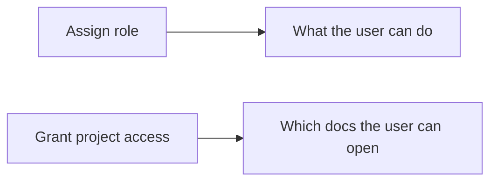

# Manage Users, Roles, and Access

Use this page to add teammates, give them the right level of access, rotate passwords when access changes, and share only the docs each person should see. This lets readers open finished docs without giving everyone permission to generate, delete, or administer projects.

## Prerequisites

- An admin account. Use the built-in `admin` account or a user you created with the `admin` role.
- If you want to use the CLI, set it up once with `docsfy config init`. See [Manage docsfy from the CLI](manage-docsfy-from-the-cli.html).
- The project you want to share must already exist. See [Generate Documentation](generate-documentation.html).

## Quick example

```bash
docsfy admin users create alice --role viewer
docsfy admin access grant my-repo --username alice --owner admin
docsfy admin access list my-repo --owner admin
```

This creates a read-only account, shares the `my-repo` docs owned by `admin`, and confirms the grant. Replace `admin` in `--owner admin` with the username that owns the project in your deployment.

## Step-by-step

1. Choose the role first.

| Role | Use it for | Can generate, delete, or abort docs? | Can manage users and access? |
| --- | --- | --- | --- |
| `admin` | People who administer docsfy | Yes | Yes |
| `user` | People who create and manage their own docs | Yes | No |
| `viewer` | People who only need to read docs | No | No |

Role controls what someone can do. Project access controls which docs they can see.



> **Tip:** If someone only needs to read generated docs, start with `viewer`.

2. Create the user.

```bash
docsfy admin users create alice --role viewer
docsfy admin users list
```

Run this as an admin. docsfy shows the generated password once, so save it and share it securely with the user.

> **Warning:** Save the generated password immediately. docsfy does not show it again after creation.

Admins can also create users from the dashboard's `Users` section.

> **Note:** The same secret is used as the dashboard password and the CLI password/API key.

3. Grant access to the project.

```bash
docsfy admin access grant my-repo --username alice --owner admin
docsfy admin access list my-repo --owner admin
```

Use the project owner's username in `--owner`. This matters when more than one person has docs for a project with the same name.

> **Tip:** One access grant covers every branch and every provider/model variant for that owner's project.

After the grant, the user can sign in and open the shared project from the dashboard. See [View, Download, and Publish Docs](view-download-and-publish-docs.html) for opening exact variants or downloading a shared site.

4. Rotate passwords when access changes.

```bash
docsfy admin users rotate-key alice
```

Use this when a password is lost, a person changes teams, or you want to replace a temporary password. docsfy returns the new password immediately, invalidates the old one, and ends the user's current sessions.

Created users can also change their own password from the dashboard sidebar with `Change Password`. After a self-service change, they must sign in again with the new password. Admins can also rotate another user's password from the dashboard's `Users` section.

5. Remove access or remove the user.

```bash
docsfy admin access revoke my-repo --username alice --owner admin
docsfy admin users delete alice --yes
```

Use revoke when the person should keep their account but stop seeing one project's docs. Use delete when the account should be removed entirely.

| If you want to... | Use |
| --- | --- |
| Keep the account but hide one project's docs | `docsfy admin access revoke ...` |
| Remove the account and its access grants | `docsfy admin users delete ... --yes` |

Revoking access removes that project's docs from the user's view. Deleting the user removes the account itself.

<details><summary>Advanced Usage</summary>

Use a specific replacement password instead of an auto-generated one:

```bash
docsfy admin users rotate-key alice --new-key "my-very-secure-password-123"
```

Custom passwords must be at least 16 characters long.

You can also run admin commands without saving a CLI profile:

```bash
docsfy --host localhost --port 8000 -u admin -p "<ADMIN_KEY>" admin users list
```

Two admin account types behave slightly differently:

| Admin type | Sign-in name | Can use admin tools? | Can change its own password from the dashboard? |
| --- | --- | --- | --- |
| Built-in admin | `admin` | Yes | No |
| Admin user you created | Their username | Yes | Yes |

> **Warning:** If you change `ADMIN_KEY`, previously issued passwords for created users stop working. Plan to rotate those passwords too.

Deleting a user is a full cleanup step. It removes the account, ends that user's sessions, removes their access grants, and removes projects they owned.

> **Warning:** You cannot create a user named `admin`, and the currently signed-in admin cannot delete their own account.

</details>

## Troubleshooting

- `No server configured`: run `docsfy config init`, or use `--host`, `--port`, `-u`, and `-p` for a one-off command. See [Manage docsfy from the CLI](manage-docsfy-from-the-cli.html).
- `Project not found` when granting access: make sure the project has already been generated and that `--owner` matches the account that owns it. See [Generate Documentation](generate-documentation.html).
- A `viewer` cannot generate or delete docs: that is expected. Create a `user` instead if they need write access.
- The built-in `admin` account cannot change its own password from the dashboard: change the server's `ADMIN_KEY`, then sign in again.
- Deleting a user fails while they have a generation in progress: wait for the run to finish, or stop it first. See [Track Generation Progress](track-generation-progress.html).
- A user is sent back to the login page right after a password change: that is expected. Sign in again with the new password.

## Related Pages

- [Manage docsfy from the CLI](manage-docsfy-from-the-cli.html)
- [View, Download, and Publish Docs](view-download-and-publish-docs.html)
- [HTTP API Reference](http-api-reference.html)
- [WebSocket Reference](websocket-reference.html)
- [Generate Documentation](generate-documentation.html)