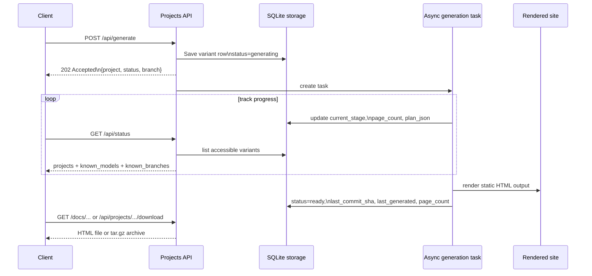

# Projects API

Docsfy treats every generated docs set as a **variant**, not a single flat "project" row. The Projects API is how you list accessible variants, start new generations, inspect one exact variant, abort work in progress, delete stored output, download archives, and serve the rendered docs site.

A variant is identified by five values: `name`, `branch`, `ai_provider`, `ai_model`, and `owner`.

```63:79:src/docsfy/storage.py
CREATE TABLE IF NOT EXISTS projects (
    name TEXT NOT NULL,
    branch TEXT NOT NULL DEFAULT 'main',
    ai_provider TEXT NOT NULL DEFAULT '',
    ai_model TEXT NOT NULL DEFAULT '',
    owner TEXT NOT NULL DEFAULT '',
    repo_url TEXT NOT NULL,
    status TEXT NOT NULL DEFAULT 'generating',
    current_stage TEXT,
    last_commit_sha TEXT,
    last_generated TEXT,
    page_count INTEGER DEFAULT 0,
    error_message TEXT,
    plan_json TEXT,
    created_at TIMESTAMP DEFAULT CURRENT_TIMESTAMP,
    updated_at TIMESTAMP DEFAULT CURRENT_TIMESTAMP,
    PRIMARY KEY (name, branch, ai_provider, ai_model, owner)
)
```

`owner` is part of the stored identity, but it is **not** part of the main URL path. That is why exact variant routes sometimes need `?owner=<username>` for admin disambiguation.

> **Note:** docsfy does not publish Swagger or an OpenAPI JSON document. The routes below are the API reference.

## Quick Route Map

| What you want to do | Method and path |
| --- | --- |
| List all accessible variants | `GET /api/status` |
| Same as above | `GET /api/projects` |
| List all accessible variants for one project name | `GET /api/projects/{name}` |
| Get one exact variant | `GET /api/projects/{name}/{branch}/{provider}/{model}` |
| Start a generation | `POST /api/generate` |
| Abort a project when only one active variant matches | `POST /api/projects/{name}/abort` |
| Abort one exact variant | `POST /api/projects/{name}/{branch}/{provider}/{model}/abort` |
| Delete one exact variant | `DELETE /api/projects/{name}/{branch}/{provider}/{model}` |
| Delete all variants for one owner-scoped project | `DELETE /api/projects/{name}` |
| Download one exact variant as `tar.gz` | `GET /api/projects/{name}/{branch}/{provider}/{model}/download` |
| Download the latest ready variant | `GET /api/projects/{name}/download` |
| Serve one exact rendered site file | `GET /docs/{project}/{branch}/{provider}/{model}/{path:path}` |
| Serve a file from the latest ready rendered site | `GET /docs/{project}/{path:path}` |

These two list routes are aliases of the same handler:

```1152:1159:src/docsfy/api/projects.py
@router.get("/status")
@router.get("/projects")
async def status(request: Request) -> dict[str, Any]:
    return await build_projects_payload(request.state.username, request.state.is_admin)

@router.get("/projects/{name}")
async def get_project_details(request: Request, name: str) -> dict[str, Any]:
```

## Authentication, Roles, and Owner Scoping

All `/api/*` and `/docs/*` routes require authentication. In practice, you usually use one of these:

- A Bearer token for scripts and CLI usage
- A `docsfy_session` cookie for browser usage

If you use the CLI, the checked-in example config looks like this:

```7:25:config.toml.example
[default]
server = "dev"

[servers.dev]
url = "http://localhost:8000"
username = "admin"
password = "<your-dev-key>"

[servers.prod]
url = "https://docsfy.example.com"
username = "admin"
password = "<your-prod-key>"

[servers.staging]
url = "https://staging.docsfy.example.com"
username = "deployer"
password = "<your-staging-key>"
```

With a profile like this, the CLI commands `docsfy generate`, `docsfy status`, `docsfy abort`, `docsfy delete`, and `docsfy download` call the same HTTP routes documented here.

Role behavior is important:

| Role | Can list / look up / view / download? | Can generate? | Can abort or delete? | Owner behavior |
| --- | --- | --- | --- | --- |
| `viewer` | Yes, for accessible variants | No | No | `?owner=` does not grant extra access |
| `user` | Yes, for owned variants and explicitly shared variants | Yes, for their own variants | Yes, for their own active runs and owned variants | `?owner=` is ignored on exact lookup routes |
| `admin` | Yes, across all owners | Yes | Yes | Use `?owner=<username>` on exact variant routes when needed |

Shared access is granted separately under the admin API. Once a project is shared, a non-admin user can list it, open its docs, and download it, but they still cannot delete another owner's data or abort another owner's active run. See [User and Access Management](user-and-access-management.md) for the sharing endpoints.

Access grants are owner-scoped, not global to a repository name:

```258:263:src/docsfy/storage.py
CREATE TABLE IF NOT EXISTS project_access (
    project_name TEXT NOT NULL,
    project_owner TEXT NOT NULL DEFAULT '',
    username TEXT NOT NULL,
    PRIMARY KEY (project_name, project_owner, username)
)
```

> **Note:** For browser requests to `/docs/*`, unauthenticated HTML requests are redirected to `/login`. API-style requests get `401 Unauthorized`.

> **Warning:** For exact variant routes, `?owner=` is an **admin disambiguation tool**, not a general-purpose access override. If you are not an admin, docsfy resolves the variant from your own account and your granted access only.

## Branches, Providers, and Defaults

Branch is part of the variant identity and part of the URL. `main` and `dev` are different variants even when everything else is identical.

Docsfy validates the generation request body like this:

```18:58:src/docsfy/models.py
class GenerateRequest(BaseModel):
    repo_url: str | None = Field(
        default=None, description="Git repository URL (HTTPS or SSH)"
    )
    repo_path: str | None = Field(default=None, description="Local git repository path")
    ai_provider: Literal["claude", "gemini", "cursor"] | None = None
    ai_model: str | None = None
    ai_cli_timeout: int | None = Field(default=None, gt=0)
    force: bool = Field(
        default=False, description="Force full regeneration, ignoring cache"
    )
    branch: str = Field(
        default=DEFAULT_BRANCH, description="Git branch to generate docs from"
    )

    @field_validator("branch")
    @classmethod
    def validate_branch(cls, v: str) -> str:
        if "/" in v:
            msg = (
                f"Invalid branch name: '{v}'. Branch names cannot contain slashes "
                "— use hyphens instead (e.g., release-1.x)."
            )
            raise ValueError(msg)
        if not re.match(r"^[a-zA-Z0-9][a-zA-Z0-9._-]*$", v):
            msg = f"Invalid branch name: '{v}'"
            raise ValueError(msg)
        if ".." in v:
            msg = f"Invalid branch name: '{v}'"
            raise ValueError(msg)
        return v

    @model_validator(mode="after")
    def validate_source(self) -> GenerateRequest:
        if not self.repo_url and not self.repo_path:
            msg = "Either 'repo_url' or 'repo_path' must be provided"
            raise ValueError(msg)
        if self.repo_url and self.repo_path:
            msg = "Provide either 'repo_url' or 'repo_path', not both"
            raise ValueError(msg)
        return self
```

In practice:

- Omit `branch` and docsfy uses `main`
- Good branch names include `main`, `dev`, `release-1.x`, and `v2.0.1`
- Slash-based branch names like `release/v2.0` are rejected
- `repo_url` and `repo_path` are mutually exclusive
- `repo_path` is for admin-only local generation workflows

The server also has real defaults for provider, model, timeout, and data directory:

```16:22:src/docsfy/config.py
    admin_key: str = ""  # Required — validated at startup
    ai_provider: str = "cursor"
    ai_model: str = "gpt-5.4-xhigh-fast"
    ai_cli_timeout: int = Field(default=60, gt=0)
    log_level: str = "INFO"
    data_dir: str = "/data"
    secure_cookies: bool = True  # Set to False for local HTTP dev
```

> **Warning:** The branch lives in the URL path, so it must be a single safe path segment. If your Git workflow uses slash-based branch names, use a hyphenated variant such as `release-1.x` when generating docs with docsfy.

## List Projects and Variants

Use `GET /api/status` or `GET /api/projects` when you want the dashboard-style view of everything you can access.

The response shape used by the frontend is:

```5:20:frontend/src/types/index.ts
export interface Project {
  name: string
  branch: string
  ai_provider: string
  ai_model: string
  owner: string
  repo_url: string
  status: ProjectStatus
  current_stage: string | null
  last_commit_sha: string | null
  last_generated: string | null
  page_count: number
  error_message: string | null
  plan_json: string | null
  created_at: string
  updated_at: string
}
```

```64:68:frontend/src/types/index.ts
export interface ProjectsResponse {
  projects: Project[]
  known_models: Record<string, string[]>
  known_branches: Record<string, string[]>
}
```

This endpoint is useful for polling because it returns:

- `projects`: a flat list of accessible variants
- `known_models`: model suggestions grouped by provider
- `known_branches`: branch suggestions grouped by project name

A few details matter:

- `projects` includes every accessible variant, not just `ready` ones
- `known_models` and `known_branches` are built from successful `ready` variants, so they behave like suggestions rather than a full history
- Non-admin users see owned variants plus explicitly shared variants
- Admins see all owners' variants

If you want all visible variants for one repository name, use `GET /api/projects/{name}`. That returns:

- `name`
- `variants`: every accessible variant for that project name

If you want one exact variant, use `GET /api/projects/{name}/{branch}/{provider}/{model}`.

> **Tip:** Use `/api/status` when you are building a dashboard, poller, or "watch until ready" script. Use `/api/projects/{name}/{branch}/{provider}/{model}` when you need one exact row and you already know the coordinates.

### Status and Stage Fields

`status` is one of:

- `generating`
- `ready`
- `error`
- `aborted`

While generation is running, `current_stage` can move through these UI-visible stages:

```26:34:frontend/src/lib/constants.ts
export const GENERATION_STAGES = [
  'cloning',
  'planning',
  'incremental_planning',
  'generating_pages',
  'validating',
  'cross_linking',
  'rendering',
] as const
```

A `ready` variant may also keep `current_stage = up_to_date` when docsfy determines that the current output already matches the target commit and no regeneration is needed.

## Start a Generation

`POST /api/generate` queues a generation and returns immediately with `202 Accepted`. The work happens asynchronously.

The frontend sends this request body when a user clicks **Generate**:

```158:164:frontend/src/components/shared/GenerateForm.tsx
await api.post('/api/generate', {
  repo_url: submittedRepoUrl,
  branch: submittedBranch,
  ai_provider: submittedProvider,
  ai_model: submittedModel,
  force: submittedForce,
})
```

A real API test-plan example also shows that omitting `branch` falls back to `main`:

```215:218:test-plans/e2e-10-branch-support.md
curl -s -X POST http://localhost:8800/api/generate -H "Authorization: Bearer <TEST_USER_PASSWORD>" -H "Content-Type: application/json" -d '{"repo_url":"https://github.com/myk-org/for-testing-only","ai_provider":"gemini","ai_model":"gemini-2.5-flash"}'
```

The stored project name is derived automatically from the repository URL or local directory name:

```83:89:src/docsfy/models.py
@property
def project_name(self) -> str:
    if self.repo_url:
        return extract_repo_name(self.repo_url)
    if self.repo_path:
        return Path(self.repo_path).resolve().name
    return "unknown"
```

Important generation rules:

- Send either `repo_url` or `repo_path`, never both
- `repo_url` is the normal user-facing path and should be a standard Git HTTPS or SSH URL
- `repo_path` must be an absolute local path, must exist, must contain `.git`, and is admin-only
- If you omit `ai_provider` or `ai_model`, docsfy uses the server defaults
- Starting the exact same owner/branch/provider/model variant twice at the same time returns `409`



> **Warning:** `repo_url` is validated and basic SSRF protections are enforced. Localhost, bare local paths, and private-network repository targets are rejected. If you need a local checkout, use admin `repo_path` instead.

## Abort Running Work

Docsfy exposes two abort routes:

- `POST /api/projects/{name}/abort`
- `POST /api/projects/{name}/{branch}/{provider}/{model}/abort`

Use the project-name route only as a convenience. It succeeds only when there is exactly one active generation for that project name. If multiple active variants match the name, docsfy returns `409` and tells you to use the branch-specific route.

The exact variant abort URL used by the UI is:

```473:475:frontend/src/components/shared/VariantDetail.tsx
await api.post(
  `/api/projects/${project.name}/${project.branch}/${project.ai_provider}/${project.ai_model}/abort?owner=${encodeURIComponent(project.owner)}`
)
```

Practical rules:

- `viewer` cannot abort anything
- `user` can abort only their own active generation
- `admin` can abort any active variant, and `?owner=` helps disambiguate when multiple owners have the same exact coordinates
- If cancellation is still in progress, the abort route can return `409` and ask you to retry shortly

> **Tip:** In automation, prefer the exact variant abort route. The project-name abort route is best reserved for human convenience when you know only one generation is active.

## Delete Stored Output

Docsfy also exposes two delete shapes:

- `DELETE /api/projects/{name}/{branch}/{provider}/{model}` deletes one exact variant
- `DELETE /api/projects/{name}` deletes all variants for one owner-scoped project group

The UI's exact variant delete call includes `?owner=`:

```107:109:frontend/src/components/shared/VariantDetail.tsx
await api.delete(
  `/api/projects/${project.name}/${project.branch}/${project.ai_provider}/${project.ai_model}?owner=${encodeURIComponent(project.owner)}`
)
```

The dashboard's "delete all variants" behavior also owner-scopes each delete call:

```350:359:frontend/src/pages/DashboardPage.tsx
// Collect distinct owners for this project name so each delete call
// includes the required ?owner= query parameter.
const owners = [...new Set(
  projects
    .filter((p) => p.name === name && (!ownerFilter || p.owner === ownerFilter))
    .map((p) => p.owner)
)]
for (const owner of owners) {
  await api.delete(`/api/projects/${name}?owner=${encodeURIComponent(owner)}`)
}
```

Deletion rules:

- `viewer` cannot delete
- `user` can delete only their own variants
- `admin` must provide `?owner=<username>` for delete routes so docsfy knows which owner-scoped project to remove
- If a matching variant is still generating, delete returns `409`; abort it first

> **Warning:** `DELETE /api/projects/{name}` is not "delete this repo globally." It deletes all variants for one owner-scoped project group. For admins, `?owner=` is required.

## Download Archives

There are two download routes:

- `GET /api/projects/{name}/{branch}/{provider}/{model}/download`
- `GET /api/projects/{name}/download`

Use the exact variant route when you need a stable artifact. Use the short route only when "latest ready" is acceptable.

A real end-to-end example downloads an exact variant archive and extracts it:

```78:84:test-plans/e2e-08-cross-model-updates.md
curl -s -L -H "Authorization: Bearer $ADMIN_KEY" \
  "$SERVER/api/projects/for-testing-only/main/$BASELINE_PROVIDER/$BASELINE_MODEL/download" \
  -o "$CROSS_PROVIDER_ROOT/baseline.tar.gz"
mkdir -p "$CROSS_PROVIDER_ROOT/baseline"
tar -xzf "$CROSS_PROVIDER_ROOT/baseline.tar.gz" --strip-components=1 -C "$CROSS_PROVIDER_ROOT/baseline"
ls "$CROSS_PROVIDER_ROOT/baseline"
```

What to expect:

- Downloads work only for `ready` variants
- The response is `application/gzip`
- Exact variant downloads are named `<project>-<branch>-<provider>-<model>-docs.tar.gz`
- Latest-route downloads are named `<project>-docs.tar.gz`
- The archive contains a top-level directory, so `tar --strip-components=1` is useful when extracting into an existing folder

> **Tip:** Use the exact variant download route in release pipelines, QA jobs, and bug reports. It is pinned to one build and does not change when a newer variant becomes ready later.

## Serve Rendered Docs

Docsfy serves the generated static site directly under `/docs`.

The exact variant route is:

```200:208:src/docsfy/main.py
@app.get("/docs/{project}/{branch}/{provider}/{model}/{path:path}")
async def serve_variant_docs(
    request: Request,
    project: str,
    branch: str,
    provider: str,
    model: str,
    path: str = "index.html",
) -> FileResponse:
```

The short "latest ready" route is:

```235:241:src/docsfy/main.py
@app.get("/docs/{project}/{path:path}")
async def serve_docs(
    request: Request, project: str, path: str = "index.html"
) -> FileResponse:
    """Serve the most recently generated variant."""
    if not path or path == "/":
        path = "index.html"
```

The dashboard builds exact docs and download links like this:

```366:367:frontend/src/components/shared/VariantDetail.tsx
const docsUrl = `/docs/${project.name}/${project.branch}/${project.ai_provider}/${project.ai_model}/?owner=${encodeURIComponent(project.owner)}`
const downloadUrl = `/api/projects/${project.name}/${project.branch}/${project.ai_provider}/${project.ai_model}/download?owner=${encodeURIComponent(project.owner)}`
```

Use the exact docs route when you want one pinned build:

- `/docs/<project>/<branch>/<provider>/<model>/`
- `/docs/<project>/<branch>/<provider>/<model>/index.html`
- `/docs/<project>/<branch>/<provider>/<model>/introduction.html`

Use the short docs route when you want "whatever is newest and ready":

- `/docs/<project>/`
- `/docs/<project>/index.html`

A few behaviors are easy to miss:

- Empty docs paths resolve to `index.html`
- Any generated file under the rendered site can be served through the same prefix
- The short `/docs/<project>/...` route picks the newest accessible `ready` variant by `last_generated`, not by branch name or commit SHA
- For admins, "latest" is global across all owners for that project name
- For non-admin users, "latest" means the newest owned or explicitly shared `ready` variant they can access
- For non-admin users, the short route can also return `409` if two accessible owners tie for the newest ready timestamp
- If you need one specific owner, branch, provider, or model, use the exact route instead of the short route

> **Warning:** The short docs and download routes are convenience URLs. They can point to a different build after the next successful generation, and they do not let you choose an owner explicitly.

> **Note:** Exact variant docs routes can use `?owner=<username>` for admin disambiguation. The short "latest" docs route does not let you select an owner.

## Common Response Codes

| Code | When you will see it |
| --- | --- |
| `200 OK` | Successful list, lookup, delete, abort, download, or docs-file response |
| `202 Accepted` | `POST /api/generate` accepted the job and queued async work |
| `400 Bad Request` | Invalid delete usage, invalid repo path, invalid download state such as "variant not ready," or missing required owner on admin delete |
| `401 Unauthorized` | Missing or invalid authentication for API-style requests |
| `403 Forbidden` | Viewer tried a write route, non-admin tried `repo_path`, or a docs file path tried to escape the rendered site |
| `404 Not Found` | The project, variant, site file, or active generation does not exist or is not accessible to you |
| `409 Conflict` | Duplicate generation, ambiguous owner selection, multiple active variants for a name-based abort, delete while generating, or cancellation still finishing |
| `422 Unprocessable Entity` | Request-body validation failed, such as an invalid repo URL or invalid branch name |

## Practical Recommendations

- Use `GET /api/status` for dashboards and progress polling.
- Use exact variant routes in scripts, release tooling, and bookmarks you want to stay stable.
- Keep `?owner=` when the UI gives it to you on exact variant routes as an admin.
- Treat the short `/docs/<project>/...` and `/api/projects/<project>/download` routes as convenience shortcuts, not permanent identifiers.
- If you are sharing docs across users, remember that sharing affects what a user can read, not what they can delete or abort.


## Related Pages

- [Generating Documentation](generating-documentation.html)
- [Viewing, Downloading, and Hosting Docs](viewing-downloading-and-hosting-docs.html)
- [Projects, Variants, and Ownership](projects-variants-and-ownership.html)
- [Variants, Branches, and Regeneration](variants-branches-and-regeneration.html)
- [WebSocket Protocol](websocket-protocol.html)