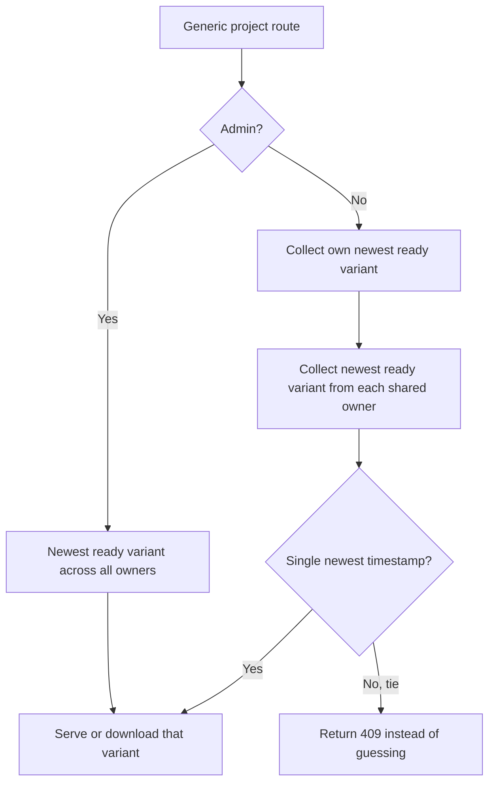

# Projects, Variants, and Ownership

Docsfy stores generated documentation as **variants**, not as one flat project record. The same repository can exist under different owners, on different branches, and with different AI provider/model combinations at the same time.

At the storage level, a variant is uniquely identified by five fields: `name`, `branch`, `ai_provider`, `ai_model`, and `owner`.

```63:79:src/docsfy/storage.py
CREATE TABLE IF NOT EXISTS projects (
    name TEXT NOT NULL,
    branch TEXT NOT NULL DEFAULT 'main',
    ai_provider TEXT NOT NULL DEFAULT '',
    ai_model TEXT NOT NULL DEFAULT '',
    owner TEXT NOT NULL DEFAULT '',
    repo_url TEXT NOT NULL,
    status TEXT NOT NULL DEFAULT 'generating',
    current_stage TEXT,
    last_commit_sha TEXT,
    last_generated TEXT,
    page_count INTEGER DEFAULT 0,
    error_message TEXT,
    plan_json TEXT,
    created_at TIMESTAMP DEFAULT CURRENT_TIMESTAMP,
    updated_at TIMESTAMP DEFAULT CURRENT_TIMESTAMP,
    PRIMARY KEY (name, branch, ai_provider, ai_model, owner)
)
```

## The Core Identity

When you look at a docsfy project, these are the fields that matter most:

- `name`: the repository name, such as `for-testing-only` or `my-repo`
- `owner`: the user who owns that generated docs set
- `branch`: the Git branch the docs were generated from
- `ai_provider`: the AI provider used for generation
- `ai_model`: the specific model used under that provider

That means all of these are different variants:

- `for-testing-only / main / gemini / gemini-2.5-flash / admin`
- `for-testing-only / dev / gemini / gemini-2.5-flash / admin`
- `for-testing-only / main / gemini / gemini-2.5-flash / testuser-e2e`

The project `name` usually comes from the repository itself, not from a separate title field. For example, `https://github.com/org/my-repo.git` becomes `my-repo`. For local repositories, docsfy uses the directory name.

## Owners And Shared Access

Every generated docs set belongs to an `owner`. In normal use, that owner is the authenticated username that started the generation. If you use the root `ADMIN_KEY`, the owner recorded for those generations is `admin`.

Ownership is what keeps two users from overwriting each other when they generate docs for the same repository. For admins, `alice/my-repo` and `bob/my-repo` are separate project groups, even if branch, provider, and model all match.

Sharing is separate from ownership:

- Sharing lets another user see a project.
- Sharing does not transfer ownership.
- Sharing does not create a duplicate copy.

Docsfy stores access grants at the `project_name + project_owner` level:

```258:262:src/docsfy/storage.py
CREATE TABLE IF NOT EXISTS project_access (
    project_name TEXT NOT NULL,
    project_owner TEXT NOT NULL DEFAULT '',
    username TEXT NOT NULL,
    PRIMARY KEY (project_name, project_owner, username)
)
```

Because of that design, an access grant applies to **all variants** for that owner’s project. If an admin grants you access to Alice’s `for-testing-only`, you can see Alice’s `main`, `dev`, `claude`, `gemini`, and other variants for that project. You do not automatically get access to Bob’s `for-testing-only`.

> **Note:** Owner is not part of the docs URL path. When multiple owners have the same repo and the same variant coordinates, admin APIs may need `?owner=<username>` to disambiguate the target.

Ownership and role are also different concepts:

- `admin` can see all owners and manage sharing
- `user` can generate, delete, and manage their own variants
- `viewer` can read accessible variants but cannot start or delete generations

## Branches

Branches are first-class variant fields. `main` and `dev` are different variants, even if everything else matches.

Docsfy is deliberately strict about branch names because the branch appears in URLs and directory paths:

```18:48:src/docsfy/models.py
class GenerateRequest(BaseModel):
    # ... other request fields omitted ...

    branch: str = Field(
        default=DEFAULT_BRANCH, description="Git branch to generate docs from"
    )

    @field_validator("branch")
    @classmethod
    def validate_branch(cls, v: str) -> str:
        if "/" in v:
            msg = (
                f"Invalid branch name: '{v}'. Branch names cannot contain slashes "
                "— use hyphens instead (e.g., release-1.x)."
            )
            raise ValueError(msg)
        if not re.match(r"^[a-zA-Z0-9][a-zA-Z0-9._-]*$", v):
            msg = f"Invalid branch name: '{v}'"
            raise ValueError(msg)
        if ".." in v:
            msg = f"Invalid branch name: '{v}'"
            raise ValueError(msg)
        return v
```

In practice:

- If you omit `branch`, docsfy uses `main`
- Good branch names include `main`, `dev`, `release-1.x`, and `v2.0.1`
- Rejected branch names include `release/v2.0`, `.hidden`, `../etc/passwd`, and `release..candidate`

> **Warning:** Branch names cannot contain `/`, and docsfy also rejects `..` anywhere in the name. If your Git workflow normally uses slash-based branch names, use a hyphenated version such as `release-1.x` when generating docs with docsfy.

If you want a stable link to a specific branch, use the fully qualified variant URL, such as `/docs/for-testing-only/dev/gemini/gemini-2.5-flash/`.

## Providers And Models

Docsfy validates the provider, and stores the model string as part of the variant. The built-in provider list is:

- `claude`
- `gemini`
- `cursor`

If you do not specify a provider or model, the server falls back to its configured defaults:

```9:21:src/docsfy/config.py
class Settings(BaseSettings):
    model_config = SettingsConfigDict(
        env_file=".env",
        env_file_encoding="utf-8",
        extra="ignore",
    )

    admin_key: str = ""  # Required — validated at startup
    ai_provider: str = "cursor"
    ai_model: str = "gpt-5.4-xhigh-fast"
    ai_cli_timeout: int = Field(default=60, gt=0)
    log_level: str = "INFO"
    data_dir: str = "/data"
```

For most installations, that means:

- Default provider: `cursor`
- Default model: `gpt-5.4-xhigh-fast`
- Default data directory: `/data`

These defaults can be overridden with environment variables before the server starts.

Two practical details are easy to miss:

- Provider choices are fixed, but model names are stored as strings, so the exact model label matters.
- The UI suggestion lists for models and branches come from **successful `ready` variants only**.

> **Note:** A branch or model does not show up in the UI’s suggestion lists just because you typed it once. It appears after a successful generation has completed.

## Statuses

Each variant has a status that tells you whether it is usable:

| Status | Meaning |
| --- | --- |
| `generating` | docsfy accepted the job and is currently working on it |
| `ready` | the docs site exists and can be viewed or downloaded |
| `error` | generation failed |
| `aborted` | generation was canceled before completion |

A few behaviors are worth knowing:

- A `generating` variant is not eligible for latest-variant resolution yet.
- If the server restarts while a variant is still generating, docsfy resets that orphaned row to `error`.
- A `ready` variant can still carry metadata such as `last_commit_sha`, `page_count`, `last_generated`, and `plan_json`.

> **Note:** While a run is active, `current_stage` can move through values like `cloning`, `incremental_planning`, `planning`, `generating_pages`, `validating`, `cross_linking`, and `rendering`. The `validating` and `cross_linking` stages come from the post-generation pipeline that runs after page writing and before the final render. A ready variant can also keep `current_stage = up_to_date` when docsfy determines nothing meaningful changed.

## What “Latest” Means

When you use a generic project route such as `/docs/<project>/` or `/api/projects/<project>/download`, docsfy does not assume `main`, and it does not prefer one model name over another. It resolves the newest **ready** variant the current caller can actually access, using `last_generated`.



For non-admin users, the helper that resolves "latest" makes that owner-aware behavior explicit:

```1078:1123:src/docsfy/api/projects.py
async def _resolve_latest_accessible_variant(
    username: str, name: str
) -> dict[str, Any] | None:
    candidates: list[dict[str, Any]] = []

    owned = await get_latest_variant(name, owner=username)
    if owned:
        candidates.append(owned)

    accessible = await get_user_accessible_projects(username)
    for proj_name, proj_owner in accessible:
        if proj_name == name and proj_owner:
            variant = await get_latest_variant(name, owner=proj_owner)
            if variant:
                candidates.append(variant)

    def _sort_key(v: dict[str, Any]) -> str:
        return str(v.get("last_generated") or "")

    candidates.sort(key=_sort_key, reverse=True)
    newest = _sort_key(candidates[0])
    tied = [c for c in candidates if _sort_key(c) == newest]
    if len(tied) > 1:
        raise HTTPException(
            status_code=409,
            detail="Multiple owners have variants with the same timestamp, please specify owner",
        )
    return candidates[0]
```

Admins still use plain `get_latest_variant()` across all owners; the owner-aware merge above applies to non-admin callers.

That leads to a few important rules:

- Only `ready` variants are candidates.
- Latest resolution is based on `last_generated`, not on branch name, Git commit age, or model name.
- Generic project routes can point to any branch. If `dev` was generated after `main`, the generic route can serve `dev`.
- Admins can resolve latest across all owners.
- Non-admin users resolve latest across their own variants plus any owner-scoped project grants they can access.
- For non-admin callers, if two accessible owners tie on the newest timestamp, the generic route fails with `409` instead of guessing.
- Variant-specific routes do not use latest resolution. They stay pinned to the exact `branch / provider / model` you requested.
- If no ready accessible variant exists yet, the generic docs/download route fails instead of guessing.

This is the split to keep in mind:

- Moving target: `/docs/<project>/`
- Pinned variant: `/docs/<project>/<branch>/<provider>/<model>/`

> **Warning:** `/docs/<project>/` and `/api/projects/<project>/download` are moving targets. Use fully qualified variant URLs when you need stable links, reproducible downloads, or branch-specific documentation. In multi-owner admin workflows, add `?owner=<username>` to the exact-variant route when you need one specific owner.

## Cross-Model And Cross-Provider Replacement

The idea of “latest” also shows up during non-force regenerations on the **same owner and branch**.

If you regenerate a project with a different provider or model and `force` is `false`, docsfy can use the newest ready variant on that same branch as the base variant:

```728:756:src/docsfy/api/projects.py
# Check if a cross-provider variant is newer
latest_any = await get_latest_variant(project_name, owner=owner, branch=branch)
if ready_current_variant and latest_any:
    current_gen = str(ready_current_variant.get("last_generated") or "")
    latest_gen = str(latest_any.get("last_generated") or "")
    if latest_gen > current_gen and (
        latest_any.get("ai_provider") != ai_provider
        or latest_any.get("ai_model") != ai_model
    ):
        base_variant = latest_any
# ...
if replaces_base_variant:
    logger.info(
        f"[{project_name}] Cross-provider update: reusing {base_provider}/{base_model} "
        f"content for {ai_provider}/{ai_model} generation"
    )
```

In practice, that means:

- On the same commit, docsfy can reuse existing artifacts directly.
- On a newer commit, docsfy can reuse unchanged cached pages and regenerate only what changed.
- After a successful non-force switch, the old base variant is treated as replaced and removed.
- If you set `force=true`, docsfy performs a full regeneration and keeps the existing variant instead of replacing it.

This behavior is especially important if you compare model outputs on the same branch.

> **Tip:** If you want two model outputs to coexist side by side, use `force=true` for the new run. Without `force`, switching models on the same branch may replace the previous ready variant once the new one finishes.

## On-Disk Layout

For self-hosted deployments, the storage layout mirrors the data model closely. Variants are stored under `owner / name / branch / provider / model` inside the configured data directory:

```525:560:src/docsfy/storage.py
def get_project_dir(
    name: str,
    ai_provider: str = "",
    ai_model: str = "",
    owner: str = "",
    branch: str = DEFAULT_BRANCH,
) -> Path:
    # ...
    return (
        PROJECTS_DIR
        / safe_owner
        / _validate_name(name)
        / branch
        / ai_provider
        / ai_model
    )
```

With the default `data_dir` of `/data`, a variant ends up under a path like:

- `/data/projects/admin/for-testing-only/main/gemini/gemini-2.5-flash/`

Within that variant directory, docsfy keeps the rendered site and the cached page artifacts separately:

- `site/` contains the generated HTML site
- `cache/pages/` contains cached page markdown used during regeneration

## Choosing The Right URL

Use the generic project URL when you want “whatever is newest, ready, and accessible to the current caller”:

- `/docs/<project>/`
- `/api/projects/<project>/download`

Use the variant-specific URL when you want something pinned and reproducible:

- `/docs/<project>/<branch>/<provider>/<model>/`
- `/api/projects/<project>/<branch>/<provider>/<model>`
- `/api/projects/<project>/<branch>/<provider>/<model>/download`

> **Tip:** In multi-owner admin workflows, add `?owner=<username>` to the exact-variant docs or download route when you need one specific owner.

If you remember just one rule, make it this one: **generic project URLs follow the latest ready accessible variant, while variant-specific URLs stay pinned to the exact branch, provider, and model you asked for.**


## Related Pages

- [Variants, Branches, and Regeneration](variants-branches-and-regeneration.html)
- [User and Access Management](user-and-access-management.html)
- [Data Storage and Layout](data-storage-and-layout.html)
- [Viewing, Downloading, and Hosting Docs](viewing-downloading-and-hosting-docs.html)
- [Projects API](projects-api.html)