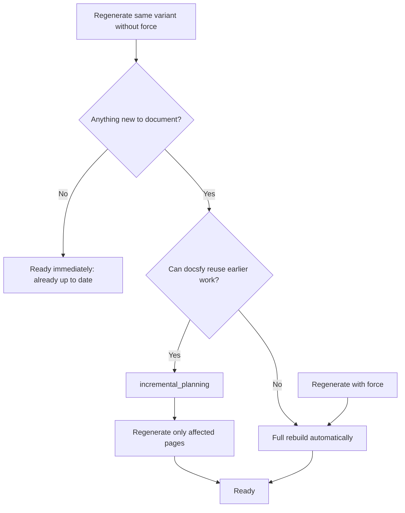

# Regenerating After Code Changes

You want the docs to match the latest commit without wasting time on pages that do not need to change. The normal rerun path lets docsfy reuse earlier work when it can, while the forced path gives you a clean rebuild when you need to start over.

## Prerequisites

- A ready docs variant already exists for the same repository, branch, provider, and model. If not, see [Generating Documentation](generate-documentation.html).
- The changes you want documented are pushed to the remote branch. The dashboard and CLI regenerate from the Git URL, not from your local working tree.
- `user` or `admin` access if you are using the dashboard.
- For CLI examples, a configured `docsfy` connection. See [Managing docsfy from the CLI](manage-docsfy-from-the-cli.html).

## Quick Example

```shell
docsfy generate https://github.com/myk-org/for-testing-only \
  --branch main \
  --provider gemini \
  --model gemini-2.5-flash
```

Run the same repository, branch, provider, and model again after you push code changes. With `--force` omitted, docsfy tries to reuse the existing variant before it decides to rebuild everything.

## Step-by-Step

1. Check the exact variant you want to refresh.

```shell
docsfy status for-testing-only \
  --branch main \
  --provider gemini \
  --model gemini-2.5-flash
```

Use all three selectors together so you do not refresh the wrong variant. In the CLI, `for-testing-only` is the project name derived from the Git URL; in the dashboard, open that ready variant first.

> **Note:** This page is about refreshing the same variant after code changes. If you want a different branch or model on purpose, see [Regenerating for New Branches and Models](regenerate-for-new-branches-and-models.html).

2. Start a normal regenerate first.

```shell
docsfy generate https://github.com/myk-org/for-testing-only \
  --branch main \
  --provider gemini \
  --model gemini-2.5-flash \
  --watch
```

In the dashboard, open the variant, leave `Force full regeneration` unchecked, and click `Regenerate`. This is the best default because docsfy can skip unchanged work or reuse earlier output automatically.

> **Tip:** Start without force unless you already know you need a clean rebuild. If reuse is not possible, docsfy falls back to a full rebuild on its own.

3. Watch the rerun until it reaches `ready`.

```shell
docsfy status for-testing-only \
  --branch main \
  --provider gemini \
  --model gemini-2.5-flash
```

If nothing changed, the rerun can finish quickly and the dashboard shows **Documentation is already up to date.** If the docs do need refreshing, let the run finish and confirm the updated `Commit`, `Status`, and `Pages` values. See [Tracking Generation Progress](track-generation-progress.html) for stage meanings.

4. Open or download the refreshed docs.

When the variant is `ready`, open or download the site the same way you would after any successful run. See [Viewing and Downloading Docs](view-and-download-docs.html) for that next step.

5. Force a clean rebuild when you need one.

```shell
docsfy generate https://github.com/myk-org/for-testing-only \
  --branch main \
  --provider gemini \
  --model gemini-2.5-flash \
  --force \
  --watch
```

In the dashboard, check `Force full regeneration` before you click `Regenerate`. Use this when output looks stale, a previous run failed, or you want docsfy to ignore cached page output and rebuild the same variant in place from zero.

## Advanced Usage



| Situation | What docsfy does |
| --- | --- |
| Same commit as the last ready run for that variant | Finishes as `ready` without rebuilding pages |
| New commit, but no file changes to document | Finishes as `ready` and treats the docs as already up to date |
| New commit, previous ready copy of that variant can be reused | Reuses the existing plan and unchanged pages, then regenerates only the affected pages |
| New commit, but reuse cannot be worked out safely | Falls back to a full rebuild automatically |
| `--force` or `Force full regeneration` | Clears cached page output and rebuilds from scratch |

A few details matter in practice:

- A normal rerun can show `incremental_planning` instead of `planning`. That is the reuse path, not an error.
- A forced rerun resets page progress and rebuilds the variant from zero.
- In the dashboard, variants in `error` or `aborted` state reopen with `Force full regeneration` already enabled.
- If you want a new branch or model instead of refreshing the same one, see [Regenerating for New Branches and Models](regenerate-for-new-branches-and-models.html).

## Troubleshooting

- **The rerun finished almost immediately:** docsfy decided the selected variant was already current. That can mean the commit is unchanged, or a new commit did not produce any file changes that require new docs. Run again with force if you still want a clean rebuild.
- **A normal rerun is taking as long as a first build:** docsfy may have fallen back to a full rebuild. Check the current stage with `docsfy status ...`; if you see `planning` rather than `incremental_planning`, that is expected fallback behavior. See [Tracking Generation Progress](track-generation-progress.html) for the stage names.
- **You get an `already being generated` error:** wait for that exact variant to finish, or abort it first.

```shell
docsfy abort for-testing-only \
  --branch main \
  --provider gemini \
  --model gemini-2.5-flash
```

- **The refreshed docs do not include your latest local edits:** push those changes to the remote branch and rerun. The dashboard and CLI do not read unpublished local working tree changes.
- **The regenerate controls are missing in the dashboard:** your account is probably `viewer`. Ask for `user` or `admin` access.
- **The rerun fails instead of reaching `ready`:** inspect the exact variant error, then see [Fixing Setup and Generation Problems](fix-setup-and-generation-problems.html).

## Related Pages

- [Generating Documentation](generate-documentation.html)
- [Tracking Generation Progress](track-generation-progress.html)
- [Viewing and Downloading Docs](view-and-download-docs.html)
- [Regenerating for New Branches and Models](regenerate-for-new-branches-and-models.html)
- [Fixing Setup and Generation Problems](fix-setup-and-generation-problems.html)