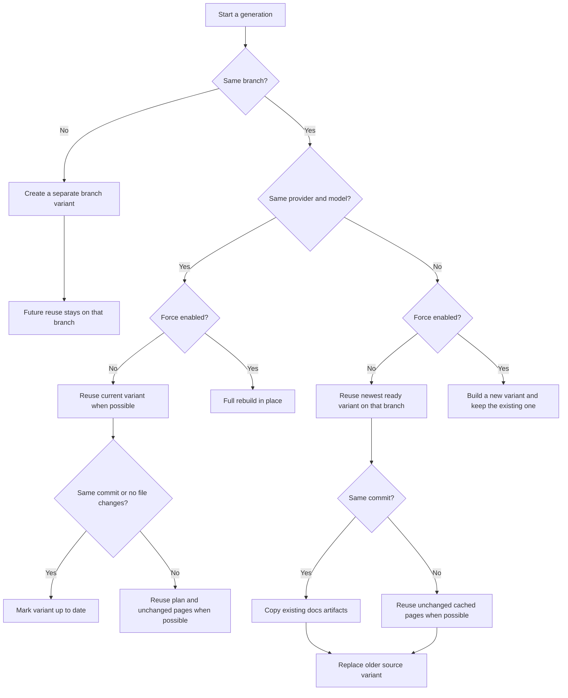

# Regenerating for New Branches and Models

You want a separate docs variant for another branch or AI model so you can compare outputs, keep release-specific docs, or grab a precise build later without overwriting the version you already use. docsfy can reuse finished work to make this faster, but the result depends on whether you changed the branch, the provider/model, or turned on a full rebuild.

## Prerequisites
- A running docsfy server and an account with write access.
- A repository URL that the server can clone.
- A provider and model that work in your environment.
- Optional: a configured `docsfy` CLI profile.

See [Generating Documentation](generate-documentation.html) for the basic first-run flow, or [Managing docsfy from the CLI](manage-docsfy-from-the-cli.html) if you need CLI setup first.

## Quick Example
```shell
docsfy generate https://github.com/myk-org/for-testing-only \
  --branch dev \
  --provider gemini \
  --model gemini-2.5-flash
```

This creates a separate `dev/gemini/gemini-2.5-flash` variant for the same repository instead of changing an existing `main` variant.

## Step-by-step
1. Create the branch variant you want.

```shell
docsfy generate https://github.com/myk-org/for-testing-only \
  --branch dev \
  --provider gemini \
  --model gemini-2.5-flash \
  --watch
```

In the web app, use `New Generation`, keep the same repository URL, type the new branch, pick the provider and model, and start the run. This is the branch-changing path in the UI.

> **Note:** If you omit `--branch`, docsfy uses `main`.


> **Tip:** Branch suggestions only come from ready variants for that repository. You can still type a new branch even if it is not listed yet.

2. Create a different provider/model variant on the same branch.

```shell
docsfy generate https://github.com/myk-org/for-testing-only \
  --branch main \
  --provider gemini \
  --model gemini-2.0-flash
```

In the web app, open the ready variant and use `Regenerate Documentation`. That form keeps the selected branch fixed and lets you change the provider or model.

3. Check exactly which variant you have before you open or download it.

```shell
docsfy status for-testing-only

docsfy status for-testing-only \
  --branch main \
  --provider gemini \
  --model gemini-2.0-flash
```

The first command lists every variant for that repository. The second command targets one exact branch, provider, and model combination.

In the web app, variants are grouped by branch in the sidebar. Expand the repository, open the `@branch` group you want, and select the provider/model row.

4. Open or download the exact variant you asked for.

```shell
docsfy download for-testing-only \
  --branch main \
  --provider gemini \
  --model gemini-2.0-flash
```

In the web app, the `View Documentation` and `Download` buttons on a selected variant already use that exact branch/provider/model. In the CLI, add `--output` if you want the archive extracted into a directory instead of saved as a `.tar.gz` file.

5. Choose whether you want reuse or a clean rebuild.

| Change you make | Without `--force` | With `--force` |
| --- | --- | --- |
| Same branch, same provider/model | Updates that same variant. If the commit is unchanged, docsfy marks it as already up to date. | Rebuilds that same variant from scratch. |
| Same branch, different provider/model | Reuses the newest ready variant on that branch when possible, then replaces the older source variant after the new one is ready. | Builds the new variant from scratch and keeps the existing variant. |
| Different branch | Creates a separate branch variant. The first ready variant on that branch does not reuse a ready variant from another branch. | Still creates a separate branch variant. Use this when you want a clean rebuild of that branch variant. |

> **Warning:** A non-force provider/model switch on the same branch is replacement behavior, not side-by-side storage. If you want to keep both variants on that branch, turn on `Force full regeneration`.

## Advanced Usage


Use the exact form when precision matters:

| Goal | Command or URL | What you get |
| --- | --- | --- |
| Open the latest ready docs for a repo | `/docs/for-testing-only/` | The most recently generated ready variant |
| Open one exact variant | `/docs/for-testing-only/dev/gemini/gemini-2.5-flash/` | Only that branch/provider/model |
| Download the latest ready docs for a repo | `docsfy download for-testing-only` | The most recently generated ready variant |
| Download one exact variant | `docsfy download for-testing-only --branch dev --provider gemini --model gemini-2.5-flash` | Only that branch/provider/model |

```shell
docsfy models --provider gemini
```

Use this when you need the current provider defaults and the known model names from completed generations. The web app uses the same ready-variant history to populate model suggestions.

A few edge cases matter in practice:

- Same-commit provider/model switches without force can finish by copying the previous docs artifacts, so the new variant can be identical to the old one.
- New commits on the same branch can reuse the existing plan and unchanged pages when docsfy can tell what changed. If it cannot reuse safely, it falls back to a full regeneration automatically.
- The same replacement rules apply whether you change just the model or switch providers too.
- In the web app, `error` and `aborted` variants reopen `Regenerate Documentation` with `Force full regeneration` enabled by default.
- If you copied a generation ID from the sidebar or variant detail view, `docsfy status` and `docsfy download` accept that ID too, so you do not have to retype the branch, provider, and model.

See [Tracking Generation Progress](track-generation-progress.html) for live stage details, [CLI Command Reference](cli-command-reference.html) for full flag syntax, [Configuration Reference](configuration-reference.html) for server defaults, and [HTTP API and WebSocket Reference](http-api-and-websocket-reference.html) if you need to automate this flow.

## Troubleshooting
- A branch like `release/v2.0` is rejected: docsfy does not allow `/` in branch names. Use something like `release-v2.0` or `release-1.x`.
- The wrong docs opened or downloaded: you probably used the default project route or `docsfy download` without branch/provider/model selectors. Use the fully qualified form when you need one exact variant.
- A branch or model is missing from the suggestion list: only ready variants populate those lists. Type the value manually, or run `docsfy models --provider gemini`.
- The old provider/model variant disappeared after a switch: that is expected after a same-branch non-force switch. Rerun with `--force` if you want both variants to remain.
- The run ends in `Clone failed`, or the branch never appears: verify that the branch exists in the remote repository and that the server can access that repository. See [Fixing Setup and Generation Problems](fix-setup-and-generation-problems.html) for broader setup and runtime failures.

## Related Pages

- [Generating Documentation](generate-documentation.html)
- [Configuring AI Providers and Models](configure-ai-providers-and-models.html)
- [Tracking Generation Progress](track-generation-progress.html)
- [Viewing and Downloading Docs](view-and-download-docs.html)
- [Managing docsfy from the CLI](manage-docsfy-from-the-cli.html)