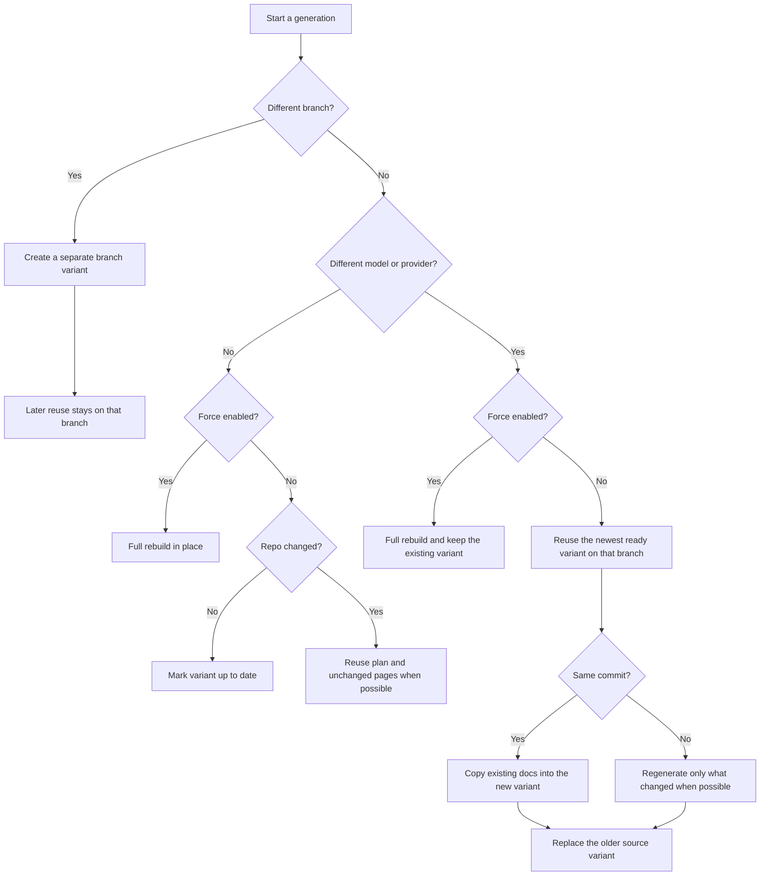

# Regenerate for New Branches and Models

You want another docs variant from the same repository so you can cover a different branch or switch models without rebuilding everything by hand. In docsfy, branch changes and model changes behave differently, so the fastest path depends on what you are changing.

## Prerequisites
- A running docsfy instance and a login with `user` or `admin` access. If you still need setup help, see [Generate Your First Docs Site](generate-your-first-docs-site.html) or [Install and Run docsfy Without Docker](install-and-run-docsfy-without-docker.html).
- The repository URL you want to regenerate.
- A provider/model that already works in your environment.
- If you use the CLI, a configured `docsfy` connection.

## Quick Example
```shell
# New branch
docsfy generate https://github.com/myk-org/for-testing-only \
  --branch dev \
  --provider gemini \
  --model gemini-2.5-flash
```

```shell
# New model on the same branch
docsfy generate https://github.com/myk-org/for-testing-only \
  --branch main \
  --provider gemini \
  --model gemini-2.0-flash
```

> **Tip:** The branch and model fields are editable. Suggestions only come from ready variants, so you can type a value even when it is not listed yet.

## Step-by-step
1. Create a new branch variant.

```shell
docsfy generate https://github.com/myk-org/for-testing-only \
  --branch dev \
  --provider gemini \
  --model gemini-2.5-flash \
  --watch
```

Use the same repo URL and change only the branch. In the dashboard, do the same thing from `New Generation`: keep the repository URL, type the new branch, choose the provider/model, and click `Generate`.

> **Note:** If you omit `--branch`, docsfy uses `main`.

2. Create a new model variant on the same branch.

```shell
docsfy generate https://github.com/myk-org/for-testing-only \
  --branch main \
  --provider gemini \
  --model gemini-2.0-flash
```

Keep the branch the same and change the model. In the dashboard, select the ready variant in the sidebar and use `Regenerate Documentation`; that form changes the provider/model but keeps the selected branch.

3. Check the exact variant you started.

```shell
docsfy status for-testing-only \
  --branch main \
  --provider gemini \
  --model gemini-2.0-flash
```

Use the branch, provider, and model together so you do not confuse one variant with another. In the dashboard, a new branch appears under its own `@branch` section in the sidebar.

4. Choose whether you want reuse or a full rebuild.

| Situation | What docsfy does |
| --- | --- |
| Same branch, same model, no force | Updates the existing variant in place. If the repo is unchanged, the run finishes as already up to date. |
| Same branch, same model, `--force` | Rebuilds that variant from scratch. |
| Same branch, different model, no force | Reuses the newest ready variant on that branch when possible, then removes the older source variant after the new one is ready. |
| Same branch, different model, `--force` | Runs a full generation and keeps the existing variant, so both variants can remain. |
| Different branch | Creates a separate branch variant. Reuse starts only after that branch has its own ready variant. |

> **Warning:** A non-force model switch is not additive. If you want to keep both the old and new model variants on the same branch, turn on `Force full regeneration`.

5. Confirm the result in the UI.

Select the ready variant and check its branch, provider/model, page count, and latest commit. If docsfy reused an unchanged variant, the ready view says the documentation is already up to date.

<details><summary>Advanced Usage</summary>



```shell
docsfy models --provider gemini
```

Use this to see the provider list, the server-marked defaults, and model names from completed generations. If you plan to rely on omitted provider/model values, check [Configuration Reference](configuration-reference.html) first.

A few reuse rules matter in practice:

- Reuse is branch-scoped. A ready `main` variant is not used as the starting point for a first-time `dev` variant.
- A same-commit model switch without force can finish by copying the existing docs into the new variant instead of starting over.
- A new commit on the same branch without force can reuse the existing plan and regenerate only changed pages when docsfy can tell what changed.
- A new commit with no file changes is treated as up to date.
- If docsfy cannot figure out what changed or cannot reuse the earlier plan, it falls back to a full regeneration automatically.
- The same replacement rules apply when you switch providers, not just when you switch models.
- In the dashboard, errored and aborted variants reopen with `Force full regeneration` enabled by default.

```shell
docsfy status for-testing-only
```

Use this when you want a full list of branch/provider/model variants for one repository.

> **Warning:** Branch names cannot contain `/`. Use a slash-free name such as `release-1.x`.

For full command syntax, see [CLI Command Reference](cli-command-reference.html). If you automate this outside the CLI, see [HTTP API Reference](http-api-reference.html) and [WebSocket Reference](websocket-reference.html).

</details>

## Troubleshooting
- `Clone failed` or branch not found: verify the branch exists in the remote repository and that the server can access that repository.
- A branch name like `release/v2.0` is rejected: docsfy only accepts branch names without slashes. Use something like `release-v2.0` or `release-1.x`.
- The model you want is not in the dropdown: type it manually or run `docsfy models --provider <provider>`. The suggestion list only includes models from ready variants.
- The regenerate controls are missing: `viewer` access is read-only. See [Manage Users, Roles, and Access](manage-users-roles-and-access.html) for permission changes.
- The previous model disappeared after a switch: that is expected after a non-force model change on the same branch. Rerun with `--force` if you want both variants to remain.

## Related Pages

- [Generate Documentation](generate-documentation.html)
- [Track Generation Progress](track-generation-progress.html)
- [View, Download, and Publish Docs](view-download-and-publish-docs.html)
- [Manage docsfy from the CLI](manage-docsfy-from-the-cli.html)
- [HTTP API Reference](http-api-reference.html)