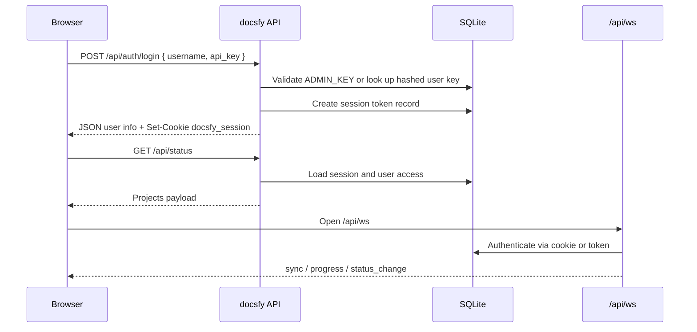

# Security Considerations

docsfy is built for authenticated documentation hosting, not anonymous public uploads. The backend protects API and docs routes, stores hashes instead of raw secrets, rejects risky repository inputs, and sanitizes rendered HTML before it serves AI-generated pages.

## What To Lock Down First

- Keep `ADMIN_KEY` secret. The server will not start without it, and it must be at least 16 characters long.
- Serve docsfy over HTTPS and leave `SECURE_COOKIES=true` in production.
- Prefer named database-backed users over sharing the built-in `admin` credential.
- Treat local `repo_path` generation as a high-trust admin feature.
- Review generated docs before publishing them outside your team.

From `.env.example`:

```env
# Required: Admin password (minimum 16 characters)
ADMIN_KEY=

# Data directory for database and generated docs
DATA_DIR=/data

# Cookie security (set to false for local HTTP development)
SECURE_COOKIES=true
```

## Authentication And Access Control

docsfy uses one auth model across the web UI, REST API, CLI, and WebSocket updates:

- Browser users sign in once and receive a `docsfy_session` cookie.
- API and CLI clients can send the same secret as `Authorization: Bearer <API_KEY>`.
- Users have one of three roles: `viewer`, `user`, or `admin`.

Most protected functionality lives under `/api/*` and `/docs/*`. The login page and health check stay public, and the WebSocket endpoint authenticates during the handshake. The same access model gates project APIs, generated docs URLs, downloads, and live status updates.

There are two kinds of admin access:

- Built-in `admin`: the username must literally be `admin`, and the submitted secret must match `ADMIN_KEY`.
- Database-backed `admin`: a normal user row with role `admin`.

From `src/docsfy/api/auth.py`:

```python
# Check admin -- username must be "admin" and key must match
if username == "admin" and hmac.compare_digest(api_key, settings.admin_key):
    is_admin = True
    authenticated = True
    role = "admin"
else:
    # Check user key -- verify username matches the key's owner
    user = await get_user_by_key(api_key)
    if user and user["username"] == username:
        authenticated = True
        role = str(user.get("role", "user"))
        if role == "admin":
            is_admin = True
```

Write access is enforced on the server, not just hidden in the UI. `viewer` is read-only.

From `src/docsfy/api/projects.py`:

```python
def _require_write_access(request: Request) -> None:
    """Raise 403 if user is a viewer (read-only)."""
    if request.state.role not in ("admin", "user"):
        raise HTTPException(
            status_code=403,
            detail="Write access required.",
        )
```

Shared access is owner-scoped. That matters because two different users can generate docs for repositories with the same name. If a user asks for a project they should not see, docsfy often returns `404 Not found` instead of `403`, which helps avoid leaking whether that project exists.

From `src/docsfy/api/projects.py`:

```python
async def _check_ownership(
    request: Request, project_name: str, project: dict[str, Any]
) -> None:
    """Raise 404 if the requesting user does not own the project (unless admin)."""
    if request.state.is_admin:
        return
    project_owner = str(project.get("owner", ""))
    if project_owner == request.state.username:
        return
    access = await get_project_access(project_name, project_owner=project_owner)
    if request.state.username in access:
        return
    raise HTTPException(status_code=404, detail="Not found")
```



The CLI uses the same credential model. From `src/docsfy/cli/client.py`:

```python
self._client = httpx.Client(
    base_url=self.server_url,
    headers={"Authorization": f"Bearer {self.password}"},
    timeout=30.0,
    follow_redirects=False,
)
```

> **Note:** In the UI this secret is labeled as a password. In the API and CLI it is treated as an API key. It is the same underlying credential.

> **Warning:** The username `admin` is reserved. You cannot create a database-backed user named `admin`, `Admin`, or `ADMIN`.

> **Tip:** Use the built-in `admin` account for bootstrap and recovery. For normal day-to-day work, create named users, including named admins.

The WebSocket endpoint also accepts a `?token=` query parameter. That is useful for direct clients, but it is a poorer fit for browsers because URLs are easier to leak than cookies.

> **Warning:** For browser use, prefer the normal session-cookie flow over `wss://.../api/ws?token=...`.

## API Keys, Session Tokens, And Cookie Settings

User API keys are not stored in plain text. The `users` table stores only `api_key_hash`, and that hash is an HMAC-SHA256 digest keyed by `ADMIN_KEY`.

From `src/docsfy/storage.py`:

```python
def hash_api_key(key: str, hmac_secret: str = "") -> str:
    """Hash an API key with HMAC-SHA256 for storage."""
    secret = hmac_secret or os.getenv("ADMIN_KEY", "")
    if not secret:
        msg = "ADMIN_KEY environment variable is required for key hashing"
        raise RuntimeError(msg)
    return hmac.new(secret.encode(), key.encode(), hashlib.sha256).hexdigest()

def generate_api_key() -> str:
    """Generate a random API key."""
    return f"docsfy_{secrets.token_urlsafe(32)}"
```

That means:

- The server cannot recover an old user API key from the database.
- Auto-generated keys use a random `docsfy_...` format.
- Custom replacement keys must be at least 16 characters long.
- The raw key is shown only when a user is created or rotated, so you should save it immediately.

Browser sessions use a different secret from the user API key. docsfy generates a random session token, stores only its SHA-256 hash in the `sessions` table, and sends the raw token back only in the cookie.

From `src/docsfy/storage.py`:

```python
def _hash_session_token(token: str) -> str:
    """Hash a session token for storage."""
    return hashlib.sha256(token.encode()).hexdigest()

async def create_session(
    username: str, is_admin: bool = False, ttl_hours: int = SESSION_TTL_HOURS
) -> str:
    """Create an opaque session token."""
    token = secrets.token_urlsafe(32)
    token_hash = _hash_session_token(token)
    expires_at = datetime.now(timezone.utc) + timedelta(hours=ttl_hours)
    expires_str = expires_at.strftime("%Y-%m-%d %H:%M:%S")
    async with aiosqlite.connect(DB_PATH) as db:
        await db.execute(
            "INSERT INTO sessions (token, username, is_admin, expires_at) VALUES (?, ?, ?, ?)",
            (token_hash, username, 1 if is_admin else 0, expires_str),
        )
        await db.commit()
    return token
```

The session cookie is hardened for browser use. From `src/docsfy/api/auth.py`:

```python
response.set_cookie(
    "docsfy_session",
    session_token,
    httponly=True,
    samesite="strict",
    secure=settings.secure_cookies,
    max_age=SESSION_TTL_SECONDS,
)
```

That gives you:

- `HttpOnly`: browser JavaScript cannot read the cookie.
- `SameSite=Strict`: the cookie is not meant for cross-site use.
- `Secure`: controlled by `SECURE_COOKIES`, and it should stay on in production.
- `max_age=SESSION_TTL_SECONDS`: sessions last 8 hours by default.

The frontend intentionally uses same-origin credential handling instead of reading the cookie itself. From `frontend/src/lib/api.ts`:

```ts
const config: RequestInit = {
  ...options,
  credentials: 'same-origin',
  redirect: 'manual',
  headers,
}
```

Live updates follow the same pattern. From `frontend/src/lib/websocket.ts`:

```ts
const protocol = window.location.protocol === 'https:' ? 'wss:' : 'ws:'
const url = `${protocol}//${window.location.host}/api/ws`
this.ws = new WebSocket(url)
```

Any endpoint that returns a raw key marks that response as non-cacheable. From `src/docsfy/api/auth.py`:

```python
response = JSONResponse(
    content={"username": username, "new_api_key": new_key},
    headers={"Cache-Control": "no-store"},
)
```

Key rotation also invalidates existing sessions for that user. From `src/docsfy/storage.py`:

```python
# Invalidate all existing sessions for this user
await db.execute("DELETE FROM sessions WHERE username = ?", (username,))
```

If you use the CLI, remember that its config file contains the raw secret. `docsfy config init` writes owner-only permissions.

From `src/docsfy/cli/config_cmd.py`:

```python
CONFIG_DIR.mkdir(parents=True, exist_ok=True)
os.chmod(CONFIG_DIR, stat.S_IRWXU)
with open(CONFIG_FILE, "wb") as f:
    tomli_w.dump(config, f)
os.chmod(CONFIG_FILE, stat.S_IRUSR | stat.S_IWUSR)
```

> **Warning:** Rotating `ADMIN_KEY` does more than change the built-in admin login. `ADMIN_KEY` is also the HMAC secret used to verify stored user API keys, so rotating it invalidates existing database-backed user keys until you reissue them.

> **Warning:** The built-in `admin` account cannot use self-service key rotation. To change that credential, update `ADMIN_KEY` in the environment and restart the server.

> **Tip:** Leave `SECURE_COOKIES=true` in production. Set it to `false` only for local HTTP development, otherwise the browser will not send the session cookie back over plain HTTP.

## Repository Input Safety

### Accepted Repo URLs And Branch Names

docsfy validates repository input before it gets anywhere near Git or the filesystem. The current request model accepts:

- `http://...` or `https://...` repository URLs in `host/org/repo(.git)` form
- scp-style SSH URLs in `git@host:org/repo(.git)` form
- absolute local paths for `repo_path`

From `src/docsfy/models.py`:

```python
@field_validator("repo_url")
@classmethod
def validate_repo_url(cls, v: str | None) -> str | None:
    if v is None:
        return v
    https_pattern = r"^https?://[\w.\-]+/[\w.\-]+/[\w.\-]+(\.git)?$"
    ssh_pattern = r"^git@[\w.\-]+:[\w.\-]+/[\w.\-]+(\.git)?$"
    if not re.match(https_pattern, v) and not re.match(ssh_pattern, v):
        msg = f"Invalid git repository URL: '{v}'"
        raise ValueError(msg)
    return v

@field_validator("repo_path")
@classmethod
def validate_repo_path(cls, v: str | None) -> str | None:
    if v is None:
        return v
    path = Path(v)
    if not path.is_absolute():
        msg = "repo_path must be an absolute path"
        raise ValueError(msg)
    return v
```

Branch names are validated too, because docsfy uses them both in URLs and on disk.

From `src/docsfy/models.py`:

```python
@field_validator("branch")
@classmethod
def validate_branch(cls, v: str) -> str:
    if "/" in v:
        msg = (
            f"Invalid branch name: '{v}'. Branch names cannot contain slashes "
            "— use hyphens instead (e.g., release-1.x)."
        )
        raise ValueError(msg)
    if not re.match(r"^[a-zA-Z0-9][a-zA-Z0-9._-]*$", v):
        msg = f"Invalid branch name: '{v}'"
        raise ValueError(msg)
    if ".." in v:
        msg = f"Invalid branch name: '{v}'"
        raise ValueError(msg)
    return v
```

> **Tip:** Use branch names like `release-1.x` or `v2.0.1`. Do not use `release/1.x`.

### SSRF Protections For Remote Repositories

Before docsfy clones a remote repository, it rejects URLs that point to localhost, private IPs, or DNS names that resolve to non-global addresses. That blocks many common server-side request forgery mistakes.

From `src/docsfy/api/projects.py`:

```python
# Check for localhost
if hostname in ("localhost", "127.0.0.1", "::1", "0.0.0.0"):
    raise HTTPException(
        status_code=400,
        detail="Repository URL must not target localhost or private networks",
    )

try:
    addr = ipaddress.ip_address(hostname)
    if not addr.is_global:
        raise HTTPException(
            status_code=400,
            detail="Repository URL must not target localhost or private networks",
        )
except ValueError:
    resolved = await loop.run_in_executor(
        None,
        socket.getaddrinfo,
        hostname,
        None,
        socket.AF_UNSPEC,
        socket.SOCK_STREAM,
    )
    for _family, _socktype, _proto, _canonname, sockaddr in resolved:
        ip_str = sockaddr[0]
        addr = ipaddress.ip_address(ip_str)
        if not addr.is_global:
            raise HTTPException(
                status_code=400,
                detail="Repository URL resolves to a private network address",
            )
```

When docsfy calls Git, it terminates options before the repository URL, which also helps prevent Git option injection.

From `src/docsfy/repository.py`:

```python
clone_cmd = ["git", "clone", "--depth", "1"]
if branch:
    clone_cmd += ["--branch", branch]
clone_cmd += ["--", repo_url, str(repo_path)]
```

Repository URLs are also cleaned up before logging if they include embedded credentials. The `_redact_url()` helper in `src/docsfy/api/projects.py` replaces any username or password portion with `***@host`.

> **Note:** The SSRF protection here is useful, but it is not a full network sandbox. The code explicitly recommends handling advanced cases such as DNS rebinding with network or firewall controls.

### Local Repository Paths Are Admin-Only

Remote repositories are the normal path for regular users. Local filesystem access is intentionally more restricted.

From `src/docsfy/api/projects.py`:

```python
if gen_request.repo_path and not request.state.is_admin:
    raise HTTPException(
        status_code=403,
        detail="Local repo path access requires admin privileges",
    )

if gen_request.repo_path:
    repo_p = Path(gen_request.repo_path)
    if not repo_p.exists():
        raise HTTPException(
            status_code=400,
            detail=f"Repository path does not exist: '{gen_request.repo_path}'",
        )
    if not (repo_p / ".git").exists():
        raise HTTPException(
            status_code=400,
            detail=f"Not a git repository (no .git directory): '{gen_request.repo_path}'",
        )
```

That gives you two useful guarantees:

- Non-admin users cannot point docsfy at arbitrary local directories.
- Even admins must provide an existing Git working tree, not just any path.

## Filesystem And Path Traversal Protection

docsfy stores generated content under `DATA_DIR`, using an owner-aware layout:

`/data/projects/<owner>/<project>/<branch>/<provider>/<model>/...`

Because those values become real path segments, the backend validates them aggressively.

From `src/docsfy/storage.py`:

```python
def get_project_dir(
    name: str,
    ai_provider: str = "",
    ai_model: str = "",
    owner: str = "",
    branch: str = DEFAULT_BRANCH,
) -> Path:
    if not branch:
        msg = "branch is required for project directory paths"
        raise ValueError(msg)
    if not ai_provider or not ai_model:
        msg = "ai_provider and ai_model are required for project directory paths"
        raise ValueError(msg)
    for segment_name, segment in [
        ("branch", branch),
        ("ai_provider", ai_provider),
        ("ai_model", ai_model),
    ]:
        if (
            "/" in segment
            or "\\" in segment
            or ".." in segment
            or segment.startswith(".")
        ):
            msg = f"Invalid {segment_name}: '{segment}'"
            raise ValueError(msg)
```

There are similar checks for project names and owners:

- Project names must match `^[a-zA-Z0-9][a-zA-Z0-9._-]*$`
- Owners cannot contain `/`, `\`, `..`, or a leading `.`
- Unsafe slugs are skipped during generation

Generated filenames go through an additional confinement check before docsfy writes them.

From `src/docsfy/postprocess.py`:

```python
def _confined_path(base: Path, relative_name: str) -> Path:
    """Ensure a relative filename resolves inside the base directory."""
    if any(ord(ch) < 32 for ch in relative_name):
        raise ValueError(f"Unsafe generated filename: {relative_name!r}")
    candidate = (base / relative_name).resolve()
    base_resolved = base.resolve()
    try:
        candidate.relative_to(base_resolved)
    except ValueError as exc:
        raise ValueError(f"Unsafe generated filename: {relative_name!r}") from exc
    candidate.parent.mkdir(parents=True, exist_ok=True)
    return candidate
```

Even when serving already-generated docs, docsfy checks that the requested file stays inside the resolved site directory.

From `src/docsfy/main.py`:

```python
file_path = site_dir / path
try:
    file_path.resolve().relative_to(site_dir.resolve())
except ValueError as exc:
    raise HTTPException(status_code=403, detail="Access denied") from exc
if not file_path.exists() or not file_path.is_file():
    raise HTTPException(status_code=404, detail="File not found")
```

In practical terms, these checks are there to block:

- `..`-style path traversal
- hidden or dot-prefixed path segments where they are not expected
- provider, model, and branch values that would escape the intended directory tree
- unsafe generated filenames in post-processing and cross-linking

## Sanitizing AI-Generated HTML

docsfy treats generated content as something that still needs guardrails. Markdown is rendered to HTML, then run through a sanitizer before the final page is served.

From `src/docsfy/renderer.py`:

```python
def _sanitize_html(html: str) -> str:
    html = re.sub(
        r"<script[^>]*>.*?</script>", "", html, flags=re.DOTALL | re.IGNORECASE
    )
    for tag in ["iframe", "object", "embed", "form"]:
        html = re.sub(
            rf"<{tag}[^>]*>.*?</{tag}>", "", html, flags=re.DOTALL | re.IGNORECASE
        )
        html = re.sub(rf"<{tag}[^>]*/>", "", html, flags=re.IGNORECASE)
    html = re.sub(r'\s+on\w+\s*=\s*["\'][^"\']*["\']', "", html, flags=re.IGNORECASE)
    html = re.sub(r"\s+on\w+\s*=\s*\S+", "", html, flags=re.IGNORECASE)

    def _sanitize_url_attr(match: re.Match) -> str:
        attr = match.group(1)
        quote = match.group(2)
        url = match.group(3)
        clean_url = url.strip()
        if clean_url.startswith(("http://", "https://", "#", "/", "mailto:")):
            return match.group(0)
        return f"{attr}={quote}#{quote}"
```

That sanitizer does a few important things:

- Removes `<script>` blocks entirely
- Removes `<iframe>`, `<object>`, `<embed>`, and `<form>`
- Strips inline event handlers such as `onclick=` and `onerror=`
- Rewrites unsafe `href=` and `src=` values to `#`
- Preserves the allowed URL patterns `http://`, `https://`, `#`, `/`, and `mailto:`

Template autoescaping stays on for HTML rendering. From `src/docsfy/renderer.py`:

```python
_jinja_env = Environment(
    loader=FileSystemLoader(str(TEMPLATES_DIR)),
    autoescape=select_autoescape(["html"]),
)
```

The static search UI is also careful about text rendering. It uses DOM `textContent` for titles and snippets instead of injecting HTML from the search index. From `src/docsfy/static/search.js`:

```javascript
title.textContent = m.title
preview.textContent = snippet
```

> **Warning:** Sanitization greatly reduces XSS risk, but it does not make AI output magically correct or safe to publish. Generated docs can still contain bad advice, stale instructions, or links you would not want to ship without review.

## Deployment Defaults Worth Knowing

A few security-sensitive defaults are worth keeping in mind when you deploy docsfy.

Startup refuses a missing or too-short `ADMIN_KEY`. From `src/docsfy/main.py`:

```python
if not settings.admin_key:
    logger.error("ADMIN_KEY environment variable is required")
    raise SystemExit(1)

if len(settings.admin_key) < 16:
    logger.error("ADMIN_KEY must be at least 16 characters long")
    raise SystemExit(1)
```

FastAPI's built-in interactive docs and OpenAPI schema are disabled by default. From `src/docsfy/main.py`:

```python
app = FastAPI(
    title="docsfy",
    description="AI-powered documentation generator",
    version="0.1.0",
    lifespan=lifespan,
    docs_url=None,
    redoc_url=None,
    openapi_url=None,
)
```

When you run `docsfy-server` directly, it defaults to `127.0.0.1`. From `src/docsfy/main.py`:

```python
host = os.getenv("HOST", "127.0.0.1")
port = int(os.getenv("PORT", "8000"))
```

The container image drops to a non-root user, and the Compose file reads `ADMIN_KEY` from the environment instead of hardcoding it.

From `Dockerfile`:

```dockerfile
RUN useradd --create-home --shell /bin/bash -g 0 appuser \
  && mkdir -p /data \
  && chown appuser:0 /data \
  && chmod -R g+w /data

USER appuser
```

From `docker-compose.yaml`:

```yaml
env_file:
  - .env
environment:
  - ADMIN_KEY=${ADMIN_KEY}
```

From `entrypoint.sh`:

```sh
exec uv run --no-sync uvicorn docsfy.main:app \
    --host 0.0.0.0 --port 8000
```

A good production baseline is simple:

- Keep `ADMIN_KEY` in the environment, not in git-tracked files.
- Put docsfy behind HTTPS.
- Leave `SECURE_COOKIES=true`.
- Use named users and roles instead of sharing one secret.
- Treat local `repo_path` generation as a controlled admin capability.
- Review generated docs before publishing them more widely.


## Related Pages

- [Authentication and Roles](authentication-and-roles.html)
- [User and Access Management](user-and-access-management.html)
- [Authentication API](auth-api.html)
- [Projects API](projects-api.html)
- [Deployment and Runtime](deployment-and-runtime.html)