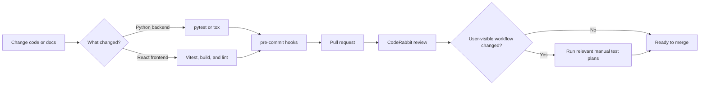

# Testing and Quality Checks

docsfy uses several layers of testing instead of one giant quality gate. Fast automated checks catch backend and frontend regressions, `pre-commit` blocks common mistakes before they reach git, CodeRabbit adds pull-request review automation, and the manual plans in `test-plans/` verify real user workflows from login to documentation generation.

## Quick Start

If you want a strong default before you open or update a pull request, run:

```bash
tox

cd frontend
npm test
npm run build
npm run lint

cd ..
pre-commit run --all-files
```

If your change affects login, generation, real-time updates, docs output, or the CLI, also run the relevant manual plan in `test-plans/`.

> **Note:** The quality automation you can inspect in this repository lives in `tox.toml`, `.pre-commit-config.yaml`, `.coderabbit.yaml`, the frontend test and build configs, and the manual plans under `test-plans/`.



## Pytest

`pytest` is the main automated runner for the Python side of docsfy. The checked-in configuration is deliberately small:

```toml
[project.optional-dependencies]
dev = ["pytest", "pytest-asyncio", "pytest-xdist"]

[tool.pytest.ini_options]
asyncio_mode = "auto"
testpaths = ["tests"]
pythonpath = ["src"]
```

That setup gives you three useful guarantees: async tests work without extra boilerplate, test discovery is constrained to `tests/`, and imports resolve from `src/` so the suite exercises the package code directly.

Most backend tests run the FastAPI app in-process instead of booting a separate server. That keeps runs fast and makes failures easier to debug. For example, `tests/test_api_projects.py` exercises the generate endpoint like this:

```python
async def test_generate_starts(client: AsyncClient) -> None:
    """POST /api/generate starts generation (mock create_task), returns 202."""
    with patch("docsfy.api.projects.asyncio.create_task") as mock_task:
        mock_task.side_effect = lambda coro: coro.close()
        response = await client.post(
            "/api/generate",
            json={"repo_url": "https://github.com/org/repo.git"},
        )
    assert response.status_code == 202
    body = response.json()
    assert body["project"] == "repo"
    assert body["status"] == "generating"
```

WebSocket behavior is covered too. `tests/test_websocket.py` verifies that authenticated clients receive the initial sync payload:

```python
with sync_client.websocket_connect(f"/api/ws?token={TEST_ADMIN_KEY}") as ws:
    data = ws.receive_json()
    assert data["type"] == "sync"
    assert "projects" in data
    assert "known_models" in data
    assert "known_branches" in data
```

The backend suite is broad. The checked-in test files cover auth, admin APIs, project APIs, storage, repository operations, renderer behavior, post-processing, CLI commands, dashboard routes, integration flows, and WebSocket updates. It even includes doc-quality features such as version detection, stale-reference cleanup, cross-linking, and Mermaid pre-rendering.

> **Note:** Backend route tests do not require a full production frontend build. `tests/conftest.py` creates a minimal `frontend/dist/index.html` for SPA catch-all tests.

> **Tip:** If you want the exact backend `pytest` command the repository defines, `tox` wraps `uv run --extra dev pytest -n auto tests`.

## Vitest

The frontend uses `Vitest` with Testing Library. The main scripts in `frontend/package.json` are:

```json
"scripts": {
  "dev": "vite",
  "build": "tsc -b && vite build",
  "lint": "eslint .",
  "preview": "vite preview",
  "test": "vitest run"
}
```

And the checked-in Vitest config in `frontend/vitest.config.ts` is straightforward:

```ts
export default defineConfig({
  test: {
    environment: 'jsdom',
    globals: true,
    setupFiles: './src/test/setup.ts',
  },
  resolve: {
    alias: {
      '@': fileURLToPath(new URL('./src', import.meta.url)),
    },
  },
})
```

That means frontend tests run in a browser-like `jsdom` environment, can use global test helpers, and load `frontend/src/test/setup.ts`, which imports `@testing-library/jest-dom/vitest`.

A representative example from `frontend/src/pages/LoginPage.test.tsx`:

```tsx
describe('LoginPage', () => {
  it('renders username and password inputs', () => {
    renderLogin()
    expect(screen.getByLabelText('Username')).toBeInTheDocument()
    expect(screen.getByLabelText('Password')).toBeInTheDocument()
  })

  it('renders the submit button', () => {
    renderLogin()
    expect(screen.getByRole('button', { name: 'Sign In' })).toBeInTheDocument()
  })
})
```

In practice, the frontend quality checks are split across three commands:
- `npm test` runs the Vitest suite
- `npm run build` runs `tsc -b` before Vite builds, so TypeScript errors fail the build
- `npm run lint` runs ESLint

`frontend/eslint.config.js` applies recommended JavaScript, TypeScript, React Hooks, and Vite refresh rules to `**/*.{ts,tsx}`, so linting and testing are separate checks on purpose.

> **Note:** The checked-in Vitest coverage is currently narrow. Right now it is centered on `frontend/src/pages/LoginPage.test.tsx`, so user-visible frontend changes still deserve careful manual testing.

## tox

`tox` is the repository’s repeatable backend test wrapper. The entire checked-in config fits on a few lines:

```toml
skipsdist = true

envlist = ["unittests"]

[env.unittests]
deps = ["uv"]
commands = [["uv", "run", "--extra", "dev", "pytest", "-n", "auto", "tests"]]
```

A plain `tox` run executes the `unittests` environment, installs `uv`, and runs the backend suite with `pytest-xdist` parallelism via `-n auto`.

A couple of practical takeaways:
- `tox` is focused on backend tests, not the frontend
- `skipsdist = true` means it is not trying to build a package artifact before testing
- the parallelism lives in the `tox` command, not in the base `pytest` config

Use `tox` when you want the repository’s exact backend command, not a hand-assembled local variation.

> **Tip:** Use `pytest` for fast iteration while you are working, then use `tox` before you ship the change.

## Pre-Commit Hooks

`pre-commit` is the broadest single local quality gate in this repository. It combines file hygiene checks, Python linting and formatting, type checking, and secret scanning.

Here is the most relevant part of `.pre-commit-config.yaml`:

```yaml
- repo: https://github.com/pre-commit/pre-commit-hooks
  rev: v6.0.0
  hooks:
    - id: check-added-large-files
    - id: check-docstring-first
    - id: check-executables-have-shebangs
    - id: check-merge-conflict
    - id: detect-private-key
    - id: mixed-line-ending
    - id: debug-statements
    - id: trailing-whitespace
      args: [--markdown-linebreak-ext=md]
    - id: end-of-file-fixer
    - id: check-ast
    - id: check-builtin-literals
    - id: check-toml

# flake8 retained for RedHatQE M511 plugin; ruff handles standard linting
- repo: https://github.com/PyCQA/flake8
  rev: 7.3.0
  hooks:
    - id: flake8
      args: [--config=.flake8]

- repo: https://github.com/Yelp/detect-secrets
  rev: v1.5.0
  hooks:
    - id: detect-secrets

- repo: https://github.com/astral-sh/ruff-pre-commit
  rev: v0.15.8
  hooks:
    - id: ruff
    - id: ruff-format

- repo: https://github.com/gitleaks/gitleaks
  rev: v8.30.0
  hooks:
    - id: gitleaks

- repo: https://github.com/pre-commit/mirrors-mypy
  rev: v1.19.1
  hooks:
    - id: mypy
      exclude: (tests/)
```

That hook set does a lot of work:
- `ruff` and `ruff-format` handle day-to-day Python linting and formatting
- `flake8` is kept specifically for the RedHatQE `M511` rule; `.flake8` narrows it to `select=M511`
- `mypy` is part of the hook set, but it excludes `tests/`
- `detect-private-key`, `detect-secrets`, and `gitleaks` give you multiple chances to catch secrets before commit
- the whitespace hook is configured for Markdown line breaks, which helps protect docs formatting

The config also includes a `ci:` section with `autofix_prs: false` and a custom autoupdate commit message. In other words, the repository is ready for automated hook runs, but it is not configured to silently rewrite pull requests.

> **Tip:** `pre-commit run --all-files` is the best one-command sweep before you push, especially after refactors, dependency changes, or wide docs edits.

## Type Checks

docsfy uses strict type checking on both the Python and TypeScript sides.

For Python, `mypy` is configured in `pyproject.toml` with a strict baseline:

```toml
[tool.mypy]
check_untyped_defs = true
disallow_any_generics = true
disallow_incomplete_defs = true
disallow_untyped_defs = true
no_implicit_optional = true
show_error_codes = true
warn_unused_ignores = true
strict_equality = true
extra_checks = true
warn_unused_configs = true
warn_redundant_casts = true
```

This is not a best-effort setup. The checked-in app code is expected to be annotated and type-consistent.

On the frontend, both `frontend/tsconfig.app.json` and `frontend/tsconfig.node.json` enable strict TypeScript checks:

```json
"noEmit": true,
"strict": true,
"noUnusedLocals": true,
"noUnusedParameters": true,
"noFallthroughCasesInSwitch": true,
"noUncheckedSideEffectImports": true
```

Because the build script is `tsc -b && vite build`, `npm run build` is the repository’s real frontend type-check command.

> **Note:** The checked-in `mypy` hook excludes `tests/`, so strict Python type enforcement is aimed at application code rather than the test suite.

## Secret Scanning

This repository scans for secrets in layers. `detect-private-key` catches obvious keys, `detect-secrets` flags secret-like values, and `gitleaks` adds another scanner with its own rules.

The gitleaks allowlist is intentionally narrow:

```toml
[extend]
useDefault = true

[allowlist]
paths = [
    '''tests/test_repository\.py''',
]
```

The test suite also marks clearly fake values inline when scanners would otherwise create noise. For example, `tests/test_api_auth.py` contains this intentionally invalid credential:

```python
response = await unauthed_client.post(
    "/api/auth/login",
    json={
        "username": "someone",
        "api_key": "totally-wrong",  # pragma: allowlist secret
    },
)
```

You will see the same `# pragma: allowlist secret` pattern in other test files where obviously fake keys, passwords, or SHAs would otherwise trigger scanners.

> **Warning:** Treat allowlists as exceptions, not convenience. Fake test values are acceptable only when they are clearly fake and explicitly marked. Real credentials should stay out of tracked files.

## Review Automation

Pull-request review automation is configured in `.coderabbit.yaml`. The repository tells CodeRabbit to auto-review pull requests into `main`, use an assertive review profile, and request changes when it finds critical issues.

```yaml
reviews:
  profile: assertive
  request_changes_workflow: true
  auto_review:
    auto_pause_after_reviewed_commits: 0
    enabled: true
    drafts: false
    base_branches:
      - main

  tools:
    ruff:
      enabled: true
    pylint:
      enabled: true
    eslint:
      enabled: true
    shellcheck:
      enabled: true
    yamllint:
      enabled: true
    gitleaks:
      enabled: true
    semgrep:
      enabled: true
    actionlint:
      enabled: true
    hadolint:
      enabled: true
```

This matters for two reasons. First, review-time automation goes beyond the local hook set by adding tools such as `pylint`, `semgrep`, `actionlint`, and `hadolint`. Second, security and style checks remain part of the pull-request process, not just local development.

CodeRabbit is useful, but it is not a substitute for local testing. Treat it as an extra reviewer, not as your primary test runner.

> **Tip:** The fastest review cycle is still: run the relevant local checks first, then let CodeRabbit focus on what humans tend to miss in diffs.

## Manual End-to-End Test Plans

The manual plans in `test-plans/` are the acceptance-test layer. Start with `test-plans/e2e-ui-test-plan.md`. It defines the shared rules, the live server URL (`http://localhost:8800`), the test repository, the execution order, and the master map of all sub-plans. It also requires each subsection to be executed and logged in order, which makes the plans closer to an audit trail than a loose checklist.

The current plans cover:
- authentication and roles in `test-plans/e2e-01-auth-and-roles.md`
- generation and dashboard behavior in `test-plans/e2e-02-generation-and-dashboard.md`
- docs quality and UI in `test-plans/e2e-03-docs-quality-and-ui.md`
- isolation, logout, and direct URL authorization in `test-plans/e2e-04-isolation-and-auth.md`
- incremental updates in `test-plans/e2e-05-incremental-updates.md`
- delete and owner scoping in `test-plans/e2e-06-delete-and-owner.md`
- UI component behavior in `test-plans/e2e-07-ui-components.md`
- cross-model updates in `test-plans/e2e-08-cross-model-updates.md`
- cleanup and teardown in `test-plans/e2e-09-cleanup.md`
- branch support in `test-plans/e2e-10-branch-support.md`
- WebSocket behavior in `test-plans/e2e-11-websocket.md`
- CLI workflows in `test-plans/e2e-12-cli.md`
- post-generation pipeline checks in `test-plans/e2e-13-post-generation-pipeline.md`

These plans are deliberately concrete. They combine browser automation, API calls, polling loops, and CLI commands instead of relying on vague manual instructions.

The WebSocket plan checks a real browser session opening a socket to the app:

```shell
agent-browser javascript "new Promise(resolve => { const ws = new WebSocket('ws://localhost:8800/api/ws'); ws.onopen = () => { resolve('connected'); ws.close(); }; ws.onerror = () => resolve('error'); setTimeout(() => resolve('timeout'), 5000); })"
```

That same plan also covers unauthenticated rejection, sync messages, progress events, reconnect behavior, and the SPA's polling fallback.

The CLI plan exercises the user-facing `docsfy` command against the live server:

```shell
docsfy generate https://github.com/myk-org/for-testing-only --provider gemini --model gemini-2.5-flash --force
```

Beyond generation, the CLI plan also covers `config init`, `--watch`, `list`, `status`, `delete`, admin user commands, and `abort`.

The post-generation pipeline plan is especially useful for docsfy itself. It checks version footer detection, Mermaid rendering, related pages, validation stages, cross-linking stages, and a performance baseline for generation.

> **Note:** `test-plans/e2e-09-cleanup.md` is designed to run last, after the other plans.

> **Note:** `test-plans/e2e-13-post-generation-pipeline.md` treats Mermaid rendering as environment-dependent. It explicitly blocks the diagram-rendering check if `mmdc` is not installed.

> **Tip:** The manual plans matter most for user-visible changes. The backend automated suite is broad, but the current frontend unit-test coverage is much smaller.

## Choosing the Right Check

| If you changed... | Start with... | Add this when needed |
|---|---|---|
| Python APIs, auth, storage, repository logic, rendering, post-processing, or CLI behavior | `tox` or backend `pytest` | `pre-commit run --all-files` |
| React components or frontend behavior | `npm test`, `npm run build`, `npm run lint` | relevant plan in `test-plans/` |
| Files that might affect formatting, linting, typing, or secret detection | `pre-commit run --all-files` | targeted backend or frontend tests |
| Login, generation, status pages, WebSocket behavior, docs output, branch handling, or CLI workflows | relevant plan in `test-plans/` | the matching automated checks above |

In practice, the safest path is small, fast checks first and workflow checks last: `pytest` and `Vitest` catch regressions quickly, `tox` makes backend runs repeatable, `pre-commit` keeps the repository clean, CodeRabbit scrutinizes pull requests, and the manual plans prove the product still works the way users experience it.


## Related Pages

- [Local Development](local-development.html)
- [Deployment and Runtime](deployment-and-runtime.html)
- [Security Considerations](security-considerations.html)
- [Troubleshooting](troubleshooting.html)
- [Generating Documentation](generating-documentation.html)