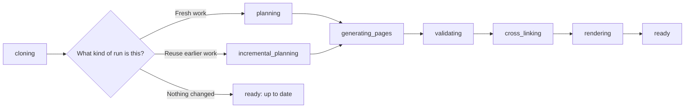

# Track Generation Progress

Keep an eye on a generation so you know whether to wait, retry, or stop it before spending more AI time. This guide shows how to follow a run in the dashboard and from the terminal, and how to tell the difference between a normal long run and a fast "already up to date" result.

## Prerequisites
- A generation has already been started. If not, see [Generate Your First Docs Site](generate-your-first-docs-site.html).
- To abort a run, sign in as a `user` or `admin`. A `viewer` can monitor progress, but cannot stop or regenerate runs.
- For terminal examples, configure `docsfy` to reach your server. See [CLI Command Reference](cli-command-reference.html) and [Configuration Reference](configuration-reference.html).

## Quick Example

```shell
docsfy generate https://github.com/myk-org/for-testing-only --provider gemini --model gemini-2.5-flash --watch
```

```text
Project: for-testing-only
Branch: main
Status: generating
Watching generation progress...
[generating] cloning
[generating] planning
[generating] generating_pages (3 pages)
Generation complete! (9 pages)
```

Use `--watch` when you want live terminal updates until the run finishes as `ready`, `error`, or `aborted`.

## Step-by-step

1. Open the exact variant you want to watch.

   In the dashboard sidebar, expand the repository and branch, then select the provider/model variant. Even when a repository group is collapsed, docsfy still shows how many variants are `ready`, `generating`, `failed`, or `aborted`, which makes active work easy to spot.

2. Check the status badge first.

   | Status | What it means | What to do next |
   | --- | --- | --- |
   | `generating` | The run is still active. | Keep watching, or abort if you started the wrong run. |
   | `ready` | The docs finished successfully. | Open or download the result. See [View, Download, and Publish Docs](view-download-and-publish-docs.html). |
   | `error` | The run failed. | Regenerate after fixing the problem. |
   | `aborted` | A user stopped the run. | Review the message, then regenerate or delete the variant. |

3. Read the activity log and progress bar together.



   | Stage | What you are waiting for |
   | --- | --- |
   | `cloning` | docsfy is preparing the repository source. |
   | `planning` | docsfy is building a fresh documentation plan. |
   | `incremental_planning` | docsfy is deciding what can be reused from an earlier variant. |
   | `generating_pages` | Pages are being written or updated. |
   | `validating` | The generated pages are being checked against the repository. |
   | `cross_linking` | Cross-page links are being added. |
   | `rendering` | The final docs site is being built. |

> **Note:** The progress bar appears only after planning finishes, because docsfy does not know the total page count until the plan exists.

4. Interpret the page counter correctly.

   `X of Y pages` tracks page writing, not the whole run. If the counter reaches `Y of Y` and the status still says `generating`, docsfy is usually finishing `validating`, `cross_linking`, or `rendering`.

> **Tip:** Treat `ready` as the real finish line. The page counter can hit `100%` before the final site is done.

5. Recognize the fast-success case.

   A run can finish quickly without rebuilding everything. When docsfy decides the target docs are already current, the variant still ends as `ready`, and the dashboard shows **Documentation is already up to date.**

6. Abort a run when you need to stop it.

   Open the generating variant, click `Abort Generation`, and confirm the dialog. The variant stays in the list with status `aborted`, so you can review what happened and start again with different settings if needed.

> **Warning:** Aborting discards in-flight progress for that run.

7. Use the finished variant right away.

   When the status changes to `ready`, the detail view shows `View Documentation` and `Download`. See [View, Download, and Publish Docs](view-download-and-publish-docs.html) for the next step.

<details><summary>Advanced Usage</summary>

Monitor a repository from the terminal without opening the dashboard:

```shell
docsfy status for-testing-only
```

Use that when you want to scan every variant for the repository.

```shell
docsfy status for-testing-only --branch main --provider gemini --model gemini-2.5-flash
```

Use the fully specified form when you want one variant's current status, stage, page count, update time, and commit.

Abort a specific running variant from the terminal:

```shell
docsfy abort for-testing-only --branch main --provider gemini --model gemini-2.5-flash
```

This is the safest abort form when the same repository may be running under more than one branch or model.

You can also use the shorter command:

```shell
docsfy abort for-testing-only
```

That shortcut works only when exactly one active variant matches that repository name.

A few progress patterns are worth knowing:

- A non-force regenerate can reuse earlier work, so the log may show `incremental_planning` instead of `planning`.
- Incremental runs can show a page count above `0` sooner than a full regenerate.
- A no-op regenerate ends as `ready` and shows **Documentation is already up to date.**
- If the dashboard stops updating instantly, leave it open for a moment before refreshing; it retries live updates automatically.
- If `--watch` disconnects, rerun `docsfy status ...` to check the latest state.

See [CLI Command Reference](cli-command-reference.html) for more command syntax.

</details>

## Troubleshooting
- **`Abort Generation` is missing:** your account is probably `viewer`. `viewer` can monitor accessible variants, but only `user` and `admin` can stop runs. See [Manage Users, Roles, and Access](manage-users-roles-and-access.html) for details.
- **The counter says `100%` but the run is still `generating`:** page writing is done, but docsfy is still validating, cross-linking, or rendering.
- **`docsfy abort <name>` says more than one variant is active:** rerun the command with `--branch`, `--provider`, and `--model`.
- **Abort says the run already finished or is still in progress:** refresh status, wait a moment, and retry only if the variant is still `generating`.
- **A run changed from `generating` to `error` after a restart:** the server marks interrupted runs as failed instead of leaving them stuck forever. Start the run again.

## Related Pages

- [Generate Documentation](generate-documentation.html)
- [View, Download, and Publish Docs](view-download-and-publish-docs.html)
- [Regenerate for New Branches and Models](regenerate-for-new-branches-and-models.html)
- [Manage docsfy from the CLI](manage-docsfy-from-the-cli.html)
- [WebSocket Reference](websocket-reference.html)