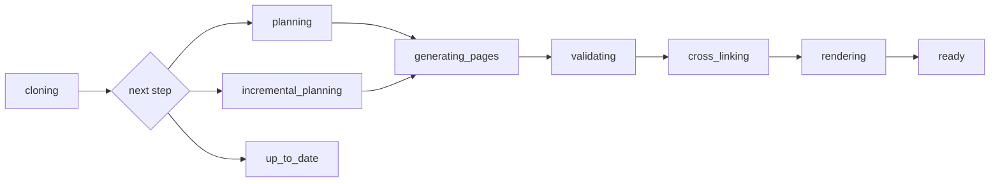

# Tracking Generation Progress

Use docsfy's live progress views to decide whether a generation is moving normally, already finished, or worth stopping before it spends more time and AI usage. This page shows the fastest ways to watch a run in the dashboard and from the CLI.

## Prerequisites

- Start a generation first if you do not already have one running. See [Generating Documentation](generate-documentation.html).
- For terminal examples, configure the `docsfy` CLI first. See [Managing docsfy from the CLI](manage-docsfy-from-the-cli.html).
- Use a `user` or `admin` account if you may need to abort a run. `viewer` can monitor a run but cannot stop it.

## Quick Example

```shell
docsfy generate https://github.com/myk-org/for-testing-only --provider gemini --model gemini-2.5-flash --watch
```

Run this when you want one command that starts a generation and keeps printing progress until it reaches `ready`, `error`, or `aborted`.

## Step-by-Step

### 1. Open the exact variant you want to watch

In the dashboard sidebar, expand the repository and branch, then select the provider/model variant. Collapsed repository groups still show how many variants are ready, generating, failed, or aborted, which makes active work easy to spot when you have several variants.

### 2. Check the status first

| Status | What it means | What to do |
| --- | --- | --- |
| `Generating` | The run is still active. | Keep watching, or abort if you started the wrong run. |
| `Ready` | The docs finished successfully. | Open or download the finished variant. |
| `Error` | The run failed. | Read the message, fix the problem, and start again. |
| `Aborted` | A user stopped the run. | Review the message and regenerate if needed. |

### 3. Use the activity log and page counter together

Stay on the variant detail view while the run is active. The Activity Log and progress bar update live, so you do not need to refresh the page manually.



| CLI stage | What you will see in the dashboard | What it means |
| --- | --- | --- |
| `cloning` | `Cloning repository...` | docsfy is preparing the repository source. |
| `planning` | `Planning documentation structure...` | docsfy is building a full docs plan. |
| `incremental_planning` | `Planning incremental update...` | docsfy is deciding what can be reused from an earlier run. |
| `generating_pages` | `Generating page X of Y...` and `Generated page X of Y` | docsfy is writing or updating pages. |
| `validating` | `Validating documentation against codebase...` | docsfy is checking the generated pages against the repository. |
| `cross_linking` | `Adding cross-page links...` | docsfy is fixing cross-page references. |
| `rendering` | `Rendering documentation site...` | docsfy is building the final site. |
| `up_to_date` | `Documentation is already up to date.` | Nothing changed that required a rebuild. |

> **Note:** The progress bar appears only after planning finishes, because docsfy does not know the total page count until the plan exists.

### 4. Know when a run is actually finished

`X of Y pages` measures page generation only. If the counter reaches `Y of Y` and the status still says `Generating`, docsfy is usually finishing `validating`, `cross_linking`, or `rendering`.

A healthy run does not have to increase the page counter every second. It is still healthy if the stage changes, the activity log keeps moving, or it finishes quickly as already up to date.

> **Tip:** Treat `Ready` as the real finish line. A run can hit `100%` page generation before the final site is fully built.

### 5. Recognize the fast successful case

If a regenerate finishes quickly and the ready view says `Documentation is already up to date.`, the run succeeded without rebuilding pages. This is normal when the source content did not change in a way that requires new docs output.

If you see `Planning incremental update...` instead of full planning, docsfy is reusing earlier work. That is also a normal, healthy path.

### 6. Abort when the run is clearly the wrong one

Click `Abort Generation`, confirm the dialog, and wait for the status to change to `Aborted`. Use this when you started the wrong branch, model, or repository, or when you want to stop a duplicate run and start over cleanly.

> **Warning:** Aborting discards in-flight progress for that run.

## Advanced Usage

```shell
docsfy status for-testing-only --branch main --provider gemini --model gemini-2.5-flash
```

Use this when a run is already in progress and you want a snapshot of its status, stage, page count, last update time, commit, and any error message.

```shell
docsfy list --status generating
```

Use this to scan all active runs from the terminal. The table includes the page count and generation ID, which is useful when the same repository has multiple active variants.

```shell
docsfy status <generation-id>
docsfy abort <generation-id>
```

Copy the generation ID from the sidebar or the variant details when you want to inspect or stop one exact run without typing the full repository, branch, provider, and model combination.

```shell
docsfy abort for-testing-only --branch main --provider gemini --model gemini-2.5-flash
```

Use the fully specified abort command when more than one variant of the same repository might be running.

```shell
docsfy abort for-testing-only
```

Use the short form only when exactly one active variant matches that project name.

Incremental runs can start with some pages already counted, because docsfy may reuse unchanged pages from the previous variant. That is expected behavior, not a stuck progress bar.

> **Tip:** The Activity Log keeps auto-scrolling only while you are already near the bottom, so you can scroll up to inspect earlier steps without losing your place.


> **Tip:** If live updates pause briefly, leave the page open for a moment. The dashboard retries automatically and falls back to periodic refresh if needed.

See [CLI Command Reference](cli-command-reference.html) for full command syntax. If you intentionally run several branches or model combinations at the same time, see [Regenerating for New Branches and Models](regenerate-for-new-branches-and-models.html).

## Troubleshooting

- **`Abort Generation` is missing:** You are probably signed in as `viewer`. `viewer` can monitor accessible variants, but only `user` and `admin` can stop a run.
- **The progress bar says `100%` but the run still shows `Generating`:** Page writing is done, but docsfy is still validating, cross-linking, or rendering. Wait for `Ready`, `Error`, or `Aborted`.
- **`docsfy abort <name>` says multiple active variants were found:** Run it again with `--branch`, `--provider`, and `--model`, or use the generation ID.
- **The run changed from `Generating` to `Error` after a restart:** docsfy marks interrupted runs as failed with `Server restarted during generation` instead of leaving them stuck forever. Start the run again.
- **Abort says the generation already finished or that abort is still in progress:** Refresh the status, wait a few seconds, and retry only if the variant still shows `Generating`.

See [Fixing Setup and Generation Problems](fix-setup-and-generation-problems.html) for deeper failure diagnosis.

## Related Pages

- [Generating Documentation](generate-documentation.html)
- [Viewing and Downloading Docs](view-and-download-docs.html)
- [Regenerating After Code Changes](regenerate-after-code-changes.html)
- [Regenerating for New Branches and Models](regenerate-for-new-branches-and-models.html)
- [Fixing Setup and Generation Problems](fix-setup-and-generation-problems.html)