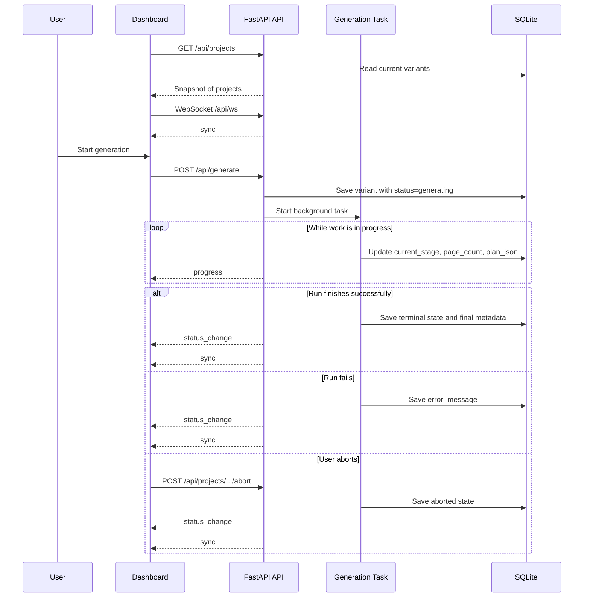

# Tracking Progress and Status

docsfy tracks each documentation variant at two levels:

- `status` tells you whether the variant is still running or has finished.
- `current_stage` tells you what docsfy is doing right now while the run is in progress.

The dashboard first loads a snapshot from `/api/projects`, then keeps that snapshot live over `/api/ws`. That is why the badge, activity log, page count, and sidebar can update without a manual refresh.

> **Note:** `ready` is a final status. It is not one of the in-flight stage names shown during generation.

## What the statuses mean

| Status | Meaning | What you will see |
| --- | --- | --- |
| `generating` | docsfy is still working | A blue generating badge, a live activity log, and a progress bar once the plan exists |
| `ready` | The docs finished successfully | A success or up-to-date message, final page count, commit, last-generated time, and buttons to open or download the docs |
| `error` | The run failed | An error message in the detail view and, if you have write access, a regenerate form |
| `aborted` | A user stopped the run | An aborted message in the detail view and, if you have write access, regenerate and delete options |

A variant can also become `ready` without a long full run. When docsfy sees that the selected commit does not need new docs, it uses `current_stage="up_to_date"` and the ready view says **Documentation is already up to date.**

## In-Flight Stages

The dashboard uses this exact stage list when it builds the activity log:

```26:34:frontend/src/lib/constants.ts
export const GENERATION_STAGES = [
  'cloning',
  'planning',
  'incremental_planning',
  'generating_pages',
  'validating',
  'cross_linking',
  'rendering',
] as const
```

Notice that the list ends at `rendering`. Terminal outcomes like `ready`, `error`, and `aborted` are handled separately from the in-flight stages.

Here is what each stage means in practice:

- `cloning`: docsfy is preparing the repository source. For remote repositories that means cloning; for admin-only local paths it is usually very brief.
- `planning`: docsfy is building a fresh documentation plan for the repository.
- `incremental_planning`: docsfy found an earlier ready variant and is deciding which pages actually need to change.
- `generating_pages`: markdown pages are being written or updated.
- `validating`: the generated pages go through a validation pass.
- `cross_linking`: docsfy adds cross-page links after validation.
- `rendering`: the generated content is turned into the final static site.

> **Tip:** `incremental_planning` usually means docsfy is reusing prior work instead of rebuilding everything from scratch.

> **Note:** `up_to_date` can appear in `current_stage`, but it is a special successful no-op marker, not one of the long-running in-flight stages above.

## WebSocket-Driven Updates



On connect, the server sends an initial `sync`. While a run is still active, it sends `progress` updates. When a variant reaches `ready`, `error`, or `aborted`, it sends `status_change` and then a full `sync` so every open dashboard stays consistent.

```131:155:src/docsfy/api/projects.py
await update_project_status(project_name, ai_provider, ai_model, **ups_kwargs)

if status in _TERMINAL_STATUSES:
    await notify_status_change(
        gen_key=gen_key,
        status=status,
        page_count=page_count,
        last_generated=(
            datetime.now(UTC).strftime("%Y-%m-%d %H:%M:%S")
            if status == "ready"
            else None
        ),
        last_commit_sha=last_commit_sha,
        error_message=error_message,
    )
    await notify_sync()
else:
    await notify_progress(
        gen_key=gen_key,
        status=status,
        current_stage=current_stage if isinstance(current_stage, str) else None,
        page_count=page_count,
        plan_json=plan_json,
        error_message=error_message,
    )
```

Live updates are scoped to the people who should see them: admins, the project owner, and users who were granted access to that project.

On the browser side, the dashboard patches `progress` and `status_change` messages into its local project list. If a message arrives before that variant exists in memory, the dashboard falls back to a fresh `/api/projects` request so the UI still catches up cleanly.

### If the connection drops

The browser app does not leave the dashboard stale if the socket drops. It retries a few times, then falls back to polling `/api/projects` every 10 seconds.

```81:108:frontend/src/lib/websocket.ts
private attemptReconnect(): void {
  if (this.reconnectAttempts >= this.maxReconnectAttempts) {
    console.debug('[WS] Falling back to polling')
    this.startPolling()
    return
  }
  const delay = this.getBackoffDelay()
  this.reconnectAttempts++
  console.debug('[WS] Reconnecting, attempt', this.reconnectAttempts)
  this.reconnectTimer = setTimeout(() => this.connect(true), delay)
}

private startPolling(): void {
  if (this.pollingTimer) return
  this.pollingTimer = setInterval(async () => {
    try {
      const data = await api.get<ProjectsResponse>('/api/projects')
      const syncMessage: WebSocketMessage = {
        type: 'sync' as const,
        projects: data.projects,
        known_models: data.known_models,
        known_branches: data.known_branches,
      }
      this.handlers.forEach(handler => handler(syncMessage))
    } catch {
      /* ignore polling errors */
    }
  }, WS_POLLING_FALLBACK_MS)
}
```

In the current code, the backend heartbeat is 30 seconds, the pong timeout is 10 seconds, the server closes after 2 missed pongs, and the browser polling fallback interval is 10000 ms.

> **Tip:** If the dashboard stops updating instantly but refreshes within about 10 seconds, the polling fallback is probably working exactly as designed.

If you run the frontend through Vite in development, WebSocket proxying is already enabled:

```15:23:frontend/vite.config.ts
server: {
  host: '0.0.0.0',
  port: 5173,
  proxy: {
    '/api': {
      target: API_TARGET,
      changeOrigin: true,
      ws: true,
    },
```

> **Warning:** If you put docsfy behind another reverse proxy or load balancer, it also needs to allow WebSocket upgrades for `/api/ws`. Otherwise the browser will fall back to slower polling, and CLI live watch can fail entirely.

## Page Counts and the Progress Bar

`page_count` is not guessed in the browser. The generator updates it on the server after each markdown page is written by counting the cached page files on disk.

```326:343:src/docsfy/generator.py
# Update page count in DB if project_name provided
if project_name:
    from docsfy.storage import update_project_status

    # Count cached pages to get current total
    existing_pages = len(list(cache_dir.glob("*.md")))
    await update_project_status(
        project_name,
        ai_provider,
        ai_model,
        owner=owner,
        status="generating",
        page_count=existing_pages,
        branch=branch,
    )
    if on_page_generated is not None:
        try:
            await on_page_generated(existing_pages)
```

The progress bar uses that `page_count` together with the planned total number of pages from `plan_json`:

```459:499:frontend/src/components/shared/VariantDetail.tsx
const totalPages = getTotalPages(project.plan_json)
const progressPercent = totalPages > 0 ? Math.round((project.page_count / totalPages) * 100) : 0

// ...

{totalPages > 0 && (
  <div className="flex flex-col gap-1.5">
    <Progress value={progressPercent}>
      <span className="text-sm font-medium">Progress</span>
    </Progress>
    <span className="text-xs text-muted-foreground">
      {project.page_count} of {totalPages} pages ({progressPercent}%)
    </span>
  </div>
)}
```

That leads to a few useful rules of thumb:

- The progress bar only appears after planning is complete, because docsfy does not know the total page count before the plan exists.
- A force full regeneration resets the count to `0`.
- An incremental regeneration can start above `0`, because unchanged cached pages are reused immediately.
- Reaching `N of N pages` does not always mean the run is done yet. Validation, cross-linking, and rendering happen after page generation.

> **Tip:** If you see `100%` but the badge still says `Generating`, docsfy is usually in `validating`, `cross_linking`, or `rendering`. Wait for the status to become `ready` before treating the docs as finished.

## How the Dashboard Reflects In-Flight Work

When you start a generation from the dashboard, docsfy immediately switches to that variant view instead of making you go find it manually. That selected variant also causes the matching repo and branch to auto-expand in the sidebar. If the new variant has not arrived over WebSocket quickly enough, the page does a fallback fetch to pull it in.

```271:304:frontend/src/pages/DashboardPage.tsx
// After generation starts, immediately select the new variant.
// If WebSocket sync doesn't deliver the variant within 5s, fetch via HTTP.
function handleGenerated(name: string, branch: string, provider: string, model: string) {
  console.debug('[Dashboard] Generate success:', name, branch, provider, model)
  setSelectedView({
    type: 'variant',
    name,
    branch,
    provider,
    model,
    owner: username,
  })
  // Clear any previous fallback timeout
  if (generatedTimeoutRef.current) {
    clearTimeout(generatedTimeoutRef.current)
  }
  generatedTimeoutRef.current = setTimeout(async () => {
    generatedTimeoutRef.current = null
    // Check if the variant is already in the projects list
    const found = projects.some(
      (p) => p.name === name && p.branch === branch && p.ai_provider === provider && p.ai_model === model && p.owner === username
    )
    if (!found) {
      console.debug('[Dashboard] New variant not yet in state, fetching via HTTP')
      try {
        const data = await api.get<ProjectsResponse>('/api/projects')
        setProjects(data.projects)
        setKnownModels(data.known_models)
        setKnownBranches(data.known_branches)
      } catch {
        /* best-effort fallback */
      }
    }
  }, WS_POLLING_FALLBACK_MS / 2) // 5s
}
```

The sidebar also makes in-flight work easy to scan even when repo groups are collapsed. Each repo row shows how many variants are `ready`, `generating`, `failed`, or `aborted`:

```355:394:frontend/src/components/shared/ProjectTree.tsx
{!isExpanded && (
  <div className="pl-5 mt-0.5 flex items-center gap-1 text-xs text-muted-foreground">
    <span>{totalVariants} variant{totalVariants !== 1 ? 's' : ''}</span>
    {(counts.ready ?? 0) > 0 && (
      <>
        <span>·</span>
        <span className="flex items-center gap-1">
          <StatusDot status="ready" showTitle={false} className="w-2 h-2" />
          <span className="text-green-500">{counts.ready} ready</span>
        </span>
      </>
    )}
    {(counts.generating ?? 0) > 0 && (
      <>
        <span>·</span>
        <span className="flex items-center gap-1">
          <StatusDot status="generating" showTitle={false} className="w-2 h-2" />
          <span className="text-blue-500">{counts.generating} generating</span>
        </span>
      </>
    )}
    {(counts.error ?? 0) > 0 && (
      <>
        <span>·</span>
        <span className="flex items-center gap-1">
          <StatusDot status="error" showTitle={false} className="w-2 h-2" />
          <span className="text-red-500">{counts.error} failed</span>
        </span>
      </>
    )}
    {(counts.aborted ?? 0) > 0 && (
      <>
        <span>·</span>
        <span className="flex items-center gap-1">
          <StatusDot status="aborted" showTitle={false} className="w-2 h-2" />
          <span className="text-amber-500">{counts.aborted} aborted</span>
        </span>
      </>
    )}
  </div>
)}
```

In the selected variant view, the main panel keeps the info grid, progress bar, activity log, and abort controls live as messages arrive. Once the plan is available, the activity log can show page-by-page entries using the real page titles from that plan.

## Ready, Error, and Aborted

### `ready`

A successful run ends in `ready`. The detail view shows the final page count, commit, last-generated time, and buttons to open or download the generated docs. If nothing changed, docsfy still uses `ready`, but the success message changes to **Documentation is already up to date.**

### `error`

An `error` status means docsfy could not finish. That can happen before generation starts, such as when the provider CLI is unavailable, or later in the pipeline during planning, page generation, validation, cross-linking, or rendering. The detail view shows the backend `error_message`, and if you have write access the regenerate form defaults to **Force full regeneration** so you can retry cleanly.

### `aborted`

An `aborted` status means a user stopped the run from the generating view. The variant stays visible after the abort, so you can still see what happened and choose whether to regenerate or delete it.

> **Warning:** docsfy does not let you delete a variant while it is actively generating. Abort it first, then delete it if you no longer need it.

If the server restarts while a variant is still marked `generating`, docsfy automatically converts that row to `error` so stale work does not look permanently in progress:

```202:208:src/docsfy/storage.py
# Reset orphaned "generating" projects from previous server run
cursor = await db.execute(
    "UPDATE projects SET status = 'error', error_message = 'Server restarted during generation', current_stage = NULL WHERE status = 'generating'"
)
if cursor.rowcount > 0:
    logger.info(
        f"Reset {cursor.rowcount} orphaned generating project(s) to error status"
    )
```

> **Tip:** `docsfy generate <repo> --watch` listens to the same `/api/ws` progress feed from the terminal. It is great for quick terminal feedback, but unlike the browser dashboard it does not fall back to polling if the WebSocket connection fails.

Tracking is simplest if you read the UI in this order: check the variant `status` first, then the `current_stage`, then the page counter. Page counts tell you how far page generation has gone, but a run is only finished when the status becomes `ready`.


## Related Pages

- [WebSocket Protocol](websocket-protocol.html)
- [Generating Documentation](generating-documentation.html)
- [Projects API](projects-api.html)
- [Variants, Branches, and Regeneration](variants-branches-and-regeneration.html)
- [Troubleshooting](troubleshooting.html)