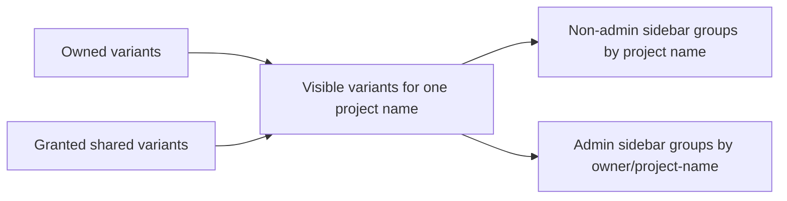

# User and Access Management

docsfy supports one built-in administrator account plus database-backed user accounts. In the web UI the secret is labeled **Password**; in the CLI and API the same value is used as an **API key**.

> **Note:** After a successful browser login, docsfy creates an opaque `docsfy_session` cookie instead of storing the raw password/API key in the cookie itself. Browser sessions last 8 hours by default.

## How access works

docsfy supports three database roles:

| Role | What they can do |
| --- | --- |
| `admin` | See all projects, open the **Users** and **Access** admin panels, create and delete users, rotate any user's password, and grant or revoke project access |
| `user` | Generate documentation, manage their own variants, open projects shared with them, and rotate their own password |
| `viewer` | Open projects they own or have been granted, and rotate their own password, but cannot generate, abort, delete, or regenerate |

There are also two ways to have admin access:

| Admin type | How it works | Can it rotate its own password in the UI/API? |
| --- | --- | --- |
| Built-in admin | Sign in as username `admin` using the `ADMIN_KEY` environment variable | No |
| Database admin user | A normal user account created with role `admin` | Yes |

> **Warning:** The username `admin` is reserved. You cannot create a database user named `admin`, `Admin`, or any other case variation.

## Configure the built-in admin

The built-in admin account comes from the server environment:

```env
# Required: Admin password (minimum 16 characters)
ADMIN_KEY=

# Cookie security (set to false for local HTTP development)
SECURE_COOKIES=true
```

If you use the CLI, the bundled example config stores the same credential as a named server profile:

```toml
[servers.dev]
url = "http://localhost:8000"
username = "admin"
password = "<your-dev-key>"
```

> **Warning:** `config.toml` contains real credentials. The example config explicitly recommends keeping it private with `chmod 600 ~/.config/docsfy/config.toml`.

## Create users

Admins can create users from the dashboard in **Admin -> Users** or from the CLI.

CLI examples:

```bash
docsfy admin users list
docsfy admin users create cli-test-user --role user
```

When you create a user, docsfy returns the generated password/API key once. Auto-generated keys start with `docsfy_`.

> **Warning:** Save the generated password immediately. The UI warns that it will not be shown again, and the API marks create/rotate responses as `Cache-Control: no-store`.

Usernames must:

- be 2 to 50 characters long
- start with a letter or number
- use only letters, numbers, `.`, `_`, or `-`

Choose the role at creation time:

- `admin`: full administrative access
- `user`: normal working account
- `viewer`: read-only access to documentation and shared projects

If you automate user creation directly against the admin API, the request body looks like this:

```json
{"username": "testuser", "role": "user"}
```

## Rotate passwords and API keys

Every database-backed user can rotate their own password from the sidebar's **Change Password** action. That includes `user`, `viewer`, and database-backed `admin` accounts.

You can:

- enter a replacement password yourself
- leave the field empty and let docsfy generate one
- use any custom password/API key that is at least 16 characters long

After a self-service rotation, docsfy deletes the current session cookie and you must sign in again with the new password.

Admins can also rotate another user's password from **Admin -> Users** or from the CLI:

```bash
docsfy admin users rotate-key alice
```

If you want to provide a specific replacement key through automation, the API accepts `new_key`:

```json
{"new_key": "admin-chosen-password-long"}
```

Rotating a user's key invalidates their existing sessions and the old password stops working immediately.

> **Warning:** The built-in `admin` account cannot use self-service key rotation. To change that password, update `ADMIN_KEY` in the environment instead.

> **Warning:** docsfy uses `ADMIN_KEY` when hashing stored user keys. If you change `ADMIN_KEY`, existing user passwords/API keys stop working and all users need new keys.

## Grant and revoke project access

Project sharing is admin-only. Use **Admin -> Access** in the dashboard or the CLI commands below:

```bash
docsfy admin access grant my-repo --username alice --owner admin
docsfy admin access list my-repo --owner admin
docsfy admin access revoke my-repo --username alice --owner admin
```

Access grants are scoped by both:

- project name
- project owner

That owner field matters because two different users can generate documentation for projects with the same name.

A single grant covers all variants of that owner's project. In other words, if you grant access to `my-repo` owned by `admin`, the recipient can see that owner's `main`, `dev`, or other branch variants, plus different provider/model variants for the same project name.

The admin API expects a JSON body like this when granting access:

```json
{"username": "alice", "owner": "admin"}
```

A grant only succeeds when:

- the target user already exists
- the project already exists for the specified owner

> **Tip:** Connected dashboards resync after a grant or revoke, so shared projects appear or disappear without a manual refresh.

## How shared projects appear for non-admin users

For non-admin users, shared projects are still mixed into the normal project list. There is no separate **Shared Projects** section.

What changed is that docsfy now merges shared variants into the same project view for a given project name:

- a regular `user` sees owned projects plus any projects an admin has granted to them
- a `viewer` sees assigned projects, but not generation or destructive actions
- admins still see separate project groups by `owner/project-name`
- non-admins see one project entry per project name, even when some variants are owned and others are shared

The project-details API makes that merge explicit:

```python
variants = await list_variants(name, owner=request.state.username)
# Always merge shared variants so they appear alongside owned ones
seen: set[tuple[str, str, str, str]] = {
    (
        str(v.get("owner", "")),
        str(v.get("branch", DEFAULT_BRANCH)),
        str(v.get("ai_provider", "")),
        str(v.get("ai_model", "")),
    )
    for v in variants
}
accessible = await get_user_accessible_projects(request.state.username)
for proj_name, proj_owner in accessible:
    if proj_name == name and proj_owner:
        shared_variants = await list_variants(name, owner=proj_owner)
        for sv in shared_variants:
            key = (
                str(sv.get("owner", "")),
                str(sv.get("branch", DEFAULT_BRANCH)),
                str(sv.get("ai_provider", "")),
                str(sv.get("ai_model", "")),
            )
            if key not in seen:
                seen.add(key)
                variants.append(sv)
```

The sidebar keeps admins and non-admins intentionally different. The grouping rule in the tree component is a single line:

```ts
const groupKey = isAdmin ? `${p.owner}/${p.name}` : p.name
```



Shared access still lets non-admins open documentation and download ready variants they are allowed to see. Access checks are enforced on the server as well as in the UI.

Important behavior to know:

- If access is granted or revoked while the dashboard is open, the visible project list updates without a manual refresh.
- If access is revoked, direct docs and download URLs start returning `404`.
- Non-admin users still do not delete or abort another person's shared variant. Delete and abort actions stay limited to variants they own.
- New generations always run under the signed-in user, even if they start from a repository that was originally shared with them.
- Shortcut routes such as `/docs/{project}/` and `/api/projects/{name}/download` choose the latest ready variant the signed-in user can access, whether that variant is owned or shared.

> **Note:** docsfy intentionally returns `404` for projects you do not own and have not been granted. That hides whether the project exists at all.

## Delete users

Admins can delete users from **Admin -> Users** or from the CLI:

```bash
docsfy admin users delete alice --yes
```

Deleting a user is a full cleanup operation. docsfy:

- invalidates all of that user's sessions
- deletes projects owned by that user
- removes access grants given to that user
- removes access grants attached to projects owned by that user
- deletes the user's project directory from disk

Two protections are built in:

- you cannot delete your own currently signed-in admin account
- you cannot delete a user while they have an active generation in progress

> **Warning:** User deletion is destructive. If the account owns generated documentation you still need, reassign access or download the docs before deleting the user.

## Quick reference

Create a user:

```bash
docsfy admin users create cli-test-user --role user
```

Rotate a user's password:

```bash
docsfy admin users rotate-key alice
```

List who can access a project:

```bash
docsfy admin access list my-repo --owner admin
```

Share a project:

```bash
docsfy admin access grant my-repo --username alice --owner admin
```

Remove shared access:

```bash
docsfy admin access revoke my-repo --username alice --owner admin
```


## Related Pages

- [Authentication and Roles](authentication-and-roles.html)
- [Admin API](admin-api.html)
- [Authentication API](auth-api.html)
- [Projects, Variants, and Ownership](projects-variants-and-ownership.html)
- [Security Considerations](security-considerations.html)