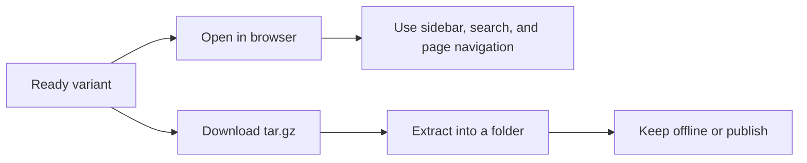

# Viewing and Downloading Docs

You want to open a ready docs site, move through it quickly, and save the exact output as a static bundle. That lets you review the generated docs inside docsfy first, then keep the same files offline or publish them on another static host.

## Prerequisites

- At least one docs variant is in `Ready`. If you still need to create one, see [Generating Documentation](generate-documentation.html).
- You can sign in to the docsfy web app.
- If you want terminal downloads, the CLI is configured to reach your server. See [Managing docsfy from the CLI](manage-docsfy-from-the-cli.html).

## Quick Example

```text
/docs/for-testing-only/main/gemini/gemini-2.5-flash/
```

```shell
docsfy download for-testing-only --branch main --provider gemini --model gemini-2.5-flash
mkdir -p published-docs
tar -xzf for-testing-only-main-gemini-gemini-2.5-flash-docs.tar.gz --strip-components=1 -C published-docs
```

Open that docs path on your docsfy server to browse one exact finished build. Download the matching archive when you want that same build in a folder you can keep, copy to another machine, or publish elsewhere.

## Step-by-Step

1. Decide whether you want the newest ready docs for a project or one exact variant.

| Use this when you want... | Open in the browser | Download it | Archive name |
|---|---|---|---|
| The newest ready docs you can access for a project | `/docs/<project>/` | `docsfy download <project>` | `<project>-docs.tar.gz` |
| One exact branch/provider/model build | `/docs/<project>/<branch>/<provider>/<model>/` | `docsfy download <project> --branch <branch> --provider <provider> --model <model>` | `<project>-<branch>-<provider>-<model>-docs.tar.gz` |

> **Warning:** The short project form can change as newer ready variants finish. Use the exact variant form when you need a stable bookmark, review link, or published artifact.

2. Open the docs site from the dashboard. Select the ready variant you want, then click **View Documentation** to open that exact variant in a new tab. If a run is still working, wait until it reaches `Ready`. See [Tracking Generation Progress](track-generation-progress.html) for the live status workflow.

3. Move around the docs site with the built-in navigation tools. Use the left sidebar to jump between sections and pages, use the search field or the **Search** button in the top bar to find matching pages and text, and use **On this page**, when it appears, to jump between headings in the current page. At the bottom of a page, use **Previous** and **Next** to keep reading in order.

4. Download the same site as a static archive.

```shell
docsfy download <project> --branch <branch> --provider <provider> --model <model>
```

In the web app, the ready variant panel has a **Download** button that starts the same `.tar.gz` download. In the CLI, omit the variant flags only when you want the newest ready variant for that project instead of one exact build. If you need help choosing a branch or model before you download, see [Regenerating for New Branches and Models](regenerate-for-new-branches-and-models.html).

5. Extract the archive into the folder you want to keep or publish.

```shell
mkdir -p published-docs
tar -xzf <archive-name>.tar.gz --strip-components=1 -C published-docs
```

After extraction, `published-docs/` contains the site entry page, page HTML files, static assets, the search index, and the bundled LLM-friendly files. Keep the whole folder together so styling, search, navigation, and footer links continue to work whether you keep it offline or publish it elsewhere.



> **Tip:** The extracted bundle includes `.nojekyll`, so it can be published directly on GitHub Pages-style static hosts.

## Advanced Usage

### Direct Links and Automation

```text
/docs/<project>/<branch>/<provider>/<model>/
/api/projects/<project>/<branch>/<provider>/<model>/download
```

Use the exact variant form when you want everyone to see the same branch, provider, and model. For raw route details and scripted downloads, see [HTTP API and WebSocket Reference](http-api-and-websocket-reference.html).

### Extract with the CLI Instead of Keeping the Archive

```shell
docsfy download <project> --branch <branch> --provider <provider> --model <model> --output ./published-docs
```

With `--output`, the CLI downloads and extracts the archive for you. The extracted files stay inside the archive's top-level folder, so point your static host at the folder that contains `index.html`. See [CLI Command Reference](cli-command-reference.html) for the full flag list.

### Publish the Full Bundle, Not Just the Landing Page

Keep these files in the published copy:

- `assets/` for styling and client-side behavior
- `search-index.json` for built-in search
- `llms.txt` and `llms-full.txt` for the bundled AI-friendly copies
- the generated page `.md` files if you want the links inside `llms.txt` to keep working

> **Warning:** Once you publish the files outside docsfy, docsfy sign-in and project access rules no longer protect them. Use your static host, CDN, or reverse proxy if the published copy must stay private.

### Handle Multiple Owners as an Admin

```shell
docsfy download <project> --branch <branch> --provider <provider> --model <model> --owner <username>
```

```text
/docs/<project>/<branch>/<provider>/<model>/?owner=<username>
```

If multiple owners have the same project name and variant, choose the owner explicitly so you open or download the right copy. For access and sharing rules, see [Managing Users and Access](manage-users-and-access.html).

## Troubleshooting

- If opening a docs URL sends you to the login page, sign in to the web app first.
- If a signed-in user gets `404`, there may be no ready variant for that link, or that user may not have access to the project.
- If `docsfy download` says `--branch`, `--provider`, and `--model` must be provided together, either supply all three or omit all three.
- If the published copy loads without styling or search, upload the whole extracted folder, not just `index.html`.
- If an admin is told to specify an owner, use the exact variant form and choose the owner explicitly.
- If the docs you opened are not the variant you expected, use the exact variant form instead of the short project form.
- If you need help with readiness, access, or failed downloads, see [Fixing Setup and Generation Problems](fix-setup-and-generation-problems.html).

## Related Pages

- [Tracking Generation Progress](track-generation-progress.html)
- [Regenerating for New Branches and Models](regenerate-for-new-branches-and-models.html)
- [Managing docsfy from the CLI](manage-docsfy-from-the-cli.html)
- [HTTP API and WebSocket Reference](http-api-and-websocket-reference.html)
- [Managing Users and Access](manage-users-and-access.html)