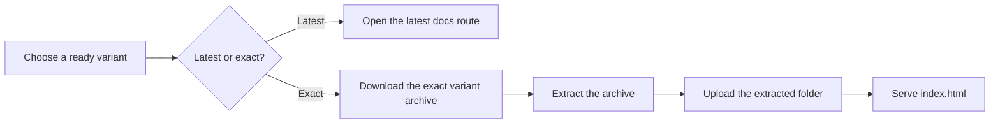

# View, Download, and Publish Docs

Open generated docs when you need a fast browser view, then download the same output when you want a stable artifact to review, archive, or host somewhere else. The key choice is whether you want a moving "latest" link or one exact variant pinned to a branch, provider, and model.

## Prerequisites

- A docs variant already exists and is `ready`.
- You can sign in to docsfy in the browser, or you have a valid API key for `Authorization: Bearer ...`.
- If you use the CLI, `docsfy` is already configured to reach your server.

## Quick Example

```text
$SERVER/docs/<project>/
```

```shell
curl -s -L -H "Authorization: Bearer $API_KEY" \
  "$SERVER/api/projects/<project>/<branch>/<provider>/<model>/download" \
  -o "<project>-<branch>-<provider>-<model>-docs.tar.gz"
mkdir -p published-docs
tar -xzf "<project>-<branch>-<provider>-<model>-docs.tar.gz" \
  --strip-components=1 \
  -C published-docs
```

Open the first URL when you just want the newest ready docs you can access. Use the download command when you want one exact build that you can extract and publish as a normal static site.

## Step-by-Step

1. Choose whether you want a moving link or a pinned build.

| If you want... | Open in the browser | Download the site | Downloaded file |
|---|---|---|---|
| The latest ready docs you can access | `/docs/<project>/` | `/api/projects/<project>/download` | `<project>-docs.tar.gz` |
| One exact build | `/docs/<project>/<branch>/<provider>/<model>/` | `/api/projects/<project>/<branch>/<provider>/<model>/download` | `<project>-<branch>-<provider>-<model>-docs.tar.gz` |

> **Warning:** The short project routes move when a newer ready variant becomes available. Use the full variant URL when you need a stable bookmark, review link, or published release artifact.

2. Open the docs in the browser.

```text
$SERVER/docs/<project>/
$SERVER/docs/<project>/<branch>/<provider>/<model>/
```

If you are using the web app, open the ready variant and click **View Documentation**. Use the full variant URL when the branch, provider, and model must stay fixed.

3. Download the exact site you want to publish.

```shell
curl -s -L -H "Authorization: Bearer $API_KEY" \
  "$SERVER/api/projects/<project>/<branch>/<provider>/<model>/download" \
  -o "<project>-<branch>-<provider>-<model>-docs.tar.gz"
```

If you prefer the web app, click **Download** on the ready variant. Exact downloads are the safest choice for publishing because they stay pinned to the build you selected.

> **Note:** Exact variant downloads return `400` until that variant is `ready`. The short project download returns `404` if there is no ready variant it can use.

4. Extract the archive into a publishable folder.

```shell
mkdir -p published-docs
tar -xzf "<project>-<branch>-<provider>-<model>-docs.tar.gz" \
  --strip-components=1 \
  -C published-docs
ls published-docs
```

After extraction, keep the generated bundle together. The folder includes `index.html`, generated page HTML files, `assets/`, `search-index.json`, `llms.txt`, and `llms-full.txt`.

5. Publish the extracted folder like any other static site.



Upload the contents of `published-docs/` to your static host or web server, and use `index.html` as the entry point. There is no separate external publish command in docsfy; once extracted, the output is a normal static site.

> **Tip:** The generated site includes a `.nojekyll` file, so you can publish it as-is on GitHub Pages-style static hosting.

> **Warning:** Once you publish the files outside docsfy, docsfy's sign-in and access checks no longer protect them. Use your host, CDN, or proxy for access control if the published docs must stay private.

<details><summary>Advanced Usage</summary>

### Download with the CLI

```shell
docsfy download <project>
docsfy download <project> --branch <branch> --provider <provider> --model <model>
docsfy download <project> --branch <branch> --provider <provider> --model <model> --output ./published-docs
```

Use `docsfy download <project>` for the latest ready archive. Add `--branch`, `--provider`, and `--model` together to pin the download to one exact variant. With `--output`, the CLI extracts the archive instead of keeping the `.tar.gz`.

> **Note:** The CLI extracts the archive as-is. If you use `--output`, the extracted files stay inside the archive's top-level folder, so point your static host at that folder or move its contents up one level.

### Admin owner disambiguation

```text
$SERVER/docs/<project>/<branch>/<provider>/<model>/?owner=<username>
$SERVER/api/projects/<project>/<branch>/<provider>/<model>/download?owner=<username>
```

If an admin has the same project and variant name under multiple owners, use the full variant route and add `?owner=<username>` to choose the right one. The short "latest" routes do not let you pick an owner.

### Keep the full published bundle

When you publish elsewhere, upload the generated files together rather than picking only `index.html`. In particular:

- Keep `assets/` with the HTML files.
- Keep `search-index.json` if you want built-in search to work.
- Keep `llms.txt` and `llms-full.txt` if you want the published LLM-friendly copies.
- Keep the generated `*.md` page files if you want the links inside `llms.txt` to keep working.

### Exact URLs and branch names

The branch name is part of the exact variant URL. Use path-safe branch names such as `main`, `dev`, or `release-1.x`; slash-style branch names are not supported in these routes.

See [HTTP API Reference](http-api-reference.html) for raw endpoint details and [CLI Command Reference](cli-command-reference.html) for every CLI flag.

</details>

## Troubleshooting

- Getting redirected to `/login` or seeing `401`:
  sign in to the web app first, or send `Authorization: Bearer <api-key>` with direct requests.
- Getting `404` from a docs or download URL:
  there may be no ready variant for that route, or you may not have access to that project's docs.
- Seeing `400 Variant not ready` on an exact download:
  wait until generation finishes, then retry the same exact URL.
- Published pages load without styling or search:
  upload the whole extracted folder, not just `index.html`.
- The CLI says you must specify `--branch`, `--provider`, and `--model` together:
  provide all three to target one exact variant, or omit all three to use the latest ready archive.

See [Fix Setup and Generation Problems](fix-setup-and-generation-problems.html) for broader auth, access, and readiness issues.

## Related Pages

- [Track Generation Progress](track-generation-progress.html)
- [Generate Documentation](generate-documentation.html)
- [Manage Users, Roles, and Access](manage-users-roles-and-access.html)
- [Manage docsfy from the CLI](manage-docsfy-from-the-cli.html)
- [HTTP API Reference](http-api-reference.html)