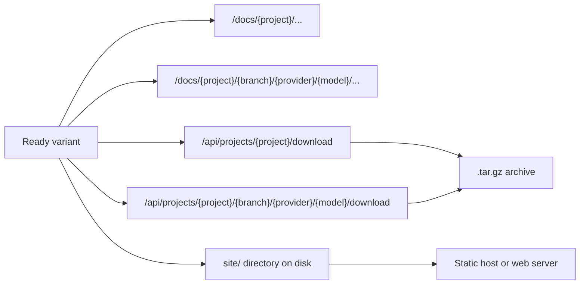

# Viewing, Downloading, and Hosting Docs

A `ready` variant is one generated docs build for a specific project, branch, AI provider, and AI model. Once a variant is ready, you can browse it through docsfy, download it as a `.tar.gz`, or publish the generated static site somewhere else.

Project-level URLs are convenience URLs. They follow the latest ready variant you can access. Variant-specific URLs stay pinned to one exact build.



## Open Docs

Use a project-level route when you want the current docs for a repository:

- `/docs/<project>/`
- `/docs/<project>/index.html`

Use a variant-specific route when you need a stable link to one exact branch/provider/model build:

- `/docs/<project>/<branch>/<provider>/<model>/`
- `/docs/<project>/<branch>/<provider>/<model>/index.html`

The integration tests exercise both route shapes directly:

```127:149:tests/test_integration.py
# Check docs are served via variant-specific route
response = await client.get("/docs/test-repo/main/claude/opus/index.html")
assert response.status_code == 200
assert "test-repo" in response.text

response = await client.get("/docs/test-repo/main/claude/opus/introduction.html")
assert response.status_code == 200
assert "Welcome!" in response.text

# Check docs are served via latest-variant route
response = await client.get("/docs/test-repo/index.html")
assert response.status_code == 200
assert "test-repo" in response.text

# Download via variant-specific route
response = await client.get("/api/projects/test-repo/main/claude/opus/download")
assert response.status_code == 200
assert response.headers["content-type"] == "application/gzip"

# Download via latest-variant route
response = await client.get("/api/projects/test-repo/download")
assert response.status_code == 200
assert response.headers["content-type"] == "application/gzip"
```

The same docs base URL can serve other published files too: page HTML, `llms.txt`, `llms-full.txt`, and files under `assets/`. The end-to-end suite explicitly opens `llms.txt` and `llms-full.txt` at `/docs/for-testing-only/main/gemini/gemini-2.5-flash/llms.txt` and `/docs/for-testing-only/main/gemini/gemini-2.5-flash/llms-full.txt`.

> **Tip:** Use `/docs/<project>/` for a moving "current docs" link. Use the full variant URL for release docs, reviews, QA, or anything that must keep pointing to the same build.

> **Warning:** `/docs/<project>/` is not a shortcut for `main`. If a newer `ready` variant is generated for a different branch, provider, or model, that URL can start serving the newer build.

> **Note:** `/docs/...` requires authentication. Browser requests for HTML redirect to `/login` when you are signed out. API-style requests return `401`.

> **Note:** The branch name is part of the path. Branches like `main`, `dev`, and `release-1.x` work. Branch names with `/` do not.

## Download Tarballs

docsfy exposes two download endpoints:

- `/api/projects/<project>/download` for the latest ready variant you can access
- `/api/projects/<project>/<branch>/<provider>/<model>/download` for one exact variant

The server creates the archive directly from the rendered `site/` directory:

```374:409:src/docsfy/api/projects.py
async def _stream_tarball(site_dir: Path, archive_name: str) -> StreamingResponse:
    """Create a tar.gz archive and stream it as a response."""
    tmp = tempfile.NamedTemporaryFile(suffix=".tar.gz", delete=False)
    tar_path = Path(tmp.name)
    tmp.close()

    def _create_archive() -> None:
        with tarfile.open(tar_path, mode="w:gz") as tar:
            tar.add(str(site_dir), arcname=archive_name)

    # ... stream the file, then clean up the temporary archive ...

    return StreamingResponse(
        _stream_and_cleanup(),
        media_type="application/gzip",
        headers={
            "Content-Disposition": f'attachment; filename="{archive_name}-docs.tar.gz"'
        },
    )
```

That gives you predictable archive names:

- project-level download: `<project>-docs.tar.gz`
- variant-specific download: `<project>-<branch>-<provider>-<model>-docs.tar.gz`

When you extract the archive, it contains a single top-level folder named after the selected project or variant. A real e2e test downloads and extracts one of these archives like this:

```78:84:test-plans/e2e-08-cross-model-updates.md
curl -s -L -H "Authorization: Bearer $ADMIN_KEY" \
  "$SERVER/api/projects/for-testing-only/main/$BASELINE_PROVIDER/$BASELINE_MODEL/download" \
  -o "$CROSS_PROVIDER_ROOT/baseline.tar.gz"
mkdir -p "$CROSS_PROVIDER_ROOT/baseline"
tar -xzf "$CROSS_PROVIDER_ROOT/baseline.tar.gz" --strip-components=1 -C "$CROSS_PROVIDER_ROOT/baseline"
ls "$CROSS_PROVIDER_ROOT/baseline"
```

If you want the site files placed directly into a target directory, `tar --strip-components=1` is the simplest way to drop the archive's top-level folder during extraction.

> **Note:** Downloads only work for `ready` variants. An explicit variant download returns `400` until that variant is ready, and the project-level route returns `404` if no ready variant exists.

> **Note:** The archive contains the published `site/` bundle. It does not include internal generation files such as `plan.json` or `cache/pages/`.

## Download With The CLI

The CLI wraps the same download endpoints. The repository ships an example config file for `~/.config/docsfy/config.toml`:

```1:25:config.toml.example
# docsfy CLI configuration
# Copy to ~/.config/docsfy/config.toml or run: docsfy config init
#
# SECURITY: This file contains passwords. Keep it private:
#   chmod 600 ~/.config/docsfy/config.toml

# Default server to use when --server is not specified
[default]
server = "dev"

# Server profiles -- add as many as you need
[servers.dev]
url = "http://localhost:8000"
username = "admin"
password = "<your-dev-key>"

[servers.prod]
url = "https://docsfy.example.com"
username = "admin"
password = "<your-prod-key>"

[servers.staging]
url = "https://staging.docsfy.example.com"
username = "deployer"
password = "<your-staging-key>"
```

The download logic in the CLI shows the two main behaviors: variant selectors are all-or-nothing, and `--output` extracts instead of saving the `.tar.gz`:

```287:327:src/docsfy/cli/projects.py
# Require all variant selectors together, or none
variant_opts = [branch, provider, model]
if any(variant_opts) and not all(variant_opts):
    typer.echo(
        "Specify --branch, --provider, and --model together to download a specific variant, "
        "or omit all three to download the default variant.",
        err=True,
    )
    raise typer.Exit(code=1)

# ... choose latest or pinned download URL and archive name ...

if output:
    # Download to a temp file and extract
    with tempfile.NamedTemporaryFile(suffix=".tar.gz", delete=False) as tmp:
        tmp_path = Path(tmp.name)

    try:
        client.download(url_path, tmp_path)
        output_dir = Path(output)
        output_dir.mkdir(parents=True, exist_ok=True)
        with tarfile.open(tmp_path, "r:gz") as tar:
            tar.extractall(path=output_dir, filter="data")
        typer.echo(f"Extracted to {output_dir}")
    finally:
        tmp_path.unlink(missing_ok=True)
else:
    dest = Path.cwd() / archive_name
    client.download(url_path, dest)
    typer.echo(f"Downloaded to {dest}")
```

In practice:

- `docsfy download <project>` saves the latest ready archive in your current directory.
- Add `--branch`, `--provider`, and `--model` together to pin the download to one exact variant.
- Add `--output <dir>` to extract the archive instead of keeping the tarball.

> **Note:** Keep `~/.config/docsfy/config.toml` private. The shipped example explicitly warns that it contains passwords.

> **Note:** The CLI extracts the archive as-is. If the archive contains a top-level folder, that folder remains inside your chosen `--output` directory.

## Host The Static Site

If you are happy letting docsfy serve the docs, you do not need any extra publish step. `/docs/...` already serves the generated `site/` bundle. Only use the rest of this section when you want to publish that bundle somewhere else.

Every ready variant is written to disk at `$DATA_DIR/projects/<owner>/<project>/<branch>/<provider>/<model>/site`. `DATA_DIR` defaults to `/data`.

In the provided Compose setup, `/data` is persisted from the host filesystem:

```1:16:docker-compose.yaml
services:
  docsfy:
    build:
      context: .
      dockerfile: Dockerfile
    ports:
      - "8000:8000"
      # Uncomment for development (DEV_MODE=true)
      # - "5173:5173"
    volumes:
      - ./data:/data
      # Uncomment for development (hot reload)
      # - ./frontend:/app/frontend
    env_file:
      - .env
```

With that setup, the host-side path is typically `./data/projects/<owner>/<project>/<branch>/<provider>/<model>/site`.

The renderer recreates that directory and writes the published files directly into it:

```600:688:src/docsfy/renderer.py
if output_dir.exists():
    shutil.rmtree(output_dir)
output_dir.mkdir(parents=True, exist_ok=True)
assets_dir = output_dir / "assets"
assets_dir.mkdir(exist_ok=True)

# Prevent GitHub Pages from running Jekyll
(output_dir / ".nojekyll").touch()

if STATIC_DIR.exists():
    for static_file in STATIC_DIR.iterdir():
        if static_file.is_file():
            shutil.copy2(static_file, assets_dir / static_file.name)

(output_dir / "index.html").write_text(index_html, encoding="utf-8")
(output_dir / f"{slug}.html").write_text(page_html, encoding="utf-8")
(output_dir / f"{slug}.md").write_text(md_content, encoding="utf-8")

search_index = _build_search_index(valid_pages, plan)
(output_dir / "search-index.json").write_text(
    json.dumps(search_index), encoding="utf-8"
)

llms_txt = _build_llms_txt(plan, navigation=filtered_navigation)
(output_dir / "llms.txt").write_text(llms_txt, encoding="utf-8")

llms_full_txt = _build_llms_full_txt(
    plan, valid_pages, navigation=filtered_navigation
)
(output_dir / "llms-full.txt").write_text(llms_full_txt, encoding="utf-8")
```

When you publish the folder elsewhere, keep these pieces together:

- `index.html`
- every generated page `*.html`
- `assets/`
- `search-index.json`
- `.nojekyll`
- `llms.txt`
- `llms-full.txt`
- page `*.md` files if you want the Markdown copies too

This repository gives you the generated files and the runtime mounts, but not a dedicated static-site deployment pipeline. Publishing is simply a matter of copying or syncing the `site/` directory to your static host or web server and serving `index.html` as the entry point.

> **Tip:** GitHub Pages is a good fit for the exported site because docsfy writes `.nojekyll` automatically.

> **Warning:** Treat `site/` as build output. docsfy deletes and recreates it on every render, so manual edits there will be overwritten by the next generation.

> **Warning:** If you publish the `site/` directory outside docsfy, docsfy's authentication and access checks no longer protect it. Use your static host, CDN, or proxy for access control if the docs must stay private.

## Quick Reference

- Use `/docs/<project>/` for a moving browser link to the latest ready docs you can access.
- Use `/docs/<project>/<branch>/<provider>/<model>/` for a pinned browser link to one exact variant.
- Use `/api/projects/<project>/download` for a moving latest archive.
- Use `/api/projects/<project>/<branch>/<provider>/<model>/download` for a pinned archive.
- Use `$DATA_DIR/projects/<owner>/<project>/<branch>/<provider>/<model>/site` when you want to host the generated site outside docsfy.


## Related Pages

- [Generated Output](generated-output.html)
- [Projects API](projects-api.html)
- [CLI Workflows](cli-workflows.html)
- [Data Storage and Layout](data-storage-and-layout.html)
- [Variants, Branches, and Regeneration](variants-branches-and-regeneration.html)