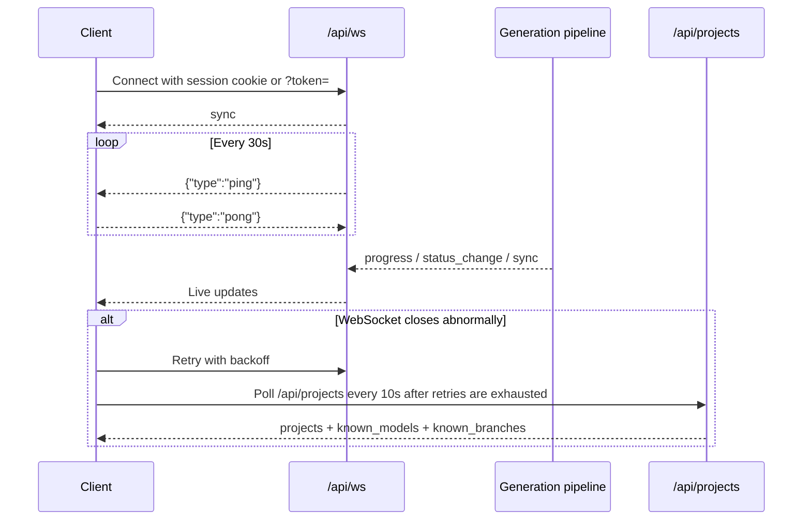

# WebSocket Protocol

`/api/ws` is docsfy's real-time update stream. Connect once, authenticate, read the initial `sync` snapshot, then apply live `progress` and `status_change` messages as generation runs or project visibility changes.

For most clients, the mental model is simple:

- `sync` is the full snapshot and source of truth.
- `progress` reports in-flight work for one variant.
- `status_change` reports terminal states for one variant.
- `ping` / `pong` keeps the connection alive.
- `GET /api/projects` is the HTTP fallback path the built-in frontend uses when it cannot stay on WebSocket.

## Connection Model

The built-in frontend opens a same-origin socket and chooses `ws://` or `wss://` from the current page URL:

```ts
const protocol = window.location.protocol === 'https:' ? 'wss:' : 'ws:'
const url = `${protocol}//${window.location.host}/api/ws`
this.ws = new WebSocket(url)
```

That means:

- If docsfy is served over HTTPS, the frontend uses `wss://`.
- If docsfy is served over plain HTTP, the frontend uses `ws://`.
- The official UI connects to the same host that served the page.

There is no subscribe message or per-project room selection. One connection receives every update the authenticated user is allowed to see.



## Authentication

docsfy supports two authentication paths for `/api/ws`.

### Session Cookie

This is the normal browser flow:

1. Log in with `POST /api/auth/login`.
2. docsfy sets a `docsfy_session` cookie.
3. Open `/api/ws` on the same origin.
4. The browser sends the cookie during the WebSocket handshake.

The login handler sets the cookie like this:

```python
response.set_cookie(
    "docsfy_session",
    session_token,
    httponly=True,
    samesite="strict",
    secure=settings.secure_cookies,
    max_age=SESSION_TTL_SECONDS,
)
```

In the current codebase, that means browser sessions are:

- `HttpOnly`
- `SameSite=Strict`
- controlled by `SECURE_COOKIES` for the `Secure` flag
- valid for 8 hours by default
- backed by an opaque session token, not the raw API key

> **Tip:** For browser integrations, use the session-cookie flow. It matches the built-in frontend and keeps raw API keys out of the WebSocket URL.

> **Warning:** If you are running docsfy on plain `http://localhost`, set `SECURE_COOKIES=false`. Otherwise the browser will not send the secure session cookie, and `/api/ws` will not authenticate.

### `?token=` Query Parameter

Direct clients can authenticate with the admin key or a user's API key by putting it in the URL query string.

The CLI watcher does exactly that:

```python
ws_url = (
    server_url.rstrip("/").replace("https://", "wss://").replace("http://", "ws://")
)
ws_url = f"{ws_url}/api/ws?{urlencode({'token': password})}"
```

> **Warning:** `?token=` puts the credential in the URL. URLs can end up in logs, browser history, proxies, and monitoring tools. Prefer the session-cookie flow in browser-based code.

> **Note:** REST requests can use `Authorization: Bearer <token>`, but `/api/ws` does not authenticate that way. The WebSocket handler checks the `docsfy_session` cookie and the `token` query parameter.

### Auth Failures

If the handshake is not authenticated, the server closes the socket with code `1008`.

Some browser tooling reports a generic connection error instead of surfacing the close code directly, so failed browser tests may show either a close code or a plain error.

## Message Types

| Message | When it is sent | Key fields |
| --- | --- | --- |
| `sync` | Immediately after connect, and again when the server wants a full resync | `projects`, `known_models`, `known_branches` |
| `progress` | While a generation is still running | `name`, `branch`, `provider`, `model`, `owner`, `status`, plus optional progress fields |
| `status_change` | When a variant reaches a terminal state | `name`, `branch`, `provider`, `model`, `owner`, `status`, plus optional final metadata |
| `ping` | Heartbeat from server | `{ "type": "ping" }` |
| `pong` | Heartbeat reply from client | `{ "type": "pong" }` |

Client messages are minimal: the server only expects `pong`. Malformed client messages are ignored.

## `sync`

`sync` is the full replacement payload. If you are writing a client, treat it as the latest authoritative snapshot for the current user.

The frontend types define it like this:

```ts
export interface SyncMessage {
  type: 'sync'
  projects: Project[]
  known_models: Record<string, string[]>
  known_branches: Record<string, string[]>
}
```

A few practical details:

- `projects` is the same live project list returned by `GET /api/projects`.
- `projects` can include variants in `generating`, `ready`, `error`, and `aborted`.
- `known_models` and `known_branches` are helper maps used by the UI for provider/model and branch pickers.
- Both helper maps are built from `ready` projects, not in-progress ones.
- The server sends `sync` immediately on connect.
- The server also uses `sync` after broader consistency changes such as terminal status updates, deletes, variant replacement, and access grants or revokes.

> **Tip:** If you already know how to handle `GET /api/projects`, you already know how to handle `sync`. The only extra field is `type: "sync"`.

## `progress`

`progress` is the in-flight message. It reports that a generation is still running and adds whatever progress fields are available so far.

The backend builds the payload like this:

```python
message: dict[str, Any] = {
    "type": "progress",
    "name": project_name,
    "branch": branch,
    "provider": provider,
    "model": model,
    "owner": owner,
    "status": status,
}
if current_stage is not None:
    message["current_stage"] = current_stage
if page_count is not None:
    message["page_count"] = page_count
if plan_json is not None:
    message["plan_json"] = plan_json
if error_message is not None:
    message["error_message"] = error_message
```

In the current backend, `progress.status` is used for the running state, so you should expect `status: "generating"` here.

The stage names currently used by docsfy are:

- `cloning`
- `planning`
- `incremental_planning`
- `generating_pages`
- `validating`
- `cross_linking`
- `rendering`

What the optional fields mean:

- `current_stage`: the backend's current phase, when one is known
- `page_count`: pages generated so far
- `plan_json`: the saved documentation plan as a JSON string
- `error_message`: an in-flight error detail when the backend has one to surface

`plan_json` is a serialized string, not a pre-parsed object.

## `status_change`

`status_change` is used for terminal states only. In the current backend, that means:

- `ready`
- `error`
- `aborted`

The message always identifies a specific variant with:

- `name`
- `branch`
- `provider`
- `model`
- `owner`
- `status`

It may also include:

- `page_count`
- `last_generated`
- `last_commit_sha`
- `error_message`

A few useful expectations:

- Successful runs end with `status: "ready"`.
- A run that turns out to need no work still ends as `ready`.
- Failed or user-cancelled runs end as `error` or `aborted`.
- After a terminal `status_change`, the backend also sends a full `sync`.

If docsfy finds that a variant is already current, the later `sync` can show `current_stage: "up_to_date"` in the stored project record even though the terminal WebSocket message is still just `status: "ready"`.

> **Warning:** `sync.projects` uses `ai_provider` and `ai_model` because it carries full `Project` records. `progress` and `status_change` use `provider` and `model`. If you merge incremental updates into `Project` objects, map those field names explicitly.

Because terminal updates are followed by `sync`, client handlers should be idempotent. Apply the newest state; do not assume messages are exactly-once events.

## Matching Updates To A Variant

Use the full variant identity when applying `progress` or `status_change`:

- `name`
- `branch`
- `provider`
- `model`
- `owner`

That is what lets you safely distinguish:

- different branches of the same repository
- different provider/model outputs for the same repository
- different owners who generated the same repository name

The built-in CLI watcher uses this exact approach when it filters incoming updates.

## Heartbeat: `ping` And `pong`

The server keeps the socket alive with a heartbeat:

```python
_WS_HEARTBEAT_INTERVAL = 30
_WS_PONG_TIMEOUT = 10
_WS_MAX_MISSED_PONGS = 2
```

In practice, that means:

- the server sends `{"type": "ping"}` every 30 seconds
- the client should reply with `{"type": "pong"}`
- the server waits up to 10 seconds for the reply
- after 2 missed pongs, the server closes the connection with code `1001`

The built-in frontend replies like this:

```ts
if (isPingMessage(parsed)) {
  this.ws?.send(JSON.stringify({ type: 'pong' }))
  return
}
```

You do not need to send your own periodic pings unless your runtime or infrastructure requires it for some other reason.

## Who Receives Updates?

WebSocket delivery is based on access control, not subscriptions.

docsfy sends relevant project updates to:

- admins
- the project owner
- users who have been granted access to that project

That has a few consequences:

- Admins see all variants.
- Non-admin users see their own variants plus shared variants they have been granted access to.
- If an admin grants or revokes access, the affected user receives a fresh `sync` rather than a special `access_change` message.
- Multiple simultaneous connections for the same user are supported, so multiple browser tabs can all receive the same updates.

## Polling Fallback Expectations

The dashboard does not depend on WebSocket alone.

On first load, it fetches the current project list over HTTP with `GET /api/projects`. After that, it opens `/api/ws` and prefers live push updates. If the socket closes abnormally, the built-in frontend retries a few times and then shifts to polling.

The retry and fallback logic is:

```ts
this.ws.onclose = (event) => {
  console.debug('[WS] Disconnected, code:', event.code)
  if (event.code !== 1000) this.attemptReconnect()
}

private attemptReconnect(): void {
  if (this.reconnectAttempts >= this.maxReconnectAttempts) {
    console.debug('[WS] Falling back to polling')
    this.startPolling()
    return
  }
  const delay = this.getBackoffDelay()
  this.reconnectAttempts++
  console.debug('[WS] Reconnecting, attempt', this.reconnectAttempts)
  this.reconnectTimer = setTimeout(() => this.connect(true), delay)
}

private startPolling(): void {
  if (this.pollingTimer) return
  this.pollingTimer = setInterval(async () => {
    try {
      const data = await api.get<ProjectsResponse>('/api/projects')
      const syncMessage: WebSocketMessage = {
        type: 'sync' as const,
        projects: data.projects,
        known_models: data.known_models,
        known_branches: data.known_branches,
      }
      this.handlers.forEach(handler => handler(syncMessage))
    } catch {
      /* ignore polling errors */
    }
  }, WS_POLLING_FALLBACK_MS)
}
```

With the current frontend defaults, that means:

- close code `1000` is treated as a normal disconnect, so the manager does not retry
- other closes trigger up to 3 reconnect attempts
- the reconnect backoff is 1 second, then 2 seconds, then 4 seconds
- after retries are exhausted, the dashboard polls `GET /api/projects` every 10 seconds
- polling results are turned into synthetic `sync` messages before they reach the rest of the UI

The dashboard also has two extra best-effort refresh paths:

- When you start a generation, it waits 5 seconds and fetches `/api/projects` if the new variant still has not appeared in local state.
- If it receives a `progress` or `status_change` message for a variant it does not have locally yet, it fetches `/api/projects` to resync.

> **Note:** In fallback mode, the UI remains usable, but updates arrive on the polling interval instead of immediately.

## Configuration That Affects `/api/ws`

The settings that matter most are the admin key and cookie security:

```python
class Settings(BaseSettings):
    admin_key: str = ""  # Required — validated at startup
    secure_cookies: bool = True  # Set to False for local HTTP dev
```

In practice:

- `ADMIN_KEY` is required and must be at least 16 characters long.
- `SECURE_COOKIES` controls whether browser session cookies use the `Secure` flag.
- Browser-based WebSocket auth depends on that session cookie, so HTTPS/WSS is the right production setup.

> **Tip:** Keep `SECURE_COOKIES=true` in production. Only turn it off for plain-HTTP local development.

## Practical Client Checklist

- Open one `/api/ws` connection per active client session.
- Authenticate with the session cookie or `?token=<api-key>`.
- Treat the first `sync` as your initial state.
- Match `progress` and `status_change` by `name + branch + provider + model + owner`.
- Reply to every `ping` with `pong`.
- Reuse your `GET /api/projects` handler for fallback, since that is the same payload shape the official frontend turns into `sync`.


## Related Pages

- [Tracking Progress and Status](tracking-progress-and-status.html)
- [Projects API](projects-api.html)
- [Authentication API](auth-api.html)
- [CLI Workflows](cli-workflows.html)
- [Local Development](local-development.html)